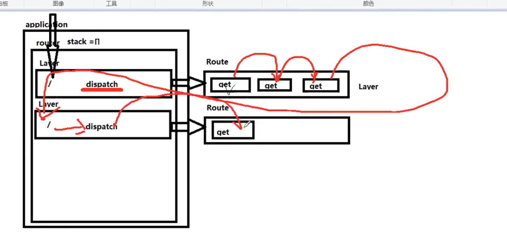

# Express应用+原理
原理图片

## 一.创建express服务
```js
let express = require('./express');
let app = express();
// 最基本的模型
app.get('/',function(req,res){
	res.end('ok');
});
app.listen(3000);

```
## 二.路径匹配
```js
let http = require("http");
let url = require("url");
let routers = [ // 404路由
  {
    path: "*",
    method: "*",
    handler(req, res) {
      res.end(`Cannot ${req.method} ${req.url}`);
    }
  }
];
function createApplication() {
  return {
    get(path, handler) {
      routers.push({
        path,
        method: "get",
        handler
      });
    },
    listen() {
      let server = http.createServer((req, res) => {
        let { pathname } = url.parse(req.url);
        for (let i = 1; i < routers.length; i++) {
          let { path, method, handler } = routers[i];
          if (path === pathname && method == req.method.toLocaleLowerCase()) {
            return handler(req, res);
          }
        }
        return routers[0].handler(req, res);
      });
      server.listen(...arguments);
    }
  };
}
module.exports = createApplication;
```
## 三.分离应用
```js
let http = require('http');
let url = require('url');
function Application(){
    this._router = [
        {path:'*',method:'*',handler(req,res){
            res.end(`Cannot ${req.method} ${req.url}`)
        }}
    ]
}
Application.prototype.get = function(path,handler){
    this._router.push({
        path,
        handler,
        method:'get'
    })
}
Application.prototype.listen = function(){
    let server = http.createServer((req,res)=>{
        let {pathname} = url.parse(req.url);
        for(let i = 1;i<this._router.length;i++){
            let {path,method,handler} = this._router[i];
            if (path === pathname && method == req.method.toLocaleLowerCase()){
                return handler(req, res);
            }
        }
        return this._router[0].handler(req,res);
    });
    server.listen(...arguments);
}
module.exports = Application;
```

## 四.应用和路由的分离
```js
let http = require("http");
let Router = require('../router');
function Application() {
  this._router = new Router();
}
Application.prototype.get = function(path, handler) {
  // 交给路由系统来存储
  this._router.get(path,handler);
};
Application.prototype.listen = function() {
  let server = http.createServer((req, res) => {
    function done(){ // 内部处理不了结束响应
        res.end(`Cannot ${req.method} ${req.url}`);
    }
    // 交给路由系统处理
    this._router.handle(req,res,done);
  });
  server.listen(...arguments);
};
module.exports = Application;
```
## 五.路由系统
```js
let Layer = require('./layer');
let Route = require('./route');
function Router(){
    this.stack = [];
}
Router.prototype.route = function(path){
    // 做layer 和 route之间的关系
    let route = new Route();
    let layer = new Layer(path,route.dispatch.bind(route)); // 将路径存储到layer中
    layer.route = route;
    this.stack.push(layer);
    return route;
}
// 创建 Route 将handler传入到route中
Router.prototype.get = function(path,handler){
    let route = this.route(path); // 将路径存入layer中
    route.get(handler);// 将handler存入到route中
}
Router.prototype.handle = function(req,res,done){
    
}
```
## 六.Route类
```js
let Layer = require('./layer')
function Route(){
    this.stack = []
}
Route.prototype.get = function(handler){
    let layer = new Layer('/',handler);
    layer.method = 'get';
    this.stack.push(layer);
}
Route.prototype.dispatch = function(){
    
}
module.exports = Route;

```
## 七.Layer类

```js
function Layer(path,handler){
    this.path = path;
    this.handler = handler;
}
module.exports = Layer;
```
## 八.当请求到来时
```js
Router.prototype.handle = function(req,res,out){
    let {pathname} = url.parse(req.url);
    let idx = 0;
    let next = () => {
        if(idx>= this.stack.length) return out(); // 匹配不到调用not found
        let layer = this.stack[idx++];
        if(layer.match(pathname)){ // 如果路径匹配到了 调用route的dispatch方法
            layer.handle_request(req,res,next);
        }else{
            next(); // 匹配不到找下一层
        }
    }
    next();
}

```
## 九.Layer中新增匹配方法并调用内部dispatch逻辑
```js
function Layer(path,handler){
    this.path = path;
    this.handler = handler;
}
// 匹配路由
Layer.prototype.match = function(pathname){
    return this.path == pathname
}
Layer.prototype.handle_request = function(req,res,next){
    // 调用dispatch方法
    this.handler(req,res,next);
}
module.exports = Layer;
Route.prototype.dispatch = function(req,res,out){
    let idx = 0;
    let next = () =>{
        if(idx>=this.stack.length) return out();
        let layer = this.stack[idx++];
        // 如果方法匹配打牌了
        if(layer.method === req.method.toLowerCase()){
            layer.handle_request(req,res,next); // 内部匹配完了在出来
        }else{
            next();
        }
    }
    next();
}
```
### 动态路由
```js
const PathToRegExp = require('path-to-regexp')

function Layer(path,handler){
    this.path = path;
    this.handler = handler;
    // /user/:id/:name  [id,name]
    this.regExp = PathToRegExp(this.path, this.keys = [], true);
}
Layer.prototype.match = function(pathname) { //当请求路径到来时pathname 用户配置的是带:name/:id
    //匹配路径时  需要看一下是路由还是中间件 中间件需要匹配 是否一他开头
    //  console.log(this.path, pathname);
    if (this.path === pathname) {
        return true
    }
    if (this.keys.length > 0) {   //如果是路由 我就看一下当前请求的路径 是否能和转换出的正则进行匹配
        let matches = pathname.match(this.regExp);
        if (matches) {
            let values = matches.slice(1);
            // console.log(values, this.keys);
            this.params = {};
            this.keys.forEach((item,idx) => {
                this.params[item.name] = values[idx];
            })
            return true
        }
    }
    if (!this.route) {
        if (this.path == '/') {
            return true;
        }
        return pathname.startsWith(this.path + '/')
    }
    return false
}

```
## 十.优化
路由懒加载

```js
Application.prototype.lazy_route = function(){ // 路由懒加载
    if(!this._router){
        this._router = new Router();
    }
}
```
批量生成方法

```js
methods.forEach(method=>{
    Application.prototype[method] = function(path, handler) {
        // 交给路由系统来存储
        this.lazy_route();
        this._router[method](path,handler);
      };
});
methods.forEach(method => {
    Router.prototype[method] = function(path,handler){
        let route = this.route(path); // 将路径存入layer中
        route[method](handler);// 将handler存入到route中
    }
});
methods.forEach(method=>{
    Route.prototype[method] = function(handler){
        let layer = new Layer('/',handler);
        layer.method = method;
        this.stack.push(layer);
    }
})
```
多个方法链式调用

```js
Application.prototype[method] = function(path, ...handlers) { 
        // 交给路由系统来存储
        this.lazy_route();
        this._router[method](path,handlers);
};

Route.prototype[method] = function(handlers){
  handlers.forEach(handler=>{
    let layer = new Layer('/',handler);
    layer.method = method;
    this.stack.push(layer);
  })
}
```
加速匹配

```js
function Route(){
    this.stack = [];
    this.methods = {};
}
methods.forEach(method=>{
    Route.prototype[method] = function(handlers){
        handlers.forEach(handler=>{
            let layer = new Layer('/',handler);
            layer.method = method;
            this.methods[method] = true;
            this.stack.push(layer);
        })
    }
})
if(layer.route.methods[req.method.toLowerCase()]){
	layer.handle_request(req, res, next);
}
```
## 十一.中间件的应用
```js
let express = require('./express');
let app = express();
```
// 最基本的模型
```js
app.use(function(req,res,next){
    console.log('middle 1');
    next();
});
app.use(function(req,res,next){
    console.log('middle 2');
    res.end('root');
})
app.use('/hello',function(req,res,next){
    res.end('hello');
})
app.listen(3000);
```


增加use方法
```js
// 中间件
Application.prototype.use = function(){
    this.lazy_route();
    this._router.use(...arguments); // 交给路由处理
}
Router.prototype.use = function(path,handler){
    if(typeof handler !== 'function'){
        handler = path;
        path = '/'
    }
    let layer = new Layer(path,handler);
    layer.route = undefined;
    this.stack.push(layer); // 将当前层放到stack中
}   
```

当请求到来时,区分是中间件还是路由,如果是中间件直接执行即可

```js
let next = () => {
    if (idx >= this.stack.length) return out(); // 匹配不到调用not found
    let layer = this.stack[idx++];
    // 如果匹配到
    if (layer.match(pathname)) {
      if (!layer.route) { // 中间件
        layer.handle_request(req,res,next);
      } else { // 路由
        if(layer.route.methods[req.method.toLowerCase()]){
            layer.handle_request(req, res, next);
        }else{
            next();
        }
      }
    } else {
      next(); // 匹配不到找下一层
    }
  };
Layer.prototype.match = function(pathname){
    if(this.path === pathname){
        return true
    }
    if(!this.route){ // 如果是中间件
        if(this.path === '/'){
            return true;
        }
        return pathname.startsWith(this.path+'/');
    }
    return false;
}
```
## 十二.错误中间件
```js
Route.prototype.dispatch = function(req,res,out){
    let idx = 0;
    let next = (err) =>{
        if(err) return out(err); // 有错误就抛出去
        if(idx>=this.stack.length) return out();
        let layer = this.stack[idx++];
        // 如果方法匹配打牌了
        if(layer.method === req.method.toLowerCase()){
            layer.handle_request(req,res,next); // 内部匹配完了在出来
        }else{
            next();
        }
    }
    next();
}
let next = err => {
    if (idx >= this.stack.length) return out(); // 匹配不到调用not found
    let layer = this.stack[idx++];
    if (err) { // 有错误
        if(!layer.route){ // 如果是中间件
            layer.handle_error(err,req,res,next);
        }else{
            next(err); 
        }
    } else {
      // 如果匹配到
      if (layer.match(pathname)) {
        if (!layer.route) {
          // 中间件
          layer.handle_request(req, res, next);
        } else {
          // 路由
          if (layer.route.method === req.method.toLowerCase()) {
            layer.handle_request(req, res, next);
          } else {
            next();
          }
        }
      } else {
        next(); // 匹配不到找下一层
      }
    }
  };
```
处理错误

```js
Layer.prototype.handle_error = function(err,req,res,next){
    if(this.handler.length === 4){ // 参数是四个就是错误中间件
        return this.handler(err,req,res,next);
    }
    next(err);
}
```
## 十三.二级路由实现
测试用例

```js
const express = require('./express');
const app = express();
const article = require('./route/article')
const user = require('./route/user')
app.use('/article', article) // 路由 /article/add
app.use('/user', user)//路由 /user/add
app.listen(3000)
//route user 

```
route 文件夹 user.js 
```js
const express = require('../express');
let router = express.Router(); //即充当了类 又充当了函数
router.get('/add',function(req,res,next) {
  res.end('user -- add')
})
router.get('/remove',function(req,res,next)  {
    res.end('user -- remove')
})
module.exports = router;
```
- 核心 路由实例既可以当函数掉 又可以new <font color="red">**注意 如果一个类返回的不是基本类型 那么this指向这个返回值**</font>
- 如何匹配路由 判断是否是中间件 如果是中间件 则路径req.url去掉外层的user 然后get('/add') 去匹配/add 
  等匹配过了 到下一个中间件的时候 再补上 req.url = removed + pathname


原理实现
```js
function Router() { //如果一个类返回的不是基本类型 那么this指向这个返回值
  // this.stack = [];
  let router =  (req,res,next) => {
    //请求会走到此函数
    //怎么处理对应的stack 中的内容
    router.handle(req, res, next) //还需要处理路径

  }
  router.stack = []; 
  router.__proto__ = proto; // let router = new Router(); router.get('/')
  return router; //router 会作为实例
}
proto.handle = function (req, res, done) {
  let {pathname} = url.parse(req.url);
  // let requestMethod = req.method.toLowerCase();
    let idx = 0;
    let removed = '';
    //先遍历外层的
    let next = (err) => {
      if(this.stack.length === idx) return done(); // 匹配不到调用not found
        let layer = this.stack[idx++];
        if (removed) {
          req.url = removed + pathname; //当调用next 会从上一层跑到下一层去 这时要把删除的路径加上
          removed = '';
        }
       if (err) {
         if (!layer.route) { //找到错误的中间件
           //中间件
           layer.handle_error(err,req,res,next)
         }else {
            next(err);
         }
        return;
       }
        // console.log(layer.match(pathname),'layer.match(pathname)')
        if(layer.match(pathname)){ // 如果路径匹配到了 调用route的dispatch方法
          req.params = layer.params;
            //有可能是中间件
            if (layer.route) {
              if (layer.route.match_methods(req.method.toLowerCase())){ //加速匹配
                layer.handler_request(req,res,next); //next 就是 route里面的dispacth 里面处理不了了 调用下一个
              }else {
              
                next();
              }
            }else {
               //如果参数是4个 错误中间件
               if (layer.handler.length !== 4) {
                 //中间件 
                 if (layer.path !== '/') { //  /user/add ---> /add
                   removed = layer.path;
                   req.url = pathname.slice(removed.length);
                   console.log(req.url, 'req.url')
                 }
                layer.handler_request(req,res,next); //中间件 不匹配方法 直接执行回调函数
               }else {
                 next();
               }
             
            }     
        }else{
            next(); // 匹配不到找下一层
        }
    }
    next();
};
```
// 调用get 时可能不是一个数组
```js
methods.forEach(method => {
    proto[method] = function(path, handlers) {
    if(!Array.isArray(handlers)){
        handlers = Array.from(arguments).slice(1);
    }
    let route = this.route(path); // 将路径存入layer中
    route[method](handlers); // 将handler存入到route中
  };
});
```
## 十四.路由正则匹配
```js
app.get('/name/:id/:age',function(req,res,next){
    console.log(req.params);
    res.end('end');
})
let pathToRegExp = require('path-to-regexp');
function Layer(path,handler){
    this.path = path;
    this.handler = handler;
    this.regExp = pathToRegExp(this.path,this.keys = [],true);
}

Layer.prototype.match = function(pathname){ 
    if(this.path === pathname){
        return true;
    }
    if(this.route){
        let matches = pathname.match(this.regExp);
        if(matches){ // 正则路由匹配
            let values = matches.slice(1);
            this.params = values.reduce((memo,current,index)=>{
                memo[this.keys[index].name] = values[index];
                return memo
            },{});
            return true
        }
    }
    if(!this.route){ // 中间件
        if(pathname === '/'){
            return true
        }
        return pathname.startsWith(this.path+'/');
    }
    return false
}
```
## 十五.带参数的路由
```js
app.param('id',function(req,res,next,value,key){ // 订阅事件
    console.log('id'+1);
    next();
});
app.param('id',function(req,res,next,value,key){
    console.log('id'+2);
    next();
});
app.get('/name/:id/:age',function(req,res,next){
    console.log(req.params);
    res.end('end');
});
Application.prototype.param = function(key,callback){
    this.lazy_route();
    this._router.param(key,callback)
}

proto.param = function(key,callback){
    if(this.paramsCallbacks[key]){
        this.paramsCallbacks[key].push(callback)
    }else{
        this.paramsCallbacks[key] = [callback];
    }
}
proto.handle_params = function(layer, req, res, done) {
  let keys = layer.keys; // [{name:id},{name:name}]
  if (!keys) {
    return done();
  }
  keys = keys.map(item => item.name);
  let idx = 0;
  let key;
  let fns;
  let next = () => {
    if (keys.length === idx) return done();
    key = keys[idx++];
    fns = proto.paramsCallbacks[key];
    if (fns && fns.length) {
      callbackParam();
    } else {
      next();
    }
  };
  let i = 0;
  let callbackParam = () => {
    // [fn,fn]
    let fn = fns[i++];
    if (fn) {
      fn(req, res, callbackParam, layer.params[key], key);
    } else {
      i = 0;
      next();
    }
  };
  next();
};

// 处理好param后触发对应的回调
proto.handle_params(layer, req, res, () => {
    layer.handler(req, res, next);
});
```

