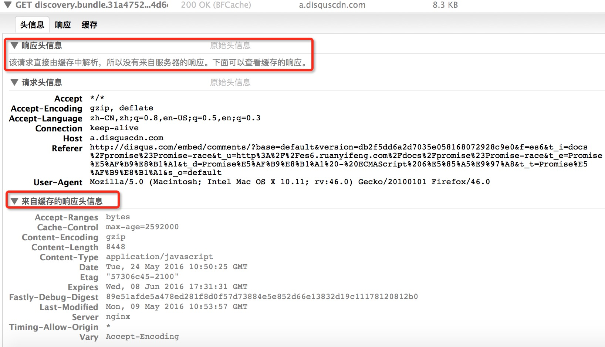

# HTTP中Header的应用
## 一.课程主题：
- HTTP中静态服务的编写

- ajax的使用和跨域问题

- http缓存(强制缓存和对比缓存)

- 压缩问题 zlib 转化流

- 多语言切换

## 二.课程内容
### 1.实现静态服务
mime模块处理请求文件类型
```text
npm install mime -g
```
```js
let server = http.createServer((req,res)=>{
    let {pathname} = url.parse(req.url);
    // 根据请求路径查找文件 
    let absFilePath = path.join(__dirname,pathname);
    fs.stat(absFilePath,(err,stat)=>{
        if(err){
            return res.end(`Not Found`);
        }
        if(stat.isDirectory()){ 
            // 尝试查找index.html
            absFilePath = path.join(absFilePath,'index.html');
            fs.access(absFilePath,(err=>{
                if(err){
                    res.end(`Not Found`);
                }else{
                    let type = mime.getType(absFilePath);   
                    res.setHeader('Content-Type',type+';charset=utf-8');
                    fs.createReadStream(absFilePath).pipe(res);
                }
            }));
        }else{  
            let type = mime.getType(absFilePath);   
            res.setHeader('Content-Type',type+';charset=utf-8');
            fs.createReadStream(absFilePath).pipe(res);
        }
    });
});
server.listen(3000);
```
### 2.通过类改写静态服务
通过async和await改写主体流程

```js
let http = require('http');
let fs = require('fs').promises;
let {createReadStream} = require('fs');
let url = require('url');
let path = require('path');
let mime = require('mime');
class Server{
    async handleServer(req,res){
        let {pathname} = url.parse(req.url);
        let absFilePath = path.join(__dirname,pathname);
        try{
            let statObj = await fs.stat(absFilePath);
            if(statObj.isDirectory()){
                absFilePath = path.join(absFilePath,'index.html');
            }
            this.sendFile(req,res,absFilePath,statObj);
        }catch(err){
            console.log(err);
            this.sendError(req,res);            
        }
    }
    sendFile(req,res,absFilePath,statObj){
        let type = mime.getType(absFilePath);   
        res.setHeader('Content-Type',type+';charset=utf-8');
        createReadStream(absFilePath).pipe(res);
    }
    sendError(req,res){
        res.statusCode = 404;
        res.end(`Not Found`);
    }
    start(){
        let server = http.createServer(this.handleServer.bind(this));
        server.listen(...arguments);
    }
}
let server = new Server();
server.start(3000);
```
### 3.ajax跨域问题
cors解决跨域问题

```js
'Access-Control-Allow-Origin','http://a.zf.cn:5000' // 允许某个域访问
'Access-Control-Allow-Credentials','true'           // 允许携带cookie
'Access-Control-Allow-Headers','a'                  // 允许携带的header
'Access-Control-Max-Age','3600'                     // 设置options的请求发送时长
let xhr = new XMLHttpRequest();
xhr.open('GET','http://localhost:5000/user',true);
xhr.setRequestHeader('a','1'); // 设置请求头

xhr.onload = function(){ 
	console.log(xhr.responseText); 
}
xhr.withCredentials = true; // 设置强制携带cookie
xhr.send();
```
跨域配置

```js
res.setHeader('Access-Control-Allow-Origin','http://a.zf.cn:5000');
res.setHeader('Access-Control-Allow-Credentials','true')
res.setHeader('Access-Control-Max-Age',3600);
res.setHeader('Access-Control-Allow-Headers','a');
if(req.method === 'OPTIONS'){ // options请求直接结束即可
	return res.end()
}
```
### 4.http缓存问题
强制缓存 (Cache-Control && Expires)

Cache-Control:

- private 客户端可以缓存
- public 客户端和代理服务器都可以缓存
- max-age=60 缓存内容将在60秒后失效
- no-cache 需要使用对比缓存验证数据,强制向源服务器再次验证 (没有强制缓存)
- no-store 所有内容都不会缓存，强制缓存和对比缓存都不会触发 (不缓存)
img

对比缓存

​ Last-Modified & If-Modified-Since

​ ETag & If-None-Match

img

#### 1、浏览器缓存
缓存这东西，第一次必须获取到资源后，然后根据返回的信息来告诉如何缓存资源，可能采用的是强缓存，也可能告诉客户端浏览器是协商缓存，这都需要根据响应的header内容来决定的。下面用两幅图来描述浏览器的缓存是怎么玩的，让大家有个大概的认知。

浏览器第一次请求时：


浏览器后续在进行请求时：


 

 从上图可以知道，浏览器缓存包含两种类型，即强缓存（也叫本地缓存）和协商缓存，浏览器在第一次请求发生后，再次请求时：

浏览器在请求某一资源时，会先获取该资源缓存的header信息，判断是否命中强缓存（cache-control和expires信息），若命中直接从缓存中获取资源信息，包括缓存header信息；本次请求根本就不会与服务器进行通信；在firebug下可以查看某个具有强缓存资源返回的信息，例如本地firebug查看的一个强缓存js文件



如果没有命中强缓存，浏览器会发送请求到服务器，请求会携带第一次请求返回的有关缓存的header字段信息（Last-Modified/If-Modified-Since和Etag/If-None-Match），由服务器根据请求中的相关header信息来比对结果是否协商缓存命中；若命中，则服务器返回新的响应header信息更新缓存中的对应header信息，但是并不返回资源内容，它会告知浏览器可以直接从缓存获取；否则返回最新的资源内容
强缓存与协商缓存的区别，可以用下表来进行描述：

 |获取资源形式	|状态码	|发送请求到服务器|
 | ------------- |:-------------:| -----:|
|强缓存	 |从缓存取|	 200（from cache）	|否，直接从缓存取
|协商缓存	 |从缓存取	 304（not modified）	|是，正如其名，通过服务器来告知缓存是否可用
 

#### 2、强缓存相关的header字段
强缓存上面已经介绍了，直接从缓存中获取资源而不经过服务器；与强缓存相关的header字段有两个：

- expires，这是http1.0时的规范；它的值为一个绝对时间的GMT格式的时间字符串，如Mon, 10 Jun 2015 21:31:12 GMT，如果发送请求的时间在expires之前，那么本地缓存始终有效，否则就会发送请求到服务器来获取资源

- cache-control：max-age=number，这是http1.1时出现的header信息，主要是利用该字段的max-age值来进行判断，它是一个相对值；资源第一次的请求时间和Cache-Control设定的有效期，计算出一个资源过期时间，再拿这个过期时间跟当前的请求时间比较，如果请求时间在过期时间之前，就能命中缓存，否则就不行；cache-control除了该字段外，还有下面几个比较常用的设置值：

- no-cache：不使用本地缓存。需要使用缓存协商，先与服务器确认返回的响应是否被更改，如果之前的响应中存在ETag，那么请求的时候会与服务端验证，如果资源未被更改，则可以避免重新下载。

- no-store：直接禁止游览器缓存数据，每次用户请求该资源，都会向服务器发送一个请求，每次都会下载完整的资源。

- public：可以被所有的用户缓存，包括终端用户和CDN等中间代理服务器。

- private：只能被终端用户的浏览器缓存，不允许CDN等中继缓存服务器对其缓存。
　　>注意：如果cache-control与expires同时存在的话，cache-control的优先级高于expires

#### 3、协商缓存相关的header字段
协商缓存都是由服务器来确定缓存资源是否可用的，所以客户端与服务器端要通过某种标识来进行通信，从而让服务器判断请求资源是否可以缓存访问，这主要涉及到下面两组header字段，
**这两组搭档都是成对出现的，即第一次请求的响应头带上某个字段（Last-Modified或者Etag），则后续请求则会带上对应的请求字段（If-Modified-Since或者If-None-Match），若响应头没有Last-Modified或者Etag字段，则请求头也不会有对应的字段。**

- 1.Last-Modified/If-Modified-Since
二者的值都是GMT格式的时间字符串，具体过程：
   - 浏览器第一次跟服务器请求一个资源，服务器在返回这个资源的同时，在respone的header加上Last-Modified的header，这个header表示这个资源在服务器上的最后修改时间

   - 浏览器再次跟服务器请求这个资源时，在request的header上加上If-Modified-Since的header，这个header的值就是上一次请求时返回的Last-Modified的值

   - 服务器再次收到资源请求时，根据浏览器传过来If-Modified-Since和资源在服务器上的最后修改时间判断资源是否有变化，如果没有变化则返回304 Not Modified，但是不会返回资源内容；如果有变化，就正常返回资源内容。当服务器返回304 Not Modified的响应时，response header中不会再添加Last-Modified的header，因为既然资源没有变化，那么Last-Modified也就不会改变，这是服务器返回304时的response header

   - 浏览器收到304的响应后，就会从缓存中加载资源

   -如果协商缓存没有命中，浏览器直接从服务器加载资源时，Last-Modified的Header在重新加载的时候会被更新，下次请求时，If-Modified-Since会启用上次返回的Last-Modified值

- 2.Etag/If-None-Match
这两个值是由服务器生成的每个资源的唯一标识字符串，只要资源有变化就这个值就会改变；其判断过程与**Last-Modified/If-Modified-Since**类似，与**Last-Modified**不一样的是，当服务器返回304 Not Modified的响应时，由于ETag重新生成过，response header中还会把这个ETag返回，即使这个ETag跟之前的没有变化。
#### 4、既生Last-Modified何生Etag


　　**你可能会觉得使用Last-Modified已经足以让浏览器知道本地的缓存副本是否足够新，为什么还需要Etag呢？HTTP1.1中Etag的出现主要是为了解决几个Last-Modified比较难解决的问题：**
- 一些文件也许会周期性的更改，但是他的内容并不改变(仅仅改变的修改时间)，这个时候我们并不希望客户端认为这个文件被修改了，而重新GET；

- 某些文件修改非常频繁，比如在秒以下的时间内进行修改，(比方说1s内修改了N次)，If-Modified-Since能检查到的粒度是s级的，这种修改无法判断(或者说UNIX记录MTIME只能精确到秒)；

- 某些服务器不能精确的得到文件的最后修改时间。

这时，利用Etag能够更加准确的控制缓存，因为Etag是服务器自动生成或者由开发者生成的对应资源在服务器端的唯一标识符。

**Last-Modified与ETag是可以一起使用的，<font color="red">服务器会优先验证ETag</font>，一致的情况下，才会继续比对Last-Modified，最后才决定是否返回304。**

#### 5、用户的行为对缓存的影响
盗用网上的一张图，基本能描述用户行为对缓存的影响


#### 6、强缓存如何重新加载缓存缓存过的资源
上面说到，使用强缓存时，浏览器不会发送请求到服务端，根据设置的缓存时间浏览器一直从缓存中获取资源，在这期间若资源产生了变化，浏览器就在缓存期内就一直得不到最新的资源，那么如何防止这种事情发生呢？

<font color="red">通过更新页面中引用的资源路径，让浏览器主动放弃缓存，加载新资源。</font>

类似下图所示：


这样每次文件改变后就会生成新的query值，这样query值不同，也就是页面引用的资源路径不同了，之前缓存过的资源就被浏览器忽略了，因为资源请求的路径变了。
### 5.压缩与解压缩处理(accept-encoding)
使用GZIP / DEFLATE 实现解压

```js
var zlib = require('zlib');
var fs = require('fs');
var http = require('http');
http.createServer(function (request, response) {
    var raw = fs.createReadStream('.' + request.url);
    var acceptEncoding = request.headers['accept-encoding'];
    if (!acceptEncoding) {
        acceptEncoding = '';
    }
    if (acceptEncoding.match(/\bdeflate\b/)) {
        response.setHeader('Content-Encoding','deflate');
        raw.pipe(zlib.createDeflate()).pipe(response);
    } else if (acceptEncoding.match(/\bgzip\b/)) {
        response.setHeader('Content-Encoding','gzip');
        raw.pipe(zlib.createGzip()).pipe(response);
    } else {
        raw.pipe(response);
    }
}).listen(9090)
```
### 6.多语言 (accept-language)
```js
let http = require('http');
let pack = {
    en: {
        title: 'hello'
    },
    cn: {
        title: '欢迎'
    }
}

function request(req, res) {
    let acceptLangulage = req.headers['accept-language'];
    let lan = 'en';
    if (acceptLangulage) {
        lan = acceptLangulage.split(',').map(item => {
            let values = item.split(';');
            return {
                name: values[0].split('-')[0],
                q: isNaN(values[1]) ? 1 : parseInt(values[1])
            }
        }).sort((lan1, lan2) => lan1.q - lan2.q).shift().name;
    }
    res.end(pack[lan] ? pack[lan].title : pack['en'].title);

}
let server = http.createServer();
server.on('request', request);
server.listen(8080);
```
## 三.模拟 http-server第三方库
写一个http-server 全局包
```js
const http = require("http");
const path = require("path");
const url = require("url");
const fs = require("fs").promises;
const { createReadStream, createWriteStream, readFileSync } = require("fs");
//模板引擎
const ejs = require("ejs");
const mime = require("mime");
const  crypto = require('crypto')
const chalk = require("chalk");

class Server {
  constructor(options) {
    this.port = options.port;
    this.directory = options.directory;
    this.template = readFileSync(
      path.resolve(__dirname, "render.html"),
      "utf8"
    );
  }
  async handleRequest(req, res) {
    let { pathname, query } = url.parse(req.url);
    pathname = decodeURIComponent(pathname); //可能路径含有中文
    let filepath = path.join(this.directory, pathname);
    console.log(filepath, "filepath");
    try {
      let statobj = await fs.stat(filepath);
      if (statobj.isFile()) {
        this.sendFile(req, res, statobj, filepath);
      } else {
        //需要列出文件夹中的内容
        let dirs = await fs.readdir(filepath); // fs-extra 模块 推荐用这个
        //文件访问的路径 采用绝对路径 尽量不要用 ./ ../ 路径
        dirs = dirs.map((item) => ({
          dir: item,
          href: path.join(pathname, item),
        }));
        let result = await ejs.render(this.template, { dirs }, { async: true });//EJS 将使用异步函数进行渲染。
        res.setHeader("Content-Type", "text/html;charset=utf-8");
        res.end(result);
      }
    } catch (e) {
      this.sendError(e, req, res);
    }
  }
  cache(req, res, statobj, filepath) {
    //场景 public a.html 引用了a/1.js 不断刷新a.html 可以看见1.js并没有每次都请求浏览器
    //设置缓存  默认缓存10s 10s内不在像服务器发起请求  首页不会强制缓存 引用的资源可以强制缓存
    res.setHeader("Expires", new Date(Date.now() + 10 * 1000).toGMTString());
    //no-catch 表示每次都像服务器发起请求  有缓存的
    //no-store 浏览器不缓存
    //  res.setHeader('Cache-Control', 'no-cache'); //http1.1 a.html引用的文件 1.js 第一次是200  后面一直是304
    res.setHeader("Cache-Control", "max-age=10"); //缓存内容将在10秒后失效 http1.1 a.html引用的文件 1.js 10秒内一直是200 10秒后开始对比 走304
    let etag = crypto.createHash('md5').update(readFileSync(filepath)).digest('base64')
    res.setHeader("Etag", etag); 
    //过了10s 文件还是没变 可以不用返回文件 告诉浏览器 缓存就是最新的
    //协商缓存 商量一个 是否需要给最新的 如果不需要返回内容 直接给304状态吗 表示找缓存即可
    //默认先走强制缓存 10s内不会发送请求到服务器中采用浏览器缓存 但是10s后再次发送请求 后端进行对比
    // 1）文件没有变化 直接返回304即可 浏览器会从缓存中查找文件 之后的10s中还是会走缓存
    //  2）文件变化了 返回最新的 之后的10s还是会走缓存 。。。。
    //看文件是否变化
    //1.根据修改时间 来判断文件是否修改了  304服务端设置的

    // If-Modified-Since: Sun, 24 Jan 2021 12:50:22 GMT
    let IfModifiedSince = req.headers['if-modified-since'];
    let IfNoneMatch = req.headers['if-none-match'];//node 请求头都要小写
    let ctime = statobj.ctime.toGMTString();
    //服务器设置的
    res.setHeader('Last-Modified', statobj.ctime.toGMTString()); //changename 修改时间 每次请求都会带着这个
    console.log(IfModifiedSince, IfModifiedSince != ctime, 'IfModifiedSince')
    if (IfModifiedSince != ctime) { //缺陷 如果文件没变 修改时间改了 2）监控的时间是秒级的 服务端容易 监控不到 
       return false;
    }
    if (IfNoneMatch != etag) { //可以用开头 加上总字节大小生产etag
        return false;
    }

    //采用指纹 Etag - 根据文件产生一个唯一的表示 md5 --> 解决上面的 缺陷
    return true;
  }
  sendFile(req, res, statobj, filepath) {
    if (this.cache(req, res, statobj, filepath)) {
        console.log('文件走缓存----')
      res.statusCode = 304; //协商缓存是包含首次访问的资源的
      return res.end();
    }
    res.setHeader("Content-Type", mime.getType(filepath) + ";charset=utf-8");
    createReadStream(filepath).pipe(res);
  }
  sendError(e, req, res) {
    res.statusCode = 404;
    res.end("NOT FOUND");
  }
  start() {
    const server = http.createServer(this.handleRequest.bind(this)); //解决this指向
    server.listen(this.port, () => {
      console.log(
        `${chalk.yellow("Starting up zf-server:")}  ./${path.relative(
          process.cwd(),
          this.directory
        )}`
      );
      console.log(`http:localhost:${chalk.green(this.port)}`);
    });
  }
}
module.exports = Server;

```
