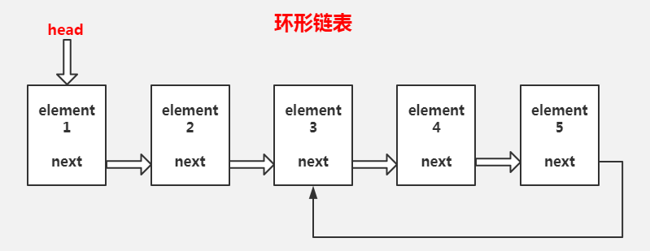

# 什么是链表(LinkedList)?
链表实际上是线性表的链式存储结构。

## 一.单向链表
各个节点数据通过指针的方法串联起来,构成链表。（单向指针）


### 实现单向链表

```js
class Node {
    constructor(element, next) {
        this.element = element;
        this.next = next;
    }
}
/**
 * add(index,element)  指定索引添加元素 
 * add(element)  直接添加元素
 * get(index)  获取指定索引元素
 * set(index,element) 修改指定索引节点内容
 * remove(index) 删除指定索引节点
 * clear() 清空链表 
 * 
 */
class LinkedList {
    constructor() {
        this.size = 0;
        this.head = null;
    }
    _node(index) {
        if (index < 0 || index >= this.size) throw new Error('越界');
        let current = this.head;
        for (let i = 0; i < index; i++) {
            current = current.next;
        }
        return current;
    }
    add(index, element) {
        if (arguments.length === 1) {
            element = index;
            index = this.size;
        }
        if (index < 0 || index > this.size) throw new Error('越界');
        if (index === 0) {
            let head = this.head;
            this.head = new Node(element, head);
        } else {
            let prevNode = this._node(index - 1);
            prevNode.next = new Node(element, prevNode.next);
        }
        this.size++;
    }
    get(index) {
        return this._node(index);
    }
    set(index, element) {
        let node = this._node(index);
        node.element = element;
        return node;
    }
    remove(index) {
        if (index < 0 || index >= this.size) throw new Error('越界');
        if (index === 0) {
            this.head = this.head.next;
        }else{
            let prevNode = this._node(index - 1);
            prevNode.next = prevNode.next.next;
        }
        this.size --;
    }
    clear() {
        this.size = 0;
        this.head = null;
    }
}
```
## 二.链表的反转
### (1)递归实现

```js

reverseList(){
    function reverse(head){
        if(head == null || head.next == null) return head;
        let newHead = reverse(head.next);
        head.next.next = head;
        head.next = null;
        return newHead;
    }
    this.head = reverse(this.head);
    return this.head 
}
```
### (2)循环实现


```js
reverseList(){
    let head = this.head;
    if(head == null || head.next == null) return head;
    let newHead = null;
    while (head !=null ) {
        let temp = head.next;
        head.next = newHead;
        newHead = head;
        head = temp;
    }
    this.head = newHead;
    return newHead;
}
```
## 三.单向循环链表


```js
add(index, element) {
    if (arguments.length === 1) {
        element = index;
        index = this.size;
    }
    if (index < 0 || index > this.size) throw new Error('越界');
    if (index === 0) {
        let head = this.head;
        let newHead  = new Node(element, head);
        let last = this.size === 0 ? newHead :this._node(this.size-1);
        this.head = newHead;
        last.next = newHead;
    } else {
        let prevNode = this._node(index - 1);
        prevNode.next = new Node(element, prevNode.next);
    }
    this.size++;
}
remove(index) {
    if (index < 0 || index >= this.size) throw new Error('越界');
    if (index === 0) {
        if(this.size === 1){ // 删除一个时特殊处理
                this.head = null;
        }else{
            let last = this._node(this.size-1);
            this.head = this.head.next;
            last.next = this.head;
        }
    }else{
        let prevNode = this._node(index - 1);
        prevNode.next = prevNode.next.next;
    }
    this.size--;
}
```
## 四.双向链表


```js
class Node {
    constructor(element, prev, next) {
        this.element = element;
        this.next = next;
        this.prev = prev;
    }
}
class LinkedList {
    constructor() {
        this.size = 0;
        this.head = null;
        this.tail = null;
    }
    get(index) {
        if (index < 0 || index >= this.size) {
            throw new Error('越界');
        }
        let current;
        if (index < (this.size >> 1)) {
            current = this.head;
            for (let i = 0; i < index; i++) {
                current = current.next;
            }
        } else {
            current = this.tail;
            for (let i = this.size - 1; i > index; i--) {
                current = current.prev;
            }
        }
        return current;
    }
    add(index, element) {
        if (arguments.length === 1) {
            element = index;
            index = this.size;
        }
        if (index < 0 || index > this.size) throw new Error('越界');
        // 向后添加的情况
        if (index == this.size) {
            let oldLast = this.tail;
            this.tail = new Node(element, oldLast, null);
            if (oldLast == null) { // 第一个添加的
                this.head = this.tail
            } else {
                oldLast.next = this.tail;
            }
        } else {
            let nextNode = this._node(index);
            let prevNode = nextNode.prev;
            let node = new Node(element, prevNode, nextNode);
            nextNode.prev = node; // 添加当前的节点
            if (prevNode == null) {
                this.head = node;
            } else {
                prevNode.next = node
            }
        }
        this.size++;
    }
    remove(index) {
        if (index < 0 || index >= this.size) throw new Error('越界');
        let node = this._node(index);
        prev = node.prev;
        next = node.next;
        if (prev === null) {
            this.head = next;
        } else {
            prev.next = next;
        }
        if (next == null) {
            this.tail = prev;
        } else {
            next.prev = prev;
        }
        this.size--;
    }
    clear() {
        this.size = 0;
        this.head = null;
        this.tail = null; 
    }
}
```
## 五.双向循环链表


```js
class Node {
    constructor(element, prev, next) {
        this.element = element;
        this.next = next;
        this.prev = prev;
    }
}
class LinkList {
    add(index, element) {
        if (arguments.length == 1) {
            element = index;
            index = this.size
        }
        if (index < 0 || index > this.size) {
            throw new Error('越界');
        }
        if (index == this.size) { // 向后添加
            let oldLast = this.tail;
            //  新增连头
            this.tail = new Node(element, oldLast, this.head);
            if (oldLast == null) {
                this.head = this.tail;
                // 尾巴 自己指向自己
                this.tail.next = this.tail;
                this.tail.prev = this.tail;
            } else {
                oldLast.next = this.tail;
                // 头指向尾巴
                this.head.prev = this.tail;
            }
        } else {
            let nextNode = this._node(index);
            let prevNode = nextNode.prev;
            let node = new Node(element, prevNode, nextNode);
            nextNode.prev = node; 
            prevNode.next = node
            if (index == 0) {
                this.head = node;
            }
        }
        this.size++;
    }
    remove(index) {
        if (index < 0 || index >= this.size) {
            throw new Error('越界');
        }
        if(this.size == 1){
            this.tail = null;
            this.head = null;
        }else{
            let node = this.get(index);
            let prevNode = node.prev;
            let nextNode = node.next;
            prevNode.next = nextNode;
            nextNode.prev = prevNode;
            if (index == 0) {
                this.head = nextNode;
            }
            if (index == this.size-1) {
                this.tail = prevNode;
            } 
            this.size--;
        }
    }
}
```
## 六.环形链表


```js
hasCycle() {
    let head = this.head;
    if (head == null || this.head == null) return false;
    let slow = head;
    let fast = head.next;
    while (fast !== null && fast.next !== null) {
        slow = slow.next;
        fast = fast.next.next;
        if (slow == fast) return true;
    }
    return false;
}
cycle(index) {
    let node = this.node(this.size - 1);
    let nextNode = this.node(index);
    node.next = nextNode
}

```
