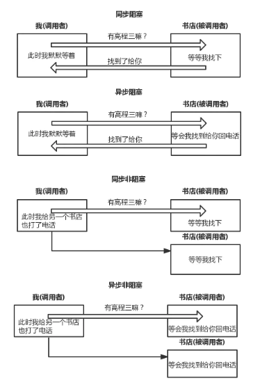
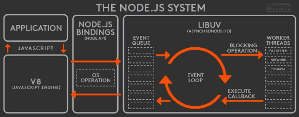

# Node 基本概念

## 一.Node 是什么?

Node.js 是一个基于 Chrome V8 引擎的 JavaScript 运行环境(runtime),Node 不是一门语言是让 js 运行在后端的运行时,并且不包括 javascript 全集,因为在服务端中不包含 DOM 和 BOM,Node 也提供了一些新的模块例如 http,fs 模块等。Node.js 使用了事件驱动、非阻塞式 I/O 的模型，使其轻量又高效并且 Node.js 的包管理器 npm，是全球最大的开源库生态系统。事件驱动与非阻塞 IO 后面我们会一一介绍。到此我们已经对 node 有了简单的概念。

## 二.Node 解决了哪些问题?

Node 在处理高并发,I/O 密集场景有明显的性能优势

高并发,是指在同一时间并发访问服务器
I/O 密集指的是文件操作、网络操作、数据库,相对的有 CPU 密集,CPU 密集指的是逻辑处理运算、压缩、解压、加密、解密
Web 主要场景就是接收客户端的请求读取静态资源和渲染界面,所以 Node 非常适合 Web 应用的开发。

## 三.JS 单线程

javascript 在最初设计时设计成了单线程,为什么不是多线程呢？如果多个线程同时操作 DOM 那岂不会很混乱？这里所谓的单线程指的是主线程是单线程的,所以在 Node 中主线程依旧是单线程的。

单线程特点是节约了内存,并且不需要在切换执行上下文
而且单线程不需要管锁的问题.

## 四.同步异步和阻塞非阻塞



## 五.Node 中的 Event Loop



- 1.我们写的 js 代码会交给 v8 引擎进行处理
- 2.代码中可能会调用 nodeApi,node 会交给 libuv 库处理
- 3.libuv 通过阻塞 i/o 和多线程实现了异步 io
- 4.通过事件驱动的方式,将结果放到事件队列中,最终交给我们的应用。
  本阶段执行已经被 setTimeout() 和 setInterval() 的调度回调函数。
  下面都是宏任务

```markdown
┌───────────────────────────┐
┌─>│ timers │
│ └─────────────┬─────────────┘
| 执行延迟到下一个循环迭代的 I/O 回调。
│ ┌─────────────┴─────────────┐
│ │ pending callbacks │
│ └─────────────┬─────────────┘
| 仅系统内部使用。
│ ┌─────────────┴─────────────┐
│ │ idle, prepare │
│ └─────────────┬─────────────┘  
| 检索新的 I/O 事件;执行与 I/O 相关的回调 ┌───────────────┐
│ ┌─────────────┴─────────────┐ │ incoming: │ pool 中有很多回调 node 中有执行的最大个数 超过最大个数延迟到下一个循环执行
│ │ poll │<─────┤ connections, │
│ └─────────────┬─────────────┘ │ data, etc. │
│ setImmediate() 回调函数在这里执行。 └───────────────┘
│ ┌─────────────┴─────────────┐  
│ │ check │
│ └─────────────┬─────────────┘
| 一些关闭的回调函数
│ ┌─────────────┴─────────────┐
└──┤ close callbacks │
└───────────────────────────┘
```

- timers: 定时器 setTimeout 执行，将 callback 加入队列中。
- pending callbacks: 一些 I/O 的 callback，推迟到下一次循环中执行。
- idle, prepare: 内部的一些事件。
- poll: 定时器的 callback 执行，setImmediate 执行，微任务执行。
- check: setImmediate 的 callback 执行。
- close callbacks: 一些 callbacks 的关闭，如 socket。

**timers、poll、check 阶段**

- timers
  这个阶段，只执行 setTimeout 和 setInterval，但是他们的 callback 不会执行，而是推到宏任务的队列之中。

- poll
  这个阶段，会先执行符合条件的微任务，比如 Promise 的异步完成，如果是 setImmediate，则只会执行，不执行他的 callback，然后执行定时器的 callback，比如 timeout。这里会适当得暂停一会，看看会不会有新任务进入队列。如果有 setImmediate 的 callback 则进入 check 阶段，否则回到 timer 继续新一轮循环。

- check
  当 poll 阶段的队列完成，则会轮到 check，这时会执行 setImmediate 的 callback。如果没有需要关闭 callbacks，那么就回到 timer 继续新一轮的循环。
  > 这里每一个阶段都对应一个事件队列,当 event loop 执行到某个阶段时会将当前阶段对应的队列依次执行。当该队列已用尽或达到回调限制，事件循环将移动到下一阶段

### 宏任务微任务

:::tip
执行一个宏任务 就会清空微任务 .... 可以理解为宏任务会先放到宏任务队列 但是微任务先执行
:::

- 宏任务
  从我的角度理解，就是一个正常的 task，本来在一个线程中可以毫无波折地一个接着一个运行到最后，奈何每个宏任务执行之后都有可能产生一些微任务，因此很不幸，这些宏任务就要排在这些微任务之后了。

宏任务代表：script(整体代码),setTimeout,setImmediate。

- 微任务
  就是宏任务执行时，产生的新的小任务，比如异步，此类任务称之为微任务，一般在当前宏任务执行完之后“插队”执行。

微任务代表：process.nextTick, Promise(原生)。

### setTimeout 与 setImmediate

- 1.**根据性能影响 执行顺序会不同**

```js
//timer阶段
setTimeout(() => {
  console.log("setTimeout");
});
//一种
//check阶段
setImmediate(() => {
  console.log("setImmdiate");
});
```

- 2.这种执行顺序是一定的 setImmdiate setTimeout

```js
fs.readFile("./note.md", function() {
  //i / o 轮询会执行i.o回调 如果没有定义setImmediate 会等待剩下的I/O完成 或者定时器到达时间
  setTimeout(() => {
    console.log("setTimeout");
  });
  //一种
  //check阶段
  setImmediate(() => {
    console.log("setImmdiate");
  });
});
```

### process.nextTick 会先于 Promise

> process.nextTick() 当前同步代码执行完毕后立即调用从技术上讲不是事件循环的一部分.
> :::tip
> node 先执行栈中代码 然后再执行宏任务 执行一个宏任务（s） 清空微任务 然后再执行宏任务 。。。。
> :::
> 全局属性 -- 能在文件夹里的文件直接直接访问的
> 全局变量 globle.

## 六.Node 中全局对象

- Buffer
### process
  - process.argv：返回当前进程的命令行参数数组。
    重要的模块 commander

    ```js
    const program = require("commander");
    const chalk = require("chalk");
    program.naome("zf");
    program.usage("[options]");
    //这个要写在上面 才有效果
    program //配置命令
      .command("create")
      .alias("c")
      .description("create project")
      .action(() => {
        console.log("create project");
      });
    //'set port描述文字'
    program.option("-p, --port <val>", "set port").version("1.0.0");

    // console.log(program);
    program
      .on("--help", () => {
        console.log("Examples");
        console.log("  node 1.js");
        console.log("  node 1.js create" + "  " + chalk.green("project"));
      })
      .parse(process.argv); //parse一定要放到最后
    ```

  - process.env：返回一个对象，成员为当前 Shell 的环境变量，比如 process.env.HOME。
    window 可以通过 set xxx=xxx / mac export xxx = xxx 可以设置环境变量
    第三方模块 cross-env 读取 process.env.xxx
  - process.installPrefix：node 的安装路径的前缀，比如/usr/local，则 node 的执行文件目录为/usr/local/bin/node。
  - process.pid：当前进程的进程号。
  - process.platform：当前系统平台，比如 Linux。
  - process.title：默认值为“node”，可以自定义该值。
  - process.version：Node 的版本，比如 v0.10.18。
  - process.chdir()：切换工作目录到指定目录。
  - process.cwd()：返回运行当前脚本的工作目录的路径。
  - process.exit()：退出当前进程。
  - process.getgid()：返回当前进程的组 ID（数值）。
  - process.getuid()：返回当前进程的用户 ID（数值）。
  - process.nextTick()：指定回调函数在当前执行栈的尾部、下一次 Event Loop 之前执行。
  - process.on()：监听事件。
  - process.setgid()：指定当前进程的组，可以使用数字 ID，也可以使用字符串 ID。
  - process.setuid()：指定当前进程的用户，可以使用数字 ID，也可以使用字符串 ID。
- setInterval,setTimeout,setImmediate
- console
- queueMicrotask

## 七.node 中的模块

- \_\_dirname
- \_\_filename
- exports
- module
- require()
