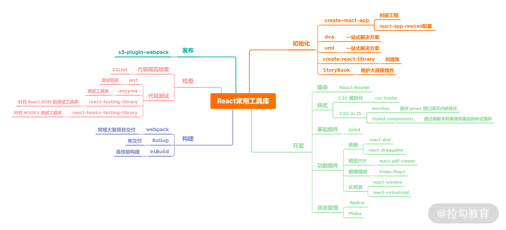

## 01 | 你真的了解 React 吗？
你真的了解 React 吗？我们在面试中往往涉及 React 时，第一个问题就是“解释 React 是什么”。解释一种技术是什么，在面试中也是非常常见的引起 话题的题目。所以本讲我就带你通过讲解“如何解释 React 是什么”，让你掌握这一类概念题在面试中的解答技巧。

**破题**

“如何解释 React 是什么？”还有一种常见的问法是这样的：“谈一谈你对 React 的理解”。

这个题目看似很容易，却很不好回答，因为大部分人拿到这个问题首先会“线性思考”，即一种直线的、单向的思维方式，表现为：想到哪儿讲到哪儿，缺乏全盘考虑。然后凭直觉作答，这样显然是不行的。可以看看这样一个在面试中很常见的场景。

>面试官：如何解释 React 是什么？  
>应聘同学：React 是一个库。 
>面试官：对，能再补充一点吗？  
>应聘同学：React 的特点是声明式、组件化、一次学习随处编写。  
>面试官：还有再补充的吗？  
>应聘同学：React 的原理是……   

很显然，在这个场景中，你已经失去了主动权，不断地被外界推着往前走。甚至最后你已经不是在回答 React 是什么了，而是跑到另外一个问题去了。看似简单的提问其实不仅能反映出你对 React 的了解程度，还能反映出你在工作中的状态以及思考问题的思路：

* 你是出现一个问题解决一个问题，不断被外界推着线性往前走；

* 还是能够高屋建瓴地思考全局。

你在工作中是不是也有类似的感觉？比如刚接触新技术的时候和变成熟手之后会有些不同的认知与感悟。就像老话说的一样：

>参禅之初，看山是山，看水是水；禅有悟时，看山不是山，看水不是水；禅中彻悟，看山仍然山，看水仍然是水。

所以本题同样考察了你对 React 的理解度，是否有“看山水”的那种变化。理解到了这一层意思，那么就完成了破题的第一步。但仅到这一步仍然是不够的，还需要在表达上有方法论的支持。

就像开篇所描述的场景：对概念很熟，对知识点也很了解，相关工具不知道用了多少次了，但面试的时候，突然整个人就拧巴了， 不知道怎么讲。那就是因为缺少相应的方法论，所以才会出现知道是什么，而无法清晰地表达的情况。所以我们既要重视知识本身，也要重视表达方法。

对待这类概念题，讲究一个四字口诀“讲说理列”，即“讲概念，说用途，理思路，优缺点，列一遍” 。

* 讲概念：用简洁的话说清楚该技术是什么。最好能用一句话描述。

* 说用途：描述该技术的用途。能够具体结合适合场景，拓展性的描述。

* 理思路：梳理该技术的核心思路或运作流程。这个地方可深可浅，如果对其有足够深入的了解，建议详细地展开说明。

* 优缺点，列一遍：对该技术栈的优缺点进行列举。列举优缺点肯定有与其他技术方案横向对比的过程，那么在这个过程中，切忌刻意地踩一捧一，容易引发面试官的反感。

这是本题第二个重要点，即表达的技巧，也是本专栏的一个重要主题：不只是梳理知识，更要学会如何回答问题。

破题是一个思维发散的过程，接下来需要把上面思考的内容收一下。

**承题**

现在从上面“碎碎念”的思考中整理一下信息，即采用非线性的结构化模式阐述答案。基于上面我们说到的“四字口诀”这一表达技巧的基础上，就非常容易延伸出我们作答的大体框架。

* 讲概念需要讲什么？讲技术本质。

* 说用途是说什么？说使用场景。

* 理思路是理什么？理核心技术思路。

* 列优缺点是列什么？是通过对比调研业界流行的技术方案，去发掘 React 的独特优势，去找出 React 的缺点。


知识导图

**入手**

根据以上的分析，接下来我带你一一进行拆解。

**概念**

回归本质，React 是一个网页 UI 框架。当然这样一个随处可见的回答并不能令人满意，我们需要回顾历史去寻找答案。

**React 诞生于 jQuery、AngularJS 与 Backbone.js 相继流行的时代。jQuery 诞生于 2005 年，浏览器兼容性是当时最大的问题。为了解决这个问题， jQuery 封装 DOM 操作，提供样式选择器，封装了 AJAX、链式操作等大量基础函数。但从如今的视角来看，jQuery 并没有解决代码如何组织的问题，甚至不能称之为框架，本质上它只是一个工具函数合集。**

因为无论是从 jQuery 输入端，还是输出端来看，一切都是混沌的。HTML、CSS、JavaScript 就像原料一样送入 jQuery 搅拌机，拌着拌着拌出一个网页。你会发现并没有一个可以称之为模式的方式将这些原料有序地组合在一起，因为这并不是 jQuery 能够解决的问题。


jQuery 代码组织方式

当然，这段时间网页还不够复杂，效果还不需要做得很酷炫。然而当 PC 的性能越来越好，页面变得越来越复杂，前端的工程也开始庞大了起来。**如何组织代码结构，如何有效提升复用率，开始成为大家亟待解决的问题。**

**2009年，AngularJS 横空出世，带着 Java 开发的先进经验闯入了前端的世界中。** 它不仅引入了 MVC 的思想，还强行灌入了 controller、$scope、service 等一系列概念。如同 Spring Boot，AngularJS 提供了一揽子全家桶解决方案，从底层开始深度封装，向上提供了路由、双向绑定、指令、组件等框架特性。

AngularJS 的分层设计是齐全且优秀的，覆盖了整个 Web 开发的方方面面。MVC 它有，数据绑定它有，前端路由它有，表单校验它有，设计模式它也有，内容多到像一本百科全书。如下图所示。


AngularJS 分层设计图

但也正是因为它庞大复杂的概念，你在使用 AngularJS 进行开发的时候，需要编写大量的面条代码，你会感觉自己并不是在写前端，而是在写 AngularJS。jQuery 时代和 AngularJS 时代，一个最明显的区别在于，jQuery 时代是与浏览器斗争，而 AngularJS 时代，更像是与 AngularJS 斗争。代码如何组织是清晰了，可数不清的概念，让 AngularJS 看起来更像一个披着前端皮的 Java 框架。甚至会有人感慨，这一切值得吗？

当然也有值得的地方，AngularJS 的双向绑定就是当时最大的特色。双向绑定在中后台网页开发中极大地提升了开发效率。中后台页面几乎全是列表与表单，双向绑定使值与视图动态可以自动更新，节约了几乎一半以上手动编写代码的时间。

**时间继续往前走，来到了 2010 年，如果你希望自己的代码有序地组织起来，又不想陷入 Angular.js 无穷无尽的概念中，那么 Backbone.js 就是一个很好的选择。**它并没有像 AngularJS 那样带来大量概念，还考虑到了两个方面：

* 与前代的亲和性，只要你懂 jQuery，你就可以继续快乐地写前端代码，而不需要再学习一种语言；

* 它考虑了代码的组织性，引入了基础 MVC 的概念，同时提供集合与前端路由的封装，补齐了 jQuery 无序的短板。

所以对于初学者而言， Backbone.js 非常友好，甚至一度流行。选择 Backbone.js 的最主要原因是它使**前端项目工程化的成本足够低**。这个“低”不光是指开发人员的学习成本低，还有改造成本低，因为大量的 jQuery 存量项目都可以尝试迁移。


Backbone 的结构图

回顾历史会发现，前端项目在不断地工程化，同时也不断地发展出新的概念。但这两个问题还是难以解决：

* 与后端不同的是前端主要以 UI 组件为基础，需要一个可以使组件复用的开发方案，过去常见的复用方案是拼装模板；

* 前端工程越来越庞杂，组件作为基本单位应该是可以通过编写单元测试来维持稳定性的。

基于过去的模式，要做到这两点是非常困难的。你会发现过去的框架通常是从页面的维度去思考，然后零星装上 jQuery 的各种小插件。

初次接触 React 的同学会发现，开发 React 的思维模式是完全不同的，概念也极为简单。如果用一个非常简洁的公式来表达，那就是：

>View = fn(props)

这个公式表达了给定相同的输入状态， 函数总是会生成一致的组件。只有做到输入与输出恒定，那么它才是可测的。

其次 fn 内部也可以是无数个组件构成的。React 中只有组件，没有页面，没有控制器，也没用模型。没有页面？那就用组件组合生成一个页面，没有控制器，那就用组件充当控制器。就像搭建乐高玩具一样。

当然 React 的变量会更多一些，将 state 和 context 考虑进去，那也是可以表达的：

>View = fn(props, state, context)

从实际编码上来讲，fn 可能是一个类组件，也可能是纯函数组件，也可能在函数中产生影响 UI 生成的副作用，比如直接操作 DOM 或者绑定事件等。经典公式总是会展示理想情况，就像 E=mc² 简化了大量的外界干扰因素，但这不妨碍它表达了一个结论，即在 React 中只需要关心两件事：数据与组件。

那为什么会把基本单位定位于组件呢？如果对设计模式有印象的话，你是否还记得“组合优于继承”的铁律？即在构建 UI 视图时，组合组件始终是最优的解决方案。

而 React 是通过组件化的方式解决视图层开发复用的问题，本质是一个组件化框架。

**用途**
React 的用途当然是构建视图啦。由于 React 虚拟 DOM 的关系，在适用场景上远比传统框架更为广泛：

* 首先无论是 PC 网页还是移动端网页，都是完全支持的；

* 其次由于 React Native，也可以用于开发 iOS 与 Android 应用；

* 还有 React 360 可以开发 VR 应用；

* 冷门儿的如 ink，也可以使用 React 开发命令行应用。

**React 的生态极大地丰富了其使用场景。**

**核心思路**

**React 的核心思路有三点，分别是声明式、组件化与通用性（官方称之为：一次学习，随处编写）。**

**声明式**

**声明式编程的优势在于直观，可以做到一目了然，也便于组合。**

如果是命令式编程，那么会是这样：

```js
// HTML
<div class="block"></div>
// JS
const block = $('.block');
block.css('color', 'red');
```
如果是 React，则会这样写：

```js
const Block = (props) => <div style={{ color: 'red' }}></div>
```
相较于上面的写法，Block 不仅结构上更容易阅读，而且更容易与其他组件代码进行组合。

**组件化**

**组件化可以降低系统间功能的耦合性，提高功能内部的聚合性**对前端工程化及代码复用有极大的好处。React 组件化最大的区别在于没有使用模板进行编写，而是采用了声明式的 JSX。

**通用性**

这就要说到 React 的虚拟 DOM。React 将 DOM 抽象为虚拟 DOM，开发者并不会直接操作 DOM。正因为有这样一层封装，使得 React 不再局限于 Web 开发，而能走向更宽广的平台，出现更繁荣的生态。无论是 Native、VR 还是 Shell 命令，只要兼容虚拟 DOM 层，那么都可以直接运行 React。详细内容可以查阅第 09 讲。

**优缺点**
其实核心设计思路就是 React 的优点：声明式、组件化与通用性。

当然 React 也有缺点， 由于 React 并不是一个一揽子框架，比如路由一类的功能，React 团队更希望交给社区来解决。所以导致在技术选型与学习使用上有比较高的成本。但也正因为社区蓬勃发展，非官方的一揽子解决方案还是有的，比如 DvaJS、React-coat 等填补了生态位的缺失。所以 React 也是一个使用者上限与下限差距极大的框架。

答题
经过以上的梳理，我们可以尝试答题了。

>React 是一个网页 UI 框架，通过组件化的方式解决视图层开发复用的问题，本质是一个组件化框架。

>>它的核心设计思路有三点，分别是声明式、组件化与 通用性。 
>>声明式的优势在于直观与组合。  
>>组件化的优势在于视图的拆分与模块复用，可以更容易做到高内聚低耦合。  
>>通用性在于一次学习，随处编写。比如 React Native，React 360 等， 这里主要靠虚拟 DOM 来保证实现。  
>>这使得 React 的适用范围变得足够广，无论是 Web、Native、VR，甚至 Shell 应用都可以进行开发。这也是 React 的优势。  
>>但作为一个视图层的框架，React 的劣势也十分明显。它并没有提供完整的一揽子解决方 案，在开发大型前端应用时，需要向社区寻找并整合解决方案。虽然一定程度上促进了社区的繁荣，但也为开发者在技术选型和学习适用上造成了一定的成本。

回答到这里基本就差不多了，但在面试的时候，我们可以尝试拿到更多的主动性，即补充类似如下的回答：

* 承接在优势后，可以再谈一下自己对于 React 优化的看法（详细内容可参考模块四）、对虚拟 DOM 的看法（详细内容可参考第 09 讲）；

* 向自己主导过的 React 项目上引导，谈一谈 React 相关的工程架构与设计模式（详细内容可参考第 18 讲）。

整体的面试时间总是固定的，所以如果有机会的话，尽可能展示你最熟悉的知识点和最丰富的实践案例。

**总结**

本讲主要讲解了“如何解释 React 是什么”这样一个看似简单却又很难解释的问题。“如何解释 React 是什么？”反映了面试者对 React 的认知水平，常用来快速划分面试者层次。通过这一讲你可以掌握 React 的核心设计思考，了解与其他框架的区别，更重要的是使用非线性的结构化思考模式来回答考官的这一类问题，这一点比答案本身更重要。

在本讲中提到了“声明式”这样一个概念，那 React 在组件中是如何展现“声明式”的呢？接下来的 02 讲我们会讲这个问题。

## 02 | 为什么 React 要用 JSX？

本讲我们一起来聊聊在面试中“为什么 React 要用 JSX?”该如何回答。

**破题**

初读一遍题目“为什么 React 要用 JSX？”，你可能会感觉有点怪怪的。这时你可以换个角度想一下，就好像有人在问你，“为什么你喜欢吃甜豆腐脑？”

你是不是想迫不及待地写一首诗，赞美甜豆腐脑到底有多好吃呢？这你可就没答到点子上了。其实面试官的潜台词是“咸豆腐脑为什么不可以呢？”，对于这个问题来说是这样的。

这便是我想着重告诉你的一个思路——通过比较论证的方式证明甜豆腐脑更胜一筹。

当然，如果你是一位豆腐脑大师，甚至一名颇有威望的豆腐脑专家。那么，摆在大家面前对比的方案将会更多，甚至有酸辣豆腐脑、巧克力豆腐脑、韩式豆腐脑等等。所以，这里问“为什么用 JSX”，其引申含义是“为什么不用 A、B、C？”

无论是面试还是晋升，“为什么采用该技术方案”这一类问题是主考官最爱提的。这类问题其实在考察你的两个方面：

* 技术广度，深挖知识面涉猎广度，对流行框架的模板方案是否知悉了解；

* 技术方案调研能力。

大多数时候，我们选取技术方案主要依靠直觉和习惯。这样既缺乏技术方案调研比对的过程，又缺乏个人的深度思考。所以这道题，如果你的回答是“JSX 更简单易用，React 官方推荐”，当然不行！你要说服主考官，你就得拿出更多口味的“豆腐脑”进行比对才行。

**承题**

通过以上的分析，我们可以使用**“三步走技巧”，即 “一句话解释，核心概念，方案对比”**的解题思路，来回答面试中“为什么 React 使用 JSX？”这类问题。

1. 一句话解释 JSX。首先能一句话说清楚 JSX 到底是什么。

2. 核心概念。JSX 用于解决什么问题？如何使用？

3. 方案对比。与其他的方案对比，说明 React 选用 JSX 的必要性。


**入手**

**一句话解释**

按照 React 官方的解释，JSX 是一个 JavaScript 的语法扩展，或者说是一个类似于 XML 的 ECMAScript 语法扩展。它本身没有太多的语法定义，也不期望引入更多的标准。

实际上，在 16 年的时候，JSX 公布过 2.0 的建设计划与小部分新特性，但很快被 Facebook 放弃掉了。整个计划在公布不到两个月的时间里便停掉了。其中一个原因是 JSX 的设计初衷，即并不希望引入太多的标准，也不期望 JSX 加入浏览器或者 ECMAScript 标准。

那这是为什么呢？这就涉及了 JSX 的核心概念。

**核心概念**

其实 React 本身并不强制使用 JSX。在没有 JSX 的时候，React 实现一个组件依赖于使用 React.createElement 函数。代码如下：

```js
class Hello extends React.Component {
  render() {
    return React.createElement(
        'div',
        null, 
        `Hello ${this.props.toWhat}`
      );
  }
}
ReactDOM.render(
  React.createElement(Hello, {toWhat: 'World'}, null),
  document.getElementById('root')
);
```
而 JSX 更像是一种语法糖，通过类似 XML 的描述方式，描写函数对象。在采用 JSX 之后，这段代码会这样写：

```js

class Hello extends React.Component {
  render() {
    return <div>Hello {this.props.toWhat}</div>;
  }
}
ReactDOM.render(
  <Hello toWhat="World" />,
  document.getElementById('root')
);
```

通过这样的对比，你可以清晰地发现，**代码变得更为简洁，而且代码结构层次更为清晰。**

因为 React 需要将组件转化为虚拟 DOM 树，所以我们在编写代码时，实际上是在手写一棵结构树。**而XML 在树结构的描述上天生具有可读性强的优势。**

但这样可读性强的代码仅仅是给写程序的同学看的，实际上在运行的时候，会使用 Babel 插件将 JSX 语法的代码还原为 React.createElement 的代码。

那既然可以用插件帮我们编译转换代码，那为什么不直接使用模板呢？通过下一部分的方案对比可以解决你的问题。

**方案对比**

**设计初衷**

谈论其他方案之前，就需要谈到 React 的设计初衷，也是计算机科学里面一个非常重要的概念，叫作关注点分离（Separation of concerns）。

>关注点分离在计算机科学中，是将代码分隔为不同部分的设计原则，是面向对象的程序设计的核心概念。其中每一部分会有各自的关注焦点。

>关注点分离的价值在于简化程序的开发和维护。当关注点分开时，各部分可以重复使用，以及独立开发和更新。具有特殊价值的是能够稍后改进或修改一段代码，而无须知道其他部分的细节必须对这些部分进行相应的更改。

>在 React 中，关注点的基本单位是组件。在接触一段时间 React 开发后，你会发现 React 单个组件是高内聚的，组件之间耦合度很低。

那模板不能做到吗？

**模板**

**React 团队认为引入模板是一种不佳的实现。** 因为模板分离了技术栈，而非关注点的模板同时又引入了更多的概念。比如新的模板语法、模板指令等，以 AngularJS 为例，我们可以看一下有多少新概念的引入。

```js
<!doctype html>
<html ng-app="docsBindExample">
  <head>
    <script src="http://code.angularjs.org/1.2.25/angular.min.js"></script>
    <script src="script.js"></script>
  </head>
  <body>
    <div ng-controller="Ctrl1">
      Hello <input ng-model='name'> <hr/>
      <span ng-bind="name"></span> <br/>
      <span ng:bind="name"></span> <br/>
      <span ng_bind="name"></span> <br/>
      <span data-ng-bind="name"></span> <br/>
      <span x-ng-bind="name"></span> <br/>
    </div>
  </body>
</html>
angular.module('docsBindExample', [])
  .controller('Ctrl1', function Ctrl1($scope) {
    $scope.name = 'Max Karl Ernst Ludwig Planck (April 23, 1858 –        October 4, 1947)';
  });
```
这段代码有很强的疏离感，引入了非常多 Angular 独有的概念。但 JSX 并不会引入太多新的概念，它仍然是 JavaScript，就连条件表达式和循环都仍然是 JavaScript 的方式。如下代码所示：

```js
const App = (props) => {
  return (
    <div>
       {props.isShow? <a>show</a> : <a>hidden</a>}
       {props.names.map(name => <a>{name}</a>)}
    </div>
  )
}
```
即便是粗略的比较代码，也可以看出 React 代码更简洁，更具有可读性，更贴近 HTML。

那模板字符串也可以套用 HTML，所以用模板字符串不行吗？

**模板字符串**

我们来看下面的例子：

```js
var box = jsx`
  <${Box}>
    ${
      shouldShowAnswer(user) ?
      jsx`<${Answer} value=${false}>no</${Answer}>` :
      jsx`
        <${Box.Comment}>
         Text Content
        </${Box.Comment}>
      `
    }
  </${Box}>
`;
```
这显然不是一个容易的方案，代码结构变得更复杂了，而且开发工具的代码提示也会变得很困难。

**JXON**

JXON 非常类似于当下的 JSX，它的结构是这样的：

```js

<catalog>
  <product description="Cardigan Sweater">
   <catalog_item gender="Men's">
     <item_number>QWZ5671</item_number>
     <price>39.95</price>
     <size description="Medium">
       <color_swatch image="red_cardigan.jpg">Red</color_swatch>
       <color_swatch image="burgundy_cardigan.jpg">Burgundy</color_swatch>
     </size>
     <size description="Large">
       <color_swatch image="red_cardigan.jpg">Red</color_swatch>
       <color_swatch image="burgundy_cardigan.jpg">Burgundy</color_swatch>
     </size>
   </catalog_item>
   <catalog_item gender="Women's">
     <item_number>RRX9856</item_number>
     <discount_until>Dec 25, 1995</discount_until>
     <price>42.50</price>
     <size description="Medium">
       <color_swatch image="black_cardigan.jpg">Black</color_swatch>
     </size>
   </catalog_item>
  </product>
  <script type="text/javascript"><![CDATA[function matchwo(a,b) {
    if (a < b && a < 0) { return 1; }
    else { return 0; }
}]]></script>
</catalog>
```
但最终放弃 JXON 这一方案的原因是，大括号不能为元素在树中开始和结束的位置，提供很好的语法提示。

**答题**
经过以上的梳理，我们可以尝试答题了。

>在回答问题之前，我首先解释下什么是 JSX 吧。JSX 是一个 JavaScript 的语法扩展，结构类似 XML。

>>JSX 主要用于声明 React 元素，但 React 中并不强制使用 JSX。即使使用了 JSX，也会在构建过程中，通过 Babel 插件编译为 React.createElement。所以 JSX 更像是 React.createElement 的一种语法糖。

>所以从这里可以看出，React 团队并不想引入 JavaScript 本身以外的开发体系。而是希望通过合理的关注点分离保持组件开发的纯粹性。

>接下来与 JSX 以外的三种技术方案进行对比。

>首先是模板，React 团队认为模板不应该是开发过程中的关注点，因为引入了模板语法、模板指令等概念，是一种不佳的实现方案。

>其次是模板字符串，模板字符串编写的结构会造成多次内部嵌套，使整个结构变得复杂，并且优化代码提示也会变得困难重重。

>最后是 JXON，同样因为代码提示困难的原因而被放弃。

>所以 React 最后选用了 JSX，因为 JSX 与其设计思想贴合，不需要引入过多新的概念，对编辑器的代码提示也极为友好。

大家在学完这讲内容后，就可以对照以下知识导图，检验自己的学习成果了。


**进阶**
**Babel 插件如何实现 JSX 到 JS 的编译？** 在 React 面试中，这个问题很容易被追问，也经常被要求手写。

它的实现原理是这样的。Babel 读取代码并解析，生成 AST，再将 AST 传入插件层进行转换，在转换时就可以将 JSX 的结构转换为 React.createElement 的函数。如下代码所示：

```js

module.exports = function (babel) {
  var t = babel.types;
  return {
    name: "custom-jsx-plugin",
    visitor: {
      JSXElement(path) {
        var openingElement = path.node.openingElement;
        var tagName = openingElement.name.name;
        var args = []; 
        args.push(t.stringLiteral(tagName)); 
        var attribs = t.nullLiteral(); 
        args.push(attribs); 
        var reactIdentifier = t.identifier("React"); //object
        var createElementIdentifier = t.identifier("createElement"); 
        var callee = t.memberExpression(reactIdentifier, createElementIdentifier)
        var callExpression = t.callExpression(callee, args);
        callExpression.arguments = callExpression.arguments.concat(path.node.children);
        path.replaceWith(callExpression, path.node); 
      },
    },
  };
};
```

这里布置个小作业给大家：弄清楚这段代码是如何运行起来的。

**总结**
本讲主要讲解了 React 选用 JSX 的原因，通过这一讲你可以掌握 JSX 的核心思想与替代方案。但似乎离组件的主题还有点儿距离，毕竟 JSX 只是组件的一种描述形式，真正到组件上还有诸如生命周期一类的东西。下一讲我就带你到组件的生命周期中去一探究竟。

在进阶部分，我给你留了个小作业，你可以通过查询 Babel 的开发文档来解决这个问题。

无论是在学习还是完成小作业的过程中遇到任何问题，都可以随时在留言区留言，我将与你共同探讨。
## 03 | 如何避免生命周期中的坑？

你好，我是伯约，在开始第 3 讲之前，我先来公布下第 2 讲小作业的答案！

小作业答案
你可以先新建一个目录，就叫 babelTest 吧。

然后新建一个 .babelrc 文件，这个文件是 babel 的配置文件。因为需要自己实现 plugins，所以先写上。

```js
{
  "plugins": []
}
```
然后实现一个解析 JSX 文件的插件，取名叫 ./jsx-parser。

```js
module.exports = function () {
  return {
    manipulateOptions: function manipulateOptions(opts, parserOpts) {
      parserOpts.plugins.push("jsx");
    }
  };
};
```
把它加入 plugins 里，就像下面这样：

```js
{
  "plugins": ["./jsx-parser"]
}
```
这是第一步，可以识别 jsx 文件，那么第二步来放一下上一讲讲到的源码，新建一个 jsx-plugin 文件，然后把上一讲的源码复制进去。


```js

{
  "plugins": ["jsx-plugin", "./jsx-parser"]
}
```
接下来就需要一个 jsx 文件进行试验，新建 hello.jsx，写入下面的内容：


```js
function Test() {
  return <div><a>Hello~~~</a></div>
}
```
完工，最后是用 babel 执行它。

```js
babel
bash: command not found: babel
```
等等？为什么不能执行呢？因为没安装 babel 呀。

```js

npm install babel-cli -g
babel hello.jsx
```
最后，看看输出，是不是有种彻底征服 JSX 的感觉呀？

接下我们进入正题，一起来聊聊在面试中“如何避免生命周期中的坑?”该如何回答。

**破题**
关于如何避免生命周期中的坑，你得先去理解问题中的潜台词。“如何避免坑？”更深层的意思是“你蹚过多少坑？”当然，你不可能把每次遇到的 Bug 都一一讲给面试官听，这会显得非常没有重点。

正如前两讲所说，答题的技巧更为重要。不仅需要对知识概念有体系化的认知——“讲概念，说用途，理思路，优缺点，来一遍”，还需要对你长期开发过程中的思考，有经验层面的方法总结。

“如何避免坑？”换种思维思考也就是“为什么会有坑？”在代码编写中，遇到的坑往往会有两种：

* 在不恰当的时机调用了不合适的代码；

* 在需要调用时，却忘记了调用。

就好比养花浇水，你需要在恰当的时机做恰当的事。比如在春季和秋季，浇水的时候最好选择在上午和下午；在夏季，适合在早上和晚上浇水；冬季的话，中午最适合浇水。

回到本题，在生命周期中出现的坑，那就一定跟生命周期有关。所以，**通过梳理生命周期，明确周期函数职责，确认什么时候该做什么事儿，以此来避免坑。**

承题
根据破题的思路，我们需要确立讨论的范围：

* 基于周期的梳理，确认生命周期函数的使用方式；

* 基于职责的梳理，确认生命周期函数的适用范围。

以此建立时机与操作的对应关系。


**入手**

**概念**

当我们在讨论 React 组件生命周期的时候，一定是在讨论类组件（Class Component）。函数式组件并没有生命周期的概念，因为它本身就是一个函数，只会从头执行到尾。

生命周期是一个抽象的概念，能让开发者产生联想记忆的往往是那些函数，比如 componentDidMount、componentWilMount 等等。然而这些函数并不是它的生命周期，只是在生命周期中按顺序被调用的函数。挂载 -> 更新 -> 卸载这一 React 组件完整的流程，才是生命周期。

**流程梳理**

接下来我将按照生命周期中函数的调用顺序，逐一列举被调用的函数。

**挂载阶段**

挂载阶段是指组件从初始化到完成加载的过程。

**constructor**

constructor 是类通用的构造函数，常用于初始化。所以在过去，constructor 通常用于初始化 state 与绑定函数。常见的写法如下：

```js
import React from 'react'
class Counter extends React.Component {
  constructor(props) {
    super(props)
    this.state = {
      count: 0,
    }
    this.handleClick = this.handleClick.bind(this)
  }
  handleClick() {
     // do some stuff
  }
  render() {
     return null
  }
}
```
那为什么会强调过去呢，因为当类属性开始流行之后，React 社区的写法发生了变化，即去除了 constructor。

```js
import React from 'react'
class Counter extends React.Component {
   state = {
      count: 0,
   }

   // 类属性第三阶段提案
   handleClick = () => {
     // do some stuff
   }
  render() {
     return null
  }
```
社区中去除 constructor 的原因非常明确：

- constructor 中并不推荐去处理初始化以外的逻辑；

- 本身 constructor 并不属于 React 的生命周期，它只是 Class 的初始化函数；

- 通过移除 constructor，代码也会变得更为简洁。

**getDerivedStateFromProps**

本函数的作用是使组件在 props 变化时更新 state，那它什么时候才会起效呢？它的触发时机是：

- 当 props 被传入时；

- state 发生变化时；

- forceUpdate 被调用时。

最常见的一个错误是认为只有 props 发生变化时，getDerivedStateFromProps 才会被调用，而实际上只要父级组件重新渲染时，getDerivedStateFromProps 就会被调用。所以是外部参数，也就是 props 传入时就会发生变化。以下是官方文档中的例子：

```js
class ExampleComponent extends React.Component {
  // 在构造函数中初始化 state，
  // 或者使用属性初始化器。
  state = {
    isScrollingDown: false,
    lastRow: null,
  };

  static getDerivedStateFromProps(props, state) {
    if (props.currentRow !== state.lastRow) {
      return {
        isScrollingDown: props.currentRow > state.lastRow,
        lastRow: props.currentRow,
      };
    }

    // 返回 null 表示无需更新 state。
    return null;
  }
}
```
依据官方的说法，它的使用场景是很有限的。由于太多错误使用的案例，React 官方团队甚至写了一篇[你可能不需要使用派生 state](https://zh-hans.reactjs.org/blog/2018/06/07/you-probably-dont-need-derived-state.html)。文中主要列举了两种反模式的使用方式：

- 直接复制 prop 到 state；

- 在 props 变化后修改 state。

这两种写法除了增加代码的维护成本外，没有带来任何好处。

**UNSAFE_componentWillMount**

也就是 componentWillMount，本来用于组件即将加载前做某些操作，但目前被标记为弃用。因为在 React 的异步渲染机制下，该方法可能会被多次调用。

一个常见的错误是 componentWillMount 跟服务器端同构渲染的时候，如果在该函数里面发起网络请求，拉取数据，那么会在服务器端与客户端分别执行一次。所以更推荐在componentDidMount中完成数据拉取操作。

**一个良好的设计应该是不让用户有较高的理解成本，而该函数却与之背道而驰**。**所以已被标记弃用，还在用的同学们可以跟着迁出了。

**render**

render 函数返回的 JSX 结构，用于描述具体的渲染内容。但切记，render 函数并没有真正的去渲染组件，渲染是依靠 React 操作 JSX 描述结构来完成的。还有一点需要注意，render 函数应该是一个纯函数，不应该在里面产生副作用，比如调用 setState 或者绑定事件。

那为什么不能 setState 呢？因为 render 函数在每次渲染时都会被调用，而 setState 会触发渲染，就会造成死循环。

那又为什么不能绑定事件呢？因为容易被频繁调用注册。

**componentDidMount**

componentDidMount 主要用于组件加载完成时做某些操作，比如发起网络请求或者绑定事件，该函数是接着 render 之后调用的。但 componentDidMount 一定是在真实 DOM 绘制完成之后调用吗？在浏览器端，我们可以这么认为。

但在其他场景下，尤其是 React Native 场景下，componentDidMount 并不意味着真实的界面已绘制完毕。由于机器的性能所限，视图可能还在绘制中。

更新阶段

更新阶段是指外部 props 传入，或者 state 发生变化时的阶段。该阶段我们着重介绍下以下 6 个函数：

**UNSAFE_componentWillReceiveProps**

该函数已被标记弃用，因为其功能可被函数 getDerivedStateFromProps 所替代。

另外，当 getDerivedStateFromProps 存在时，UNSAFE_componentWillReceiveProps 不会被调用。

**getDerivedStateFromProps**

同挂载阶段的表现一致。

**shouldComponentUpdate**

该方法通过返回 true 或者 false 来确定是否需要触发新的渲染。因为渲染触发最后一道关卡，所以也是性能优化的必争之地。通过添加判断条件来阻止不必要的渲染。

React 官方提供了一个通用的优化方案，也就是 PureComponent。PureComponent 的核心原理就是默认实现了shouldComponentUpdate函数，在这个函数中对 props 和 state 进行浅比较，用来判断是否触发更新。

```js
shouldComponentUpdate(nextProps, nextState) {
  // 浅比较仅比较值与引用，并不会对 Object 中的每一项值进行比较
  if (shadowEqual(nextProps, this.props) || shadowEqual(nextState, this.state) ) {
    return true
  }
  return false
}
```
**UNSAFE_componentWillUpdate**

同样已废弃，因为后续的 React 异步渲染设计中，可能会出现组件暂停更新渲染的情况。

**render**

同挂载阶段一致

**getSnapshotBeforeUpdate**

getSnapshotBeforeUpdate 方法是配合 React 新的异步渲染的机制，在 DOM 更新发生前被调用，返回值将作为 componentDidUpdate 的第三个参数。

官方用例如下：

```js
class ScrollingList extends React.Component {
  constructor(props) {
    super(props);
    this.listRef = React.createRef();
  }
 
  getSnapshotBeforeUpdate(prevProps, prevState) {
    // Are we adding new items to the list?
    // Capture the scroll position so we can adjust scroll later.
    if (prevProps.list.length < this.props.list.length) {
      const list = this.listRef.current;
      return list.scrollHeight - list.scrollTop;
    }
    return null;
  }
 
  componentDidUpdate(prevProps, prevState, snapshot) {
    // If we have a snapshot value, we've just added new items.
    // Adjust scroll so these new items don't push the old ones out of view.
    // (snapshot here is the value returned from getSnapshotBeforeUpdate)
    if (snapshot !== null) {
      const list = this.listRef.current;
      list.scrollTop = list.scrollHeight - snapshot;
    }
  }
 
  render() {
    return (
      <div ref={this.listRef}>{/* ...contents... */}</div>
    );
  }
```
**componentDidUpdate**

正如上面的案例，getSnapshotBeforeUpdate 的返回值会作为componentDidUpdate的第三个参数使用。

componentDidUpdate****中可以使用 setState，会触发重渲染，但一定要小心使用，避免死循环。

卸载阶段

卸载阶段就容易很多了，只有一个回调函数。

**componentWillUnmount**

该函数主要用于执行清理工作。一个比较常见的 Bug 就是忘记在 componentWillUnmount 中取消定时器，导致定时操作依然在组件销毁后不停地执行。所以一定要在该阶段解除事件绑定，取消定时器。

小结
依照上面的梳理，你可以建立一个自己的知识导图了。


现在，你有没有发现，React 生命周期下的东西虽然很多，但是很清晰了。基本上看着前面的函数名字，就可以将整个生命周期的内容理下来了。

**职责梳理**

在梳理整个生命周期之后，需要再强调两个事情。

* 什么情况下会触发重新渲染。

* 渲染中发生报错后会怎样？又该如何处理？

如果我们的 React 应用足够复杂、渲染层级足够深时，一次重新渲染，将会消耗非常高的性能，导致卡顿等问题。下面 3 种情况都会触发重新渲染。

**函数组件**

函数组件任何情况下都会重新渲染。它并没有生命周期，但官方提供了一种方式优化手段，那就是 React.memo。
```js
const MyComponent = React.memo(function MyComponent(props) {
  /* 使用 props 渲染 */
});
```
React.memo 并不是阻断渲染，而是跳过渲染组件的操作并直接复用最近一次渲染的结果，这与 shouldComponentUpdate 是完全不同的。

**React.Component**

如果不实现 shouldComponentUpdate 函数，那么有两种情况触发重新渲染。

当 state 发生变化时。这个很好理解，是常见的情况。

当父级组件的 Props 传入时。无论 Props 有没有变化，只要传入就会引发重新渲染。

**React.PureComponent**

PureComponent 默认实现了 shouldComponentUpdate 函数。所以仅在 props 与 state 进行浅比较后，确认有变更时才会触发重新渲染。

**错误边界**

错误边界是一种 React 组件，这种组件可以捕获并打印发生在其子组件树任何位置的 JavaScript 错误，并且，它会渲染出备用 UI，如下 React 官方所给的示例：

```js
class ErrorBoundary extends React.Component {
  constructor(props) {
    super(props);
    this.state = { hasError: false };
  }
  static getDerivedStateFromError(error) {
    // 更新 state 使下一次渲染能够显示降级后的 UI
    return { hasError: true };
  }
  componentDidCatch(error, errorInfo) {
    // 你同样可以将错误日志上报给服务器
    logErrorToMyService(error, errorInfo);
  }

  render() {
    if (this.state.hasError) {
      // 你可以自定义降级后的 UI 并渲染
      return <h1>Something went wrong.</h1>;
    }
    return this.props.children; 
  }
}
```
无论是 React，还是 React Native，如果没有错误边界，在用户侧看到的现象会是这样的：在执行某个操作时，触发了 Bug，引发了崩溃，页面突然白屏。

**但渲染时的报错，只能通过 componentDidCatch 捕获。**这是在做线上页面报错监控时，极其容易忽略的点儿。

答题
经过以上的梳理，我们可以尝试答题了。

>避免生命周期中的坑需要做好两件事：
>不在恰当的时候调用了不该调用的代码；
>在需要调用时，不要忘了调用。

>那么主要有这么 7 种情况容易造成生命周期的坑。

>getDerivedStateFromProps 容易编写反模式代码，使受控组件与非受控组件区分模糊。

>componentWillMount 在 React 中已被标记弃用，不推荐使用，主要原因是新的异步渲染架构会导致它被多次调用。所以网络请求及事件绑定代码应移至 componentDidMount 中。

>componentWillReceiveProps 同样被标记弃用，被 getDerivedStateFromProps 所取代，主要原因是性能问题。

>shouldComponentUpdate 通过返回 true 或者 false 来确定是否需要触发新的渲染。主要用于性能优化。

>componentWillUpdate 同样是由于新的异步渲染机制，而被标记废弃，不推荐使用，原先的逻辑可结合 getSnapshotBeforeUpdate 与 componentDidUpdate 改造使用。

>如果在 componentWillUnmount 函数中忘记解除事件绑定，取消定时器等清理操作，容易引发 bug。

>如果没有添加错误边界处理，当渲染发生异常时，用户将会看到一个无法操作的白屏，所以一定要添加。

进阶提问
“React 的请求应该放在哪里，为什么?” 这也是经常会被追问的问题。你可以这样回答。

对于异步请求，应该放在 componentDidMount 中去操作。从时间顺序来看，除了 componentDidMount 还可以有以下选择：

- constructor：可以放，但从设计上而言不推荐。constructor 主要用于初始化 state 与函数绑定，并不承载业务逻辑。而且随着类属性的流行，constructor 已经很少使用了。

- componentWillMount：已被标记废弃，在新的异步渲染架构下会触发多次渲染，容易引发 Bug，不利于未来 React 升级后的代码维护。

所以React 的请求放在 componentDidMount 里是最好的选择。

**总结**
本讲主要梳理了 React 的生命周期，也梳理了“坑”在哪里，即不恰当的时机调用了不合适的代码；在需要调用时，却忘记了调用。通过本讲你不仅能掌握 React 的坑在哪里，还可以将这套理论用于同类型问题中去。

本讲中提到了函数组件，在下一讲中将着重讲述它与类组件的区别。
## 04 | 类组件与函数组件有什么区别呢？
前面讲了“是什么”“为什么”“如何避免”这三种类型的问题，本讲我们通过分析“类组件与函数组件有什么区别呢？”这个问题，来看看“有什么区别”这类型的问题该怎么回答。

**破题**
正如前面的几讲内容所说，答题不仅是告知答案，更是要有表达上的完整性，使用表达的技巧去丰富面试表现。以这样的思路，我们再来分析下“有什么区别”这类题应该如何应对。

**描述区别，就是求同存异的过程：**

* 在确认共性的基础上，才能找到它独特的个性；

* 再通过具体的场景逐个阐述它的个性。

针对“类组件与函数组件有什么区别呢？”这一面试题，面试官需要知道：

* 你对组件的两种编写模式是否了解；

* 你是否具备在合适的场景下选用合适技术栈的能力。

类组件与函数组件的共同点，就是它们的实际用途是一样的，无论是高阶组件，还是异步加载，都可以用它们作为基础组件展示 UI。也就是作为组件本身的所有基础功能都是一致的。

那不同点呢？我们可以尝试从使用场景、独有的功能、设计模式及未来趋势等不同的角度进行挖掘。

**承题**
基于以上的分析，我们可以整理出如下的答题思路：

* 从组件的使用方式和表达效果来总结相同点；

* 从代码实现、独有特性、具体场景等细分领域描述不同点。


但是用这样的方式去描述类组件与函数组件的不同点似乎有些混乱，我们可以列出很多的重点，以至于似乎没有了重点，所以我们还需要再思考。如此多的不同点，本质上的原因是什么？为什么会设计两种不同的方式来完成同一件事，就像函数设计中为什么有 callback 与链式调用两种模式？就需要你去找差异点中的共性作为主线。

**入手**
**相同点**

组件是 React 可复用的最小代码片段，它们会返回要在页面中渲染的 React 元素。也正因为组件是 React 的最小编码单位，所以**无论是函数组件还是类组件，在使用方式和最终呈现效果上都是完全一致的。**

你甚至可以将一个类组件改写成函数组件，或者把函数组件改写成一个类组件（虽然并不推荐这种重构行为）。从使用者的角度而言，很难从使用体验上区分两者，而且在现代浏览器中，闭包和类的性能只在极端场景下才会有明显的差别。

**所以我们基本可认为两者作为组件是完全一致的。**

**不同点**

**基础认知**

**类组件与函数组件本质上代表了两种不同的设计思想与心智模式。**

- 类组件的根基是 OOP（面向对象编程），所以它有继承、有属性、有内部状态的管理。

- 函数组件的根基是 FP，也就是函数式编程。它属于“结构化编程”的一种，与数学函数思想类似。也就是假定输入与输出存在某种特定的映射关系，那么输入一定的情况下，输出必然是确定的。

**相较于类组件，函数组件更纯粹、简单、易测试**这是它们本质上最大的不同。

有一个广为流传的经典案例，是这样来描述函数组件的确定性的（有的文章会将这种确定性翻译为函数组件的值捕获特性），案例中的代码是这样的：

```js
const Profile = (props) => {
  const showMessage = () => {
    alert('用户是' + props.user);
  };
  const handleClick = () => {
    setTimeout(showMessage, 3 * 1000);
  };
  return (
    <button onClick={handleClick}>查询</button>
  );
}
```
请注意，由于这里并没有查询接口，所以通过 setTimeout 来模拟网络请求。

那如果通过类组件来描写，我们大致上会这样重构，代码如下：

```js
class Profile extends React.Component {
  showMessage = () => {
    alert('用户是' + this.props.user);
  };
  handleClick = () => {
    setTimeout(this.showMessage, 3 * 1000);
  };
  render() {
    return <button onClick={this.handleClick}>查询</button>;
  }
}
```
表面上看这两者是等效的。正因为存在这样的迷惑性，所以这也是此案例会如此经典的原因。

接下来就非常神奇了，也是这个案例的经典步骤：

- 点击其中某一个查询按钮；

- 在 3 秒内切换选中的任务；

- 查看弹框的文本。

```js
import React from "react";
import ReactDOM from "react-dom";

import ProfileFunction from './ProfileFunction';
import ProfileClass from './ProfileClass';

class App extends React.Component {
  state = {
    user: '小明',
  };
  render() {
    return (
      <>
        <label>
          <b> : </b>
          <select
            value={this.state.user}
            onChange={e => this.setState({ user: e.target.value })}
          >
            <option value="小明">Dan</option>
            <option value="小白">Sophie</option>
            <option value="小黄">Sunil</option>
          </select>
        </label>
        <h1>{this.state.user}</h1>
        <p>
          <ProfileFunction user={this.state.user} />
          <b> (function)</b>
        </p>
        <p>
          <ProfileClass user={this.state.user} />
          <b> (class)</b>
        </p>
      </>
    )
  }
}
const rootElement = document.getElementById("root");
ReactDOM.render(<App />, rootElement);
```
这时，你将会看到一个现象：

- 使用函数组件时，当前账号是小白，点击查询按钮，然后立马将当前账号切换到小黄，但弹框显示的内容依然还是小白；

- 而当使用类组件时，同样的操作下，弹框显示的是小黄。

那为什么会这样呢？因为当切换下拉框后，新的 user 作为 props 传入了类组件中，所以此时组件内的 user 已经发生变化了。如下代码所示：

```js
showMessage = () => {
     // 这里每次都是取最新的 this.props。
    alert('用户是' + this.props.user);
};
```
这里的 this 存在一定的模糊性，容易引起错误使用。如果希望组件能正确运行，那么我们可以这样修改：

```js
 showMessage = (user) => {
    alert('用户是' + user);
  };
  handleClick = () => {
    const {user} = this.props;
    setTimeout(() => this.showMessage(user), 3 * 1000);
  }
```
但在函数组件的闭包中，这就不是问题，它捕获的值永远是确定且安全的。有了这样一个基础认知，我们就可以继续探讨差异了。

**独有能力**

**类组件通过生命周期包装业务逻辑，这是类组件所特有的**我们常常会看到这样的代码：

```js
class A extends React.Component {
  componentDidMount() {
     fetchPosts().then(posts => {
      this.setState({ posts });
    }
  }
  render() {
    return ...
  }
}
```
在还没有 Hooks 的时代，函数组件的能力是相对较弱的。在那个时候常常用高阶组件包裹函数组件模拟生命周期。当时流行的解决方案是 Recompose。如下代码所示：

```js
const PostsList = ({ posts }) => (
  <ul>{posts.map(p => <li>{p.title}</li>)}</ul>
)
const PostsListWithData = lifecycle({
  componentDidMount() {
    fetchPosts().then(posts => {
      this.setState({ posts });
    })
  }
})(PostsList);
```
这一解决方案在一定程度上增强了函数组件的能力，但它并没有解决业务逻辑掺杂在生命周期中的问题。Recompose 后来加入了 React 团队，参与了 Hooks 标准的制定，并基于 Hooks 创建了一个完全耳目一新的方案。

这个方案从一个全新的角度解决问题：不是让函数组件去模仿类组件的功能，而是提供新的开发模式让组件渲染与业务逻辑更分离。设计出如下代码：

```js
import React, { useState, useEffect } from 'react';

function App() {
  const [data, setData] = useState({ posts: [] });
  useEffect(() => {
    (async () => {
      const result = await fetchPosts();
      setData(result.data);
    }()
  }, []);

  return (
    <ul>{data.posts.map(p => <li>{p.title}</li>)}</ul>
  );
}

export default App;
```
**使用场景**

从上一部分内容的学习中，可以总结出：

- 在不使用 Recompose 或者 Hooks 的情况下，如果需要使用生命周期，那么就用类组件，限定的场景是非常固定的；

- 但在 recompose 或 Hooks 的加持下，这样的边界就模糊化了，类组件与函数组件的能力边界是完全相同的，都可以使用类似生命周期等能力。

**设计模式**

在设计模式上，因为类本身的原因，类组件是可以实现继承的，而函数组件缺少继承的能力。

当然在 React 中也是不推荐继承已有的组件的，因为继承的灵活性更差，细节屏蔽过多，所以有这样一个铁律，组合优于继承。 详细的设计模式的内容会在 05 讲具体讲解。

**性能优化**

那么类组件和函数组件都是怎样来进行性能优化的呢？这里需要联动一下上一讲的知识了。

- 类组件的优化主要依靠 shouldComponentUpdate 函数去阻断渲染。

- 而函数组件一般靠 React.memo 来优化。React.memo 并不是去阻断渲染，它具体是什么作用还记得吗？赶紧翻翻上一讲的内容再次学习下吧。

**未来趋势**

由于 React Hooks 的推出，函数组件成了社区未来主推的方案。

React 团队从 Facebook 的实际业务出发，通过探索时间切片与并发模式，以及考虑性能的进一步优化与组件间更合理的代码拆分结构后，认为类组件的模式并不能很好地适应未来的趋势。 他们给出了 3 个原因：

- this 的模糊性；

- 业务逻辑散落在生命周期中；

- React 的组件代码缺乏标准的拆分方式。

而使用 Hooks 的函数组件可以提供比原先更细粒度的逻辑组织与复用，且能更好地适用于时间切片与并发模式。

**答题**
>相信通过以上的分析，当被问到这道面试题时，你已经知道如何应答了吧。

>作为组件而言，类组件与函数组件在使用与呈现上没有任何不同，性能上在现代浏览器中也不会有明显差异。

>它们在开发时的心智模型上却存在巨大的差异。类组件是基于面向对象编程的，它主打的是继承、生命周期等核心概念；而函数组件内核是函数式编程，主打的是 immutable、没有副作用、引用透明等特点。

>之前，在使用场景上，如果存在需要使用生命周期的组件，那么主推类组件；设计模式上，如果需要使用继承，那么主推类组件。

>但现在由于 React Hooks 的推出，生命周期概念的淡出，函数组件可以完全取代类组件。

>其次继承并不是组件最佳的设计模式，官方更推崇“组合优于继承”的设计概念，所以类组件在这方面的优势也在淡出。

>性能优化上，类组件主要依靠 shouldComponentUpdate 阻断渲染来提升性能，而函数组件依靠 React.memo 缓存渲染结果来提升性能。

>从上手程度而言，类组件更容易上手，从未来趋势上看，由于React Hooks 的推出，函数组件成了社区未来主推的方案。

>类组件在未来时间切片与并发模式中，由于生命周期带来的复杂度，并不易于优化。而函数组件本身轻量简单，且在 Hooks 的基础上提供了比原先更细粒度的逻辑组织与复用，更能适应 React 的未来发展。


**总结**
经过本讲的学习，你可以掌握类组件与函数组件的区别，对于组件的方方面面都有了大概的认识。那么组件是通过什么模式来设计的呢？我将会在下一讲与你详细探讨。
## 05 | 如何设计 React 组件？
在第 01 讲中，我们知道了 React 通过组件化的方式，解决了工程实践中代码如何组织的问题，但它并没有指出组件之间应该按照什么样的方式去组合，本讲我们一起来探讨这个问题，即“如何设计 React 组件”。

**破题**

“如何设计 React 组件？”其实就是在考察你是否了解 React 组件的设计模式。

你有没有发现在实际的工程实践中，如果缺乏一个指导性的设计模式，而直接开发，代码往往会非常凌乱。常见的情况就是：

- 将一个页面写成一个组件；

- 一个组件包含两三千行的代码。

这些都没有明显的模块划分，缺乏组合的思想。所以如何将组件更好地组合，这是需要探讨的第一个问题。

在明确了“如何组合”这一核心主题后，我们需要思考的是，如何将核心主题以更好的形式展示出来，因为平铺直叙地罗列知识，那内容是非常干瘪的。而基于不同的业务场景，组件的组合形式是不一样的，所以如果结合丰富场景来展示“如何组合”的方式，可以让表述变得有血有肉，也显得你经验十足。

这里你就需要先搞清楚基于场景的设计分类了。

**承题**

通过以上的分析，我们可以得出“如何设计 React 组件？”这一题的答题套路是“一个主题，多个场景”，即围绕“如何组合”这一核心主题，通过列举场景的方式展现设计模式的分类及用途。

我们先来了解下 React 的组件有哪些分类，这里可以直接采用 React 社区中非常经典的分类模式：

- 把只作展示、独立运行、不额外增加功能的组件，称为哑组件，或无状态组件，还有一种叫法是展示组件；

- 把处理业务逻辑与数据状态的组件称为有状态组件，或灵巧组件，灵巧组件一定包含至少一个灵巧组件或者展示组件。

从分类中可以看出展示组件的复用性更强，灵巧组件则更专注于业务本身。那么基于以上的思路，你可以整理出如下的知识导图：


接下来我将结合各个场景来为你展开讲解这些组件。

**入题**

无论是怎样的设计，始终是不能脱离工程实践进行探讨的。回到前端工程中来，如果使用 create-react-app 初始化项目，通常会有类似这样的目录结构：

```markdown
├── README.md
├── package.json
├── public
│   ├── favicon.ico
│   ├── index.html
│   ├── logo192.png
│   ├── logo512.png
│   ├── manifest.json
│   └── robots.txt
├── src
│   ├── App.css
│   ├── App.js
│   ├── App.test.js
│   ├── index.css
│   ├── index.js
│   ├── logo.svg
│   ├── reportWebVitals.js
│   └── setupTests.js
└── yarn.lock
```
在源码目录，也就是 src 目录中，所有组件就像衣服散落在房间里一样堆在了一起，如果继续添置衣物，可以想象这个房间最后会变得有多乱。就像每件衣服总有它适用的场合，组件也有同样的分类。

我先带你从功能最薄弱的展示组件开始梳理，其次是展示组件中装饰作用的小物件。

**展示组件**

展示组件内部是没有状态管理的，正如其名，就像一个个“装饰物”一样，完全受制于外部的 props 控制。展示组件具有极强的通用性，复用率也很高，往往与当前的前端工程关系相对薄弱，甚至可以做到跨项目级的复用。

我们先来看一下展示组件中最常用的代理组件。

**代理组件**

代理组件常用于封装常用属性，减少重复代码。关于代理组件你应该不陌生，可能经常会写。

举一个最常见的例子，当需要定义一个按钮的时候，需要在按钮上添加 button 属性，代码如下：

```js
<button type="button">
```
当然在 React 中使用的时候，不可能每次都写这样一段代码，非常麻烦。常见的做法是封装：

```js
const Button = props =>
  <button type="button" {...props}>
```
在开发中使用 Button 组件替代原生的 button，可以确保 type 保证一致。

在使用 Antd 开发时，你也会采用类似的设计模式，大致情况如下：

```js
import { Button as AntdButton } from from 'antd'
const Button = props =>
  <AntdButton size="small" type="primary" {...props}>

export default Button
```
虽然进行封装感觉是多此一举，但切断了外部组件库的强依赖特性。在大厂中引入外部组件库需要考虑两点：

- 如果当前组件库不能使用了，是否能实现业务上的无痛切换；

- 如果需要批量修改基础组件的字段，如何解决？

代理组件的设计模式很好地解决了上面两个问题。从业务上看，代理组件隔绝了 Antd，仅仅是一个组件 Props API 层的交互。这一层如若未来需要替换，是可以保证兼容、快速替换的，而不需要在原有的代码库中查找修改。其次，如果要修改基础组件的颜色、大小、间距，代理组件也可以相对优雅地解决，使得这些修改都内聚在当前的 Button 组件中，而非散落在其他地方。

基于展示组件的思想，可以封装类似的其他组件，比如样式组件。

**样式组件**

样式组件也是一种代理组件，只是又细分了处理样式领域，将当前的关注点分离到当前组件内。你是否还记得在第 02 讲中提到过“关注点分离”的概念，其中就说到“将代码分隔为不同部分，其中每一部分都会有自己的关注焦点”。

但在工程实践中，我们并不会因为一个按钮需要协商 className 而封装成一个组件，就像下面这样：

```js
const Button = props => (
  <button type="button" className="btn btn-primary">
)
```
这并没有什么意义。真实工程项目的样式管理往往是复杂的，它更接近于下面这个例子：

```js
import classnames from "classnames";

const StyleButton = ({ className, primary, isHighLighted,  ...props }) => (
  <Button
    type="button"
    className={classnames("btn", {
     btn-primary: primary,
     highLight: isHighLighted,
}, className)}
    {...props}
  />
);
```
复杂的样式管理对于 Button 是没有意义的，如果直接使用 Button，在属性上修改，对工程代码而言就是编写大量的面条代码。而 StyleButton 的思路是将样式判断逻辑分离到自身上，面向未来改动的时候会更为友好。

接下来可以看下基于样式组件的优化设计。

**布局组件**

布局组件的基本设计与样式组件完全一样，但它基于自身特性做了一个小小的优化。

首先来看下它的基础使用案例，主要用于安放其他组件，类似于这样的用法：

```js
<Layout
  Top={<NavigationBar />}
  Content={<Article />}
  Bottom={<BottomBar />}
/>
```
布局本身是确定的，不需要根据外部状态的变化去修改内部组件。所以这也是一个可以减少渲染的优化点。（当然，这里的样式结构写得比较简单）
```js
class Layout extends React.Component {
  shouldComponentUpdate() {
    return false;
  }
  render() {
    <div>
      <div>{this.props.NavigationBar}</div>
      <div>{this.props.Article}</div>
      <div>{this.props.BottomBar}</div>
    </div>
  }
}
```
由于布局组件无需更新，所以对应到第 3 讲中提到的生命周期，就可以通过写死shouldComponentUpdate 的返回值直接阻断渲染过程。对于大型前端工程，类似的小心思可以带来性能上的提升。当然，这也是基于代理组件更易于维护而带来的好处。

**灵巧组件**

由于灵巧组件面向业务，所以相对于展示组件来说，其功能更为丰富、复杂性更高，而复用度更低。展示组件专注于组件本身特性，灵巧组件更专注于组合组件。那么最常见的案例则是容器组件。

**容器组件**

容器组件几乎没有复用性，它主要用在两个方面：拉取数据与组合组件。可以看这样一个例子：

```js
const CardList = ({ cards }) => (
  <div>
    {cards.map(card => (
      <CardLayout
        header={<Avatar url={card.avatarUrl} />}
        Content={<Card {...card} />}
      />
        {comment.body}-{comment.author}
    ))}
  </div>
);
```
这是一个 CardList 组件，负责将 cards 数据渲染出来，接下来将获取网络数据。如下代码所示：

```js
class CardListContainer extends React.Component {
  state = { cards: [] }
 
  async componentDidMount() {
    const response = await fetch('/api/cards')
    this.setState({cards: response})
  }
 
  render() {
    return <CardList cards={this.state.cards} />
  }
}
```
像这样切分代码后，你会发现容器组件内非常干净，没有冗余的样式与逻辑处理。你有没有发现这也是采取了关注点分离的策略？其实这一策略还可以直接应用到你的工作中。因为互联网人的工作常常是多线并行，如果想把事做得更漂亮，可以尝试把它切分成多个片段，让自己的关注点在短时间内更为集中，从而做到高效快速地处理。

回到组件的问题上来，那么对复用性更强的业务逻辑采用什么方式处理呢？

**高阶组件**

React 的官方文档将高阶组件称为 React 中复用组件逻辑的高级技术。高阶组件本身并不是 React API 的一部分，它是一种基于 React 的组合特性而形成的设计模式。简而言之，高阶组件的参数是组件，返回值为新组件的函数。

这样听起来有一些高阶函数的味儿了。那什么是高阶函数呢？如果一个函数可以接收另一个函数作为参数，且在执行后返回一个函数，这种函数就称为高阶函数。在 React 的社区生态中，有很多基于高阶函数设计的库，比如 reselector 就是其中之一。

思想一脉相承，React 团队在组件方向也汲取了同样的设计模式。源自高阶函数的高阶组件，可以同样优雅地抽取公共逻辑。

**抽取公共逻辑**

用一个常见的例子来说，就是登录态的判断。假设当前项目有订单页面、用户信息页面及购物车首页，那么对于订单页面与用户信息页面都需要检查当前是否已登录，如果没有登录，则应该跳转登录页。

一般的思路类似于：

```js
const checkLogin = () => {
  return !!localStorage.getItem('token')
}
class CartPage extends React.Component {
   ...
}
class UserPage extends  React.Component {
  componentDidMount() {
    if(!checkLogin) {
      // 重定向跳转登录页面
    }
  }
  ...
}
class OrderPage extends  React.Component {
  componentDidMount() {
    if(!checkLogin) {
      // 重定向跳转登录页面
    }
  }
  ...
 }
```
虽然已经抽取了一个函数，但还是需要在对应的页面添加登录态的判断逻辑。然而如果有高阶组件的话，情况会完全不同。

```js
const checkLogin = () => {
  return !!localStorage.getItem('token')
}
const checkLogin = (WrappedComponent) => {
          return (props) => {
              return checkLogin() ? <WrappedComponent {...props} /> : <LoginPage />;
          }
// 函数写法
class RawUserPage extends  React.Component {
  ...
}
const UserPage = checkLogin(RawUserPage)
// 装饰器写法
@checkLogin
class UserPage extends  React.Component {
  ...
}
@checkLogin
class OrderPage extends  React.Component {
  ...
}
```
从上面的例子中可以看出无论采用函数还是装饰器的写法，都使得重复代码量下降了一个维度。

还有一个非常经典的场景就是页面埋点统计。如果使用装饰器编写的话，大概是这样的：

```js
const trackPageView = (pageName) = { 
   // 发送埋点信息请求
   ... 
}
const PV = (pageName) => {
  return (WrappedComponent) => {
    return class Wrap extends Component {
      componentDidMount() {
        trackPageView(pageName)
      }
 
      render() {
        return (
          <WrappedComponent {...this.props} />
        );
      }
    }
  };
}
@PV('用户页面')
class UserPage extends  React.Component {
  ...
}
@PV('购物车页面')
class CartPage extends  React.Component {
  ...
}
@PV('订单页面')
class OrderPage extends  React.Component {
  ..
}
```
就连埋点这样的烦琐操作都变得优雅了起来。那我想同时使用 checkLogin 与 PV 怎么办呢？这里涉及到了一个新的概念，就是链式调用。

**链式调用**

由于高阶组件返回的是一个新的组件，所以链式调用是默认支持的。基于 checkLogin 与 PV 两个例子，链式使用是这样的：

```js
// 函数调用方式
class RawUserPage extends React.Component {
  ...
}
const UserPage = checkLogin(PV('用户页面')(RawUserPage))
// 装饰器调用方式
@checkLogin
@PV('用户页面')
class UserPage extends  React.Component {
  ...
}
```
在链式调用后，装饰器会按照从外向内、从上往下的顺序进行执行。

除了抽取公用逻辑以外，还有一种修改渲染结果的方式，被称为渲染劫持。

**渲染劫持**

渲染劫持可以通过控制 render 函数修改输出内容，常见的场景是显示加载元素，如下情况所示：

```js
 function withLoading(WrappedComponent) {
    return class extends WrappedComponent {
        render() {
            if(this.props.isLoading) {
                return <Loading />;
            } else {
                return super.render();
            }
        }
    };
}
```
通过高阶函数中继承原组件的方式，劫持修改 render 函数，篡改返回修改，达到显示 Loading 的效果。

但高阶组件并非万能，它同样也有缺陷。

**缺陷**

**丢失静态函数**

由于被包裹了一层，所以静态函数在外层是无法获取的。如下面的案例中 getUser 是无法被调用的。

```js
// UserPage.jsx
@PV('用户页面')
export default class UserPage extends  React.Component {
  static getUser() {
      ...
  } 
}
// page.js
import UserPage from './UserPage'
UserPage.checkLogin() // 调用失败，并不存在。
```
如果希望外界能够被调用，那么可以在 PV 函数中将静态函数复制出来。

```js
const PV = (pageName) => {
  return (WrappedComponent) => {
    class Wrap extends Component {
      componentDidMount() {
        trackPageView(pageName)
      }
 
      render() {
        return (
          <WrappedComponent {...this.props} />
        );
      }
    }
     Wrap.getUser = WrappedComponent.getUser;
     return Wrap;
  };
 }
```
这样做确实能解决静态函数在外部无法调用的问题，但一个类的静态函数可能会有很多，都需要一一手动复制么？其实也有更为简便的处理方案。社区中早就有了现成的工具，通过 hoist-non-react-statics 来处理，可以自动复制所有静态函数。如下代码所示。

```js
import hoistNonReactStatics from 'hoist-non-react-statics';
const PV = (pageName) => {
  return (WrappedComponent) => {
    class Wrap extends Component {
      componentDidMount() {
        trackPageView(pageName)
      }
 
      render() {
        return (
          <WrappedComponent {...this.props} />
        );
      }
    }
     hoistNonReactStatics(Wrap, WrappedComponent);
     return Wrap;
  };
 }
```
虽然缺少官方的解决方案，但社区方案弥补了不足。除了静态函数的问题以外，还有 refs 属性不能透传的问题。

**refs 属性不能透传**

ref 属性由于被高阶组件包裹了一次，所以需要进行特殊处理才能获取。React 为我们提供了一个名为 React.forwardRef 的 API 来解决这一问题，以下是官方文档中的一个案例：

```js
function withLog(Component) {
  class LogProps extends React.Component {
    componentDidUpdate(prevProps) {
      console.log('old props:', prevProps);
      console.log('new props:', this.props);
    }
    render() {
      const {forwardedRef, ...rest} = this.props;
      // 将自定义的 prop 属性 “forwardedRef” 定义为 ref
      return <Component ref={forwardedRef} {...rest} />;
    }
  }
  // 注意 React.forwardRef 回调的第二个参数 “ref”。
  // 我们可以将其作为常规 prop 属性传递给 LogProps，例如 “forwardedRef”
  // 然后它就可以被挂载到被 LogProps 包裹的子组件上。
  return React.forwardRef((props, ref) => {
    return <LogProps {...props} forwardedRef={ref} />;
  });
}
```
这段代码读起来会有点儿头皮发麻，它正确的阅读顺序应该是从最底下的 React.forwardRef 部分开始，通过 forwardedRef 转发 ref 到 LogProps 内部。

**工程实践**
通过以上的梳理，接下来看一下如何在目录中给组件安排位置。
```markdown
src
├── components
│   ├── basic
│   ├── container
│   └── hoc
└── pages
```
- 首先将最基本的展示组件放入 basic 目录中；

- 然后将容器组件放入 container；

- 高阶组件放入 hoc 中；

- 将页面外层组件放在页面目录中；

- 通过目录级别完成切分。

在开发中，针对 basic 组件，建议使用类似 Storybook 的工具进行组件管理。因为Storybook 可以有组织地、高效地构建基础组件，有兴趣的话可以查阅下它的官网。

**答题**

通过以上的归类分析，关于 React 组件设计，我们的脑海中就有比较清晰的认知了。

>React 组件应从设计与工程实践两个方向进行探讨。

>从设计上而言，社区主流分类的方案是展示组件与灵巧组件。

>展示组件内部没有状态管理，仅仅用于最简单的展示表达。展示组件中最基础的一类组件称作代理组件。代理组件常用于封装常用属性、减少重复代码。很经典的场景就是引入 Antd 的 Button 时，你再自己封一层。如果未来需要替换掉 Antd 或者需要在所有的 Button 上添加一个属性，都会非常方便。基于代理组件的思想还可以继续分类，分为样式组件与布局组件两种，分别是将样式与布局内聚在自己组件内部。

>灵巧组件由于面向业务，其功能更为丰富，复杂性更高，复用度低于展示组件。最经典的灵巧组件是容器组件。在开发中，我们经常会将网络请求与事件处理放在容器组件中进行。容器组件也为组合其他组件预留了一个恰当的空间。还有一类灵巧组件是高阶组件。高阶组件被 React 官方称为 React 中复用组件逻辑的高级技术，它常用于抽取公共业务逻辑或者提供某些公用能力。常用的场景包括检查登录态，或者为埋点提供封装，减少样板代码量。高阶组件可以组合完成链式调用，如果基于装饰器使用，就更为方便了。高阶组件中还有一个经典用法就是反向劫持，通过重写渲染函数的方式实现某些功能，比如场景的页面加载圈等。但高阶组件也有两个缺陷，第一个是静态方法不能被外部直接调用，需要通过向上层组件复制的方式调用，社区有提供解决方案，使用 hoist-non-react-statics 可以解决；第二个是 refs 不能透传，使用 React.forwardRef API 可以解决。

>从工程实践而言，通过文件夹划分的方式切分代码。我初步常用的分割方式是将页面单独建立一个目录，将复用性略高的 components 建立一个目录，在下面分别建立 basic、container 和 hoc 三类。这样可以保证无法复用的业务逻辑代码尽量留在 Page 中，而可以抽象复用的部分放入 components 中。其中 basic 文件夹放展示组件，由于展示组件本身与业务关联性较低，所以可以使用 Storybook 进行组件的开发管理，提升项目的工程化管理能力。

>还可以通过以下知识导图来检验你的学习成果，看是否能将每部分补充完整。


**进阶**

**“如何在渲染劫持中为原本的渲染结果添加新的样式？”** 这个问题也经常被追问，其实并不难，但是有可能考察手写代码，所以这里我会做一些提示。

首先回滚上面的案例，在调用 super.render 的时候就可以拿到原本的渲染结果。

```js
function withLoading(WrappedComponent) {
    return class extends WrappedComponent {
        render() {
            if(this.props.isLoading) {
                return <Loading />;
            } else {
                return super.render();
            }
        }
    };
}
```
那 super.render() 返回的是什么呢？你可以结合 JSX 一讲中的内容思考下。

**总结**

在本讲中主要对 React 组件的设计模式进行了梳理与回顾，并探讨了设计模式在工程实践中的作用。

在面试中面试官不仅希望听到设计模式有哪些，社区的推荐方式有哪些，更希望听到模式具体用在哪儿。如果你知道具体的场景，就会显得更有经验。设计模式并非有确定的标准答案，社区流行的分类方式也并非万能。如果你有自己的见解，在面试中与面试官进行探讨，也是非常值得鼓励的。

下一讲我将会介绍 React 中的一个关于 setState 的经典面试题：“setState 是同步更新还是异步更新”。
## 06 | setState 是同步更新还是异步更新？
本讲我们一起来探讨“setState 是同步更新还是异步更新”，这个问题在面试中应该如何回答。

**破题**

“是 A 还是 B ”是一个在面试中经常会被问到的问题类型，这类问题有相当强的迷惑性，因为在不同的场景中会有不同的选择：

- 可能是 A；

- 也可能是 B；

- 甚至 A 和 B 同时存在的可能性也是有的。

所以就需要把问题放在具体的场景中探讨，才能有更加全面准确的回答。在面对类似的问题时，要先把场景理清楚，再去思考如何回答，一定不要让自己犯“想当然”的错误。这是回答类似问题第一个需要注意的点。

回到 setState 本身上来，setState 用于变更状态，触发组件重新渲染，更新视图 UI。有很多应聘者，并不清楚 state 在什么时候会被更新，所以难以解释到底是同步的还是异步的，也不清楚这个问题具体涉及哪些概念？

本题也是大厂面试中的一道高频题，常被用作检验应聘者的资深程度。

以上就是这个问题的“碎碎念”了，接下来是整理答题思路。

**承题**

回到问题本身上来，其实思路很简单，只要能说清楚什么是同步场景，什么是异步场景，那问题自然而然就解决了。


**入手**

在分析场景之前，需要先补充一个很重要的知识点，即合成事件，同样它也是 React 面试中很容易被考察的点。合成事件与 setState 的触发更新有千丝万缕的关系，也只有在了解合成事件后，我们才能继续聊 setState。

**合成事件**

在没有合成事件前，大家是如何处理事件的呢？由于很多同学都是直接从 React 和 Vue 开始入门的，所以很可能不太清楚这样一个在过去非常常见的场景。

假设一个列表的 ul 标签下面有 10000 个 li 标签。现在需要添加点击事件，通过点击获取当前 li 标签中的文本。那该如何操作？如果按照现在 React 的编写方式，就是为每一个 li 标签添加 onclick 事件。有 10000 个 li 标签，则会添加 10000 个事件。这是一种非常不友好的方式，会对页面的性能产生影响。

```js
<ul>
  <li onclick="geText(this)">1</li>
  <li onclick="geText(this)">2</li>
  <li onclick="geText(this)">3</li>
  <li onclick="geText(this)">4</li>
  <li onclick="geText(this)">5</li>
   ...
  <li onclick="geText(this)">10000</li>
</ul>
```
那该怎么优化呢？最恰当的处理方式是采用事件委托。通过将事件绑定在 ul 标签上这样的方式来解决。当 li 标签被点击时，由事件冒泡到父级的 ul 标签去触发，并在 ul 标签的 onclick 事件中，确认是哪一个 li 标签触发的点击事件。


```js
<ul id="test">
  <li>1</li>
  <li>2</li>
  <li>3</li>
  <li>4</li>
  <li>5</li>
  <li>10000</li>
</ul>
<script>
  function getEventTarget(e) {
      e = e || window.event;
      return e.target || e.srcElement; 
  }
  var ul = document.getElementById('test');
  ul.onclick = function(event) {
      var target = getEventTarget(event);
      alert(target.innerHTML);
  };
</script>
```
同样，出于性能考虑，合成事件也是如此：

- React 给 document 挂上事件监听；

- DOM 事件触发后冒泡到 document；

- React 找到对应的组件，造出一个合成事件出来；

- 并按组件树模拟一遍事件冒泡。


React 17 之前的事件冒泡流程图

所以这就造成了，在一个页面中，只能有一个版本的 React。如果有多个版本，事件就乱套了。值得一提的是，这个问题在 React 17 中得到了解决，事件委托不再挂在 document 上，而是挂在 DOM 容器上，也就是 ReactDom.Render 所调用的节点上。


React 17 后的事件冒泡流程图

那到底哪些事件会被捕获生成合成事件呢？可以从 React 的源码测试文件中一探究竟。下面的测试快照中罗列了大量的事件名，也只有在这份快照中的事件，才会被捕获生成合成事件。

```js
// react/packages/react-dom/src/__tests__/__snapshots__/ReactTestUtils-test.js.snap
Array [
	  "abort",
	  "animationEnd",
	  "animationIteration",
	  "animationStart",
	  "auxClick",
	  "beforeInput",
	  "blur",
	  "canPlay",
	  "canPlayThrough",
	  "cancel",
	  "change",
	  "click",
	  "close",
	  "compositionEnd",
	  "compositionStart",
	  "compositionUpdate",
	  "contextMenu",
	  "copy",
	  "cut",
	  "doubleClick",
	  "drag",
	  "dragEnd",
	  "dragEnter",
	  "dragExit",
	  "dragLeave",
	  "dragOver",
	  "dragStart",
	  "drop",
	  "durationChange",
	  "emptied",
	  "encrypted",
	  "ended",
	  "error",
	  "focus",
	  "gotPointerCapture",
	  "input",
	  "invalid",
	  "keyDown",
	  "keyPress",
	  "keyUp",
	  "load",
	  "loadStart",
	  "loadedData",
	  "loadedMetadata",
	  "lostPointerCapture",
	  "mouseDown",
	  "mouseEnter",
	  "mouseLeave",
	  "mouseMove",
	  "mouseOut",
	  "mouseOver",
	  "mouseUp",
	  "paste",
	  "pause",
	  "play",
	  "playing",
	  "pointerCancel",
	  "pointerDown",
	  "pointerEnter",
	  "pointerLeave",
	  "pointerMove",
	  "pointerOut",
	  "pointerOver",
	  "pointerUp",
	  "progress",
	  "rateChange",
	  "reset",
	  "scroll",
	  "seeked",
	  "seeking",
	  "select",
	  "stalled",
	  "submit",
	  "suspend",
	  "timeUpdate",
	  "toggle",
	  "touchCancel",
	  "touchEnd",
	  "touchMove",
	  "touchStart",
	  "transitionEnd",
	  "volumeChange",
	  "waiting",
	  "wheel",
	]
```
在有了合成事件的基础后，就更容易理解后续的内容了。

**调用顺序**

setState 是不是异步的？我们来从头梳理。

**异步场景**

通常我们认为 setState 是异步的，就像这样一个例子：

```js
class Test extends Component {
    state = {
        count: 0
    }

    componentDidMount(){
        this.setState({
           count: 1
         }, () => {
            console.log(this.state.count) //1
         })
        console.log(this.state.count) // 0
    }

    render(){
        ...
    }
}
```
由于我们接受 setState 是异步的，所以会认为回调函数是异步回调，打出 0 的 console.log 会先执行，打出 1 的会后执行。

那接下来这个案例的答案是什么呢？

```js
class Test extends Component {
    state = {
        count: 0
    }

    componentDidMount(){
        this.setState({
           count: this.state.count + 1
         }, () => {
            console.log(this.state.count)
         })
         this.setState({
           count: this.state.count + 1
         }, () => {
            console.log(this.state.count)
         })
    }

    render(){
        ...
    }
}
```
如果你觉得答案是 1,2，那肯定就错了。这种迷惑性极强的考题在面试中非常常见，因为它反直觉。

如果重新仔细思考，你会发现当前拿到的 this.state.count 的值并没有变化，都是 0，所以输出结果应该是 1,1。

当然，也可以在 setState 函数中获取修改后的 state 值进行修改。

```js
class Test extends Component {
    state = {
        count: 0
    }

    componentDidMount(){
        this.setState(
          preState=> ({
            count:preState.count + 1
        }),()=>{
           console.log(this.state.count)
        })
        this.setState(
          preState=>({
            count:preState.count + 1
        }),()=>{
           console.log(this.state.count)
        })
    }

    render(){
        ...
    }
}
```
这些通通是异步的回调，如果你以为输出结果是 1,2，那就又错了，实际上是 2,2。

为什么会这样呢？当调用 setState 函数时，就会把当前的操作放入队列中。React 根据队列内容，合并 state 数据，完成后再逐一执行回调，根据结果更新虚拟 DOM，触发渲染。所以回调时，state 已经合并计算完成了，输出的结果就是 2,2 了。

这非常反直觉，那为什么 React 团队选择了这样一个行为模式，而不是同步进行呢？一种常见的说法是为了优化。通过异步的操作方式，累积更新后，批量合并处理，减少渲染次数，提升性能。但同步就不能批量合并吗？这显然不能完全作为 setState 设计成异步的理由。

在 17 年的时候就有人提出这样一个疑问[为什么 setState 是异步的](https://github.com/facebook/react/issues/11527)，这个问题得到了官方团队的回复，原因有 2 个。

- **保持内部一致性**。如果改为同步更新的方式，尽管 setState 变成了同步，但是 props 不是。

- **为后续的架构升级启用并发更新**。为了完成异步渲染，React 会在 setState 时，根据它们的数据来源分配不同的优先级，这些数据来源有：事件回调句柄、动画效果等，再根据优先级并发处理，提升渲染性能。

从 React 17 的角度分析，异步的设计无疑是正确的，使异步渲染等最终能在 React 落地。那什么情况下它是同步的呢？

**同步场景**

异步场景中的案例使我们建立了这样一个认知：setState 是异步的，但下面这个案例又会颠覆你的认知。如果我们将 setState 放在 setTimeout 事件中，那情况就完全不同了。

```js
class Test extends Component {
    state = {
        count: 0
    }

    componentDidMount(){
        this.setState({ count: this.state.count + 1 });
        console.log(this.state.count);
        setTimeout(() => {
          this.setState({ count: this.state.count + 1 });
          console.log("setTimeout: " + this.state.count);
        }, 0);
    }

    render(){
        ...
    }
}

```
复制代码那这时输出的应该是什么呢？如果你认为是 0,0，那么又错了。

正确的结果是 0,2。因为 setState 并不是真正的异步函数，它实际上是通过队列延迟执行操作实现的，通过 isBatchingUpdates 来判断 setState 是先存进 state 队列还是直接更新。值为 true 则执行异步操作，false 则直接同步更新。


在 onClick、onFocus 等事件中，由于合成事件封装了一层，所以可以将 isBatchingUpdates 的状态更新为 true；在 React 的生命周期函数中，同样可以将 isBatchingUpdates 的状态更新为 true。那么在 React 自己的生命周期事件和合成事件中，可以拿到 isBatchingUpdates 的控制权，将状态放进队列，控制执行节奏。而在外部的原生事件中，并没有外层的封装与拦截，无法更新 isBatchingUpdates 的状态为 true。这就造成 isBatchingUpdates 的状态只会为 false，且立即执行。所以在 addEventListener 、setTimeout、setInterval 这些原生事件中都会同步更新。

**回答**

接下来我们可以答题了。

>setState 并非真异步，只是看上去像异步。在源码中，通过 isBatchingUpdates 来判断
>setState 是先存进 state 队列还是直接更新，如果值为 true 则执行异步操作，为 false 则直接更新。

>那么什么情况下 isBatchingUpdates 会为 true 呢？在 React 可以控制的地方，就为 true，比如在 React 生命周期事件和合成事件中，都会走合并操作，延迟更新的策略。

>但在 React 无法控制的地方，比如原生事件，具体就是在 addEventListener 、setTimeout、setInterval 等事件中，就只能同步更新。

>一般认为，做异步设计是为了性能优化、减少渲染次数，React 团队还补充了两点。

>保持内部一致性。如果将 state 改为同步更新，那尽管 state 的更新是同步的，但是 props不是。

>启用并发更新，完成异步渲染。

综上所述，我们可以整理出下面的知识导图。


**进阶**

这是一道经常会出现的 React setState 笔试题：下面的代码输出什么呢？

```js
class Test extends React.Component {
  state  = {
      count: 0
  };

    componentDidMount() {
    this.setState({count: this.state.count + 1});
    console.log(this.state.count);

    this.setState({count: this.state.count + 1});
    console.log(this.state.count);

    setTimeout(() => {
      this.setState({count: this.state.count + 1});
      console.log(this.state.count);

      this.setState({count: this.state.count + 1});
      console.log(this.state.count);
    }, 0);
  }
 
  render() {
    return null;
  }
};
```
我们可以进行如下的分析：

- 首先第一次和第二次的 console.log，都在 React 的生命周期事件中，所以是异步的处理方式，则输出都为 0；

- 而在 setTimeout 中的 console.log 处于原生事件中，所以会同步的处理再输出结果，但需要注意，虽然 count 在前面经过了两次的 this.state.count + 1，但是每次获取的 this.state.count 都是初始化时的值，也就是 0；

所以此时 count 是 1，那么后续在 setTimeout 中的输出则是 2 和 3。

- 所以完整答案是 0,0,2,3。

**总结**

在本讲中，我们掌握了判断 setState 是同步还是异步的核心关键点：更新队列。不得不再强调一下，看 setState 的输出结果是面试的常考点。所以在面试前，可以再针对性的看一下这部分内容，然后自己执行几次试试。

下一讲我将为你介绍另一个常考点，React 的跨组件通信。
## 07 | 如何面向组件跨层级通信？

本讲我们一起来探讨“React 如何面向组件跨层级通信”，这个问题在面试中应该如何回答。

**破题**

“React 如何面向组件跨层级通信”当面试官提出这个问题时，其实是在试探你是否有经手大型前端项目的经验。“跨层级通信”是所有现代前端框架都会遇到的一个场景，并且设计大型前端项目中的组件通信，对于开发人员来说非常具有考验。如何让不同的组件在通信中保持一致性、排除副作用，几乎是所有状态管理框架的开发者都在思考的问题。但这里我们暂时先不讨论这个问题，具体的讲解放在第 15 讲。

回到本讲的问题上来，我将类似的问题统称为“列举题”。如果你还有印象的话，应该会记得在第 05 讲我们也讲解过类似的问题，解题思路是“一个基本，多个场景”，即先确定主题，再根据场景列举。

所以该讲我们还是通过结合实践、丰富场景的方式，来表述面向组件跨层级通信的各个分类。

**承题**

由于 React 是一个组件化框架，那么基于组件树的位置分布，组件与组件之间的关系，大致可分为 4 种。

- 父与子：父组件包裹子组件，父组件向子组件传递数据。

- 子与父：子组件存在于父组件之中，子组件需要向父组件传递数据。

- 兄弟：两个组件并列存在于父组件中，需要金属数据进行相互传递。

- 无直接关系：两个组件并没有直接的关联关系，处在一棵树中相距甚远的位置，但需要共享、传递数据。

基于以上的分类思路，本讲初步的知识导图就有了：


接下来就可以结合不同的布局关系进行一一论述。

**入手**

在具体讲解之前，我需要提醒你一下，每种通信方式一定都有它实际的意义，以及具体的业务场景对应，而不只是代码的呈现。所以在回答问题时，一定要结合实际的场景才有说服力，才能让面试官信服。

**父与子**

父与子的通信是最常见的场景，React 开发的每个组件都在使用这样的设计模式。每个组件都会在父级被使用，再传入 Props，完成信息的传递。这样的交互方式尽管不起眼，容易让人忽略，但正是最经典的设计。

**Props**

那就让我们看看 Props，这个最常用、也最容易忽略的通信方式。就像下面这样的场景：

- 在初始化时展示默认文案；

- 初始化以后通过网络请求拉取文案数据；

- 通过 Props 传递 state 的文案数据，来更新按钮中的文案。

```js
const Button = ({ text }) => {
    <button type="button">{text}</button>
}
class HomePage extends React.Component {
   state = {
      text: "默认文案"
   }

   asyc componentDidMount() {
     const response = await fetch('/api/buttonText')
     this.setState({
       text: response.buttoText
     })
   }

    render() {
        const {
          text
        } = this.state
        return (
            <Button text={text} />
        )
    }
}
```
这样的通信方式非常适用于第 05 讲中提到的展示组件。在这段示例代码中，HomePage 是一个容器组件，而 Button 是一个展示组件。在这样一个设计结构中，这种通信方式就非常常见。

**子与父**
子与父的通信主要依赖回调函数。

**回调函数**

回调函数在 JavaScript 中称为 callback。React 在设计中沿用了 JavaScript 的经典设计，允许函数作为参数赋值给子组件。最基础的用法就像下面的例子一样，通过包装传递 text 的值。

```js
class Input  extends React.Component {
   handleChanged = (e) => {
     this.onChangeText(e.target.text)
   }
 
   render() {
     return <input onChange={handleTextChanged} />
   }

}
class HomePage extends React.Component {
   handleTextChanged = (text) => {
     console.log(text)
   }

    render() {
        return (
            <Input onChangeText={this.handleTextChanged} />
        )
    }
}

```
回调函数不仅仅用于传递值，它还可以用在渲染中，父组件根据返回的结果，决定子组件该渲染什么。比如在 React Router 中，我们常常会这样使用它：

```js
<Route path="/hello" render={() => <h1>Hello Everyone</h1>} />

```
这里的回调函数没用具体的参数，所以我们可以看接下来的案例：

```js
class FetchPosts extends React.Component {
  state = {
      loading: true,
      data: []
  }

  async componentDidMount() {
    const response = await fetch('/api/posts')
    this.setState({
      data: response.data,
      loading: false,
    })
  }
  render() {
    if (this.state.loading) {
      return <Loading />
    }
    return this.props.renderPosts(this.state.data)
  }
}
class HomePage extends React.Component {
  render() {
    return (
    <FetchPosts
      renderPosts={posts => (
        <ul>
          {posts.map(post => (
            <li key={post.id}>
              <h2>{post.title}</h2>
              <p>{post.description}</p>
            </li>
          ))}
        </ul>
      )}
    />)
  }
}
```
采用这样的策略可以使子组件专注业务逻辑，而父组件专注渲染结果。

**实例函数**

需要注意的是，实例函数是一种不被推荐的使用方式。这种通信方式常见于 React 流行初期，那时有很多组件都通过封装 jQuery 插件生成。最常见的一种情况是在 Modal 中使用这种方式。如下代码所示：
```js
import React from 'react'
class HomePage extends React.Component {
   modalRef = React.createRef()
   showModal = () ={
     this.modalRef.show()
   }

   hideModal = () => {
     this.modalRef.hide()
   }

    render() {
        const {
          text
        } = this.state
        return (
            <>
              <Button onClick={this.showModal}>展示 Modal </Button>
              <Button onClick={this.hideModal}>隐藏 Modal </Button>
              <Modal ref={modalRef} />
            </>
          />
        )
    }
```
但这种方式并不符合 React 的设计理念，如果你使用过 Antd 的 Modal 组件，你可能会有印象，Antd 将 Modal 显隐的控制放在 visible 参数上，直接通过参数控制。如果你有幸在工作中看到类似的代码，那么这个项目一定有些年头了。

**兄弟**

兄弟组件之间的通信，往往依赖共同的父组件进行中转。可以一起看看下面的案例：

```js
class Input extends React.Component {
   handleChanged = (e) => {
     this.onChangeText(e.target.text)
   }
 
   render() {
     return <input onChange={handleTextChanged} />
   }

}
const StaticText = ({ children }) => {
  return (
    <P>{children}</p>
  )
}
class HomePage extends React.Component {

   state = {
     text: '默认文案'
   }
   handleTextChanged = (text) => {
     this.setState({
       text,
     })
   }

    render() {
        return (
            <>
              <Input onChangeText={this.handleTextChanged} />
              <StaticText>this.state.text</StaticText> 
            </>
        )
    }
}
```
在案例中，StaticText 组件需要显示的内容来自输入框输入的值，那么通过父组件的 state 进行收集、中转、赋值给 StaticText，就完成了以上的通信。

这种模式主要负责在容器组件中协调各组件。

**无直接关系**

无直接关系就是两个组件的直接关联性并不大，它们身处于多层级的嵌套关系中，既不是父子关系，也不相邻，并且相对遥远，但仍然需要共享数据，完成通信。那具体怎样做呢？我们先从 React 提供的通信方案 Context 说起。

**Context**

Context 第一个最常见的用途就是做 i18n，也就是常说的国际化语言包。我们一起来看下这个案例：

```js
import  { createContext } from 'react';
const I18nContext = createContext({
  translate: () => '',
  getLocale: () => {},
  setLocale: () => {},
});
export default I18nContext;
```
首先使用 React.createContext 创建 Context 的初始状态。这里包含三个函数。

- translate，用于翻译指定的键值。

- getLocale，获取当前的语言包。

- setLocale，设置当前的语言包。

为了代码简洁性，这里包裹了 I18nProvider，提供了一个组件。如下代码所示：

```js
import React, { useState } from 'react';
import I18nContext from './I18nContext';
class I18nProvider extends React.Component {
  state = {
      locale: '',
  }

  render() {
     const i18n =  {
        translate: key => this.props.languages[locale][key],
        getLocale: () => this.state.locale,
        setLocale: locale => this.setState({
          loacal,
        })
     }
     return (
      <I18nContext.Provider value={i18n}>
        {this.props.children}
      </I18nContext.Provider>
    )
  }
}
export default I18nProvider;
```
如果需要共享 Context 的数据，就需要针对每一个组件包装一次消费者，会带来很多无意义的重复代码。这里你可以用我们在第 05 讲讲到的高阶函数来减少它。如以下代码就是通过高阶函数封装消费者的逻辑来减少重复代码的。

```js
import React from 'react';
import I18nContext from './I18nContext';
const withI18n = wrappedComponent => {
    return (props) => (
      <I18nContext.Consumer>
        {i18n => <WrappedComponent {...i18n} {...props} />}
      </I18nContext.Consumer>
    )
};
export default withI18n;
```
准备工作就绪以后，就需要在最顶层注入 Provider。就像下面第 12 行代码所写的那样。

```js
import React from 'react';
import ReactDOM from 'react-dom';
import App from './App';
import { I18nProvider } from './i18n';
const locales = [ 'en-US', 'zh-CN' ];
const languages = {
  'en-US': require('./locales/en-US'),
  'zh-CN': require('./locales/zh-CN'),
}
ReactDOM.render(
  <I18nProvider locales={locales} languages={languages}>
    <App />
  </I18nProvider>,
  document.getElementById('root')
);
```
接下来就是使用 Context 实现国际化的效果。Title 组件中显示 title 标题的内容，而在 Footer 组件通过 setLocale 函数修改当前显示的语言。

```js
const Title = withI18n(
  ({ translate }) => { 
    return ( <div>{translate('title')}</div> )
  }
)
const Footer = withI18n(
  ({ setLocale }) => { 
    return ( <Button onClick=(() => {
      setLocale('zh-CN')
    }) /> )
  }
)
```
这是一个标准的实现方案，接下来看一个不太推荐的方案。

**全局变量与事件**

全局变量，顾名思义就是放在 Window 上的变量。但值得注意的是修改 Window 上的变量并不会引起 React 组件重新渲染。（具体有哪些因素会造成 React 重新渲染，你可以回顾一下第 03 讲内容）

所以在使用场景上，全局变量更推荐用于暂存临时数据。比如在 CallPage 页面点击了按钮之后，需要收集一个 callId，然后在 ReportPage 上报这个 callId。如下代码所示：
```js
class CallPage extends React.Component { 
    render() {
        return <Button onClick={() => {
              window.callId = this.props.callId
        }} />
}
class ReportPage extends React.Component {

    render() {
        return <Button onClick={() => {
              fetch('/api/report', { id: window.callId })
        }} />
    }
}
```
如果在这里使用 Context，会显得有点重，但是只依靠 Window 做值的暂存就会简单很多。那为什么不太推荐这个方案呢？因为它跳出了设计模式，用偷懒换取了快捷，在后续的维护中，如果业务需求发生变更，比如需要在某处显示 callId，在 callId 变化后，就要重新渲染新的 callId。那么 Window 的劣势就暴露无遗了。所以这是一个让人可以暂时忘记架构设计，尽情偷懒的方案，但请不要忘记，技术债迟早是要还的。就像兰尼斯特家的家训——有债必偿。

除了全局变量以外，还有一种方案是全局事件。如下代码所示：

```js
class CallPage extends React.Component {
    dispatchEvent = () => {
        document.dispatchEvent(new CustomEvent('callEvent', {
          detail: {
             callId: this.props.callId
          }
        }))
    }
    render() {
        return <Button onClick={this.dispatchEvent} />
}
class ReportPage extends React.Component {
    state = {
      callId: null,
    }

    changeCallId = (e) => {
      this.setState({
        callId: e.detail.callId
      })
    } 

    componentDidMount() {
        document.addEventListener('callEvent', this.changeCallId)
    }
    componentWillUnmount() {
        document.removeEventListener('callEvent', this.changeCallId)
    }

    render() {
        return <Button onClick={() => {
              fetch('/api/report', { id: this.state.callId })
        }} />
    }
}
```
粗看代码，事件的方式让我们可以修改 state 的值，所以可以重新渲染组件。但不要忘记，事件的绑定往往会在组件加载时放入，如果 CallPage 与 ReportPage 不是同时存在于页面上，那么这个方案又不适用了。

**状态管理框架**

状态管理框架提供了非常丰富的解决方案，常见的有 Flux、Redux 及 Mobx，甚至在一定程度上约束了项目的代码结构。因为这些内容庞杂，所以将会在下一讲中详细介绍。引入第三方的状态管理框架主要困难点在于学习成本相对较高，且整个工程的开发思路也将随着框架的引入而改变。

**答题**

>综合以上的分析，我们可以答题了。

>在跨层级通信中，主要分为一层或多层的情况。

>如果只有一层，那么按照 React 的树形结构进行分类的话，主要有以下三种情况：父组件向子组件通信，子组件向父组件通信以及平级的兄弟组件间互相通信。

>在父与子的情况下，因为 React 的设计实际上就是传递 Props 即可。那么场景体现在容器组件与展示组件之间，通过 Props 传递 state，让展示组件受控。

>在子与父的情况下，有两种方式，分别是回调函数与实例函数。回调函数，比如输入框向父级组件返回输入内容，按钮向父级组件传递点击事件等。实例函数的情况有些特别，主要是在父组件中通过 React 的 ref API 获取子组件的实例，然后是通过实例调用子组件的实例函数。这种方式在过去常见于 Modal 框的显示与隐藏。这样的代码风格有着明显的 jQuery 时代特征，在现在的 React 社区中已经很少见了，因为流行的做法是希望组件的所有能力都可以通过 Props 控制。

>多层级间的数据通信，有两种情况。第一种是一个容器中包含了多层子组件，需要最底部的子组件与顶部组件进行通信。在这种情况下，如果不断透传 Props 或回调函数，不仅代码层级太深，后续也很不好维护。第二种是两个组件不相关，在整个 React 的组件树的两侧，完全不相交。那么基于多层级间的通信一般有三个方案。

>第一个是使用 React 的 Context API，最常见的用途是做语言包国际化。
>
>第二个是使用全局变量与事件。全局变量通过在 Windows 上挂载新对象的方式实现，这种方式一般用于临时存储值，这种值用于计算或者上报，缺点是渲染显示时容易引发错误。全局事件就是使用 document 的自定义事件，因为绑定事件的操作一般会放在组件的 componentDidMount 中，所以一般要求两个组件都已经在页面中加载显示，这就导致了一定的时序依赖。如果加载时机存在差异，那么很有可能导致两者都没能对应响应事件。

>第三个是使用状态管理框架，比如 Flux、Redux 及 Mobx。优点是由于引入了状态管理，使得项目的开发模式与代码结构得以约束，缺点是学习成本相对较高。

>还可以梳理出一个完整的知识框架。


**总结**

在本讲中，我结合开发实践中的常用案例，为你讲解了组件的跨层级通信方案与具体的适用场景。但本题的答案并不是唯一的，并且每一个方案不是只能解决讲到的问题，它们都有更为广泛的适用场景。我希望你可以在日常工作中积极地寻找对应的场景，只有与自己工作相关的场景才更有记忆点，在面试中才能让面试官耳目一新。当然我们的目标不只是拿下面试官，更是从难题中获得成长。

前文中提到了状态管理框架内容十分庞杂，所以在下一讲中，将会把状态管理框架中流行的方案一一详细讲解。

## 08 | 列举一种你了解的 React 状态管理框架

在面试中，如果面试官让你列举一种 React 状态管理框架，你应该如何回答呢？这讲我会带你探讨这个问题。

**破题**

正如上一讲所提到的：横跨多个层级之间的组件仍然需要共享状态、响应变化。传统的状态提升方案难以高效地解决这个问题，比如 Context。

Context 存储的变量难以追溯数据源以及确认变动点。当组件依赖 Context 时，会提升组件耦合度，这不利于组件的复用与测试。

而状态管理框架就很好地解决了这些问题，才得以流行。所以在 React 的开发中，或多或少都会用到状态管理框架。对状态管理框架的掌握程度也就成了面试的必考点。

当然，虽然题目要求列举一种，但如果你能说出更多的状态管理框架，那肯定是加分的。这样可以证明你的开发经验足够丰富，且对社区流行很是了解。

**承题**

当前社区流行的状态管理框架有哪些呢？莫过于 Flux、Redux、Mobx 了。在回答这些框架本身的内容之外，你最好可以结合个人的思考，补充一些个人观点。

这样初步的框架就出来了。


**入手**

**Flux**

Flux 给我的印象就是平地一声雷，有种“天不生 Flux，状态管理如长夜”的感觉。回顾历史，你会发现 Flux 如同 React 一样对业界影响巨大。如果你对 Flutter 与 SwiftUI 有了解的话，就能理解 React 对后起之秀的那种深远影响。Flux 同样如此，它提出了一种 MVC 以外的成功实践——单向数据流，这同样深远地影响了“后来人”。

2014 的 Facebook F8 大会上提出了一个观点，MVC 更适用于小型应用，但在面向大型前端项目时，MVC 会使项目足够复杂，即每当添加新的功能，系统复杂度就会疯狂增长。如下图所示，Model 与 View 的关联是错综复杂的，很难理解和调试，尤其是 Model 与 View 之间还存在双向数据流动。


这对于接手老代码的人来说是个令人头疼的难题，因为他们害怕承担风险，所以不敢轻易修改代码。这也正是 MVC 模式被 Facebook 抛弃的原因。

所以他们提出了一种基于单向数据流的架构。如下图所示：


我先解释下上图中涉及的概念。

- View是视图层，即代码中的 React 组件。

- Store是数据层，维护了数据和数据处理的逻辑。

- Dispatcher是管理数据流动的中央枢纽。每一个 Store 提供一个回调。当 Dispatcher 接收一个 Action 时，所有的 Store 接收注册表中的 Action，然后通过回调产生数据。

- Action可以理解为一种事件通知，通常用 type 标记。

具体的流程是这样的，Store 存储了视图层所有的数据，当 Store 变化后会引起 View 层的更新。如果在视图层触发 Action，比如点击一个按钮，当前的页面数据值会发生变化。Action 会被 Dispatcher 进行统一的收发处理，传递给 Store 层。由于 Store 层已经注册过相关 Action 的处理逻辑，处理对应的内部状态变化后，会触发 View 层更新。

从应用场景来看，Flux 除了在 Facebook 内部大规模应用以外，业界很少使用。因为它的概念及样板代码相比后起之秀，还是有点多。从如今的视角看，Flux 可称为抛砖引玉的典范，开启了一轮状态管理的军备竞赛。

**Redux**

这场军备竞赛的佼佼者非 Redux 莫属。当提到 Redux，不得不提 Elm 这样一种传奇的语言。Elm虽然是一种语言，但实际上主要用于网页开发，它设计了一种 Model、View、Message、Update 的更新思路。


Elm 有着这样独特的设计：

- 全局单一数据源，不像 Flux 一样有多个 Store；

- 纯函数，可以保证输入输出的恒定；

- 静态类型，可以确保运行安全。

在 Redux 的文档中，毫不避讳地提到，自己借鉴了这个设计。

在 Flux 与 Elm 的基础上，Redux 确立了自己的“三原则”。

- 单一数据源，即整个应用的 state 被储存在一棵 object tree 中，并且这个 object tree 只存在于唯一一个 Store 中。

- 纯函数 Reducer，即为了描述 Action 如何改变状态树 ，编写的一个纯函数的 Reducer。

- state 是只读的，唯一可以改变 state 的方法就是触发 Action，Action 是一个用于描述已发生事件的普通对象。

这三大原则使 Redux 的调试工具实现了时间回溯功能，通过录制回放 Action，完整重现了整个应用路径，这在当时引发了不小的轰动。下图中的 Redux DevTools 是开发中常用的 Redux 调试工具，界面中展示的内容就是时间回溯功能，可以查看每个操作对全局 Store 产生的变化。


Redux 调试工具的时间回溯

在 Redux 社区中有一个经久不衰的话题，就是如何解决副作用（Side Effect）。在 16 年到 18 年之间，即使是在知乎，这也是前端最火的话题。每隔一段时间社区就会冒出一个新的方案，宣称对副作用有了最佳实践。

Redux 团队是这样论述“副作用”的：任何具备业务价值的 Web 应用必然要执行复杂的逻辑，比如 AJAX 请求等异步工作，这类逻辑使函数在每次的执行过程中，产生不同的变化，这样与外界的交互，被称为“副作用”。一个常见的副作用的例子是这样的，你发一个网络请求，需要界面先显示 Loading，再根据请求是否成功，来决定显示数据还是显示报错信息，你会发现在整个过程中，异步操作在 Redux 中无从添加，因为 Redux 本身深受函数式编程的影响，导致：

- 所有的事件都收拢 Action 去触发；

- 所有的 UI 状态都交给 Store 去管理；

- 所有的业务逻辑都交由 Reducer 去处理。

在这里 Action、Reducer 是纯函数，Store 也只是一个 state 状态树，都不能完成处理副作用的操作。

真正可以解决副作用的方案主要分为两类：

- 在 Dispatch 的时候有一个middleware 中间件层，拦截分发的Action并添加额外的复杂行为，还可以添加副作用；

- 允许 Reducer 层直接处理副作用。

你可以看出，这两类方案并没有把副作用从代码中消除，而是通过不同的方式转嫁到不同的层级中。对于每一类我们都看一下主流的解决方案。

第一类中，流行的方案是 Redux-thunk，其作用是处理异步 Action，它的源码在面试中经常被要求独立编写。

```js
function createThunkMiddleware(extraArgument) {
	  return ({ dispatch, getState }) => (next) => (Action) => {
	    if (typeof Action === 'function') {
	      return Action(dispatch, getState, extraArgument);
	    }
	
	    return next(Action);
	  };
	}
	
	const thunk = createThunkMiddleware();
	thunk.withExtraArgument = createThunkMiddleware;
	
	export default thunk;
```
如上代码所示，Redux-thunk 通过添加中间件来判断 Action 是否为函数：

- 如果是函数，则 Dispatch，将当前的整个 state 以及额外参数传入其中；

- 否则就继续流转 Action。

这是一个最早最经典的处理 Redux 副作用的方案，你还可以自己去自定义 Store 的 middleware。那如果 Action 是一个数组，或者是一个 promise ，该怎么处理呢？这都可以实现。因为社区中 Action 可以是数组，可以是 promise，还可以是迭代器，或者 rxjs，比如 Redux-Saga、Redux-Promise、Redux-Observable 等。

第二类方案相对冷门很多，但从设计上而言，思考得却更加深刻。比如 Redux Loop 就深入地借鉴了 Elm。在 Elm 中副作用的处理在 update 层，这样的设计叫分形架构。如下代码所示：

复制代码
```js
import { loop, Cmd } from 'redux-loop';
function initAction(){
    return {
      type: 'INIT'
    };
}
function fetchUser(userId){
    return fetch(`/api/users/${userId}`);
}
function userFetchSuccessfulAction(user){
   return {
      type: 'USER_FETCH_SUCCESSFUL',
      user
   };
}
function userFetchFailedAction(err){
   return {
      type: 'USER_FETCH_FAILED',
      err
   };
}
const initialState = {
  initStarted: false,
  user: null,
  error: null
};
function Reducer(state = initialState, Action) {
  switch(Action.type) {
  case 'INIT':
    return loop(
      {...state, initStarted: true},
      Cmd.run(fetchUser, {
        successActionCreator: userFetchSuccessfulAction,
        failActionCreator: userFetchFailedAction,
        args: ['123']
      })
    );
  case 'USER_FETCH_SUCCESSFUL':
    return {...state, user: Action.user};
  case 'USER_FETCH_FAILED':
    return {...state, error: Action.error};
  default:
    return state;
  }
}
```
那什么是分形架构呢？这就需要提到分形架构：

>如果子组件能够以同样的结构，作为一个应用使用，这样的结构就是分形架构。

分形架构的好处显而易见，复用容易、组合方便。Redux Loop 就做出了这样的尝试，但在实际的项目中应用非常少，因为你很难遇到一个真正需要应用分形的场景。在真实的开发中，并没有那么多的复用，也没有那么多完美场景实践理论。

虽然 Redux Loop 在分形架构上做出了探索，但 Redux 作者并不是那么满意，他甚至写了一篇长文感慨，没有一种简单的方案可以组合 Redux 应用，并提了一个长久以来悬而未决的 issue。

最后就是关于 Redux 的一揽子解决方案。

- 在国外社区流行的方案是rematch，它提供了一个标准的范式写 Redux。根据具体的案例，你会发现 rematch 的模块更为内聚，插件更为丰富。

- 而国内流行的解决方案是 dva。

关于这两个方案，你可以参考我给的代码进行学习，这里就不详细讲解了。

**Mobx**

从 Redux 深渊逃离出来，现在可以松口气了，进入 Mobx。如果你喜欢 Vue，那么一定会爱上 Mobx；但是如果喜欢 Redux，那你一定会恨它。不如先抛下这些，看看官方示例：

复制代码
```js
import {observable, autorun} from 'mobx';
var todoStore = observable({
    /* 一些观察的状态 */
    todos: [],
    /* 推导值 */
    get completedCount() {
        return this.todos.filter(todo => todo.completed).length;
    }
});
/* 观察状态改变的函数 */
autorun(function() {
    console.log("Completed %d of %d items",
        todoStore.completedCount,
        todoStore.todos.length
    );
});
/* ..以及一些改变状态的动作 */
todoStore.todos[0] = {
    title: "Take a walk",
    completed: false
};
// -> 同步打印 'Completed 0 of 1 items'
todoStore.todos[0].completed = true;
// -> 同步打印 'Completed 1 of 1 items'
```
Mobx 是通过监听数据的属性变化，直接在数据上更改来触发 UI 的渲染。是不是一听就非常“Vue”。那 Mobx 的监听方式是什么呢？

- 在 Mobx 5 之前，实现监听的方式是采用 Object.defineProperty；

- 而在 Mobx 5 以后采用了 Proxy 方案。

答题
通过以上的学习，我们可以答题了。

首先介绍 Flux，Flux 是一种使用单向数据流的形式来组合 React 组件的应用架构。

Flux 包含了 4 个部分，分别是 Dispatcher、 Store、View、Action。Store 存储了视图层所有的数据，当 Store 变化后会引起 View 层的更新。如果在视图层触发一个 Action，就会使当前的页面数据值发生变化。Action 会被 Dispatcher 进行统一的收发处理，传递给 Store 层，Store 层已经注册过相关 Action 的处理逻辑，处理对应的内部状态变化后，触发 View 层更新。

Flux 的优点是单向数据流，解决了 MVC 中数据流向不清的问题，使开发者可以快速了解应用行为。从项目结构上简化了视图层设计，明确了分工，数据与业务逻辑也统一存放管理，使在大型架构的项目中更容易管理、维护代码。

其次是 Redux，Redux 本身是一个 JavaScript 状态容器，提供可预测化状态的管理。社区通常认为 Redux 是 Flux 的一个简化设计版本，但它吸收了 Elm 的架构思想，更像一个混合产物。它提供的状态管理，简化了一些高级特性的实现成本，比如撤销、重做、实时编辑、时间旅行、服务端同构等。

Redux 的核心设计包含了三大原则：单一数据源、纯函数 Reducer、State 是只读的。

Redux 中整个数据流的方案与 Flux 大同小异。

Redux 中的另一大核心点是处理“副作用”，AJAX 请求等异步工作，或不是纯函数产生的第三方的交互都被认为是 “副作用”。这就造成在纯函数设计的 Redux 中，处理副作用变成了一件至关重要的事情。社区通常有两种解决方案：

第一类是在 Dispatch 的时候会有一个 middleware 中间件层，拦截分发的 Action 并添加额外的复杂行为，还可以添加副作用。第一类方案的流行框架有 Redux-thunk、Redux-Promise、Redux-Observable、Redux-Saga 等。

第二类是允许 Reducer 层中直接处理副作用，采取该方案的有 React Loop，React Loop 在实现中采用了 Elm 中分形的思想，使代码具备更强的组合能力。

除此以外，社区还提供了更为工程化的方案，比如 rematch 或 dva，提供了更详细的模块架构能力，提供了拓展插件以支持更多功能。

Redux 的优点很多：结果可预测；代码结构严格易维护；模块分离清晰且小函数结构容易编写单元测试；Action 触发的方式，可以在调试器中使用时间回溯，定位问题更简单快捷；单一数据源使服务端同构变得更为容易；社区方案多，生态也更为繁荣。

最后是 Mobx，Mobx 通过监听数据的属性变化，可以直接在数据上更改触发UI 的渲染。在使用上更接近 Vue，比起 Flux 与 Redux 的手动挡的体验，更像开自动挡的汽车。Mobx 的响应式实现原理与 Vue 相同，以 Mobx 5 为分界点，5 以前采用 Object.defineProperty 的方案，5 及以后使用 Proxy 的方案。它的优点是样板代码少、简单粗暴、用户学习快、响应式自动更新数据让开发者的心智负担更低。

当然利用好知识导图，更有利于知识的学习。


关于个人观点部分，你可以参考我以下观点。这里务必谨记，表达个人观点时，切忌对技术栈踩一捧一，容易引发面试官反感。

我认为 Flux 的设计更偏向 Facebook 内部的应用场景，Facebook 的方案略显臃肿，拓展能力欠佳，所以在社区中热度不够。而 Redux 因为纯函数的原因，碰上了社区热点，简洁不简单的 API 设计使社区疯狂贡献发展，短短数年方案层出不穷。但从工程角度而言，不是每一个项目都适用单一数据源。因为很多项目的数据是按页面级别切分的，页面之间相对隔绝，并不需要共享数据源，是否需要 Redux 应该视具体情况而定。Mobx 在开发项目时简单快速，但应用 Mobx 的场景 ，其实完全可以用 Vue 取代。如果纯用 Vue，体积还会更小巧。

**进阶**

在现场面试中很容易让你徒手实现一个 Redux。在实现 Redux 的时候，需要注意两个地方。

- createStore。即通过 createStore，注入 Reducer 与 middleware，生成 Store 对象。

- Store 对象的 getState、subscribe 与 dispatch 函数。getState 获取当前状态树，subscribe 函数订阅状态树变更，dispatch 发送 Action。

在实现上尽量采用纯函数的实现方案。如果没有思路建议阅读 Redux 4.x 的代码。

**总结**

一涉及状态管理，内容就相当多了，在面试中也是非常浓厚的一笔。对于本讲梳理的知识导图请务必掌握，最好可以自己画一画；本讲中提到的代码也都要看一看，可以加深对概念的理解。因为大厂中的前端项目结构的复杂性高，一定会使用状态管理框架来规范模块划分与人工操作。所以在面试前，一定要确保能够完全消化本讲中的内容。

下一讲开始为你讲解渲染流程的内容，会相对轻松一些。

## 09 | Virtual DOM 的工作原理是什么？

在面试中，“Virtual DOM 的工作原理是什么？”是经常会被问到的问题。这讲我将带你一起探讨下这个问题应该如何作答。

**破题**

这同样是一个“是什么”的题目。在经过前面多次讲解该类型题后，你应该可以条件反射地想到 “讲说理列” 这个方法论了。那么，初步的答题框架就有了，接下来只需要填空就行了。

再回过头来聊聊Virtual DOM，简称VDOM，也被称为虚拟 DOM。在第 02 讲“为什么 React 要用 JSX？”中，我们提到，为了更便捷高效地使用声明式开发组件，引入了 XML 语法结构的 JSX。JSX 经过编译后会生成类似 React.creatElement 函数包裹标签及属性。那么这里的 React.creatElement 函数所返回的就是一个虚拟 DOM。虚拟 DOM 并不是只有 React 才有，只是经过 React 的发扬光大，变得很是流行。同样 Vue 从 1.0 升级到 2.0，最大的变化就是引入了虚拟 DOM。那虚拟 DOM 为什么能够引起关注，触发流行呢？这是我们在答题时不可回避的点。

**承题**

根据以上的分析，初步的答题框架出来了：基础部分仍然是“讲说理列”，除此之外，我希望你能加入这个核心点的回答，即引发流行的原因。


当然，在面试中，面试官问到的所有知识点，不可能全都是你知道的内容。这里我们就需要学会推理，即编程开发在答题时应该有自己的逻辑性，通过已知的内容推理出未知的内容。

**入手**

在正式谈论虚拟 DOM 之前，需要先聊一下虚拟 DOM 的由来，以及它是如何出现在 React 中的。

**1. 历史**

React 的原型是 XHP，该框架于 2010 年开源。Facebook 创建 XHP 的目的主要有两点。

- 简化前端开发，按照现在流行的说法叫后端赋能，让后端开发人员能够快速交付页面。

- 避免跨站点脚本攻击，也就是常说的 XSS， Facebook 拥有庞大的站点，很容易因为一处暴露 XSS 而造成整体风险。XSS 不会直接攻击网页，而是通过嵌入 JavaScript 代码的方式，将恶意攻击附加到用户的请求中来攻击用户。它可以被用作窃取用户信息，或者恶意增删用户的一些资料。而 XHP 的优势就在于可以默认启用 XSS 保护。

所有的页面在 XHP 中构建完成，并没有直接的 HTML，都是通过转义的方式生成的。这样的过程确保可以在 XHP 中写出安全的静态页面，但如果需要构建动态的网页应用（国内一般称之为 H5 网站），就会有一些问题了。 这意味着，一旦状态发生更改，网页就需要重新渲染，从而丢失之前网页中的信息。Facebook 团队很早就意识到，这个问题对于页面性能和用户体验来说是十分糟糕的。这就使他们产生了思考：为什么仅仅因为状态改变，就不得不重新渲染整个页面？

在 2011 年，Facebook 的工程师 Jordan Walke 开始研究能使这个过程更为高效、用户体验更为合理的原型方案。这就出现了 React 最初的构想：不再基于 XHP，而是基于 JavaScript 的用户界面构建库。大神非常高效，仅仅几个月后就完成了 React 的开发工作，并用于 Facebook 主站的“赞”与评论功能。

但这个时期的 React 必须基于 Facebook 背后的研发工具链才能工作。将其剥离开来的契机是 Instagram 团队希望能在它们的产品中使用 React。当时是 2012 年，Facebook 才完成 Instagram 的收购，Instagram 希望在技术栈上向 Facebook 进行取经，即使用 React 技术栈。也正因为 Instagram 的这个请求，使得 React 得以从 Facebook 内部的技术栈中剥离出来，成为之后开源的基础。

2013 年 5 月，Facebook 正式宣布开源 React 。

回顾这段历史，你会发现 Facebook 一开始的初衷就是简化前端开发、防止 XSS。它的解决方案也很粗暴，即不要直接操作 DOM，而是通过虚拟 DOM 规避风险。因为直接操作 DOM 可能会带来 XSS 的风险，也可能因为技术水平的限制，带来性能问题。如果你心爱的东西不喜欢有人去触碰，最好的方法就是把它封起来，与使用者相隔离，因此有了今天所看到的虚拟 DOM。

在日常的工作中，我们经常会提到虚拟 DOM，但是很多人对它并没有一个清晰的认识。写了很久 React 的你，是不是也会经常疑惑，它究竟长什么样子呢？

- 2. 推理
要知道编程最有意思的地方是逻辑的严密性，即便我们并没有直接阅读源码，也是可以去推理它的结构。所以在面试中即便遇到了知识盲区，也不要急。

先整理下之前学过的关于虚拟 DOM 的内容。

- 在 JSX 的使用中，JSX 所描述的结构，会转译成 React.createElement 函数，大致像这样：

复制代码
   ```js
// JSX 描述
<input type="button"/>
// Babel 转译后
React.createElement('input', { type: "button" })

```
- React 会持有一棵虚拟 DOM 树，在状态变更后，会触发虚拟 DOM 树的修改，再以此为基础修改真实 DOM。

根据上面的已知条件，可以很快地得出结论：React.createElement 返回的结果应该是一个 JavaScript Object。由于是树结构，所以一定包含一个 children 字段，来建立与子级的关联关系。所以可以推测出它的结构像下面这样：

复制代码
   ```js
// 想象中的结构
{
  tag: 'input',
  props: {
    type: 'button'
  },
  children: []
}
```
基于基本认知，React 有两个函数：

- diff 函数，去计算状态变更前后的虚拟 DOM 树差异；

- 渲染函数，渲染整个虚拟 DOM 树或者处理差异点。

现在是不是有些理解为什么 React 与 ReactDOM 是两个库了？正是由于计算与渲染的分工。在日常的开发中，就像下面的代码案例一样，需要同时引入 React 与 ReactDOM 两个库：

复制代码
```js
import React from 'react';
import ReactDOM from 'react-dom';
ReactDOM.render(<h1>hi!</h2>, document.getElementById('root'));
```
其中 React 主要的工作是组件实现、更新调度等计算工作；而 ReactDOM 提供了在网页上渲染的基础。

也正因为这样的拆分，当 React 向 iOS、Android 开发时，只需要通过 React Native 提供 Native 层的元素渲染即可完成。

- 3. 优势
如果将前面的内容稍加整理，可以得出虚拟 DOM 有这样几个优势：

性能优越；

规避 XSS；

可跨平台。

但这样的答案是有问题的。因为在谈论优势时一定要讨论它的边界。

有经验的面试官可能会这样问：“虚拟 DOM 一定比真实的 DOM 操作性能更高吗？”其实不是，如果只修改一个按钮的文案，那么虚拟 DOM 的操作无论如何都不可能比真实的 DOM 操作更快。所以一定要回到具体的场景进行探讨。

如果大量的直接操作 DOM 则容易引起网页性能的下降，这时 React 基于虚拟 DOM 的 diff 处理与批处理操作，可以降低 DOM 的操作范围与频次，提升页面性能。在这样的场景下虚拟 DOM 就比较快，那什么场景下虚拟 DOM 慢呢？首次渲染或微量操作，虚拟 DOM 的渲染速度就会比真实 DOM 更慢。

那虚拟 DOM 一定可以规避 XSS吗？虚拟 DOM 内部确保了字符转义，所以确实可以做到这点，但 React 存在风险，因为 React 留有 dangerouslySetInnerHTML API 绕过转义。

没有虚拟 DOM 不能实现跨平台吗？比如 NativeScript 没有虚拟 DOM 层 ，它是通过提供兼容原生 API 的 JS API 实现跨平台开发。那虚拟 DOM 的优势在哪里？实际上它的优势在于跨平台的成本更低。在 React Native 之后，前端社区从虚拟 DOM 中体会到了跨平台的无限前景，所以在后续的发展中，都借鉴了虚拟 DOM。比如：社区流行的小程序同构方案，在构建过程中会提供类似虚拟 DOM 的结构描述对象，来支撑多端转换。

- 4. 缺点
社区公认虚拟 DOM 的缺点有两个。

内存占用较高。因为当前网页的虚拟 DOM 包含了真实 DOM 的完整信息，而且由于是 Object，其内存占用肯定会有所上升。

无法进行极致优化。 虽然虚拟 DOM 足以应对绝大部分应用的性能需求，但在一些性能要求极高的应用中，虚拟 DOM 无法进行针对性的极致优化，比如实现类似 Google Earth 的场景。

答题
虚拟 DOM 的工作原理是通过 JS 对象模拟 DOM 的节点。在 Facebook 构建 React 初期时，考虑到要提升代码抽象能力、避免人为的 DOM 操作、降低代码整体风险等因素，所以引入了虚拟 DOM。

虚拟 DOM 在实现上通常是 Plain Object，以 React 为例，在 render 函数中写的 JSX 会在 Babel 插件的作用下，编译为 React.createElement 执行 JSX 中的属性参数。

React.createElement 执行后会返回一个 Plain Object，它会描述自己的 tag 类型、props 属性以及 children 情况等。这些 Plain Object 通过树形结构组成一棵虚拟 DOM 树。当状态发生变更时，将变更前后的虚拟 DOM 树进行差异比较，这个过程称为 diff，生成的结果称为 patch。计算之后，会渲染 Patch 完成对真实 DOM 的操作。

虚拟 DOM 的优点主要有三点：改善大规模 DOM 操作的性能、规避 XSS 风险、能以较低的成本实现跨平台开发。

虚拟 DOM 的缺点在社区中主要有两点。

内存占用较高，因为需要模拟整个网页的真实 DOM。

高性能应用场景存在难以优化的情况，类似像 Google Earth 一类的高性能前端应用在技术选型上往往不会选择 React。

整理下答题内容，可以绘制出如下的知识导图。


**进阶**

除了渲染页面，虚拟 DOM 还有哪些应用场景？

这个问题考验面试者的想象力。通常而言，我们只是将虚拟 DOM 与渲染绑定在一起，但实际上虚拟 DOM 的应用更为广阔。比如，只要你记录了真实 DOM 变更，它甚至可以应用于埋点统计与数据记录等。可以往这个方向回答，具体案例可以参考 rrweb。

总结

学完本讲，你可以掌握关于虚拟 DOM 的常规知识点，但有一点没有详细探讨，就是虚拟 DOM 的 diff 究竟是怎么计算的。在下一讲，我将会与你探讨这个问题。

## 10 | 与其他框架相比，React 的 diff 算法有何不同？

diff 算法通常被认为 React 的核心点，在面试中很受重视。之前，关于 diff 算法的问法仅仅停留在“React 的 diff 算法的流程是什么”。但近几年有所变化，问题开始变得多样了，一个比较常见的场景是对比其他框架进行阐述。这一讲我们来一起探讨下这个问题应该如何回答。

破题

这个题目虽然有对比，但本质上仍然是一道原理题。根据我们之前学习的方法论，原理题需要按照“讲概念，说用途，理思路，优缺点，列一遍”的思路来答题。

针对 React 而言，diff 算法是对知识深度的考核。面试官考察的不仅仅是你会用就可以，更重要的是你在使用中有没有思考，对 diff 算法有没有透彻的理解，这是本题的第一道关卡。对于前端工程师而言，这是一道能够快速划分“内功”等级的常见题目。

而题目中的“其他框架”，则是在考核你知识面的广度。所以你在回答的时候，务必采取“先分类，后讲述”的方式。切忌语无伦次，没有条理、没有区分度、一股脑地表达。而且，你的分类方式还向面试官透露了对知识点的理解度。

那讲到 React，不得不说的其他框架有两个。

Vue，因为 React 与 Vue 是国内前端中的主流框架。

类 React 框架，又被称为 React-like 框架，通常是指 Preact、 inferno 等兼容 React API 的框架，它们与 React 设计相似、 使用相似。

所以该讲我们就拿 Vue 和 Preact 与 React 的 diff 算法进行比较。

承题

到这里，我们就清楚了本讲考察的两个重点，可以梳理出这样的一个答题框架：

就 React diff 算法完成“讲概念，说用途，理思路，优缺点，列一遍”的组合拳；

横向对比 React、React-like 框架及 Vue 的 diff 算法。


入手

Diff 算法
首先主角当然是“diff 算法”，但讨论 diff 算法一定是建立在虚拟 DOM 的基础上的。第 09 讲“Virtual DOM 的工作原理是什么？”讲过，使用虚拟 DOM 而非直接操作真实 DOM 是现代前端框架的一个基本认知。

而 diff 算法探讨的就是虚拟 DOM 树发生变化后，生成 DOM 树更新补丁的方式。它通过对比新旧两株虚拟 DOM 树的变更差异，将更新补丁作用于真实 DOM，以最小成本完成视图更新。


具体的流程是这样的：

- 真实 DOM 与虚拟 DOM 之间存在一个映射关系。这个映射关系依靠初始化时的 JSX 建立完成；

- 当虚拟 DOM 发生变化后，就会根据差距计算生成 patch，这个 patch 是一个结构化的数据，内容包含了增加、更新、移除等；

- 最后再根据 patch 去更新真实的 DOM，反馈到用户的界面上。


举一个简单易懂的例子：

复制代码
```js
import React from 'react'

export default class ExampleComponent extends React.Component {
  render() {
    if(this.props.isVisible) {
       return <div className="visible">visbile</div>;
    }
     return <div className="hidden">hidden</div>;
  }
}
```
这里，首先我们假定 ExampleComponent 可见，然后再改变它的状态，让它不可见 。映射为真实的 DOM 操作是这样的，React 会创建一个 div 节点。

复制代码
```js
 <div class="visible">visbile</div>

```
当把 visbile 的值变为 false 时，就会替换 class 属性为 hidden，并重写内部的 innerText 为 hidden。这样一个生成补丁、更新差异的过程统称为 diff 算法。

在整个过程中你需要注意 3 点：更新时机、遍历算法、优化策略，这些也是面试官最爱考察的。

更新时机

更新时机就是触发更新、进行差异对比的时机。根据前面的章节内容可以知道，更新发生在setState、Hooks 调用等操作以后。此时，树的结点发生变化，开始进行比对。那这里涉及一个问题，即两株树如何对比差异?

这里就需要使用遍历算法。

遍历算法

遍历算法是指沿着某条搜索路线，依次对树的每个节点做访问。通常分为两种：深度优先遍历和广度优先遍历。

深度优先遍历，是从根节点出发，沿着左子树方向进行纵向遍历，直到找到叶子节点为止。然后回溯到前一个节点，进行右子树节点的遍历，直到遍历完所有可达节点。

广度优先遍历，则是从根节点出发，在横向遍历二叉树层段节点的基础上，纵向遍历二叉树的层次。

React 选择了哪一种遍历方式呢？它的 diff 算法采用了深度优先遍历算法。因为广度优先遍历可能会导致组件的生命周期时序错乱，而深度优先遍历算法就可以解决这个问题。

优化策略

优化策略是指 React 对 diff 算法做的优化手段。

虽然深度优先遍历保证了组件的生命周期时序不错乱，但传统的 diff 算法也带来了一个严重的性能瓶颈，复杂程度为 O(n^3)(后期备注上角标)，其中 n 表示树的节点总数。正如计算机科学中常见的优化方案一样，React 用了一个非常经典的手法将复杂度降低为 O(n)，也就是分治，即通过“分而治之”这一巧妙的思想分解问题。

具体而言， React 分别从树、组件及元素三个层面进行复杂度的优化，并诞生了与之对应的策略。

策略一：忽略节点跨层级操作场景，提升比对效率。

这一策略需要进行树比对，即对树进行分层比较。树比对的处理手法是非常“暴力”的，即两棵树只对同一层次的节点进行比较，如果发现节点已经不存在了，则该节点及其子节点会被完全删除掉，不会用于进一步的比较，这就提升了比对效率。

策略二：如果组件的 class 一致，则默认为相似的树结构，否则默认为不同的树结构。

在组件比对的过程中：

如果组件是同一类型则进行树比对；

如果不是则直接放入补丁中。

只要父组件类型不同，就会被重新渲染。这也就是为什么

shouldComponentUpdate、PureComponent 及 React.memo 可以提高性能的原因。

策略三：同一层级的子节点，可以通过标记 key 的方式进行列表对比。

元素比对主要发生在同层级中，通过标记节点操作生成补丁。节点操作包含了插入、移动、删除等。其中节点重新排序同时涉及插入、移动、删除三个操作，所以效率消耗最大，此时策略三起到了至关重要的作用。

通过标记 key 的方式，React 可以直接移动 DOM 节点，降低内耗。操作代码如下：

复制代码
```js
<ul>
  <li key="a">a</li>
  <li key="b">b</li>
  <li key="c">c</li>
  <li key="d">d</li>
</ui>
```
以上是 React Diff 算法最基本的内容，除此以外，由于 React 16 引入Fiber 设计，所以我们还需要了解 Fiber 给 diff 算法带来的影响。

Fiber 机制下节点与树分别采用 FiberNode 与 FiberTree 进行重构。FiberNode 使用了双链表的结构，可以直接找到兄弟节点与子节点，使得整个更新过程可以随时暂停恢复。FiberTree 则是通过 FiberNode 构成的树。

Fiber 机制下，整个更新过程由 current 与 workInProgress 两株树双缓冲完成。当 workInProgress 更新完成后，通过修改 current 相关指针指向的节点，直接抛弃老树，虽然非常简单粗暴，却非常合理。

这些就是 React 中 diff 算法的回答要点，我们再来看看其他框架需要掌握什么。

其他框架
Preact

在众多的 React-like 框架中，Preact 适用范围最广，生命力最强。它以仅 3kb 的小巧特点应用于对体积追求非常极致的场景。也正因为体积受限，Preact 在 diff 算法上做了裁剪。

以下 Preact 的 diff 算法的图示，可以看到它将 diff 分为了三个类型：Fragment、Component 及 DOM Node。


Fragment 对应 React 的树比较；

Component 对应组件比较，它们在原理上是相通的，所以这里我们不再赘述；

最大的不同在于 DOM Node 这一层，Preact 并没有 Patch 的过程，而是直接更新 DOM 节点属性。

Vue

Vue 2.0 因为使用了 snabbdom，所以整体思路与 React 相同。但在元素对比时，如果新旧两个元素是同一个元素，且没有设置 key 时，snabbdom 在 diff 子元素中会一次性对比旧节点、新节点及它们的首尾元素四个节点，以及验证列表是否有变化。Vue 3.0 整体变化不大，依然没有引入 Fiber 等设计，也没有时间切片等功能。

答题
在回答有何不同之前，首先需要说明下什么是 diff 算法。

diff 算法是指生成更新补丁的方式，主要应用于虚拟 DOM 树变化后，更新真实 DOM。所以 diff 算法一定存在这样一个过程：触发更新 → 生成补丁 → 应用补丁。

React 的 diff 算法，触发更新的时机主要在 state 变化与 hooks 调用之后。此时触发虚拟 DOM 树变更遍历，采用了深度优先遍历算法。但传统的遍历方式，效率较低。为了优化效率，使用了分治的方式。将单一节点比对转化为了 3 种类型节点的比对，分别是树、组件及元素，以此提升效率。

树比对：由于网页视图中较少有跨层级节点移动，两株虚拟 DOM 树只对同一层次的节点进行比较。

组件比对：如果组件是同一类型，则进行树比对，如果不是，则直接放入到补丁中。

元素比对：主要发生在同层级中，通过标记节点操作生成补丁，节点操作对应真实的 DOM 剪裁操作。

以上是经典的 React diff 算法内容。自 React 16 起，引入了 Fiber 架构。为了使整个更新过程可随时暂停恢复，节点与树分别采用了 FiberNode 与 FiberTree 进行重构。fiberNode 使用了双链表的结构，可以直接找到兄弟节点与子节点。

整个更新过程由 current 与 workInProgress 两株树双缓冲完成。workInProgress 更新完成后，再通过修改 current 相关指针指向新节点。

然后拿 Vue 和 Preact 与 React 的 diff 算法进行对比。

Preact 的 Diff 算法相较于 React，整体设计思路相似，但最底层的元素采用了真实 DOM 对比操作，也没有采用 Fiber 设计。Vue 的 Diff 算法整体也与 React 相似，同样未实现 Fiber 设计。

然后进行横向比较，React 拥有完整的 Diff 算法策略，且拥有随时中断更新的时间切片能力，在大批量节点更新的极端情况下，拥有更友好的交互体验。

Preact 可以在一些对性能要求不高，仅需要渲染框架的简单场景下应用。

Vue 的整体 diff 策略与 React 对齐，虽然缺乏时间切片能力，但这并不意味着 Vue 的性能更差，因为在 Vue 3 初期引入过，后期因为收益不高移除掉了。除了高帧率动画，在 Vue 中其他的场景几乎都可以使用防抖和节流去提高响应性能。


这里需要注意的是：对比过程中切忌踩一捧一，容易引发面试官反感。

进阶
学习原理的目的就是应用。那如何根据 React diff 算法原理优化代码呢？ 这个问题其实按优化方式逆向回答即可。

根据 diff 算法的设计原则，应尽量避免跨层级节点移动。

通过设置唯一 key 进行优化，尽量减少组件层级深度。因为过深的层级会加深遍历深度，带来性能问题。

设置 shouldComponentUpdate 或者 React.pureComponet 减少 diff 次数。

总结
diff 算法一直在 React 中处于核心的位置，所以本讲讲到的内容，你一定要掌握。如果你有什么问题或者想法，欢迎留言与我互动。

在下一讲，我会为你讲述 React 的渲染流程，下节课见！

## 11 | 如何解释 React 的渲染流程？

解释 React 的渲染流程是一道面试中的高频题，这讲我会带你探讨这个问题。

破题
你知道面试官是怎样通过一个回答评判你的能力层次吗：

如果只是简单的复述流程，缺乏重点侧写，那只是到了知道的程度；

如果解释清楚了设计理念，并能将核心流程穿插在具象化的抽象概念中进行描述，那才是真正吃透了理念，具备了基本的架构能力；

在上一点基础上，加上自己的理论心得、工程实践，辅以具体的落地成果，那在能力评定上，肯定是架构师以上的级别了。

虽然我们的能力还没到架构师的级别，但在思考总结与阐述观点上要往这个方向走，并在实践中不断锻炼和改进自己的思考和表达方式，做到“讲话有重点，层次要分明”。

关于本讲的问题，求职者就很容易跑偏，一个劲儿地背诵渲染流程中涉及的函数。我不止一次遇到过这样的面试场景，这样的回答非常冗长，缺乏对关键内容的提炼升华，需要听者自行完成观点的剥离，所以面试官很难听进去。这种情况就违背了“讲话有重点，层次要分明”的原则。

在第 4 讲“类组件与函数组件有什么区别呢？”中提过一个突出重点的方式，即通过主线串联整个分散的论点。本题也可以采用同样的方法。

那就需要先清楚什么是渲染过程中的重点？以及渲染过程的层次该如何划分？

承题
整合前面几讲提到的关于渲染流程的知识点：React 渲染节点的挂载、React 组件的生命周期、setState 触发渲染更新、diff 策略与 patch 方案。你会发现渲染流程中包含的内容很繁杂，有各种大大小小需要处理的事，而这些事用计算机科学中的专业术语来说，就是事务。事务是无法被分割的，必须作为一个整体执行完成，不可能存在部分完成的事务。所以这里需要注意，事务具有原子性，不可再分。

了解了事务的基本概念后，还需要知道事务是通过调度的方式协调执行的。

虽然有了全局规划的调度，也有了具体的事务，但工作仍然不是一蹴而就的，在实际的工作中，我们往往是按阶段进行划分的，比如项目启动阶段、项目开发阶段、项目提测阶段等。这样的划分模式以里程碑为节点，可以拆分子项，降低整体的复杂度，所以在渲染流程中也存在这样的阶段划分。

这样，以不同阶段的事务与策略为主线，就可以做到“讲话有重点”了；以阶段划分节点，就可以做到“层次要分明”了。

初步的答题框架就形成了。


入门
在逐级梳理之前，我们先讲一个在渲染流程中绝对绕不开的概念——协调。

协调
协调，在 React 官方博客的原文中是 Reconciler，它的本意是“和解者，调解员”。当你搜索与 Reconciler 相关的图片时，会出现很多握手、签字、相互拥抱的图片。

协调是怎么跟 React 扯上关系的呢？React 官方文档在介绍协调时，是这样说的：

React 提供的声明式 API 让开发者可以在对 React 的底层实现没有具体了解的情况下编写应用。在开发者编写应用时虽然保持相对简单的心智，但开发者无法了解内部的实现机制。本文描述了在实现 React 的 “diffing” 算法中我们做出的设计决策以保证组件满足更新具有可预测性，以及在繁杂业务下依然保持应用的高性能性。

从上文中我们可以看出，Reconciler 是协助 React 确认状态变化时要更新哪些 DOM 元素的 diff 算法，这看上去确实有点儿调解员的意思。这是狭义上的 Reconciler，也是第 10 讲“与其他框架相比，React 的 diff 算法有何不同？”中提过的内容。

而在 React 源码中还有一个叫作 reconcilers 的模块，它通过抽离公共函数与 diff 算法使声明式渲染、自定义组件、state、生命周期方法和 refs 等特性实现跨平台工作。

Reconciler 模块以 React 16 为分界线分为两个版本。

Stack Reconciler是 React 15 及以前版本的渲染方案，其核心是以递归的方式逐级调度栈中子节点到父节点的渲染。

Fiber Reconciler是 React 16 及以后版本的渲染方案，它的核心设计是增量渲染（incremental rendering），也就是将渲染工作分割为多个区块，并将其分散到多个帧中去执行。它的设计初衷是提高 React 在动画、画布及手势等场景下的性能表现。

两者的性能差距究竟有多大呢？既然主打的是高性能场景，那么在一般的中后台页面、前端 H5 下，很难看出两者之间的性能差距。但你在尝试这个 demo 之后，就能明显地体会到了。

渲染
为了更好地理解两者之间的差异，我们需要先梳理一遍 Stack Reconciler。

Stack Reconciler

Stack Reconciler 没有单独的包，并没有像 Fiber Reconclier 一样抽取为独立的React-Reconciler 模块。但这并不妨碍它成为一个经典的设计。在 React 的官方文档中，是通过伪代码的形式介绍其实现方案的。与官方文档略有不同，下面我会介绍一些真实代码的信息。

挂载

这里的挂载与生命周期一讲中的挂载不同，它是将整个 React 挂载到 ReactDOM.render 之上，就像以下代码中的 App 组件挂载到 root 节点上一样。

复制代码
```js
class App extends React.Component {
  render() {
    return (
        <div>Hello World</div>
      )
  }
} 
ReactDOM.render(<App />, document.getElementById('root'))
```
还记得在 JSX 一讲中所提到的吗？JSX 会被 Babel 编译成 React.creatElemnt 的形式：

复制代码
```js
ReactDOM.render(React.creatElement(App), document.getElementById('root'))

```
但一定要记住，这项工作发生在本地的 Node 进程中，而不是通过浏览器中的 React 完成的。在以往的面试中，就有应聘的同学以为 JSX 是通过 React 完成编译，这是完全不正确的。

ReactDOM.render 调用之后，实际上是透传参数给 ReactMount.render。

ReactDOM 是对外暴露的模块接口；

而 ReactMount 是实际执行者，完成初始化 React 组件的整个过程。

初始化第一步就是通过 React.creatElement 创建 React Element。不同的组件类型会被构建为不同的 Element：

App 组件会被标记为 type function，作为用户自定义的组件，被 ReactComponentsiteComponent 包裹一次，生成一个对象实例；

div 标签作为 React 内部的已知 DOM 类型，会实例化为 ReactDOMComponent；

"Hello World" 会被直接判断是否为字符串，实例化为 ReactDOMComponent。


这段逻辑在 React 源码中大致是这样的，其中 isInternalComponentType 就是判断当前的组件是否为内部已知类型。

复制代码
```js
if (typeof element.type === 'string') {
    instance = ReactHostComponent.createInternalComponent(element);
  } else if (isInternalComponentType(element.type)) {
    instance = new element.type(element);
  } else {
    instance = new ReactCompositeComponentWrapper();
}
```
到这里仅仅完成了实例化，我们还需要与 React 产生一些联动，比如改变状态、更新界面等。在 setState 一讲中，我们提到在状态变更后，涉及一个变更收集再批量处理的过程。在这里 ReactUpdates 模块就专门用于批量处理，而批量处理的前后操作，是由 React 通过建立事务的概念来处理的。

React 事务都是基于 Transaction 类继承拓展。每个 Transaction 实例都是一个封闭空间，保持不可变的任务常量，并提供对应的事务处理接口 。一段事务在 React 源码中大致是这样的：

复制代码
```js
mountComponentIntoNode: function(rootID, container) {
      var transaction = ReactComponent.ReactReconcileTransaction.getPooled();
      transaction.perform(
        this._mountComponentIntoNode,
        this,
        rootID,
        container,
        transaction
      );
      ReactComponent.ReactReconcileTransaction.release(transaction);
 }
```
如果有操作数据库经验的同学，应该看到过相似的例子。React 团队将其从后端领域借鉴到前端是因为事务的设计有以下优势。

原子性: 事务作为一个整体被执行，要么全部被执行，要么都不执行。

隔离性: 多个事务并发执行时，一个事务的执行不应影响其他事务的执行。

一致性: 相同的输入，确定能得到同样的执行结果。

上面提到的事务会调用 ReactCompositeComponent.mountComponent 函数进入 React 组件生命周期，它的源码大致是这样的。

复制代码
```js
if (inst.componentWillMount) {
    inst.componentWillMount();
    if (this._pendingStateQueue) {
        inst.state = this._processPendingState(inst.props, inst.context);
    }
}
```
首先会判断是否有 componentWillMount，然后初始化 state 状态。当 state 计算完毕后，就会调用在 App 组件中声明的 render 函数。接着 render 返回的结果，会处理为新的 React Element，再走一遍上面提到的流程，不停地往下解析，逐步递归，直到开始处理 HTML 元素。到这里我们的 App 组件就完成了首次渲染。

更新

接下来我们用同样的方式解析下当调用 setState 时会发生什么。setState 时会调用 Component 类中的 enqueueSetState 函数。

复制代码
```js
this.updater.enqueueSetState(this, partialState)

```
在执行 enqueueSetState 后，会调用 ReactCompositeComponent 实例中的_pendingStateQueue，将新的状态变更加入实例的等待更新状态队列中，再调用ReactUpdates 模块中的 enqueueUpdate 函数执行更新。这个过程会检查更新是否已经在进行中：

如果是，则把组件加入 dirtyComponents 中；

如果不是，先初始化更新事务，然后把组件加入 dirtyComponents 列表。

这里的初始化更新事务，就是 setState 一讲中提到的 batchingstrategy.isBatchingUpdates 开关。接下来就会在更新事务中处理所有记录的 dirtyComponents。

卸载

对于自定义组件，也就是对 ReactCompositeComponent 而言，卸载过程需要递归地调用生命周期函数。

复制代码
```js
class CompositeComponent{
  unmount(){
    var publicInstance = this.publicInstance
    if(publicInstance){
      if(publicInstance.componentWillUnmount){
        publicInstance.componentWillUnmount()
      }
    }
    var renderedComponent = this.renderedComponent
    renderedComponent.unmount()
  }
}
```
而对于 ReactDOMComponent 而言，卸载子元素需要清除事件监听器并清理一些缓存。

复制代码
```js
class DOMComponent{
  unmount(){
    var renderedChildren = this.renderedChildren
    renderedChildren.forEach(child => child.unmount())
  }
}
```
那么到这里，卸载的过程就算完成了。

小结

从以上的流程中我们可以看出，React 渲染的整体策略是递归，并通过事务建立 React 与虚拟DOM 的联系并完成调度。如果对整体函数调用流程感兴趣的同学，可以查看这个[全景大图](https://bogda n-lyashenko.github.io/Under-the-hood-ReactJS/stack/images/intro/all-page-stack-reconciler.svg)。

Fiber Reconciler

为了避免全文过于冗长，也因为主要流程大致相同，所以我就不再赘述与 Stack Reconciler 相似的地方，主要讲一讲不一样的地方。那第一个不同点是，Stack 和 Fiber 的不同。Stack 是栈，那 Fiber 是什么呢？我们需要先理解什么是 Fiber。

Fiber

Fiber 同样是一个借来的概念，在系统开发中，指一种最轻量化的线程。与一般线程不同的是，Fiber 对于系统内核是不可见的，也不能由内核进行调度。它的运行模式被称为协作式多任务，而线程采用的模式是抢占式多任务。

这有什么不同呢？

在协作式多任务模式下，线程会定时放弃自己的运行权利，告知内核让下一个线程运行；

而在抢占式下，内核决定调度方案，可以直接剥夺长耗时线程的时间片，提供给其他线程。

回到浏览器中，浏览器无法实现抢占式调度，那为了提升可用性与流畅度，React 在设计上只能采用合作式调度的方案：将渲染任务拆分成多段，每次只执行一段，完成后就把时间控制权交还给主线程，这就是得名 Fiber Reconciler 的原因。

在 Fiber Reconciler 还引入了两个新的概念，分别是 Fiber 与 effect。

在 React Element 的基础上，通过 createFiberFromElement 函数创建 Fiber 对象。Fiber 不仅包含 React Element，还包含了指向父、子、兄弟节点的属性，保证 Fiber 构成的虚拟 DOM 树成为一个双向链表。

effect 是指在协调过程中必须执行计算的活动。

有了 Fiber 的基础认知后，我们就可以进入 Fiber Reconciler 的协调过程了。

协调

React 团队的 Dan Abramov 画了一张基于 Fiber Reconciler 生命周期阶段图，其中协调过程被分为了两部分：Render 和 commit。


图片来自 React 官网

Render

Render 阶段主要是通过构造 workInProgress 树计算出 diff。以 current 树为基础，将每个 Fiber 作为一个基本单位，自下而上逐个节点检查并构造 workInProgress 树。这个过程不再是递归，而是基于循环来完成。

在执行上通过 requestIdleCallback 来调度执行每组任务，每组中的每个计算任务被称为 work，每个 work 完成后确认是否有优先级更高的 work 需要插入，如果有就让位，没有就继续。优先级通常标记为动画或者 high 的会先处理。每完成一组后，将调度权交回主线程，直到下一次 requestIdleCallback 调用，再继续构建 workInProgress 树。

Commit

在 Commit 阶段处理 effect 列表，这里的 effect 列表包含了根据 diff 更新 DOM 树、回调生命周期、响应 ref 等。

但一定要注意，这个阶段是同步执行的，不可中断暂停，所以不要在 componentDidMount、componentDidUpdate、componentWiilUnmount 中执行重度消耗算力的任务。

小结

在上面的讲述中，省去了挂载与更新流程，这里稍微补充下，在挂载阶段， ReactMount 模块已经不存在了，是直接构造 Fiber 树。而更新流程大致一样，依然通过 IsBatchingUpdates 控制。那么 Fiber Reconciler 最大的不同有两点：

协作式多任务模式；

基于循环遍历计算 diff。

答题
React 的渲染过程大致一致，但协调并不相同，以 React 16 为分界线，分为 Stack Reconciler 和 Fiber Reconciler。这里的协调从狭义上来讲，特指 React 的 diff 算法，广义上来讲，有时候也指 React 的 reconciler 模块，它通常包含了 diff 算法和一些公共逻辑。

回到 Stack Reconciler 中，Stack Reconciler 的核心调度方式是递归。调度的基本处理单位是事务，它的事务基类是 Transaction，这里的事务是 React 团队从后端开发中加入的概念。在 React 16 以前，挂载主要通过 ReactMount 模块完成，更新通过 ReactUpdate 模块完成，模块之间相互分离，落脚执行点也是事务。

在 React 16 及以后，协调改为了 Fiber Reconciler。它的调度方式主要有两个特点，第一个是协作式多任务模式，在这个模式下，线程会定时放弃自己的运行权利，交还给主线程，通过requestIdleCallback 实现。第二个特点是策略优先级，调度任务通过标记 tag 的方式分优先级执行，比如动画，或者标记为 high 的任务可以优先执行。Fiber Reconciler的基本单位是 Fiber，Fiber 基于过去的 React Element 提供了二次封装，提供了指向父、子、兄弟节点的引用，为 diff 工作的双链表实现提供了基础。

在新的架构下，整个生命周期被划分为 Render 和 Commit 两个阶段。Render 阶段的执行特点是可中断、可停止、无副作用，主要是通过构造 workInProgress 树计算出 diff。以 current 树为基础，将每个 Fiber 作为一个基本单位，自下而上逐个节点检查并构造 workInProgress 树。这个过程不再是递归，而是基于循环来完成。

在执行上通过 requestIdleCallback 来调度执行每组任务，每组中的每个计算任务被称为 work，每个 work 完成后确认是否有优先级更高的 work 需要插入，如果有就让位，没有就继续。优先级通常是标记为动画或者 high 的会先处理。每完成一组后，将调度权交回主线程，直到下一次 requestIdleCallback 调用，再继续构建 workInProgress 树。

在 commit 阶段需要处理 effect 列表，这里的 effect 列表包含了根据 diff 更新 DOM 树、回调生命周期、响应 ref 等。

但一定要注意，这个阶段是同步执行的，不可中断暂停，所以不要在 componentDidMount、componentDidUpdate、componentWiilUnmount 中去执行重度消耗算力的任务。

如果只是一般的应用场景，比如管理后台、H5 展示页等，两者性能差距并不大，但在动画、画布及手势等场景下，Stack Reconciler 的设计会占用占主线程，造成卡顿，而 fiber reconciler 的设计则能带来高性能的表现。


进阶
在面试中，在你回答完以上讲到的内容后，面试官还会补充提问一个类似脑筋急转弯的小问题：

为什么 Stack Reconciler 模式下 render 函数不支持 return 数组？

你想呀**，**Stack Reconciler 采用的是递归遍历的模式，那么在递归的情况下就只能返回一个节点元素，肯定就不支持数组了。

总结
在本讲中，从渲染流程的角度解析了 React 协调这一重要概念，但值得注意的是 Fiber Reconciler 还不是一个最终的完成品，其中并发模式并不是默认启用，还处于开发阶段，目前仍然是在同步模式下启用。

在介绍渲染流程之后，下一讲我将从工程化的角度讲解，渲染异常后会出现什么情况以及该怎么办，到时见！

## 12 | React 的渲染异常会造成什么后果？

面试中，在问到 React 的渲染流程后，通常还会问到“React 的渲染异常会造成什么后果”，大部分应聘的同学，可能会说“页面会崩掉”，但崩掉后是什么样子，又因为什么而崩掉就说不清楚了。这一讲我们就来讲解这个问题应该如何回答。

破题
在第 03 讲“如何避免生命周期中的坑”中，有讲到“错误边界”的相关内容：如果渲染异常，在没有任何降级保护措施的情况下，页面会直接显示白屏。但问题到这里并没有结束，在类似“会产生什么影响”或者“会造成什么后果”的问题后，紧接着会询问你“怎么做”，这就需要你给出一个方案来解决问题。所以这类问题的中心会发生偏移，从“是什么”到“怎么做”，即从“解释原理”到“提供方案”。

那如何评判方案的优劣呢？通常有这样三种层次。

解决问题

在表达方式上，倾向于展示自己有解决该问题的能力，如“我在项目 x 中遇到了一个 y 问题，通过排查 a、b、c 三个点找到了问题所在，最后改动了项目 x 中的 d、e、f 点完成了上线修复”这样的回答。

预防问题

在表达方式上倾向于暗示自己是一个老手，在问题处理中以预防为主。通常会讲自己在初始化项目后，会做这样几条措施以预防同类的低级错误。

工程化方案

上面两种表达还停留在个人层次的基本面，缺乏全盘考虑。你要知道，我们做前端实际上也是在做工程，那我们就需要从工程化的角度去思考方案该怎么做。那什么是工程化呢？工程化这个概念并没有统一的标准说法，但我们仍然可以从项目经验中进行总结提炼。

工程化通常以标准化为抓手完成降本增效，它涉及的方向有：

模块标准化

流程标准化

代码风格标准化

……

通过标准化的方案解决同类型的问题。即在解决的过程中需要考虑减少人为因素，引入自动化过程，比如在统一团队内部代码风格时，我们并不会用人人互相 Review 代码的方式去检查大家的符号与缩进，而是使用 ESLint 自动化处理。所以在解决同类型问题时，沉淀的标准化方案，才能用于更多的业务方向，在团队内部才更具有通用价值。

只解决自己所遇到的问题，贡献度是很低的，如果能够产出通用的方案供团队使用，就非常有价值了。同时是否具备团队视野会影响面试官对个人能力的评定。所以在面试中，不少面试官更偏好这类问题。他们希望从这类问题中了解应聘者在原团队所处的位置，以及所做的贡献是否能匹配更高的职级。这就又涉及了另外一个问题，即如何量化成果？项目价值也好，业绩贡献也好，最后都需要数据支撑，如果只是空口一句修复了 Bug，而没有提供任何参考性的指标，那就没有任何意义。工程是一门重视过程与结果的科学，不仅需要注重实施方案，也需要注重结果的量化。


审题
从上面的分析中可以整理出两个答题方向：

“是什么”，即阐述现象与原理，在描述原理时，也要注意提供相符的案例；

“怎么解决”，即从工程化的角度展开，拿出通用化方案，并能量化结果，给出数据与指标。


入手
是什么
首先我们需要了解渲染异常的现象是怎样的。下面的案例就能够很好地说明：

复制代码
```js
import React from "react";
export default class App extends React.Component  {
  state = {
    fruits: ["apple", "banana", "pear", "orange"]
  };
  handleClick = () => {
    this.setState({
      fruits: undefined
    });
  };
  render() {
    return (
      <div className="App">
        <ul>
          {this.state.fruits.map((fruit) => (
            <li>{fruit}</li>
          ))}
        </ul>
        <button onClick={this.handleClick}>Make a chaos</button>
      </div>
    );
  }
}
```
这段代码包含了两个部分：

渲染 this.state.fruits 的常规操作；

按钮点击事件，通过点击按钮将 fruits 重置为 undefined 。

整段代码运行之后，展示的内容如下图所示。


这时如果点击按钮，就会看到熟悉的 React 报错。这是因为在开发模式下 react-error-overlay，所以在代码抛出异常后，能够在页面上直接看见。


如果是生产模式呢？即直接把代码打包上线，运行在线上会怎么样呢？就像下面动图所展示的一样，你能看到整个界面会直接消失。


那为什么会产生这样的现象呢？React 官方团队是这样回答的。

复制代码

>组件内的 JavaScript 错误会导致 React 的内部状态被破坏，并且在下一次渲染时产生可能无法追踪的 错误。这些错误基本上是由较早的其他代码（非 React 组件代码）错误引起的，但 React 并没有提供一种在组件中优雅处理这些错误的方式，也无法从错误中恢复。

简而言之，如果有 JavaScript 的错误出现在 React 内部渲染层，就会导致整个应用的崩溃。从现象上来看，就是整个界面从页面中被移除掉，也就展现出了所谓的白屏。

怎么做
通用方案

那该怎么办呢？第 03 讲“如何避免生命周期中的坑”中有提到错误边界的概念，其中应用到了 getDerivedStateFromError 与 componentDidCatch 两个函数。但这并不是完整的方案，正如前面所说，需要考虑整体性。而完整方案通常是从预防与兜底两个角度下手解决问题。

预防

预防就需要先知道病灶在哪里。既然是渲染异常，就需要分析异常会出现在哪里。我们可以知道，在渲染层，也就是 render 中 return 后的 JSX，都是在进行数据的拼装与转换。

如果在拼装的过程中出现错误，那直接会导致编译的失败；

但如果在转换的过程中出现错误，就很不容易被发现。

比如上面案例中的 this.state.fruits 为 undefine 就很难被发现，尤其是前端的渲染数据基本上都是通过后端业务接口获取，那么数据是否可靠就成了一个至关重要的问题。

这个问题被称为 null-safety，也就是空安全。它并没有最优解，不仅困扰着我们，也困扰着像 Facebook 这样的大公司，目前他们对于这个问题的解决方案是使用 idx。

idx 在使用时需要配置 Babel 插件，再引入 idx 库，然后通过 idx 函数包裹需要使用的 object，再在回调函数中取需要的值。

复制代码
```js
import idx from 'idx';
// 使用时
function getFriends() {
  return idx(props, _ => _.user.friends[0].friends)
};
// 转换后
function getFriends() {
  return props.user == null ? props.user :
  props.user.friends == null ? props.user.friends :
  props.user.friends[0] == null ? props.user.friends[0] :
  props.user.friends[0].friends
}
```
idx 的代码既不优雅，也不简洁，还需要引入 Babel 插件，所以在社区中使用者寥寥无几，还不如使用 Lodash 的 get 函数。那有没有优雅的解决方案呢？有，就是 ES2020 中的 Optional chaining，中文叫作可选链操作符。如果用可选链操作符重新 render 函数的话，可以写成这样：

复制代码
```js
  render() {
    return (
      <div className="App">
        <ul>
          {this.state?.fruits.map((fruit) => (
            <li>{fruit}</li>
          ))}
        </ul>
        <button onClick={this.handleClick}>Make a chaos</button>
      </div>
    );
```
并不是所有浏览器都支持该特性，但可以通过引入 Babel 插件保障浏览器兼容性。

复制代码
```js
{
  "plugins": ["@babel/plugin-proposal-optional-chaining"]
}
```
可选链操作符是一个遵循 ES 标准、侵入性比较低的方案。那有没有无须配置的方案呢？也是有的，如果是使用 TypeScript 的话，在 3.7 版本中可以直接使用该特性。

兜底

虽然空安全的预防方案都足够完善，但我们不可能在每行代码中都使用，而且旧项目的老代码，逐行修改，也费时费力。所以以防万一，肯定是需要兜底方案的。

兜底应该限制崩溃的层级。错误边界加到哪里，崩溃就止步于哪里，其他组件还可以正常使用，所以只需要给关键的 UI 组件添加错误边界，那就可以应用到我们在第 05 讲“如何设计 React 组件？”中提到的高阶组件：

复制代码
```js
export const errorBoundary = (WrappedComponent) => {
    return class Wrap extends Component {
      state = {
	        hasError: false,
	  };
      static getDerivedStateFromError(err) {
	        return {
	            hasError: true,
	            err
	        };
	    }
	
	    componentDidCatch(err: Error, info: React.ErrorInfo) {
	        console.log(err, info);
	    }
 
      render() {
        return (
          this.state.hasError ? <ErrorDefaultUI error={this.state.error} /> : <WrappedComponent {...this.props} />
        );
      }
    }
  }
```
用这个高阶组件拦截报错信息，展示统一的错误页面，也就是 ErrorDefaultUI。使用起来也很简单，直接在原函数上挂上注解就可以了。

复制代码
```js
@errorBoundary
export default class UserProfile {
}
```
这个方案可以在团队内部抽取为一个 npm 包，提供能力复用。

量化结果

我们做了这么多事情，那如何评估做得好不好呢？就需要用数据说话，来评估做的事到底有没有价值。

在预防层面，需要看空安全方案在项目中的覆盖量，从而保证团队内项目都将空安全用了起来。

在兜底层面，同样需要保障方案在项目中的覆盖量，其次需要统计兜底页面成功兜底的次数，最后兜底页面展示时，能够及时完成线上报警。

所以量化结果的工作主要是从覆盖与统计两个方向展开。

覆盖量怎么计算呢？最简单的方法就是直接查看项目的 package.json 文件是否引入相关的库。排查的方案因不同的公司而异。比如有的公司代码检测使用统一的工具，比如 sonar，那你就只需要去写配置文件就可以了。那如果公司什么都没接入呢？就需要结合公司的实际情况了，你甚至可以用一个最原始简单的方案去实现，比如写一个 node 脚本，去拉取相关仓库的代码自行分析，然后每周产出一个 dashboard 查看使用情况。

统计相对容易一些，因为每个公司至少会接入一种统计工具，比如用百度统计、Google 统计或者 mixpanel 来完成业务分析。所以只需要在代码中，添加一行统计代码，就像下面这段代码一样直接上报相关信息就可以。如果有条件的话，最好也接入一下报警系统，这样能够及时发现问题并上报。

```js

componentDidCatch(err: Error, info: React.ErrorInfo) {
    // 业务统计
    trackEvent('error boundary', { err, info });
    // 业务报警
    reportError(error, info)
}
```
到这里数据就有了，就可以支撑你的汇报工作了。

答题
React 渲染异常的时候，在没有做任何拦截的情况下，会出现整个页面白屏的现象。它的成型原因是在渲染层出现了 JavaScript 的错误，导致整个应用崩溃。这种错误通常是在 render 中没有控制好空安全，使值取到了空值。

所以在治理上，我的方案是这样的，从预防与兜底两个角度去处理。

在预防策略上，引入空安全相关的方案，在做技术选型时，我主要考虑了三个方案：第一个是引入外部函数，比如 Facebook 的 idx 或者 Lodash.get；第二个是引入 Babel 插件，使用 ES 2020 的标准——可选链操作符；第三个是 TypeScript，它在 3.7 版本以后可以直接使用可选链操作符。最后我选择了引入 Babel 插件的方案，因为这个方案外部依赖少，侵入性小，而且团队内没有 TS 的项目。

在兜底策略上，因为考虑到团队内部和我存在一样的问题，就抽取了兜底的公共高阶组件，封装成了 NPM 包供团队内部使用。

从最终的数据来看，预防与治理方案覆盖了团队内 100% 的 React 项目，头三个月兜底组件统计到了日均 10 次的报警信息，其中有 10% 是公司关键业务。那么经过分析与统计，首先是为关键的 UI 组件添加兜底组件进行拦截，然后就是做内部培训，对易错点的代码进行指导，加强 Code Review。后续到现在，线上只收到过 1 次报警。


总结
本讲中的问题与方案都不复杂，但着重强调了工程思维。你会发现在有基本数据支撑下，去描述一件事，会更立体，让人更容易理解这件事的价值，也更加让人信服。

当然工程思维不是只能回答该讲的问题，它还可以解决很多其他问题，所以在日常工作和生活中，你可以思考下哪些问题是可以用这种思维来回答的，欢迎在留言区留下你的答案。

在下一讲中，我将会介绍如何通过描绘基线来完成性能优化。
## 13 | 如何分析和调优性能瓶颈？
如何做性能优化是一个老生常谈的问题了，但很多同学还是不能答到点儿上。所以这讲，我将为你讲解“如何分析和调优性能瓶颈”，这个面试题该如何回答。

破题
做优化应该是一个有指标、有比较、有数据的过程，就和上一讲我们提到的一样：做工程，应该有调研、有方案、有结果。而很多同学只是回答自己做了方案，比如说自己拆了包、做了懒加载等，对于为什么要这样做，做了有什么收益完全讲不清楚。

这主要是缺乏基准测试，即没能建立起衡量当前性能指标的基线。比如，一个前端页面从打开到完全可用需要耗费 3 秒：

这对于 C 端而言是无法接受的；

而对于管理后台而言，这样的加载速度是可以接受的。

所以在没有衡量标准的情况下，你很难解释清楚为什么要做优化，优化的收益在哪里。

其实一个问题的解决方案的逻辑应该是自洽的，方案也不是只有代码，并不能把代码等同于你的工作。一个完整的解决方案应该是说清楚标准，讲清楚缘由，理清楚过程，算清楚结果，最后用数据与收益来说明你的工作成果。


审题
整理以上的思路可以得到这样一个答题流程。

建立衡量标准，这样可以为优化后计算收益提供指标。衡量标准应该是可量化的，所以要制定可量化的指标。在确认指标之后，还需要有量化基础，有数据积累，那么就需要考虑如何进行数据采集。

确认优化原因：有了数据基础后，还需要根据实际场景分析优化能转化多少价值，确认是否需要优化。

实施方案：在有了优化点以后，需要制定具体的提升方案并实施。

计算收益：在优化方案实施后，需要通过数据描述收益效果。


那接下来我们就将“衡量、排查、实施、收益”四个过程展开聊一聊。

入手
衡量
理论基础

分析调优的第一步是要知道问题出在哪儿？就好比看病得先找到病灶。找病灶就需要先体检，看指标，才能找到病因，然后对症下药。

在前端项目中，有开发经验的同学一定有过这样的经历：用户反馈页面慢、页面卡。但用户反馈的慢、卡与开发人员理解的慢、卡是不一样的。我就曾经遇到过这样的用户反馈，他认为每次操作时出现的 Loading 提示都是页面卡的表现，所以他认为整个系统完全没法用。还有的用户会把后端 API 响应慢，认为是网页慢，要求前端工程师去做优化。以上的例子说明，在没有对齐标准的情况下，你很难发现真正的问题在哪儿？那么怎么建立一个标准呢？不妨看看业界是怎么做的？

Google 的 DoubleClick 小组做过一个研究，证明了网页性能在一定程度上影响用户留存率。他们的研究显示，如果一个移动端页面加载时长超过 3 秒，用户就会放弃而离开。这很有意思，结论非常简单，却是可量化的。

显然，数字在沟通上具有降低理解成本、加强印象的魔力，可以说没有比这更好的表达方式了。在此基础上，Google 的 Chrome 小组进一步提出了以用户为核心的 RAIL 模型，用更多的数字维度去阐释网页性能。

RAIL 指响应（Response）、动画（Animation）、浏览器空闲时间（Idle）、加载（Load）四个方面。

响应：应在 50 毫秒内完成事件处理并反馈给用户；

动画：10 毫秒内生成一帧；

浏览器空闲时间：最大化利用浏览器空闲时间；

加载：在 5 秒内完成页面资源加载且使页面可交互。

衡量工具

有了标准就要有测量的工具，总不能用肉眼比对吧？Chrome 团队在理论基础上，又进一步提出了名为 Lighthouse 的测量工具。

Lighthouse 内置在 Chrome 中，开启开发者工具就可以找到它。如下图所示：


这个工具用起来也很简单，点击generate report，就可以直接生成一份网站性能报告。如下图所示：


在报告中会对诸如初次内容渲染、可交互时间、加载等进行具体的数值量化并打分，最后还会为整体性能给出一个总体的分数，如下图所示，这里是 79 分。

黄色代表当前处于一个用户尚可接受的状态；

绿色就代表了表现优异。


那么拉到最底部会有如何优化当前性能指标的指导意见。整份报告不仅包含了当前页面的性能数据，还囊括了最佳实践指南，对于前端开发是非常有指导意义的。如下图所示：


那么既然有了 Lighthouse，照着工具去优化不就完事了吗？道理似乎是这样，但有一个问题需要回答，Lighthouse 是否能反应用户的真实情况呢？

真实情况

作为一个程序员，我们都经历过这样一种情况，QA 不断强调他的电脑打开页面很慢，而你在自己的电脑上通过不断刷新网页证明了加载速度很快。同一个页面在不同的环境下，是否存在性能差异？那么是否需要根据不同的网络环境、不同的浏览器单独衡量呢？

其次是开篇提到的一个问题，对于管理后台而言，需要对标 C 端的加载速度吗？那显然是不需要的。

从以上场景可以看出：

Lighthouse 并不能真实地反映出每个用户的设备的实际性能数据；

Lighthouse 的分数反应的是业界的标准，而非项目实际需求的标准。

基于以上原因，我们需要自行完成性能指标的采集。一般在大厂，公司相关基建比较成熟，有现成的工具可以直接使用。如果没有呢，你可以考虑使用网页 APM 工具：

其中国际上比较老牌的就是 New Relic，做了很多年，实力十分强悍；

国内的话可以直接考虑使用阿里云的 ARMS，建议你可以看下它的开发文档，有个基本概念，或者用开源项目自建。

但我个人并不太推荐使用开源项目自行搭建，因为数据的采集和处理都会消耗相当多的服务器资源，与成熟的产品服务相比，不管是投入的人力还是服务器运维成本都会更高。

无论是什么工具，它们都会对齐 Lighthouse 这样一个业界标准，所以完全不用担心指标会有差异，这是业界公认的一件事。所以在面试中，指标及指标的采集方式也会是一个考点。

采集过程

以阿里云的 ARMS 为例，采集通常是由一个 JavaScript SDK 完成的，就像下面这样一个在 script 标签中引入 bl.js 的示例一样：

复制代码
```js
<script>
!(function(c,b,d,a){c[a]||(c[a]={});c[a].config={pid:"xxx",appType:undefined,imgUrl:"https://arms-retcode.aliyuncs.com/r.png?", uid: "xxxx"};
with(b)with(body)with(insertBefore(createElement("script"),firstChild))setAttribute("crossorigin","",src=d)
})(window,document,"https://retcode.alicdn.com/retcode/bl.js","__bl");
</script>
```
接着就是做指标采集工作。指标需要根据业界发展与业务需求去增减或者修改，所以经常会有变化，常用的指标一般有以下几个。

FCP（First Contentful Paint），首次绘制内容的耗时。首屏统计的方式一直在变，起初是通过记录 window.performance.timing 中的 domComplete 与 domLoading 的时间差来完成，但这并不具备交互意义，现在通常是记录初次加载并绘制内容的时间。


TTI（Time to Interact），是页面可交互的时间。通常通过记录 window.performance.timing 中的 domInteractive 与 fetchStart 的时间差来完成。

Page Load，页面完全加载时间。通常通过记录 window.performance.timing 中的 loadEventStart 与 fetchStart 的时间差来完成。

FPS，前端页面帧率。通常是在主线程打点完成记录。其原理是 requestAnimationFrame 会在页面重绘前被调用，而 FPS 就是计算两次之间的时间差。

复制代码
```js
let lastTime = performance.now()
let frame = 0
let lastFameTime = performance.now()
const loop = (time) => {
    const now = performance.now()
    lastFameTime = now
    frame++
    if (now > 1000 + lastTime) {
        let fps = Math.round(frame / (( now - lastTime ) / 1000))
        frame = 0
        lastTime = now
        console.log(fps)
    }
    window.requestAnimationFrame(loop) 
}
```
静态资源及API 请求成功率。通常是通过 window.performance.getEntries( ) 来获取相关信息。


以上就是衡量的理论基础、指标体系与采集方式，那么接下来看一下如何优化。

排查
优化最难的地方在于定目标。

制定目标有一个前提，对象是谁？很多应聘者在描述优化的时候，喜欢讲页面在优化方案下，快了多少倍。正如前文所分析的，这是不准确的。如果我们要提升网页的加载速度，应该把关注点放在整个用户群，而不是只有自己。

我们不妨假设，现在已经收集到了用户页面的性能数据，比如 FCP 的数据是 1 秒，3 秒，4 秒，6 秒，7 秒，8 秒，65 秒。那提升性能就是去提升他的平均数值吗？平均数约 39 秒，并不能反映整体情况。如下图所示。


在性能监控中有一个概念叫TP（Top Percentile），比如 TP50、TP90、TP99 和 TP999 等指标，指高于 50%、90%、99% 等百分线的情况。如 TP50 就意味着，50% 的用户打开页面绘制内容的时间不超过 6 秒，90%的用户不超过 8 秒。如果要提升 FCP，那么就需要提升 TP 50、TP90、TP999 下的数据，这才是有正确方向的目标。

其次就是场景，如果是 2C 的页面，那么 FCP、TTI、FPS、Page Load、静态资源及 API 请求成功率等几个指标都很重要，会直接影响关键业务的转化率，而管理后台，更关注的是使用起来功能是否完整，运行是否流畅，对加载速度并没有很高的要求，所以通常只对 FPS 、静态资源及 API 请求成功率这三个指标更为关注。显然，指标的选择取决于你的业务形态。

这样对于优化大致就有一个落脚点了，接下来就可以探讨如何做实施工作了。

实施
这部分拿 FCP、TTI、Page Load、FPS、静态资源及 API 请求成功率这六个指标来进行讲解。

FCP

回到 React 的角度来看，加载一个 React 页面，通常是从白屏到直接显示内容。那么如果白屏时间很长，用户可能会流失，就需要在页面上绘制内容，给出一些反馈。

最早的优化方案是绘制一个Loading图标，写死在 HTML 的 CSS 里，等 JS 开始执行的时候再移除它。

后来有了骨架屏的概念，如下面 Facebook 的网页显示。在内容还没有就绪的时候，先通过渲染骨架填充页面，给予用户反馈。


还有一种解决方案是SSR，也就是走服务端渲染路线，常用的方案有 next.js 等。

TTI

TTI 在实现上，可以优先加载让用户关注的内容，让用户先用起来。策略上主要是将异步加载与懒加载相结合。比如：

核心内容在 React 中同步加载；

非核心内容采取异步加载的方式延迟加载

内容中的图片采用懒加载的方式避免占用网络资源。

Page Load

页面完整加载时间同样可以通过异步加载的方式完成。异步加载主要由 Webpack 打包 common chunk 与异步组件的方式完成。

FPS

FPS 主要代表了卡顿的情况，在 React 中引起卡顿的主要原因有长列表与重渲染。长列表的解决方案很成熟，直接使用 react-virtualized 或者 react-window 就可以，相关的原理你可以自行学习；重渲染的问题比较复杂，下一讲我会详细讲解。

静态资源及 API 请求成功率

静态资源及 API 请求成功率的统计是非常有意义的。两者都有可能出现在用户的机器上失败，但在自己的电脑上毫无问题的情况。导致这个问题的原因千奇百怪。

你是直接从前端服务器拉取 JS 与 CSS 资源，还是从 CDN 拉取的？

解析 CDN 与 API 域名存在失败的情况。

运营商对静态资源及 API 请求做了篡改，导致请求失败。

那怎么解决这些问题呢？

对于静态资源而言，能用 CDN 就用 CDN，可以大幅提升静态资源的成功率。

如果域名解析失败，就可以采取静态资源域名自动切换的方案；还有一个简单的方案是直接寻求 SRE 的协助。

如果有运营商对内容做了篡改，我推荐使用 HTTPS。

收益
技术必须服务于业务，否则就只是技术团队的自嗨。

所以从技术角度讲收益，需要从业务实际效益出发。就像开篇所说的：“如果一个移动端页面加载时长超过 3 秒，用户就会放弃而离开。”那么将 TP999 从 5 秒优化到 3 秒以内，就可以得出具体的用户转化率数据。这样的技术优化才是对公司有帮助的。

答题
接下来我将用本文讲到的方案进行回答。

我负责的业务是 CRM 管理后台，用户付费进入操作使用，有一套非常标准的业务流程。在我做完性能优化后，整个付费率一下提升了 17%，效果还可以。

前期管理后台的基础性能数据是没有的，我接手后接入了一套 APM 工具，才有了基础的性能数据。然后我对指标观察了一周多，思考了业务形态，发现其实用户对后台系统的加载速度要求并不高，但对系统的稳定性要求比较高。我也发现静态资源的加载成功率并不高，TP99 的成功率大约在 91%，这是因为静态资源直接从服务器拉取，服务器带宽形成了瓶颈，导致加载失败。我对 Webpack 的构建工作流做了改造，支持发布到 CDN，改造后 TP99 提升到了 99.9%。


总结
本文中 React 相关的内容偏少，因为在做页面性能优化的工作时，无论你采用什么前端框架，工作流程都是一样的。需要结合业务形态与指标数据去思考要优化哪些指标，如果不优化是否可行。在实施部分，大致讲解了每个指标对应 React 的优化情况，因为方案都很成熟，所以你可以根据方案自行学习，了解下原理与使用方式。

其中重渲染是一个比较麻烦且容易出错的点，所以在下一讲中，将会着重为你介绍重渲染应该如何处理。

## 14 | 如何避免重复渲染？

上一讲讲到，React 的性能问题通常有两类：一类是长列表，一类是重复渲染。这里再提一下长列表，它指的是你的页面渲染了很长的列表，通常有上百甚至上千行数据。长列表本身不是 React 特有的问题，无论是什么技术栈，都可能遇到。它的通用解决方案是采用虚拟滚动，业界做得比较好的解决方案有react-virtualized和react-window，已经非常成熟了。

那重复渲染的解决方案有没有这么成熟呢？不仅没有，甚至还存在一些误区。所以这一讲我们就这个主题来讲解下。

破题
在前面的生命周期与渲染流程等章节中都有提过避免重复渲染的具体方案，但为什么还是会发生重复渲染呢？因为当业务复杂度与项目规模还没有上升到引发页面性能下降时，这个问题不值得探讨，因为即使处理了也会白费功夫。这就让我想起了这句话：

过早的优化是万恶之源。
—— Donald Knuth 《计算机编程艺术》

互联网时代，是一个追求快速交付的时代。保证业务快速上线远比代码质量更为重要。只要业务能跑，性能往往是相对靠后的要求。这就需要我们明确优化时机的问题，即什么时候该做，什么时候不该做。

其次需要讨论如何排查问题页面，借助什么工具去定位？

然后就是一些常见忽略的点，即有哪些我们以为不会引发重渲染的写法，实际上会有问题？又该如何避免？

最后就是如何设计优化方案，有什么好的实践，以及有什么反面的做法。

审题
那么基于这样一个思路，可以整理下答题方式：

优化时机，说明应该在什么时候做优化，这样做的理由是什么；

定位方式，用什么方式可以快速地定位相关问题；

常见的坑，明确哪些常见的问题会被我们忽略，从而导致重渲染；

处理方案，有哪些方案可以帮助我们解决这个问题。


这里需要强调一个问题，通常我们认为制定处理方案是整个过程的重点，但对于大厂而言，更重要的是先证明这件事是否有做的必要性。这就要求我们具备洞察力，能辨别矛盾的主次关系，合理安排人力与资源，往要害处下手。所以这就需要我们先想清楚为什么要优化，以及什么时候做优化。

入手
优化时机
正如开篇所讲，重新渲染可以是一个问题，也可以不是。在厘清问题之前，不妨先回顾下重新渲染时会发生什么。

原理

React 会构建并维护一套内部的虚拟 DOM 树，因为操作 DOM 相对操作 JavaScript 对象更慢，所以根据虚拟 DOM 树生成的差异更新真实 DOM。那么每当一个组件的 props 或者 state 发生变更时，React 都会将最新返回的元素与之前渲染的元素进行对比，以此决定是否有必要更新真实的 DOM。当它们不相同时，React 会更新该 DOM。这个过程被称为协调。

协调的成本非常昂贵，如果一次性引发的重新渲染层级足够多、足够深，就会阻塞 UI 主线程的执行，造成卡顿，引起页面帧率下降。

时机

虽然重新渲染会带来额外的性能负担，但这并不意味着我们就需要立刻优化它。正如上一讲所说，任何结论应该建立在业务标准与数据基础上分析。数据基础很好理解，上一讲提过，那业务标准是什么呢？

比如，当前的前端页面有 10 个，其中有 9 个页面经过数据采集后 TP99 在 52 FPS 左右，其中有 1 个页面 TP99 在 29 FPS 左右。

既然 52 FPS 没到 60，那有必要优化吗？

一般 50 ~ 60 FPS，就相当流畅了；

在 30 ~ 50 FPS 之间就因人而异了，通常属于尚可接受的范畴；

在 30 FPS 以下属于有明显卡顿，会令人不适。

依照上面的标准，其中的 9 个页面都没有优化的必要，完全可以放任自流，只需要聚焦 29 FPS 的页面即可。但在开展优化工作之前，还需要调查客观运行环境的情况，比如浏览器与运行设备等。

如果该用户将页面运行在 IE 中，而你的业务不需要支持 IE，低帧率需要优化吗？显然也是不需要的。

如果该用户的手机是 5 年前的旧机型，配置相当低，运行内存只有 512 MB，那还需要优化吗？你的业务如果需要兼容这部分用户的机型，那就要去做。

所以你的业务在目标群体中的运行环境标准就是业务标准。

有数据有标准才能分析是否有做的必要，是否能产生业务价值。

定位方式
通过数据采集，确认页面在 TP99 帧率不足 30 FPS，然后就需要开始定位该页面的问题。定位的第一步应该是还原场景、完整复现。

复现

如果你能直接在设备上成功复现该问题，那是最好的，这个问题就没有什么探讨的价值了。而在实际工作中常常会出现一种截然相反的情况，就是无法复现。那首要采取的行动就是寻找运行该页面的设备机型与浏览器版本，确保能在相同环境下复现。如果还是不能，就需要确认影响范围，是否只是在特定的设备或者特定的浏览器版本才会出现该问题，这样就需要转入长期作战，增加埋点日志，采集更多的数据进行复现方式的分析。

工具

成功复现后，就需要通过工具定位问题点。通常通过两个工具去处理：

通过 Chrome 自带的 Performance 分析，主要用于查询 JavaScript 执行栈中的耗时，确认函数卡顿点，由于和重复渲染关联度不高，你可以自行查阅使用文档；

通过 React Developer Tools 中的 Profiler 分析组件渲染次数、开始时间及耗时。

如果需要查看页面上的组件是否有重新渲染，可以在配置项里直接开启Highlight updates when components render。此时，有组件渲染了，就会直接高亮。


打开录制功能，在操作一段时间后暂停，就能看见具体的渲染情况：

不渲染的内容，会直接标记为Did not render；

重复渲染的内容可直接查看渲染耗时等消息。

如下图所示：


React Profiler 的详细使用方式建议阅读官方文档，在排查重复渲染上没有比这更好的工具了。

常见的坑
在 React Profiler 的运行结果中，我们可以看出，避免重复渲染并不是不让它去渲染。

如果页面有显示信息变化的需求，那就要重新渲染；

但如果仅仅是更新单个组件，却触发了大量无关组件更新，那就有问题了。

所以我们避免的是无效的重复渲染，毕竟协调成本很昂贵。

比如有一个这样的列表，内部元素的顺序可以上移下移。代码如下所示：

复制代码
```js
const initListData = []
for (let i = 0; i < 10; i++) {
  initListData.push({ text: i, id: i });
}
const LisItem = ({ text, id, onMoveUp, onMoveDown }) => (
    <div>
      {text}
      <button onClick={() => onMoveUp(id)}>
        上移
      </button>
      <button onClick={() => onMoveDown(id)}>
        下移
      </button>
    </div>
);
class List extends React.Component {
   state = {
     listData: initListData,
   }
   handleMoveUp = (id) => {
     // ...
   }

   handleMoveDown = (id) => {
     // ...
   }
   render() {
     const {
       listData
     } = this.state
     return (
       <div>
           {
               list.map(({ text, id }, index) => (
                <ListItem
                  key={id}
                  id={id}
                  text={text}
                  onMoveUp={this.handleMoveUp}
                  onMoveDown={this.handleMoveDown}
                />
              ))
           }
       </div>
     )
   }
}
```
这段代码分为两个部分：

List组件用于展示列表，执行上下移动的逻辑；

ListItem，也就是列表中展示的行，渲染每行的内容。

执行这段代码后，如果你点击某行的 ListItem 进行上下移动，在 React Profile 中你会发现其他行也会重新渲染。

如果应用我们前面所学的知识，为 ListItem 添加 React.memo 就可以阻止每行内容重新渲染。如下代码所示：

复制代码
```js
const LisItem = React.memo(({ text, onMoveUp, onMoveDown }) => (
    <div>
      {text}
      <button onClick={() => onMoveUp(item)}>
        上移
      </button>
      <button onClick={() => onMoveDown(item)}>
        下移
      </button>
    </div>
))
```
要知道无论是 React.memo 还是 PureComponent 都是通过浅比较的方式对比变化前后的 props 与 state，对比过程就是下面这段摘抄于 React 源码的代码。

复制代码
```js
 if (type.prototype && type.prototype.isPureReactComponent) {
      return (
        !shallowEqual(oldProps, newProps) || !shallowEqual(oldState, newState)
      );
    }
```
那是否存在失效的情况呢？

最常见的情况莫过于使用箭头函数，比如像下面这样的写法，通过箭头函数取代原有的 handleMoveUp 函数。 那么此时再打开 React Profile，你会发现每次移动某行时，其他无关行又开始重复渲染了。

复制代码
```js
 <ListItem
    key={id}
    id={id}
    text={text}
    onMoveUp={(id) => { //... }}
    onMoveDown={this.handleMoveDown}
  />
```
这是因为箭头函数在 List 每次调用 render 时都会动态生成一个新的函数，函数的引用变化了，这时即便使用 React.memo 也是无效的。

JSX 的问题比较好解决，将整个函数提取为一个类属性的函数就可以了，但还有一类问题并不好解决，比如在 React Native 中，有个错误的使用案例是这样的：FlatList 是一个 PureComponent，但每次调用 render 函数都会生成一个新的 data 对象，与上面同理，PureComponent 就破防了，如果下层的子组件没有设置防护，那就层层击穿，开始昂贵的协调了。如下代码所示：

复制代码
```js
render() {
     const data = this.props.list.map((item) => { /*... */ })
     return (
        <FlatList
          data={data}
          renderItem={this.renderItem}
        />
     )
  }
```
所以在使用组件缓存的 API 时，一定要避开这些问题。

处理方案
那怎么解决呢？React 在设计上是通过数据的变化引发视图层的更新。

缓存

性能不够，缓存来凑，第一类方案是添加缓存来处理，常见的解决方案有 Facebook 自研的 reselect。让我们回到 FlatList 的案例，虽然 this.props.list 每次必须经过转换后才能使用，但我们只要保证 list 不变时转换后的 data 不变，就可以避免重复渲染。

reselect 会将输入与输出建立映射，缓存函数产出结果。只要输入一致，那么会直接吐出对应的输出结果，从而保证计算结果不变，以此来保证 pureComponent 不会被破防。如以下案例所示：

复制代码
```js
import { createSelector } from 'reselect'
const listSelector = props => props.list || []
const dataSelector = createSelector(
  listSelector,
  list => list.map((item) => { /*... */ })
)
render() {
     return (
        <FlatList
          data={dataSelector(this.props)}
          renderItem={this.renderItem}
        />
     )
  }
```
不可变数据

第二类方案的心智成本相对比较高，是使用不可变数据，最早的方案是使用ImmutableJS。如果我们无法将 props 或者 state 扁平化，存在多级嵌套且足够深，那么每次修改指定节点时，可能会导致其他节点被更新为新的引用，而ImmutableJS 可以保证修改操作返回一个新引用，并且只修改需要修改的节点。

ImmutableJS 常见的一个错误使用方式就是下面这样的，即在传参时，使用 toJS 函数生成新的对象，那就又破防了。

复制代码
```js
 <FlatList
        data={immutableList.toJS()}
        renderItem={this.renderItem}
  />
```
这样的错误写法太常见了，存在于大量的 ImmutableJS 项目中。造成的原因是 ImmutableJS 本身的数据遍历 API 使用麻烦，且不符合直觉，所以如今 immerjs 更为流行。

手动控制

最后一种解决方案就是自己手动控制，通过使用 shouldComponentUpdate API 来处理，在生命周期一讲中有详细介绍过，这里就不赘述了。

需要注意，使用 shouldComponentUpdate 可能会带来意想不到的 Bug，所以这个方案应该放到最后考虑。

答题
如何避免重复渲染分为三个步骤：选择优化时机、定位重复渲染的问题、引入解决方案。

优化时机需要根据当前业务标准与页面性能数据分析，来决定是否有必要。如果卡顿的情况在业务要求范围外，那确实没有必要做；如果有需要，那就进入下一步——定位。

定位问题首先需要复现问题，通常采用还原用户使用环境的方式进行复现，然后使用 Performance 与 React Profiler 工具进行分析，对照卡顿点与组件重复渲染次数及耗时排查性能问题。

通常的解决方案是加 PureComponent 或者使用 React.memo 等组件缓存 API，减少重新渲染。但错误的使用方式会使其完全无效，比如在 JSX 的属性中使用箭头函数，或者每次都生成新的对象，那基本就破防了。

针对这样的情况有三个解决方案：

缓存，通常使用 reselect 缓存函数执行结果，来避免产生新的对象；

不可变数据，使用数据 ImmutableJS 或者 immerjs 转换数据结构；

手动控制，自己实现 shouldComponentUpdate 函数，但这类方案一般不推荐，因为容易带来意想不到的 Bug，可以作为保底手段使用。

通过以上的手段就可以避免无效渲染带来的性能问题了。


总结
本讲中并没有出现实际的案例，但如果你在项目中有重复渲染案例，不妨根据第 13 讲“如何分析和调优性能瓶颈？”中的流程，自己再总结一份答案，看看是否会有新的收获。

在介绍完 React 的性能相关问题后，下一讲我会为你介绍如何提升 React 代码的可维护性。

## 15 | 如何提升 React 代码可维护性？
组件的设计也好，性能优化也好，它们彼此割裂，并不能反映真实的工程质量，也不能反映代码质量。面试中除了探讨造飞机的话题，也需要落地讲讲代码怎么写、怎么放、怎么用，才能更好维护，所以如何提升 React 代码可维护性也是面试官常问的一个问题。

破题
在探讨 React 代码的可维护性之前，需要先聊一个话题，即当我们在探讨可维护性的时候，我们究竟在聊什么。你会发现很难用一句话解释清楚这样一个模糊的概念，是指代码规范，还是设计模式呢？如果我们要认真探讨这个问题的话，其实可以有很多维度，并没有标准答案。这里，我提供一个不一样的视角看待这个问题：表面上讨论的是 React 代码，实际上是基于 React 开发的项目，所以可以从软件工程的角度去尝试理解。

在软件工程中，可维护性对应的单词是 Maintainability，与它相近的概念还有技术债和代码异味，这些都表示当前代码迭代的难易程度。简而言之，当项目可维护性很差的时候，往往意味着该项目既难以修改，也难以拓展。更专业一些的话，就像 ISO/IEC 9126 的国际标准中指出产品可维护性反映了五个特征。

可分析性，指工程项目拥有定位产品缺陷的能力，暗指定位缺陷的成本。举一个工作中的例子，你的页面在线上出了问题，但是你找不到相关手段去定位哪里有问题，在自己的电脑上也无法复现，线上代码在 uglify 后也无法阅读，这就是缺少可分析性。

可改变性，指工程项目拥有基本的迭代能力，暗指迭代的成本。这点相对好理解，通常在你看完代码后，如果觉得这次的内容容易修改，那迭代成本就很低；如果觉得实在改不动，那么这就不具备可变性了。

稳定性，指避免工程项目因为代码修改而造成线上意外。这点也很好理解，更生活化一点的表达就是，你敢不敢改这段代码？你的修改是否会影响线上运行？如何确保每次迭代都不会影响线上环境，那就是保障了稳定性。

易测试性，指工程项目能够快速发现产品缺陷的能力。如果代码有问题，项目有 Bug，怎么在交付前发现？怎么在引起大规模故障前发现？用什么手段可以发掘？这就是易测试性。

可维护性的依从性，指遵循相关的标准或约定，即团队开发工程规范，比如代码风格的要求、开发流水线的要求等。

基于各个框架开发的项目，其可维护性的基本特征是一致的，区别在于使用 React 构建项目，它的可维护性通过什么额外的方案来保障，比如特殊的文档规范、设计准则还是自动化工具。

所以这里需要建立特征与方案之间的联系，比如特征是可分析性，那它对应的方案是什么？方案是否有现成的工具可用，你又是如何规范使用的？

审题
在有了这样的基本认知下，我们就可以开始整理答题的框架图了。整理上述的思路，本题需要把握两个方面：

特征，也就是答题维度，包含了可分析性、可改变性、稳定性、易测试性、可维护性的依从性；

方案，从每个单一维度出发阐述 React 项目的差异与可使用的规范、工具等。


特征可以帮助我们建立一个基本的答题轮廓，再根据实际经验逐步填充完整，你的答案才会呈现出层次感。

入手
可分析性
仅凭可分析性的概念，确实难以下手。这里你可以用在第 12 讲“React 的渲染异常会造成什么后果？”中提到的做工程的方案，就是预防与兜底：

预防，即从上线前开始，可以对代码做哪些措施防止出现线上问题；

兜底，就是上线后又可以做哪些方案加快线上故障的定位速度。

预防

从预防的角度出发，能够提前发掘代码中的问题点，通过使用人工或者工具审查的方式去实现。

人工审查代码的方式，标准称谓是 Code Review。基于 React 写法的易错点，团队内部会总结出一些实践准则，比如这篇由网友分享的 Review checklist 中的案例就提供了一些实践。

工具审查的方式，标准称谓是静态代码检查工具。在 JavaScript 世界中，静态代码检查工具主要有 3 个，分别是JSLint、JSHint、ESLint。从生态发展的角度上，支持配置化与插件拓展 ESLint 获得了最终的胜利。基于 ESLint 有不少大厂给出了自己的最佳实践，最经典的规则方案莫过于 Airbnb 的 eslint-config-airbnb。这些规则方案将人工审查工作转化为工具自动化审查，节约了团队内部的时间。

那是不是说明 Code Review 没用了？并不是，工具并不能检查业务逻辑，所以我更推荐团队内部将 Code Review 的重心放到代码的业务逻辑上。

兜底

兜底能够快速定位线上报错。在线环境的代码通常是经过 UglifyJS 混淆并压缩的（当然新版 Webpack 将默认的压缩器替换为了 terser），所以直接看报错信息，并不能得知对应的源码是什么样的，不利于排查问题。所以需要考虑线上代码的报错信息收集、汇总与反混淆。

最理想的情况莫过于改造编译流水线，在发布过程中上传 sourcemap 到报错收集平台。这里以部分开源的 Sentry 平台为例，在 Webpack 中添加 sourcemap 相关插件就可以在编译过程直接上传 sourcemap 到 Sentry 的报错平台。如下代码所示：

复制代码
```js
const SentryWebpackPlugin = require("@sentry/webpack-plugin");
module.exports = {
  configureWebpack: {
    plugins: [
      new SentryWebpackPlugin({
        authToken: process.env.SENTRY_AUTH_TOKEN,
        org: "exmaple-org",
        project: "example-project",
        include: ".",
        ignore: ["node_modules", "webpack.config.js"],
      }),
    ],
  },
};
```
在使用 Sentry 捕获报错时，就能够直接查看对应的源码了，如下所示：

复制代码
```js
try {
  aFunctionThatMightFail();
} catch (err) {
  Sentry.captureException(err);
}
```
报错平台具体用哪一家，需要依据自家公司的基建现状，那如果当前的报错平台不支持怎么办呢？可以使用 Mozilla 开源的工具 sourcemap，直接恢复对应的源代码信息，如下所示：

复制代码
```js
const rawSourceMap = { 
  version: 3, 
  file: "min.js", 
  names: ["bar", "baz", "n"], 
  sources: ["one.js", "two.js"], 
  sourceRoot: "http://example.com/www/js/", 
  mappings: "CAAC,IAAI,IAAM,SAAUA,GAClB,OAAOC,IAAID;CCDb,IAAI,IAAM,SAAUE,GAClB,OAAOA" 
};
const whatever = await SourceMapConsumer.with(rawSourceMap, null, consumer => { 
  console.log(consumer.sources); 
  // [ 'http://example.com/www/js/one.js', 
  //   'http://example.com/www/js/two.js' ] 
  console.log( 
    consumer.originalPositionFor({ 
      line: 2, 
      column: 28 
    }) 
  ); 
  // { source: 'http://example.com/www/js/two.js', 
  //   line: 2, 
  //   column: 10, 
  //   name: 'n' } 
  console.log( 
    consumer.generatedPositionFor({ 
      source: "http://example.com/www/js/two.js", 
      line: 2, 
      column: 10 
    }) 
  ); 
  // { line: 2, column: 28 } 
  consumer.eachMapping(function(m) { 
    // ... 
  }); 
  return computeWhatever(); 
});
```
可改变性
从代码层面来讲，可变性代表了代码的可拓展能力。一提到拓展能力，你可能会想到架构设计或者设计模式一类的概念。在这方面并没有唯一的正确答案，可以说仁者见仁智者见智，但统一的特征是做划分边界、模块隔离。

在前面的文章中提供了两个思路来提升代码的可拓展性。

第 05 讲“如何设计 React 组件？”中提到的组件设计模式，即从组件的角度出发，通过分离容器组件与展示组件的方式分离模块。其中推荐了 Storybook 来沉淀展示组件。

第 08 讲“列举一种你了解的 React 状态管理框架”中提到的状态管理框架。状态管理框架中有相对成熟的设计模式，比如 Redux 中的 action、reducer 等，它的边界很清楚，你很容易明白业务逻辑该如何拆解、如何放入模块中。

只要跟着框架走就完事了吗？不，面试官还要听你的思考。在前面的章节中反复提过思考是什么：思考是调研方案、对比方案，说明选择这个方案的原因，阐述在该方案基础上的实践。

稳定性
要增强项目稳定性，从代码层面来讲，常规的思路是加测试。但写测试并不是一件容易的事。你会发现在前端项目中，无论是单元测试还是集成测试，整体覆盖比例都很低，常常通过人工测试“点点点”的方式保证稳定性。

究其主要原因，前端测试并不好写。不好写并不是指代码不好写，而是针对 UI 层不好写。即便是做 Android 和 iOS 开发，其 UI 测试也很少有人认真写。因为国内的业务迭代模式都非常快，快到 UI 层难以有稳定的测试代码，所以通常大家也不会花太多时间去写组件的测试，基于实际情况，有条件写测试的话，也是尽量给核心业务写测试。

比如购物车的商品与价格计算逻辑，每次有人修改这段代码必然会心惊胆战。如果可以的话，针对这样的核心业务逻辑，测试用例尽量做到完全覆盖；在流水线上确保每次修改后，都能自动化地跑一次单元测试。

前端单元测试主要是有 Chai、Mocha 和 Jest，其中 Jest 与 React 生态最为紧密，由 Facebook 主推。

综上所述，由于 UI 层迭代更新快，所以在代码中，选取业务核心逻辑编写测试更利于整体项目的稳定性。

易测试性
易测试性与整体的代码架构相关。下面采用 Redux 官方的案例说明合理的架构为什么容易测试。

比如其中的 Action 是一个纯函数，那么编写测试就非常容易，直接输入输出验证一波就完事了。如下代码所示：

复制代码
```js
import * as actions from '../../actions/TodoActions'
import * as types from '../../constants/ActionTypes'
describe('actions', () => {
  it('should create an action to add a todo', () => {
    const text = 'Finish docs'
    const expectedAction = {
      type: types.ADD_TODO,
      text
    }
    expect(actions.addTodo(text)).toEqual(expectedAction)
  })
})
```
再比如，它的 Reducer 也是纯函数，那么只需要验证输入输出就可以了。如下代码所示：

复制代码
```js
import reducer from '../../structuring-reducers/todos'
import * as types from '../../constants/ActionTypes'
describe('todos reducer', () => {
  it('should return the initial state', () => {
    expect(reducer(undefined, {})).toEqual([
      {
        text: 'Use Redux',
        completed: false,
        id: 0
      }
    ])
  })
  it('should handle ADD_TODO', () => {
    expect(
      reducer([], {
        type: types.ADD_TODO,
        text: 'Run the tests'
      })
    ).toEqual([
      {
        text: 'Run the tests',
        completed: false,
        id: 0
      }
    ])
    expect(
      reducer(
        [
          {
            text: 'Use Redux',
            completed: false,
            id: 0
          }
        ],
        {
          type: types.ADD_TODO,
          text: 'Run the tests'
        }
      )
    ).toEqual([
      {
        text: 'Run the tests',
        completed: false,
        id: 1
      },
      {
        text: 'Use Redux',
        completed: false,
        id: 0
      }
    ])
  })
})
```
这里有两点值得我们学习：

合理的架构划分，使得模块与模块之间互不干涉、各自分离，可以让测试相对独立；

纯函数在测试上有着得天独厚的优势，让测试验证的过程变得更为简单，试想，如果是一个类，有状态流转变化，有缓存机制，那是否会给测试带来困难，所以现在前端有一种思潮就是编写一个接一个的函数，而比较少写类。

比如 react-native-code-push 这个项目中的代码就是在调用一个接一个的函数。这是 React 社区值得关注的一种现象。

依从性
依从性讲的是约束。为什么要约束呢？因为统一编码规范与代码风格可以提升易读性，减少认知差异，防止不规范操作埋藏的潜在隐患。软件开发又是一个过分依赖人的活动，而人往往是最不可靠的。这里需要注意，强调约束时，落地的方案一定要在工具上，而非人本身。

在前端工程中最常见的 Lint 工具包含：

针对 JavaScript 的 ESLint；

针对样式的 Stylelint；

针对代码提交的 Commitlint；

针对编辑器风格的 Editorconfig；

针对代码风格的 Prettier。

这些也都适用于 React 生态。

答题

通过梳理上述的知识点，可以尝试从软件工程的角度来回答本题。

如何提升 React 代码的可维护性，究其根本是考虑如何提升 React 项目的可维护性。从软件工程的角度出发，可维护性包含了可分析性、可改变性、稳定性、易测试性与可维护性的依从性，接下来我从这五个方面对相关工作进行梳理。

可分析性的目标在于快速定位线上问题，可以从预防与兜底两个维度展开工作，预防主要依靠 Lint 工具与团队内部的 Code Review。Lint 工具重在执行代码规划，力图减少不合规的代码；而 Code Review 的重心在于增强团队内部的透明度，做好业务逻辑层的潜在风险排查。兜底主要是在流水线中加入 sourcemap，能够通过线上报错快速定位源码。

可改变性的目标在于使代码易于拓展，业务易于迭代。工作主要从设计模式与架构设计展开。设计模式主要指组件设计模式，通过容器组件与展示组件划分模块边界，隔绝业务逻辑。整体架构设计，采用了 rematch 方案，rematch 中可以设计的 model 概念可以很好地收敛 action、reducer 及副作用，同时支持动态引入 model，保障业务横向拓展的能力。Rematch 的插件机制非常利于做性能优化，这方面后续可以展开聊一下。

接下来是稳定性，目标在于避免修改代码引起不必要的线上问题。在这方面，主要通过提升核心业务代码的测试覆盖率来完成。因为业务发展速度快、UI 变化大，所以基于 UI 的测试整体很不划算，但背后沉淀的业务逻辑，比如购物车计算价格等需要长期复用，不时修改，那么就得加测试。举个个人案例，在我自己的项目中，核心业务测试覆盖率核算是 91%，虽然没完全覆盖，但基本解决了团队内部恐惧线上出错的心理障碍。

然后是易测试性，目标在于发现代码中的潜在问题。在我个人负责的项目中，采用了 Rematch 的架构完成模块分离，整体业务逻辑挪到了 model 中，且 model 自身是一个 Pure Object，附加了多个纯函数。纯函数只要管理好输入与输出，在测试上就很容易。

最后是可维护性的依从性，目标在于建立团队规范，遵循代码约定，提升代码可读性。这方面的工作就是引入工具，减少人为犯错的概率。其中主要有检查 JavaScript 的 ESLint，检查样式的 stylelint，检查提交内容的 commitlint，配置编辑器的 editorconfig，配置样式的 prettier。总体而言，工具的效果优于文档，团队内的项目整体可保持一致的风格，阅读代码时的切入成本相对较低。


总结

本讲提供了一个从软件工程角度论述的思路，但这并不是唯一答案，我们每个人都可以有自己的理论体系，以及讲解重点，只要它体系齐全、逻辑自洽、结构清晰，就能说服面试官。本讲中提到的理论，看一看、读一读，最重要的是有自己的理解，而本讲中提到的相关工具建议重点关注，试一试、用一用，看看是否真的能帮助你提升 React 代码的可维护性。

你可以尝试用其他思路思考下本题，通过在留言区留言的方式分享自己的见解。我也会在留言区与你互动。

在下一讲中就正式进入 React Hooks 的环节，先看看 Hooks 在使用上有什么限制。
## 16 | React Hook 的使用限制有哪些？
由于 Hooks 书写方式更加简便，总体上提升了开发效率，所以在 React 面试中经常被问到，其中 Hooks 的使用限制就是不可避开的点，能把这个问题说明白，你不仅需要对知识点足够清楚，还需要有一定的答题技巧，这一讲，我们就来讲解“React Hooks 的使用限制有哪些”。

破题
React 在 2013 ~ 2018 年走过了它的第一个阶段。毋庸置疑，React 在这个阶段非常成功，为前端开发引入了丰富的概念，也启发了无数的开发者。React 团队作为前端前沿开发者，只是维持现状、修修补补并不能满足他们继续探索的诉求，在他们的构想中，React Hooks 是面向下一个五年的探索。

也正因为 Hooks 在 React 中备受关注的地位，所以成为面试中绕不开的点，最常见的问题就是它的使用限制有哪些？Hooks 的使用限制对于每一个有使用经验的开发者而言，肯定是非常清楚的。但你需要警惕，问题如果是 What，那么一定伴随着 Why 和 How。这也是面试中常见的 3W 套路：先问你是什么，再问为什么，最后是怎么处理。这同样是对应聘者思维模式的考察，看你是否具备工程化思维，也就是你只是 API 的搬运工，还是真的从工程架构的角度思考过，想过完备的方案。

“是什么”很好解释，列举一二三即可。但在讲“为什么”的时候就需要一个完整的思路。在第02 讲提到，我们需要理解 React 开发团队在设计相关功能时，它的目标与初衷是什么，希望解决什么问题，为什么选用这种方案，以及该方案的弊端，或者说限制，这些就是我们的“为什么”。做工程是一个不断妥协的过程，永远不可能有一个完美无缺的设计。现实生活中的工程设计更像断臂维纳斯，既有遗憾也有缺陷，这就形成了妥协点。但妥协点就是我们的答题点。最后的“How”就需要我们回答在妥协点不能被解决的情况下，如何有效率地规避它、绕开它。

审题
经过上面的思考，再系统化地整理思路，就能得到一个完整的答题框架了。

是什么：列举使用限制有哪些。

为什么：围绕三个点论述，分别是 Hooks 的设计初衷、要解决的问题、设计的方案原理。

怎么做：讲述如何规避使用限制会引起的问题。


入手
虽然答题的思路是 What → Why → How，但为了方便理解，我们还是从 Hooks 的设计初衷说起。

初衷与问题
正如开篇所说，React 发展的第五个年头，也正是寻找下一个方向的时候。其实早在 2016 年，React 团队就开启了个叫 React Future 的项目，试图探索未来的方向，里面提到了一个概念叫Stateful Functions。Stateful Functions 的目的就是通过引入 state 拓宽函数组件的使用边界，但这个方案最终没有成功落地。回到今天来看，React 团队以另外一个方式给出了答案——Hooks。React 团队给的第一个 Hooks 使用案例，也是在函数组件中使用 state，使用状态管理。那为什么要这样做呢？

React 团队在过去编写和维护数以万计组件的五年时间里，他们遇到了这些问题。

（1）组件之间难以复用状态逻辑

是什么意思呢？在第 05 讲中提到高阶组件复用逻辑时，给了一个检查登录的案例，在这个案例中就只做了一件事，那就是把登录判断逻辑抽取出来，放置到 checkLogin 组件中。组件之间的状态逻辑就通过这样一个高阶组件共享出来了。如果涉及的场景更为复杂，多级组件需要共享状态，就需要使用 Redux 或者 Mobx 来解决了。这是每一个 React 开发者都会遇到的问题，所以最好考虑从 React 层提供 API来解决。如下代码所示：

复制代码
```js
const isLogin = () => {
  return !!localStorage.getItem('token')
}
const checkLogin = (WrappedComponent) => {
          return (props) => {
              return isLogin() ? <WrappedComponent {...props} /> : <LoginPage />;
```
（2）复杂的组件变得难以理解

这一条主要指出生命周期函数没能提供最佳的代码编程实践范式。这点相对来说更好理解一些，比如 componentDidMount，在下面的案例中变成了一个大杂烩，我们在这里设置页面标题、订阅聊天状态信息、拉取用户信息、拉取按钮权限信息，ComponentDidMount 函数内部逻辑随意堆砌，内容杂乱，缺乏专注性，往往还会对上下文产生依赖。如果你在 componentDidMount 使用 ChatAPI.subscribe，那么你就需要在 componentWillUnmount 中去 unsubscribe 它。

订阅与取消订阅并没有直接关联在一起，而是通过生命周期函数去使用，这非常的反模式，也就导致组件难以分解，且到处都是状态逻辑。当然，之前提到过的状态管理框架可以解决类似问题，但它也是有成本的。还是第一条中的那句话“既然是每个人都会遇到的问题，那就应该考虑从 React 层提供 API 来解决”。如下代码所示：

复制代码
```js
class Example extends React.Component {
  componentDidMount() {
    // 设置页面标题
    document.title = `User Profile`;
    // 订阅聊天状态信息
    ChatAPI.subscribeToFriendStatus(
      this.props.friend.id,
      this.handleStatusChange
    );
    // 拉取用户信息
    fetchUserProfile()
    // 拉取按钮权限信息
    fetchButtonAuthority()
  }
  componentWillUnmount() {
    // 取消订阅
    ChatAPI.unsubscribeFromFriendStatus(
      this.props.friend.id,
      this.handleStatusChange
    );
  }
}
```
（3）人和机器都容易混淆类

类容易令初学者，甚至熟手犯错，还会给机器造成困扰：

this 首当其冲，对于这个问题的经典案例就是第 04 讲中提到的值捕获，这里就不再赘述了；

还有一个与 this 相关的问题就是用 bind 函数包一下来绑定事件。虽然现在我们都通过了类属性的方案，也可以使用 Babel 插件提前开发了，但整个提案仍然是草案的阶段，还不稳定；

最后一个问题是在类中难以做编译优化，React 团队一直在做前端编译层的优化工作，比如常数折叠（constant folding）、内联展开（inline expansion）及死码删除（Dead code elimination）等。

不光人难以优化类，机器也难。这也就导致下一步探索工作难以有新的进展。所以基于以上的原因，选择以函数组件为基础进行设计。

方案原理
不妨看一看 Hooks 最终用起来的样子。通过在函数中调用 useState 会返回当前状态与更新状态的函数。就像下面的案例一样，count 的初始值是 0，然后，通过 useState 赋值初始值，然后获取当前状态 count 与函数 setCount。那么在点击按钮时调用 setCount，修改 count 的值。本质上 state hook 替代了类组件中 setState 的作用。如下代码所示：

复制代码
```js
import { useState } from 'react';
function Example() {
  // 声明一个新的状态变量，我们将其称为 "count" 
  const [count, setCount] = useState(0);
  return (
    <div>
      <p>You clicked {count} times</p>
      <button onClick={() => setCount(count + 1)}>
        Click me
      </button>
    </div>
  );
}
```
这种写法颇有奇妙感。Rudi Yardley 在 2018 年的时候写过一篇 《React hooks: not magic, just arrays》详细地阐释了它的设计原理，并通过一个案例来说明。在案例中 RenderFunctionComponent 组件有两个 useState，分别用于修改 firstName 与 lastName。

复制代码
```js
function RenderFunctionComponent() {
  const [firstName, setFirstName] = useState("Rudi");
  const [lastName, setLastName] = useState("Yardley"); 
  return ( <Button onClick={() => setFirstName("Fred")}>Fred</Button> ); 
}
```
当初次渲染时，就会有两对 state 与 setter 被放入数组中，其中第 0 个就是 FirstName 那组，第 1 个就是 LastName 那组。如下图所示：


那么在后续渲染中，也会保持这样一个规律获取对应的组。那这里就会产生一个问题：如果在 if 条件中调用 useState 会怎样呢？就会造成数组的取值错位，所以不能在 React 的循环、条件或嵌套函数中调用 Hook。

这里我们用数组来简化描述，实质上 React 源码的实现是采用的链表。在整体设计结构上你会发现 Hooks 的设计是贴近函数组件的，那么在类组件方面，为了未来的优化探索，Hooks 直接选择了不支持，但 React 并没有禁止两者混用，甚至鼓励两者混用。React 团队并不希望我们使用 Hooks 重写以前的类组件，那没有什么意义，而是希望在未来 Hooks 变成主流的开发方式。

从以上的分析中，我们可以得出两条使用限制：

不要在循环、条件或嵌套函数中调用 Hook；

在 React 的函数组件中调用 Hook。

那我们应该如何合理处理它们呢？

防范措施
因为 React 的内在设计原理，所以我们不可能绕过限制规则，但可以在代码中禁止错误的使用方式。如何防范就很有意思了，我不止一次在面试中提问如何防范错误的使用方式，大部分应聘者都是讲自己遇到的错误经历，或者讲加强 Code Review，加强人工检查，但是用这样的方式进行检查效率会很低。

在前面的章节中，反复强调，工程化的东西最终应该落地到工具上，其实只需要在 ESLint 中引入 eslint-plugin-react-hooks 完成自动化检查就可以了。在处理代码编写方式的问题时，都应该优先想到从 Lint 工具入手。

答题
React Hooks 的限制主要有两条：

不要在循环、条件或嵌套函数中调用 Hook；

在 React 的函数组件中调用 Hook。

那为什么会有这样的限制呢？就得从 Hooks 的设计说起。Hooks 的设计初衷是为了改进 React 组件的开发模式。在旧有的开发模式下遇到了三个问题。

组件之间难以复用状态逻辑。过去常见的解决方案是高阶组件、render props 及状态管理框架。

复杂的组件变得难以理解。生命周期函数与业务逻辑耦合太深，导致关联部分难以拆分。

人和机器都很容易混淆类。常见的有 this 的问题，但在 React 团队中还有类难以优化的问题，他们希望在编译优化层面做出一些改进。

这三个问题在一定程度上阻碍了 React 的后续发展，所以为了解决这三个问题，Hooks 基于函数组件开始设计。然而第三个问题决定了 Hooks 只支持函数组件。

那为什么不要在循环、条件或嵌套函数中调用 Hook 呢？因为 Hooks 的设计是基于数组实现。在调用时按顺序加入数组中，如果使用循环、条件或嵌套函数很有可能导致数组取值错位，执行错误的 Hook。当然，实质上 React 的源码里不是数组，是链表。

这些限制会在编码上造成一定程度的心智负担，新手可能会写错，为了避免这样的情况，可以引入 ESLint 的 Hooks 检查插件进行预防。


总结
本讲从 React Hooks 的使用限制出发，不仅讨论了它的基本原理，还探讨了 React 团队的后续规划与设计理想，你可以感受到 React 团队满满的创造力。他们今年也没闲着，在 2020 年圣诞节还提出了 React Server Components 的草案。我只想说一句，真的学不动了。

那么在本讲的内容基础上，我提出一个问题，就是 Hooks 是如何关联对应组件的？你可以尝试自己找一下答案，欢迎在评论区中和我一起交流。

在下一讲，我将介绍 React 中两个容易混淆的 API，到时见。

## 17 | useEffect 与 useLayoutEffect 区别在哪里？

在 React 的面试中会对 Hooks API 进行一个区分度考察，重点往往会落在 useEffect 与 useLayoutEffect 上。很有意思，光从名字来看，它们就很相像，所以被点名的概率就很高。这一讲我们来重点讲解下这部分内容。

审题
在第 04 讲“类组件与函数组件有什么区别呢？”中讲过该类型的题目，其中提到描述区别，就是求同存异的过程。 那我们可以直接用同样的思路来思考下这道题。

先挖掘 useEffect 与 useLayoutEffect 的共性，它们被用于解决什么问题，其次发掘独特的个性、各自适用的场景、设计原理以及未来趋势等。

承题
根据以上的分析，该讲所讲解题目的答题思路就有了。

首先是论述共同点：

使用方式，也就是列举使用方式上有什么相似处，共同用于解决什么问题；

运用效果，使用后的执行效果上有什么相似处。

其次是不同点：

使用场景，两者在使用场景的区分点在哪里，为什么可以或者不可以混用；

独有能力，什么能力是其独有的，而另外一方没有的；

设计原理，即从内部设计挖掘本质的原因；

未来趋势，两者在未来的发展趋势上有什么区别，是否存在一方可能在使用频率上胜出或者淡出的情况。


破题
共同点
使用方式

如果你读过 React Hooks 的官方文档，你可能会发现这么一段描述：useLayoutEffect 的函数签名与 useEffect 相同。

那什么是函数签名呢？函数签名就像我们在银行账号上签写的个人签名一样，独一无二，具有法律效应。以下面这段代码为例：

复制代码
```js
MyObject.prototype.myFunction(value)

```
应用 MDN 的描述，在 JavaScript 中的签名通常包括这样几个部分：

该函数是安装在一个名为 MyObject 的对象上；

该函数安装在 MyObject 的原型上（因此它是一个实例方法，而不是一个静态方法/类方法）；

该函数的名称是 myFunction；

该函数接收一个叫 value 的参数，且没有进一步定义。

那为什么说 useEffect 与 useLayoutEffect 函数签名相同呢？它们俩的名字完全不同啊。这是因为在源码中，它们调用的是同一个函数。下面的这段代码是 React useEffect 与 useLayoutEffect 在 ReactFiberHooks.js 源码中的样子。

复制代码
```js
// useEffect
useEffect(
   create: () => (() => void) | void,
   deps: Array<mixed> | void | null,
 ): void {
   currentHookNameInDev = 'useEffect';
   mountHookTypesDev();
   checkDepsAreArrayDev(deps);
   return mountEffect(create, deps);
 },
 
function mountEffect(
	  create: () => (() => void) | void,
	  deps: Array<mixed> | void | null,
	): void {
	  if (__DEV__) {
	    // $FlowExpectedError - jest isn't a global, and isn't recognized outside of tests
	    if ('undefined' !== typeof jest) {
	      warnIfNotCurrentlyActingEffectsInDEV(currentlyRenderingFiber);
	    }
	  }
	  return mountEffectImpl(
	    UpdateEffect | PassiveEffect | PassiveStaticEffect,
	    HookPassive,
	    create,
	    deps,
	  );
	}
 
// useLayoutEffect
useLayoutEffect(
   create: () => (() => void) | void,
   deps: Array<mixed> | void | null,
 ): void {
   currentHookNameInDev = 'useLayoutEffect';
   mountHookTypesDev();
   checkDepsAreArrayDev(deps);
   return mountLayoutEffect(create, deps);
 },
 
function mountLayoutEffect(
	  create: () => (() => void) | void,
	  deps: Array<mixed> | void | null,
	): void {
	  return mountEffectImpl(UpdateEffect, HookLayout, create, deps);
}
```
可以看出：

useEffect 先调用 mountEffect，再调用 mountEffectImpl；

useLayoutEffect 会先调用 mountLayoutEffect，再调用 mountEffectImpl。

那么你会发现最终调用的都是同一个名为 mountEffectImpl 的函数，入参一致，返回值也一致，所以函数签名是相同的。

从代码角度而言，虽然是两个函数，但使用方式是完全一致的，甚至一定程度上可以相互替换。

运用效果

从运用效果上而言，useEffect 与 useLayoutEffect 两者都是用于处理副作用，这些副作用包括改变 DOM、设置订阅、操作定时器等。在函数组件内部操作副作用是不被允许的，所以需要使用这两个函数去处理。

虽然看起来很像，但在执行效果上仍然有些许差异。React 官方团队甚至直言，如果不能掌握 useLayoutEffect，不妨直接使用 useEffect。在使用 useEffect 时遇到了问题，再尝试使用 useLayoutEffect。

不同点
使用场景

虽然官方团队给出了一个看似友好的建议，但我们并不能将这样模糊的结果作为正式答案回复给面试官。所以两者的差异在哪里？我们不如用代码来说明。下面通过一个案例来讲解两者的区别。

先使用 useEffect 编写一个组件，在这个组件里面包含了两部分：

组件展示内容，也就是 className 为 square 的部分会展示一个圆圈；

在 useEffect 中操作修改 square 的样式，将它的样式重置到页面正中间。

复制代码
```js
import React, { useEffect } from "react";
import "./styles.css";
export default () => {
  useEffect(() => {
    const greenSquare = document.querySelector(".square");
    greenSquare.style.transform = "translate(-50%, -50%)";
    greenSquare.style.left = "50%";
    greenSquare.style.top = "50%";
  });
  return (
    <div className="App">
      <div className="square" />
    </div>
  );
};
```
下面再补充一下样式文件，其中 App 样式中规中矩设置间距，square 样式主要设置圈儿的颜色与大小，接下来就可以看看它的效果了。

复制代码
```js
.App {
  text-align: center;
  margin: 0;
  padding: 0;
}
.square {
  width: 100px;
  height: 100px;
  position: absolute;
  top: 50px;
  left: 0;
  background: red;
  border-radius: 50%;
}
```
然后执行代码， 你就会发现红圈在渲染后出现了肉眼可见的瞬移，一下飘到了中间。


那如果使用 useLayoutEffect 又会怎么样呢？其他代码都不需要修改，只需要像下面这样，将 useEffect 替换为 useLayoutEffect：

复制代码
```js
import React, { useLayoutEffect } from "react";
import "./styles.css";
export default () => {
  useLayoutEffect(() => {
    const greenSquare = document.querySelector(".square");
    greenSquare.style.transform = "translate(-50%, -50%)";
    greenSquare.style.left = "50%";
    greenSquare.style.top = "50%";
  });
  return (
    <div className="App">
      <div className="square" />
    </div>
  );
};
```
接下来再看执行的效果，你会发现红圈是静止在页面中央，仿佛并没有使用代码强制调整样式的过程。


虽然在实际的项目中，我们并不会这么粗暴地去调整组件样式，但这个案例足以说明两者的区别与使用场景。在 React 社区中最佳的实践是这样推荐的，大多数场景下可以直接使用useEffect，但是如果你的代码引起了页面闪烁，也就是引起了组件突然改变位置、颜色及其他效果等的情况下，就推荐使用useLayoutEffect来处理。那么总结起来就是如果有直接操作 DOM 样式或者引起 DOM 样式更新的场景更推荐使用 useLayoutEffect。

那既然内部都是调用同一个函数，为什么会有这样的区别呢？在探讨这个问题时就需要从 Hooks 的设计原理说起了。

设计原理

首先可以看下这个图：


这个图表达了什么意思呢？首先所有的 Hooks，也就是 useState、useEffect、useLayoutEffect 等，都是导入到了 Dispatcher 对象中。在调用 Hook 时，会通过 Dispatcher 调用对应的 Hook 函数。所有的 Hooks 会按顺序存入对应 Fiber 的状态队列中，这样 React 就能知道当前的 Hook 属于哪个 Fiber，这里就是上一讲所提到的Hooks 链表。但 Effect Hooks 会有些不同，它涉及了一些额外的处理逻辑。每个 Fiber 的 Hooks 队列中保存了 effect 节点，而每个 effect 的类型都有可能不同，需要在合适的阶段去执行。

那么 LayoutEffect 与普通的 Effect 都是 effect，但标记并不一样，所以在调用时，就会有些许不同。回到前面的底层代码，你会发现只有第一个参数和第二个参数是不一样的，其中 UpdateEffect、PassiveEffect、PassiveStaticEffect 就是 Fiber 的标记；HookPassive 和 HookLayout 就是当前 Effect 的标记。如下代码所示：

复制代码
```js
// useEffect 调用的底层函数
function mountEffect(
	  create: () => (() => void) | void,
	  deps: Array<mixed> | void | null,
	): void {
	  if (__DEV__) {
	    // $FlowExpectedError - jest isn't a global, and isn't recognized outside of tests
	    if ('undefined' !== typeof jest) {
	      warnIfNotCurrentlyActingEffectsInDEV(currentlyRenderingFiber);
	    }
	  }
	  return mountEffectImpl(
	    UpdateEffect | PassiveEffect | PassiveStaticEffect,
	    HookPassive,
	    create,
	    deps,
	  );
	}
// useLayoutEffect 调用的底层函数
function mountLayoutEffect(
	  create: () => (() => void) | void,
	  deps: Array<mixed> | void | null,
	): void {
	  return mountEffectImpl(UpdateEffect, HookLayout, create, deps);
	}
```
标记为 HookLayout 的 effect 会在所有的 DOM 变更之后同步调用，所以可以使用它来读取 DOM 布局并同步触发重渲染。但既然是同步，就有一个问题，计算量较大的耗时任务必然会造成阻塞，所以这就需要根据实际情况酌情考虑了。如果非必要情况下，使用标准的 useEffect 可以避免阻塞。这段代码在 react/packages/react-reconciler/src/ReactFiberCommitWork.new.js 中，有兴趣的同学可以研读一下。

答题
那么以上就是本讲的全部知识点了，内容并不太多，重点主要在于分析思路。那么下面就可以进入答题环节了。

useEffect 与 useLayoutEffect 的区别在哪里？这个问题可以分为两部分来回答，共同点与不同点。

它们的共同点很简单，底层的函数签名是完全一致的，都是调用的 mountEffectImpl，在使用上也没什么差异，基本可以直接替换，也都是用于处理副作用。

那不同点就很大了，useEffect 在 React 的渲染过程中是被异步调用的，用于绝大多数场景，而 LayoutEffect 会在所有的 DOM 变更之后同步调用，主要用于处理 DOM 操作、调整样式、避免页面闪烁等问题。也正因为是同步处理，所以需要避免在 LayoutEffect 做计算量较大的耗时任务从而造成阻塞。

在未来的趋势上，两个 API 是会长期共存的，暂时没有删减合并的计划，需要开发者根据场景去自行选择。React 团队的建议非常实用，如果实在分不清，先用 useEffect，一般问题不大；如果页面有异常，再直接替换为 useLayoutEffect 即可。


总结
本题仍然是一个讲区别的点，所以在整体思路上找相同与不同就可以。

这里还有一个很有意思的地方，React 的函数命名追求“望文生义”的效果，这里不是贬义，它在设计上就是希望你从名字猜出真实的作用。比如 componentDidMount、componentDidUpdate 等等虽然名字冗长，但容易理解。从 LayoutEffect 这样一个命名就能看出，它想解决的也就是页面布局的问题。

那么在实际的开发中，还有哪些你觉得不太容易理解的 Hooks？或者容易出错的 Hooks？不妨在留言区留言，我会与你一起交流讨论。

这一讲就到这了，在下一讲中，将主要介绍 React Hooks 的设计模式，到时见。


## 18 | 谈谈 React Hook 的设计模式

关于 React Hooks 还有一个高概率命中的题，就是聊设计模式。跟组件一样，如何协调地组合相关的代码是一个强需求，所以设计模式是一个不可避免的问题。

审题
但我个人感觉，这是一个处于只能谈一谈，或者说聊一聊的问题。这是为什么呢？自然有它的原因。

（1）Hooks 整体发展时间不长。

从 18 年推出 Hooks 到现在，整体时间不算长，从成熟度上来讲还不能够与类组件的开发模式相提并论，有些问题还没得到解决。比如在官方文档中给出了获取上一轮 props 或 state 的方案，代码如下所示：

复制代码
```js
function Counter() {
  const [count, setCount] = useState(0);
  const prevCountRef = useRef();
  useEffect(() => {
    prevCountRef.current = count;
  });
  const prevCount = prevCountRef.current;
  return <h1>Now: {count}, before: {prevCount}</h1>;
}
```
在这段代码里，先是通过 useRef 函数生成一个 ref，然后将当前的 count 写入 ref.current 作为缓存，以此保证每次能够获取上一轮的 state。

这个设计使用了些许小技巧，虽然能解决问题，但不够直观。虽然官方也提出了，可以将这个过程封装为一个 usePrevious 的 Hooks，社区也提供了这样的 Hooks，但就开发心智而言，确实是个负担。

与此类似的还有在 Hooks 的开发模式下完成 getDerivedStateFromProps 的操作，对心智的挑战也很大。这个时候你会发现有时使用类组件可能更好理解。

（2）Hooks 并不会改变组件本身的设计模式。

比如在第 05 讲“如何设计 React 组件？”提到的展示组件、容器组件、高阶组件等概念，并不会因为使用 Hooks 而改变。因为 Hooks 并不是解决组件如何复用的问题，而是解决内部逻辑抽象复用的问题。以前是通过生命周期的方式思考逻辑如何布局，而现在是以事务的角度归纳合并。所以这个变化对于开发者的心智挑战也很大。

所以在缺乏绝对权威方案的情况下，对于 React Hooks 的设计模式只能是处于谈一谈、聊一聊的开放式状态。对于这类开放式问题，我们依然需要遵循一定的逻辑来陈述自己的观点。最好还能由浅及深，逐步递进地展开自己的想法。

在论述前需要先建立一个认知基础，表明自身对 Hooks 整体的运用理解，这就是“道”；

再结合实践谈技巧上的常规操作与个人实践，这就是“术”；

最后呢，结合自身经验聊一聊 Hooks 在工程实践中的组合方式，这就是“势”。

当然，这并不是唯一的答案，只是提供了一个思路，要注意，只要是逻辑自洽的答案都是好答案。

承题
我们就可以根据上文分析到的“道、术、势”来答题了：道就是认知基础；术就是常规操作与个人实践；势就是工程实践上的运用。


破题
道
Dan 在 React Hooks 的介绍中曾经说过：“忘记生命周期，以 effects 的方式开始思考”，这样的思维转换，能帮助我们更好地处理代码。

下面还是用一个聊天组件来举例，代码如下所示：

复制代码
```js
class ChatChannel extends Component {
  state = {
    messages: [];
  }
  componentDidMount() {
    this.subscribeChannel(this.props.channelId);
  }

  componentDidUpdate(prevProps) {
    if (this.props.channelId !== prevProps.channelId) {
      this.unSubscribeChannel(prevProps.channelId);
      this.subscribeChannel(this.props.channelId);
    }
  }
  componentWillUnmount() {
    this.unSubscribeChannel(this.props.channelId);
  }


  subscribeChannel = (channelId) => {
    ChatAPI.subscribe(
      channelId,
      message => {
        this.setState(state => {
          return { messages: [...state.messages, message] };
        });
      }
    );
  }

  unSubscribeChannel = (channelId) => {
     ChatAPI.unSubscribe(channelId);
  }
  render() {
    // 组件样式
    // ...
  }
}
```
这个组件命名为ChatChannel，它的作用是根据传入的 channelId 订阅相关 channel 的信息，也就是 messages，并展示内容。因为展示界面 UI 不是要说明的重点，所以这里的代码就暂时省略了。

其中用于订阅 channel 的函数是 subscribeChannel，用于取消订阅 channel 的函数是 unSubscribeChannel，内部都是调用 ChatAPI 实现。

根据生命周期的思路，在 componentDidMount 去订阅 channel，在 componentWillUnmount 取消。那如果外部传入的 channelId 变化了呢？这里通过 componentDidUpdate 去处理，先取消上一次订阅的 channel，再订阅新的 channel。你会发现整个逻辑不只我讲起来拗口，代码看起来也费劲。

如果从生命周期转换到 Hooks 去思考，这段代码将会被大量简化。因为你只需要抓住一个点就够了，那就是 channelId 与 channel 一一对应关联，channelId 切换时，自动取消订阅。写成的代码就像下面这样：

复制代码
```js
const ChatChannel = ({ channelId }) => {
  const [messages, setMessages] = useState([]);
  useEffect(() => {
   ChatAPI.subscribe(
      channelId,
      message => {
        this.setState(state => {
          return { messages: [...state.messages, message] };
        });
      }
    );
    return () => ChatAPI.unSubscribe(channelId));
  }, [channelId]);

  // 组件样式
  return ...
}
```
整个逻辑只需要一个 effect 就可以完成了，订阅的操作是 useEffect 的第一个函数，这个函数的返回值是一个取消订阅的函数。useEffect 的第二个参数是 channelId，当 channelId 变化时会优先执行取消订阅的函数，再执行订阅。

经过 Hooks 的改造后，只需要一个 effect 就完整实现了需要多个生命周期函数才能完成的业务逻辑。如果希望进一步抽象与复用，只需要将 effect 中的代码抽为自定义 Hook 就行了。这远比生命周期来得简单。

术
接下来将介绍一些 Hooks 中容易遇到的问题。

（1）React.memo vs React.useMemo

在第 04 讲“类组件与函数组件有什么区别呢？”中有提到，React.memo 是一个高阶组件，它的效果类似于 React.pureComponent。但在 Hooks 的场景下，更推荐使用 React.useMemo，因为它存在这样一个问题。就像如下的代码一样：

复制代码
```js
function Banner() {
  let appContext = useContext(AppContext);
  let theme = appContext.theme;
  return <Slider theme={theme} />
}
export default React.memo(Banner)
```
这段代码的意义是这样的，通过 useContext 获取全局的主题信息，然后给 Slider 组件换上主题。但是如果给最外层的 Banner 组件加上 React.memo，那么外部更新 appContext 的值的时候，Slider 就会被触发重渲染。

当然，我们可以通过分拆组件的方式阻断重渲染，但使用 React.useMemo 可以实现更精细化的控制。就像下面的代码一样，为 Slider 组件套上 React.useMemo，写上 theme 进行控制。

复制代码
```js
function Banner() {
  let appContext = useContext(AppContext);
  let theme = appContext.theme;
  return React.useMemo(() => {
    return <Slider theme={theme} />;
  }, [theme])
}
export default React.memo(Banner)
```
所有考虑到更宽广的使用场景与可维护性，更推荐使用 React.useMemo。

（2）常量

由于函数组件每次渲染时都会重新执行，所以常量应该放置到函数外部去，避免每次都重新创建。而如果定义的常量是一个函数，且需要使用组件内部的变量做计算，那么一定要使用 useCallback 缓存函数。

（3）useEffect 第二个参数的判断问题

在设计上它同样是进行浅比较，如果传入的是引用类型，那么很容易会判定不相等，所以尽量不要使用引用类型作为判断条件，很容易出错。

势
你在开发时，想过这样一个问题吗，就是如何将业务逻辑的 Hooks 组合起来？每个团队肯定都有自己的见解和方案，那么下面将举一个出自 The Facade pattern and applying it to React Hooks 的案例来看看如何组合 Hooks。

在这个案例中将 User 的所有操作归到一个自定义 Hook 中去操作，最终返回的值有 users、addUsers 及 deleteUser。其中 users 是通过 useState 获取；addUser 是通过 setUsers 添加 user 完成；deleteUser 通过过滤 userId 完成。代码如下所示：

复制代码
```js
function useUsersManagement() {
  const [users, setUsers] = useState([]);
 
  function addUser(user) {
    setUsers([
      ...users,
      user
    ])
  }
 
  function deleteUser(userId) {
    const userIndex = users.findIndex(user => user.id === userId);
    if (userIndex > -1) {
      const newUsers = [...users];
      newUsers.splice(userIndex, 1);
      setUsers(
        newUsers
      );
    }
  }
 
  return {
    users,
    addUser,
    deleteUser
  }
}
```
第二部分是通过 useAddUserModalManagement 这一个自定义 Hook 控制 Modal 的开关。与上面的操作类似。isAddUserModalOpened 表示了当前处于 Modal 开关状态，openAddUserModal 则是打开，closeAddUserModal 则是关闭。如下代码所示：

复制代码
```js
function useAddUserModalManagement() {
  const [isAddUserModalOpened, setAddUserModalVisibility] = useState(false);
 
  function openAddUserModal() {
    setAddUserModalVisibility(true);
  }
 
  function closeAddUserModal() {
    setAddUserModalVisibility(false);
  }
  return {
    isAddUserModalOpened,
    openAddUserModal,
    closeAddUserModal
  }
}
```
最后来看看在代码中运用的情况，引入 useUsersManagement 和 useAddUserModalManagement 两个自定义 Hook，然后在组件 UsersTable 与 AddUserModal 直接使用。UsersTable 直接展示 users 相关信息，通过操作 deleteUser 可以控制删减 User。AddUserModal 通过 isAddUserModalOpened 控制显隐，完成 addUser 操作。代码如下所示：

复制代码
```js
import React from 'react';
import AddUserModal from './AddUserModal';
import UsersTable from './UsersTable';
import useUsersManagement from "./useUsersManagement";
import useAddUserModalManagement from "./useAddUserModalManagement";
 
const Users = () => {
  const {
    users,
    addUser,
    deleteUser
  } = useUsersManagement();
  const {
    isAddUserModalOpened,
    openAddUserModal,
    closeAddUserModal
  } = useAddUserModalManagement();
 
  return (
    <>
      <button onClick={openAddUserModal}>Add user</button>
      <UsersTable
        users={users}
        onDelete={deleteUser}
      />
      <AddUserModal
        isOpened={isAddUserModalOpened}
        onClose={closeAddUserModal}
        onAddUser={addUser}
      />
    </>
  )
};
 
export default Users;
```
在上面的例子中，我们可以看到组件内部的逻辑已经被自定义 Hook 完全抽出去了。外观模式很接近第 05 讲“如何设计 React 组件？”提到的容器组件的概念，即在组件中通过各个自定义 Hook 去操作业务逻辑。每个自定义 Hook 都是一个独立的子模块，有属于自己的领域模型。基于这样的设计就可以避免 Hook 之间逻辑交叉，提升复用性。

答题
React Hooks 并没有权威的设计模式，很多工作还在建设中，在这里我谈一下自己的一些看法。

首先用 Hooks 开发需要抛弃生命周期的思考模式，以 effects 的角度重新思考。过去类组件的开发模式中，在 componentDidMount 中放置一个监听事件，还需要考虑在 componentWillUnmount 中取消监听，甚至可能由于部分值变化，还需要在其他生命周期函数中对监听事件做特殊处理。在 Hooks 的设计思路中，可以将这一系列监听与取消监听放置在一个 useEffect 中，useEffect 可以不关心组件的生命周期，只需要关心外部依赖的变化即可，对于开发心智而言是极大的减负。这是 Hooks 的设计根本。

在这样一个认知基础上，我总结了一些在团队内部开发实践的心得，做成了开发规范进行推广。

第一点就是 React.useMemo 取代 React.memo，因为 React.memo 并不能控制组件内部共享状态的变化，而 React.useMemo 更适合于 Hooks 的场景。

第二点就是常量，在类组件中，我们很习惯将常量写在类中，但在组件函数中，这意味着每次渲染都会重新声明常量，这是完全无意义的操作。其次就是组件内的函数每次会被重新创建，如果这个函数需要使用函数组件内部的变量，那么可以用 useCallback 包裹下这个函数。

第三点就是 useEffect 的第二个参数容易被错误使用。很多同学习惯在第二个参数放置引用类型的变量，通常的情况下，引用类型的变量很容易被篡改，难以判断开发者的真实意图，所以更推荐使用值类型的变量。当然有个小技巧是 JSON 序列化引用类型的变量，也就是通过 JSON.stringify 将引用类型变量转换为字符串来解决。但不推荐这个操作方式，比较消耗性能。

这是开发实践上的一些操作。那么就设计模式而言，还需要顾及 Hooks 的组合问题。在这里，我的实践经验是采用外观模式，将业务逻辑封装到各自的自定义 Hook 中。比如用户信息等操作，就把获取用户、增加用户、删除用户等操作封装到一个 Hook 中。而组件内部是抽空的，不放任何具体的业务逻辑，它只需要去调用单个自定义 Hook 暴露的接口就行了，这样也非常利于测试关键路径下的业务逻辑。

以上就是我在设计上的一些思考。


总结
React Hook 是未来仍然需要关注的一个技术点，由于与类组件不同的心智模型，也希望你在开发中能更多地去使用它。你在使用 Hooks 时遇到过什么问题？有什么独特的解决方案？不妨在留言区留言，我将和你一起探讨。

从下一讲开始就进入 React 周边生态相关的面试题目，首先是 React Router。 React Router 是一个非常长寿的库，可以说在 React 生态中处于屹立不倒的位置，笑看其他库流行起来又衰落下去。在下一讲中，我将与你一起探索它的秘密。

## 19 | React-Router 的实现原理及工作方式分别是什么？
如果你在社区留言询问 React 的状态管理库用什么，那评论区的回复会直接争破头，“Redux 天下第一”“Mobx 万岁”，当然还有使用 Hooks 的 useReducer 派。但如果说起 React 路由，那毫无争议就是 React Router 了，别无二家。对于这样一个在生态中具有统治地位的常用库，我们就必须严肃对待了，因为在面试中大概率会被问到，而问的方向往往会从实现原理与工作方式两个维度去展开。这一讲我们就来具体分析下这个问题应该如何作答。

审题
其实在真实的面试中通常不会出现像标题这样的提问方式，会更细化一点，比如“它的原理是什么”“它的代码组织方式是怎样的”“它的设计模式是什么样的”“某个功能是如何实现的”，等等。我们不会去穷尽所有细化的问题，而是通过梳理脉络的方式去掌握它。这些问题实际上分为两类——what is it 和 how does it works，也就是标题中所提到的实现原理与工作方式。

首先聊一下实现原理。实现原理应该由外到内去探索，每个库的根本原理是立足于自身生态以外的。React Router 的基础原理是什么呢？这需要我们跳出 React 生态去寻求答案，也只有掌握了根本原理后才能回到 React Router 内部，去梳理它的实践方案。

其次是工作方式。工作方式的探索应该是从整体到局部的。从宏观视角挖掘 React Router 的架构设计模式，比如 React Router 内部的模块有哪些，分别采取了什么模式进行设计并运行，又是如何完成协同工作的；从局部挖掘模块的实现方式，比如 A 模块是如何实现的，其内在的原理又是怎么样的。

那么在理清了以上的主线之后，我们才不会惧怕更细化的问题，这就是抓大放小，抓主要放次要。

承题
基于以上的分析可以整理答题思路了，将答案简化到两个方向上去。

实现原理，包含基础原理与 React Router 内部的实践方案。

工作方式，包含整体设计模式与关键模块的实现方案。那如何定义关键模块呢？最简单的方案莫过于打开官方文档扫一眼提到过的模块，那就是最常用且最容易被提问的知识点。当然你也许会想，这样去准备会不会太简单了，面试官不会拿更冷门儿的内容来提问吗？要知道，生僻冷门的知识点在面试中就算考倒了应聘者也没有什么意义。面试是为了甄别应聘者的技能熟练度，所以只要抓住常用内容就好了。


破题
实现原理
基础原理

现在的网页大部分是以单页应用（SPA）的方案完成交付。当我们访问 http://example.com/a 或者 http://example.com/b 时，路由完全由前端开发者在网页层自行控制。通俗点来讲，就是通过浏览器中的 JavaScript 控制页面路由。但在过去的多页应用（MPA）时代，路由完全是由服务端进行控制的。

为什么会有这样一个变化呢？技术并不是凭空出现的，往往先有需求，再有方案，只有理解其中的原因才能体会技术的深刻变化。

前端在路由上经历了四次变化，最初的路由管理权由后端完全控制，前端页面通过在模板中插入后端语言变量的方式完成开发。这个时代最明显的技术特征是 Java 的 JSP。这样的开发方式效率很低，在工作协同上，前后端相互严重依赖。

但当 AJAX 技术兴起后，前端网页不再与后端页面直接耦合了，工程也得以分离。这个时代最明显的特征是多个 HTML 页面，并由 Nginx 等静态文件服务完成托管，这是第二次变化。在这次变化中解除了前后端开发者的直接依赖，前端开发者可以自行维护独立的前端工程。但在这个工程中，有多个 HTML 需要维护，它们各自分离，需要引用不同的 JS 与 CSS，对于工程复用又是一个难题。

于是迎来了第三次变化，在这次变化中，最明显的是 JavaScript 成为前端开发的主角，无论是 HTML、CSS 还是路由都通过 JavaScript 来控制。在这个阶段中，最具特征的技术栈是AngularJS。我们要知道，前端并不能真正地去控制路由，比如请求 http://example.com/a 与 http://example.com/b，一定会返回两个页面，这就需要一种方案去模拟路由，所以 Hash 路由作为一个折中的解决方案登上了舞台。类似下面这样，通过在 Hash 中添加路由路径的方式控制前端路由。

复制代码
```js
http://example.com#a
http://example.com#b
```
Hash 路由在实践上非常成功，使得开发者的注意力得以从前端的繁杂信息中进一步收敛。在现代前端工程中，你会发现大部分的代码都是由 JavaScript 独立完成的，这在最初是完全不可想象的。

接下来随着浏览器对 HTML5 中 History pushState 的支持，前端路由迎来了第四次变化。这次我们终于可以不再写 #a 这样的路由了，而是回归到最初的写法——http://example.com/a。

那为什么 History pushState 可以办到呢？它分两部分进行。

第一部分在浏览器完成，HTML5 引入了 history.pushState() 和 history.replaceState() 两个函数，它们分别可以添加和修改历史记录条目。在浏览器侧的表现行为则是：

pushState 修改当前浏览器地址栏中的网址路径；

replaceState 则是替换网址路径。

使用 pushState 和 replaceState 时，浏览器并不会刷新当前页面，而仅仅修改网址，此时如果用户刷新页面才会重新拉取。 所以需要注意，既然 http://example.com 本身指向编译产出物 index.html，那么 http://example.com/a 也需要指向 index.html，那就需要在服务端去配置完成。

所以第二部分是在服务端的进行配置修改，被称为 historyApiFallback。如果你了解过 webpack 的配置，那么一定看见过 historyApiFallback，它的作用就是将所有 404 请求响应到 index.html。那么同理需要在 Nginx 或者 Node 层去配置 historyApiFallback，同样是将 404 请求响应到 index.html 就可以了。至此，前端路由才算完全完成，那 React Router 内部是怎样呢？

实践方案

翻开 React Router 的代码，你会发现 React Router 提供了三个库，分别是 react-router、react-router-dom 及 react-router-native。但如果细看，你会发现 react-router 是没有 UI 层的，react-router-dom = react-router + Dom UI，而 react-router-native = react-router + native UI。DOM 版本与 Native 版本最大限度地复用了同一个底层路由逻辑，如下图所示。


在 DOM 版本中提供的基础路由是 BrowserRouter，它的源码是这样的：

复制代码
```js
import { Router } from "react-router";
import { createBrowserHistory as createHistory } from "history";
class BrowserRouter extends React.Component {
  history = createHistory(this.props);
  render() {
    return <Router history={this.history} children={this.props.children} />;
  }
}
```
那这段源码做了什么呢？我们可以看到在 render 部分直接应用了 react-router 中的 Router 组件，在 history 属性中赋值了 createBrowserHistory 生成的变量。在 react-router-native 版本中代码完全一样，只是把 createBrowserHistory 替换成了 createMemoryHistory。所以真正的路由处理角色其实是 history 库。

总结一下，在 React Router 中路由通过抽象 history 库统一管理完成，history 库支持BrowserHistory 与 MemoryHistory 两种类型。打开源码看一下 BrowserHistory 实际上调用的就是浏览器的 History API，也就是基础原理的部分，那为什么还有 MemoryHistory 呢？因为 React Native 并不是运行在浏览器环境中，所以需要在内存中构建一个自己的版本，原理上就是一个数组，有兴趣的同学可以看一下这块代码的 886 行。

工作方式
设计模式

Monorepo

要理解 React Router 的设计模式，我们不妨先看一下代码目录结构。如下图所示，整个代码被分割成了四个文件夹，这四个文件夹又各自是一个库，那这四个库如何联动的呢？这里用到了Monorepo的设计。


与 Monorepo 相对的概念是Multirepo。Multirepo 就是我们常用的开发模式，一个仓库对应一个工程，子团队自行维护。如果这几个工程存在强协同，需要在一个迭代周期中完成新功能上线，那沟通协调成本就非常大了，你需要等别的工程发布更新后才能开发。所以在这里 React Router 使用了 Monorepo 的工程架构，使工程代码对团队中的每一个人都具备透明度。在同一次迭代中，库之间互相引用代码也更为容易。关于 Multirepo 和 Monorepo 的区别如下图所示：


通常会使用 Lerna 作为开发管理 Monorepo 的开发工具，它的主要用户包括 Babel、React、umi、React Router 等。个人感觉最有意思的点是 Lerna 这个名字非常贴切。Lerna 是希腊神话中的九头蛇，赫拉克勒斯的十二功绩之一就是猎杀九头蛇。看着九头蛇这个形象，像不像一个仓库里面存放了多个可用的库呢？


图片源自 React 官网

Context

第二个比较重要的设计模式是使用 Context API 完成数据共享。在第 05 讲 “如何设计 React 组件？”中详细介绍了相关的内容，这里就不再赘述了。你可以自行阅读下 packages/react-router/modules/RouterContext.js、packages/react-router/modules/Router.js 文件。除此以外再阅读下 packages/react-router/modules/withRouter.js 的源码。

关键模块

在了解整体架构设计后，我们就可以开始梳理关键模块了。那该怎么梳理呢？梳理其实就是一种通过结构化展示认知的方式。你可以从整体到局部，从宏观到微观，从外到内。但如果没有很好的思路，那就分类，分类是永远不过时的梳理技巧。从功能角度，我们可以把 React Router 的组件分为三类：

Context 容器，分别是 Router 与 MemoryRouter，主要提供上下文消费容器；

直接消费者，提供路由匹配功能，分别是 Route、Redirect、Switch；

与平台关联的功能组件，分别是 react-router-dom 中的 Link、NavLink 以及 react-router-native 中的 DeepLinking。

在有分类以后，是不是感觉对整体模块有一种尽在掌握的感觉？那接下来就可以答题了。

答题
React Router 路由的基础实现原理分为两种，如果是切换 Hash 的方式，那么依靠浏览器 Hash 变化即可；如果是切换网址中的 Path，就要用到 HTML5 History API 中的 pushState、replaceState 等。在使用这个方式时，还需要在服务端完成 historyApiFallback 配置。

在 React Router 内部主要依靠 history 库完成，这是由 React Router 自己封装的库，为了实现跨平台运行的特性，内部提供两套基础 history，一套是直接使用浏览器的 History API，用于支持 react-router-dom；另一套是基于内存实现的版本，这是自己做的一个数组，用于支持 react-router-native。

React Router 的工作方式可以分为设计模式与关键模块两个部分。从设计模式的角度出发，在架构上通过 Monorepo 进行库的管理。Monorepo 具有团队间透明、迭代便利的优点。其次在整体的数据通信上使用了 Context API 完成上下文传递。

在关键模块上，主要分为三类组件：第一类是 Context 容器，比如 Router 与 MemoryRouter；第二类是消费者组件，用以匹配路由，主要有 Route、Redirect、Switch 等；第三类是与平台关联的功能组件，比如 Link、NavLink、DeepLinking 等。


总结
本讲我们聊了 React Router 的相关内容。但我希望你掌握的不只是 React Router 的内容，而是一套对于开源库的学习方法，通过这个方法再举一反三到其他的开源库中完成学习并掌握。

在这里为你留一个关于 React Router 的小问题：如果我当前在 A 页面编辑文字内容，不小心点击了返回，可能会退回 B 页面，那如何阻断这个过程呢？希望你能将解决方案留言在评论区。

下一讲是本专栏的最后一篇，我将和你一起梳理 React 生态。

## 20 | React 中你常用的工具库有哪些？
“React 中你常用的工具库有哪些”，一般这个问题一出，基本就宣告 React 的面试接近尾声了。这一讲我们就一起来探讨下这个问题。

审题
提这个问题的意图非常明确，为了了解应聘者在 React 生态中的知识广度。这样的广度有什么作用呢？要知道 React 的一大优势就是生态的丰富性，有众多可以满足各式各样需求的轮子。即便当前的轮子不能满足我们的需求，在对生态足够了解的情况下，我们依然可以根据已有的轮子，站在巨人的肩膀上去改造它，而非从零开始。从零开始对于国内快节奏的交付迭代而言意味着人力与时间的双重成本，所以生态的效益不言而喻。

这个问题从结果上来看是考验应聘者的综合能力，从形式上更像是考察书籍的阅读量，是一个不设限的开放式问题。对于这样的问题，本专栏一直在强调需要用结构化思维的方式去回答，那该如何去规划呢？

正如上一讲所说如果你找不到合适的策略去结构化，那不妨就分类，分类是最简单易懂的结构化思路。所以从答题的角度，我们可以从“有哪些”转换到“有几类”，再为每一类列举两三个常用库即可。此时，即便面试官没有使用过你提到的库，但也能从你的分类中了解到你的涉猎范围，对你的回答快速建立一个基本认知。

承题
那现在我们就可以得出一个基本的解题思路了。

分类。基于应用场景对 React 生态进行分类，然后对常用库类比。

列举。除了名字外，还需要阐述适用场景与主要功能。如果准备充分的话，可以再描述下核心原理。


入手
分类
分类不是随意分，它同样需要遵循一定的规律。通常而言，分类的基本要求是“不重不漏，相互独立，完全穷尽”。怎么理解呢？举个例子，如果把人类分成男人、女人和老人，就不满足相互独立，因为老人包含男人，也包含女人。

常见的分类方法有这样五种：

二分法

矩阵法

公式法

过程法

要素法

二分法比较简单，就是将事物分成两类，正如上面的案例，人类分为男人与女人。

矩阵法，如果我们把二分法的结果再次二分，就可以得到矩阵法。矩阵法有一个非常经典的案例，就是将工作按重要程度与紧急程度划分为四类，分别是：重要紧急、重要不紧急、不重要但紧急、不重要也不紧急。这样可以形成如下图的时间管理矩阵。


公式分类法就是通过公式将几个不太相关的内容放在一起，加强联系。常见的案例就是“天才 = 99% 的汗水 + 1% 的天赋”。你看汗水与天赋本无关联，但一写在公式上就非常有记忆特征了。

过程法是通过梳理流程的方式完成分类。比如前端的开发流程包含了初始化、开发、构建、检查、发布等。


最后是要素法，要素法需要对事物进行高屋建瓴的抽象，比如营销包含产品、品牌、价格、渠道、推广、促销六大要素。总结要素往往是最难的，对认知水平的要求非常高。

在梳理完以上的分类方法后，你会发现过程法是一个相对容易入手的方案。所以下面将以前端开发工作流的角度来进行梳理。

梳理
初始化

就初始化新项目工程而言， React 官方推荐使用create-react-app。这个库在生成项目时配置足够简单，但拓展极其麻烦。所以由第三方的 react-app-rewired 库对 create-react-app 提供拓展能力。

这是官方的解决方案，国内还有类似 umi 和 dva 这样一站式的解决方案，更适合国内的场景。

但如果要初始化一个组件项目，更推荐create-react-library。它针对组件的场景有优化，更适合发布组件。对于维护大规模组件库的场景，更推荐使用Storybook，它支持大规模组件开发。

开发

初始化之后，就需要开发了。在开发过程中需要使用到的库，有路由、样式、基础组件、功能组件、状态管理等。

路由的话当属 React Router，毫无争议的路由王者，具体内容可以查阅上一讲。

样式的解决方案比较多样化，基础的做法是CSS 模块化，比如 import css、 import scss 或者 import less 文件到组件里。在 18 年兴起的 CSS in JS 方案将传统的 css Props 的思路转换到了样式组件上去，这一波兴起的方案有 styled-components 和 emotion：

emotion 的思路是通过提供 props 接口消灭内联样式；

styled-component 是通过模板字符串提供基础的样式组件。

国内最流行的基础组件的解决方案是 Antd。Antd 在管理后台领域几乎处于统治地位了。Antd 团队倾注了非常多的心血，在最新的 4.0 版本中甚至大量引入虚拟滚动来提升性能。他们真的是将开源做到极致了。

接下来是功能组件：

react-dnd 和 react-draggable 用于实现拖拽；

react-pdf-viewer 用于预览 PDF；

Video-React 用于播放视频；

react-window 和 react-virtualized 用于长列表问题的解决。

在功能组件上你应该尽可能地多列举来展示自己的涉猎范围。

最后就是状态管理了，相关的内容可以看一下第 08 讲“列举一种你了解的 React 状态管理框架”。

构建

支持构建 React 的工具有 Webpack、Rollup 以及 esbuild。

从生态上来讲，webpack 的用户最多，支撑了众多的大型前端项目，其实践验证更完备，插件也最为丰富。

而 Rollup 瞄准的市场更小，专注于交付库，而非大型工程。Rollup 在交付场景下的打包更具备优势，支持多种模块类型输出，比如 commonjs、es module 等等。

esBuild 将自身定位于打包及压缩工具，其特点是性能足够强。它的核心代码由 Go 语言编写，相比传统 JavaScript 构建工具有 10 到 100 倍性能优势。由 esbuild 独立完成的构建项目并不多，处于将火不火的边缘，但是已经有不少大型项目开始实践，将 webpack 与 esbuild 相结合使用，解决打包时的性能问题。

检查

检查主要包含两方面内容，一方面是代码规范检查，另一方面是编写代码测试。

代码规范检查主要使用ESLint，加上相关插件的配合，即可完成对 React 代码的一个静态检测。

其次是编写代码测试。通常的选择有 jest、enzyme、react-testing-library、react-hooks-testing-library。它们之间是什么关系呢？

jest 是一个测试框架，你可以想象成一个测试基座，负责跑具体的用例。

enzyme 是一个测试工具库，自带了大量的测试工具函数，简化编写测试用例的过程。

react-testing-library 是针对 React DOM 的测试工具库。

react-hooks-testing-library 则是针对 hooks 的。

发布

在发布环节通常由构建器完成打包，再丢到服务器上运行。此时静态文件可以通过 CDN 服务商的回源服务加速静态资源，这个过程中不需要做任何代码改动。而另一种方式是自行手动上传静态资源文件到 CDN，那么这里就需要 s3-plugin-webpack 一类的插件处理静态资源上传。

答题
常用的工具库都融入了前端开发工作流中，所以接下来我以初始化、开发、构建、检查及发布的顺序进行描述。

首先是初始化。初始化工程项目一般用官方维护的 create-react-app，这个工具使用起来简单便捷，但 create-react-app 的配置隐藏比较深，修改配置时搭配 react-app-rewired 更为合适。国内的话通常还会用 dva 或者 umi 初始化项目，它们提供了一站式解决方案。dva 更关心数据流领域的问题，而 umi 更关心前端工程化。其次是初始化库，一般会用到 create-react-library，也基本是零配置开始开发，底层用 rollup 进行构建。如果是维护大规模组件的话，通常会使用 StoryBook，它的交互式开发体验可以降低组件库的维护成本。

再者是开发，开发通常会有路由、样式、基础组件、功能组件、状态管理等五个方面需要处理。路由方面使用 React Router 解决，它底层封装了 HTML5 的 history API 实现前端路由，也支持内存路由。样式方面主要有两个解决方案，分别是 CSS 模块化和 CSS in JS。CSS 模块化主要由 css-loader 完成，而 CSS in JS 比较流行的方案有 emotion 和  styled-components。emotion 提供 props 接口消灭内联样式；styled-components 通过模板字符串提供基础的样式组件。基础组件库方面，一般管理后台使用 Antd，因为用户基数庞大，稳定性好；面向 C 端的话，主要靠团队内部封装组件。功能组件就比较杂了，比如用于实现拖拽的有 react-dnd 和 react-draggable，react-dnd 相对于 react-draggable，在拖放能力的抽象与封装上做得更好，下层差异屏蔽更完善，更适合做跨平台适配；PDF 预览用过 react-pdf-viewer；视频播放用过 Video-React；长列表用过 react-window 与 react-virtualized，两者的作者是同一个人，react-window 相对于 react-virtualized 体积更小，也被作者推荐。最后是状态管理，主要是 Redux 与 Mobx，这两者的区别就很大了，Redux 主要基于全局单一状态的思路，Mobx 主要是基于响应式的思路，更像 Vue。

然后是构建，构建主要是 webpack、Rollup 与 esBuild。webpack 久经考验，更适合做大型项目的交付；Rollup 常用于打包小型的库，更干净便捷；esBuild 作为新起之秀，性能十分优异，与传统构建器相比，性能最大可以跑出 100 倍的差距，值得长期关注，尤其是与 webpack 结合使用这点，便于优化 webpack 构建性能。

其次是检查。检查主要是代码规范与代码测试编写。代码规范检查一般是 ESLint，再装插件，属于常规操作。编写代码测试会用到 jest、enzyme、react-testing-library、react-hooks-testing-library：jest 是 Facebook 大力推广的测试框架；enzyme 是 Aribnb 大力推广的测试工具库，基本完整包含了大部分测试场景；react-testing-library 与 react-hooks-testing-library 是由社区主推的测试框架，功能上与 enzyme 部分有所重合。

最后是发布，我所管理的工程静态资源主要托管在 CDN 上，所以需要在 webpack 中引入上传插件。这里我使用的是 s3-plugin-webpack，主要是识别构建后的静态文件进行上传。




总结

在学习完以上内容后，我还是得强调下，本讲中提到的梳理方法并不是唯一正确的答案。最佳的实践方式是你按照自己的分类，自己的经验从头到尾梳理一遍，欢迎你将答案留在下面的留言区，我将和你一起探讨。

那么到这里，面试宝典之 React 篇的全部内容就算完成了，感谢相伴，接下来还有一篇关于简历编写的彩蛋送给你。
