[TOC]

## react基础用法

### ref 的用法

```ba
1.ref的值是一个字符串
2.ref的值是一个函数
3.为DOM元素添加ref
4.为class组件添加ref
5.ref转发
```

```js
//常用

class Sum2 extends React.Component {
  constructor(props) {
    super(props);
    this.numA = React.createRef();//把真实dom给了current
    this.numB = React.createRef();
    this.result = React.createRef();
  }
  componentDidMount() {
   
  }
  add = () => {
    let numA = this.numA.current.value;
    let numB = this.numB.current.value;
    let result = parseFloat(numA) + parseFloat(numB);
    this.result.current.value = result;
  }
  render() {
    return (
    <> 
    <input ref={this.numA}></input>+
    <input ref={this.numB}></input><button onClick={this.add}>等于</button>
    <input ref={this.result}></input>
    </>
    )
  }
 
}
1.以下基本废弃
class Sum extends React.Component {
  componentDidMount() {
   
  }
  add = () => {
    let numA = this.refs.numA.value;
    let numB = this.refs.numB.value;
    let result = parseFloat(numA) + parseFloat(numB);
    this.refs.result.value = result;
  }
  render() {
    return (
    <> 
    <input ref="numA"></input>+
    <input ref="numB"></input><button onClick={this.add}>等于</button>
    <input ref="result"></input>
    </>
    )
  }
}
2.
class Sum1 extends React.Component {
  componentDidMount() {
   
  }
  add = () => {
    let numA = this.numA.value;
    let numB = this.numB.value;
    let result = parseFloat(numA) + parseFloat(numB);
    this.result.value = result;
  }
  render() {
    return (
    <> 
    <input ref={inst => this.numA = inst}></input>+
    <input ref={inst => this.numB = inst}></input><button onClick={this.add}>等于</button>
    <input ref={inst => this.result = inst}></input>
    </>
    )
  }
 
}
```

### forwardRef

```js
forwardRef 原理  中转站 转发ref
function forwardRef(funComponent) {
    return function(props) { // ref:{current:null}
        return funComponent(props, props.ref1)
    }
}
用法
function TextInput2(props, ref) {
    return <input ref={ref} />
  }
 TextInput2 = forwardRef(TextInput2)
class Form extends React.Component{
    //Form想操作TextInput2 里面的input 的dom
    constructor(props) {
        super(props);
        this.textInput = React.createRef();
    }
    getFocus = () => {
        this.textInput.current.focus();
    }
    render() {
        return (
            <>
            <TextInput2 ref={this.textInput} />
            <button onClick={this.getFocus}>focus</button>
            </>
        )
    }
}

```

### setState

```js
class Form extends React.Component{
    constructor(props) {
        super(props);
        this.state = {number: 0, name: 'zy'};
    }
    //state 异步更新
    add = () => {
    //   this.state.number = this.state.number + 1;
    //   this.setState({number:this.state.number+1});
    //   console.log(this.state.number); // 0  this.state.number读到的是0 
    //   this.setState({number:this.state.number+1});
    //   console.log(this.state.number);// 0
    //当调用setState的时候 其实状态并没有改变 而是放入一个队列中
      this.setState((state)=>({number:state.number+1}), () => {
          console.log(this.state); // 2
      });
      console.log(this.state.number);// 0
      this.setState((state)=>({number:state.number+1}))//state是最新的值
      console.log(this.state.number);// 0
    }
    render() {
        return (
            <>¡
            <p>{this.state.name}{this.state.number}</p>
            <button onClick={this.add}>+</button>
            </>
        )
    }
}
```

### 关于setState的一些思考

```js
如何实现组件的复用
//父类 可以复用的逻辑
class Component{
    constructor(props){
        this.props = props;
        this.$updater = new updater(this);//给每个组件都配一个更新器
    }
  //批量更新
    updateComponent() {
        //把新状态与旧状态合并 -> 然后更新
        this.$updater.pendingStates.forEach(partcialState => {
            Object.assign(this.state, partcialState)
        })
        //替换节点
        this.$updater.pendingStates = [];
        let oldElement = this.domElement;
        let newElement = this.createDOMfromDOMString();
        oldElement.parentElement.replaceChild(newElement,oldElement);
    }
    // 把一个Dom模板字符创转换成真实dom
    fcreateDOMfromDOMString() {
        let htmlString = this.render();//父类调用子类的方法 创建的是子类的实例new Counter()
        // this.domElement = this.createDomFromDomString(htmlString);
        let div = document.createElement('div');
        div.innerHTML = htmlString;
        this.domElement = div.children[0]; // button的实例
        this.domElement.component = this;// this  当前counter组件实例
        // this.domElement.addEventListener('click', this.add.bind(this))
        return this.domElement;
    }
    // 用法 ：1.let countApp = document.getElementById('counter-app');
   // 2.new Counter({name:'珠峰架构'}).mount(countApp);
    mount(containter) {
        containter.appendChild(this.createDOMfromDOMString());
    }
    // 替换节点
    setState(partcialState) {
        //先缓存起来
        this.$updater.addState(partcialState);
        // this.state = Object.assign(this.state, partcialState);
        // let oldElement = this.domElement;
        // let newElement = this.createDOMfromDOMString();
        // oldElement.parentElement.replaceChild(newElement,oldElement);
    }
}
子类
class Counter extends Component{
    constructor(props) {
        super(props)
        this.state = {number:0};
    }
    //批量更新
    add() {
        this.setState({number: this.state.number+1})
        console.log(this.state);//0  延迟  合并 更新是异步的 
        this.setState({number: this.state.number+1})
        console.log(this.state);//0
        //此时批量更新 isBatchingUpdates false 直接更新
        setTimeout(() => {
        this.setState({number: this.state.number+1})
        console.log(this.state);//2
        this.setState({number: this.state.number+1})
        console.log(this.state);//3
        })
        // this.state({number: this.state.number+1})
    }
    //只管渲染 让代码更纯粹
    render() {
        return `<button id="counter-app" onClick="trigger(event, 'add')">${this.props.name}${this.state.number}</button>`
    }
    // render() {
    //     this.domElement = this.createDomFromDomString(`<button id="counter-app">${this.state.name}${this.state.number}</button>`)
    //         this.domElement.addEventListener('click', this.add.bind(this))
    //         return this.domElement;
    // }
}
```

#### setState的内部实现

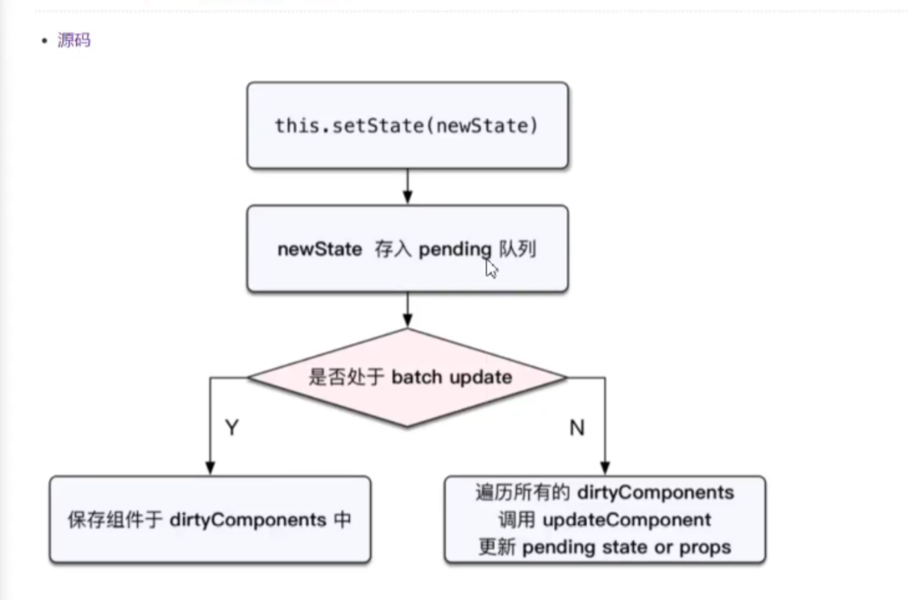;

```js
首先看是不是批量更新 
let batchingStrategy = {
    isBatchingUpdates: false,//默认非批量更新模式
    dirtyComponents: [], //脏组件 --- 组件的状态和界面显示的不一样
    batchedUpdates() {
        this.dirtyComponents.forEach(component => {
            console.log(component, 'dirtyComponents');
            component.updateComponent()
        })
    }

}
//更新器
class updater {
    constructor(component) {
        this.component = component;//组件
        this.pendingStates = []; //暂存临时状态 缓存起来
    }
    addState(partcialState) {
        this.pendingStates.push(partcialState);
        //dirtyComponents 脏组件 --- 组件的状态和界面显示的不一样
        batchingStrategy.isBatchingUpdates ? 
        batchingStrategy.dirtyComponents.push(this.component):
        this.component.updateComponent();
    }
}
```

```js
找到是否批量更新的时机  开启批量更新 关闭批量更新
//事件委托 react也是通过事件委托方法实现
window.trigger = function(event, method, ...others) {
    console.log(event, method);
  //当事件执行的时候 就开启批量更新
    let component = event.target.component;//拿到counter组件实例
    // component[method].call(event.target.component, event, method, ...others);
    transaction.perform(component[method].bind(component));//返回add的方法
}
// batchingStrategy.isBatchingUpdates batchedUpdates
// 一个所谓的事务就是将需要执行的method使用wrapper 封装起来 再通过perform 方法执行
//先执行initialize => methods => close
class Transaction {
    constructor(wrappers) {
        this.wrappers = wrappers;
    }
    perform(anyMethod) {
        this.wrappers.forEach(wrapper => wrapper.initialize());
        anyMethod.call();//在这个方法执行前后做一些事情
        this.wrappers.forEach(wrapper => wrapper.close());
    }
}
let transaction = new Transaction([{
    initialize() {
        console.log('initialize')
        batchingStrategy.isBatchingUpdates = true;// 开启批量更新模式
    },
    close() {
        console.log('close')
        batchingStrategy.isBatchingUpdates = false;// 开启批量更新模式
        batchingStrategy.batchedUpdates();//进行批量更新 把所有的脏组件
    }
}])
```

### react.js

```js
用法
let ele = React.createElement('h1', { className: "mytitle"
}, 'hello', React.createElement('span', null, 'world'));
/**
 * React就是一个普通的js对象
 *  {
  "type":"h1",
  "key":null,
  "ref":null,
  "props":{
      "className":"mytitle",
      "children":[
          "hello",
          {
              "type":"span",
              "key":null,
              "ref":null,
              "props":{
                  "children":"world"
              },
              "_owner":null,
              "_store":{

              }
          }
      ]
  },
  "_owner":null,
  "_store":{

  }
}
 */


```
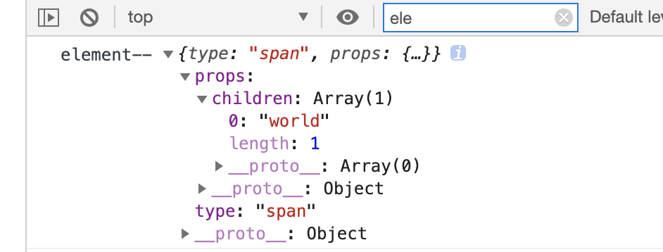

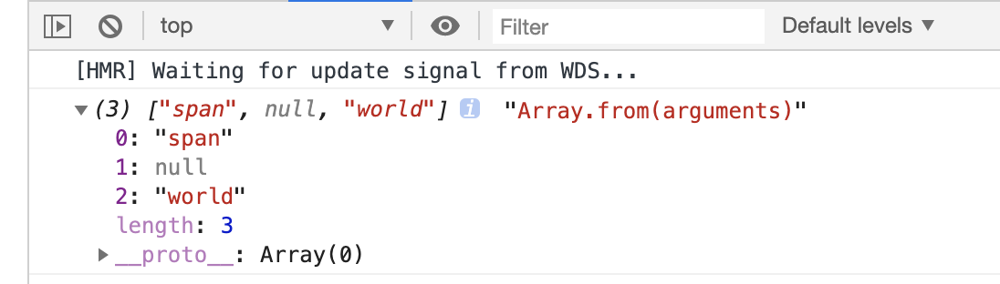


```js
react.js
class Component {
    static isReactComponent = true;
    constructor(props) {
        this.props = props;
    }
}

function ReactElement(type, props) {
    const element = {type, props};
    console.log('element--', element);
    return element;
}
function createElement(type, config = {}, children) {
    let propName;
    const props = {};
    for (propName in config) {
        props[propName] = config[propName];
    }
    props.children = Array.from(arguments).slice(2);
    return ReactElement(type, props);
}
export default {
    createElement,
    Component
}
```

### reactDOM

```js
react-dom.js
function render(element, parentNode) {
    console.log(element, parentNode)
    if (typeof element === 'string' || typeof element === 'number') {
        return parentNode.appendChild(document.createTextNode(element));
    }
    let type, props;
    type = element.type;
    props = element.props;
    // class Welcome1 extends React.Component {
    //     render() {
    //       return React.createElement('h1', {}, props.name, props.age)
    //     }
    //   }
    //子类 Welcome1 继承了父类的isReactComponent
    if (type.isReactComponent) {
        //类组件
        let returnElement = new type(props).render();
        type = returnElement.type;//h1
        props = returnElement.props;
    } else if (typeof type === 'function') { //函数式组件
        /**
         * function Welcome(props) {
          return React.createElement('h1', {}, props.name, props.age)
            }
           let element = React.createElement(Welcome, {name:'zhufeng', age:10});
         */

        let returnElement = type(props);//把props传给函数
        console.log('returnElement--', returnElement);
        type = returnElement.type;//
        props = returnElement.props;

    }
    let domElement = document.createElement(type);
    for (let propName in props) {
        console.log(propName, 'propName');
        if (propName === 'className') {
            domElement.className = props[propName];
        } else if (propName === 'style') {
            let styleObj = props[propName];
            // for (let attr in styleObj) {
            //     domElement.style[attr] = styleObj[attr];
            // }
            let cssText = Object.keys(styleObj).map(attr => {
                //正则 有待研究一下下哦
                return `${attr.replace(/([A-Z])/g, function () { return '-' + arguments[1] })}: ${styleObj[attr]}`;
            });
            // domElement.style.cssText = 'color:red;font-size:50px';
            domElement.style.cssText = cssText;
        } else if (propName === 'children') {
            console.log(props.children, 'props.children');
            let children = Array.isArray(props.children) ? props.children : [props.children];
            children.forEach(child => render(child, domElement));
        } else {
            domElement.setAttribute(propName, props[propName])
        }
    }
    parentNode.appendChild(domElement);
}
export default {
    render
}
```

### 生命周期

#### 旧版生命周期

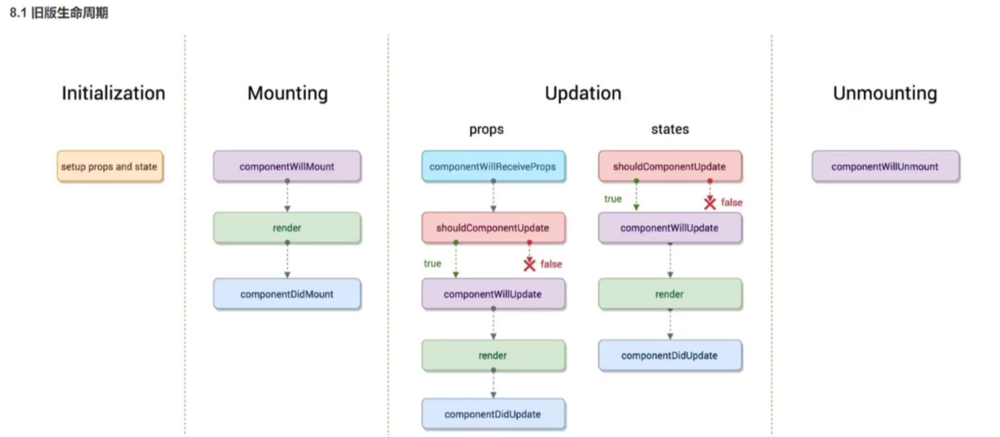

```js
//渲染过程中react 16 后可能会执行多次 不建议请求接口操作
    //react 16之后 有优化  
    //如果ssr 客户端一次 服务端一次 而 componentDidMount 只有一次
    //componentWillMount 新版取消
    componentWillMount() {
        console.log('2组件将要挂载')
    }
    //一般在这里做异步操作 请求接口 永远只有一次
    componentDidMount() {
        console.log('componentDidMount', '4组件挂载完成')
    }
    shouldComponentUpdate(nextProps, nextState) {
        console.log(nextProps, nextState, 'nextProps, nextState');
        console.log('5shouldComponentUpdate询问是否需要更新')
        return true;
    }
    //新版取消
    componentWillUpdate() {
        console.log('6componentWillUpdate组件将要更新')
    }
    componentDidUpdate() {
        console.log('7componentDidUpdate组件更新完毕')
    }
//子组件
 //组件收到新的属性 新版取消
    componentWillReceiveProps() {
        console.log('子组件componentWillReceiveProps 将要接收新的属性')
    }
    componentWillUnmount() {
        console.log('子组件componentWillUnmount 将要卸载')
    }
```

#### 新版生命周期react16

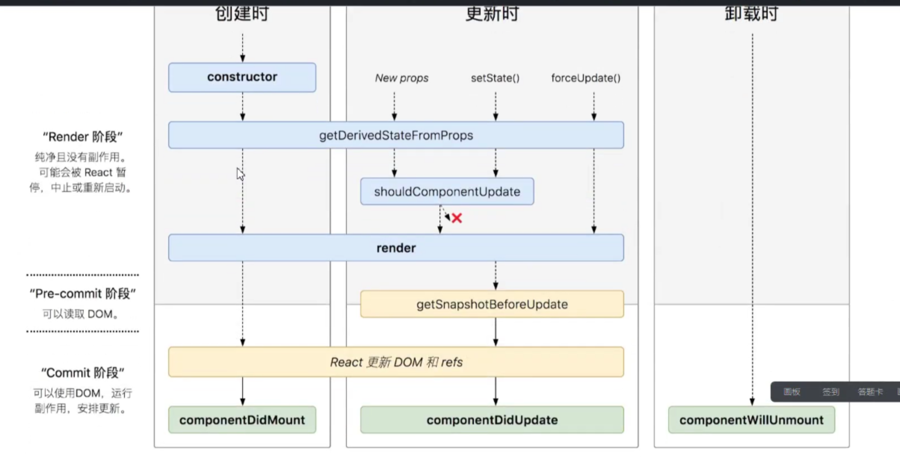

```js
废弃 componentWillMount  componentWillReceiveProps componentWillUpdate
增加getDerivedStateFromProps  getSnapshotBeforeUpdate  
```

```js
子组件
//根据新的属性对象派生状态对象 新的属性对象 和旧的状态对象
    //把props 映射为state状态 prevState 上一个状态 
//getDerivedStateFromProps 静态方法
    static getDerivedStateFromProps(nextProps, prevState) {
        //会返回新的状态对象 替换掉旧的状态
        // return{date:Date.now()} // 可以通过this.state找到该属性
        if (nextProps.number%2===0) {
            return {number:prevState.number+nextProps.number*2}
        }else {
            return {number:prevState.number+nextProps.number*3}
        }
    }
// 它的含义是在React更新Dom元素之前，获取一个快照，它返回的结果将作为componentDidUpdate的第三个参数。一般的用法就是获取更新前的DOM
  getSnapshotBeforeUpdate() {
        //返回更新前的内容高度 
        return this.wrapper.current.scrollHeight; //给下面的prevScrollHeight
    }
 //组件更新完毕
    componentDidUpdate(prevProps, prevState, prevScrollHeight) {
        this.wrapper.current.scrollTop = 
        this.wrapper.current.scrollTop +(this.wrapper.current.scrollHeight -prevScrollHeight);
    }
```

### getDerivedStateFromProps

参考链接https://www.jianshu.com/p/cafe8162b4a8

判断的时候需要返回一个null以免阻断更新

```bash
触发机制:
1.UNSAFE_componentWillReceiveProps(nextProps) 在组件接收到新的参数时被触发.
当父组件导致子组件更新的时候, 即使接收的 props 并没有变化, 这个函数也会被调用
2.getDerivedStateFromProps 会在每次组件被重新渲染前被调用, 这意味着无论是父组件的更新, props 的变化, 或是组件内部执行了 setState(), 它都会被调用.
工作方式
UNSAFE_componentWillReceiveProps(nextProps):
1.参数是组件接收到的新的 props , 用于比对新的 props 和原有的 props, 用户需要在函数体中调用 setState() 来更新组件的数据.
2.static getDerivedStateFromProps(nextProps, currentState):
参数是组件接收到的新的 props 和组件当前的数据. 用户需要在这个函数中返回一个对象, 它将作为 setState() 中的 Updater 更新组件.

作者：Apolo_Du
链接：https://www.jianshu.com/p/cafe8162b4a8
来源：简书
著作权归作者所有。商业转载请联系作者获得授权，非商业转载请注明出处。
```

```bash
为什么不应该使用 getDerivedStateFromProps
1.getDerivedStateFromProps 是一个静态方法, 是一个和组件自身"不相关"的角色. 在这个静态方法中, 除了两个默认的位置参数 nextProps 和 currentState 以外, 你无法访问任何组件上的数据.
2.会被频繁地触发
无论是组件调用了 setState(), 接收的 props 发生了变化, 或是父组件的更新都会导致子组件上的 getDerivedStateFromProps被触发.
相比起在 UNSAFE_componentWillReceiveProps(nextProps) 的函数体中直接比较 this.props 和 nextProps 上的字段. 你需要"绕一个弯" 去比较 nextProps 和 currentState.
3.使用的时候必须非常小心
由于 getDerivedStateFromProps 会在 setState() 后被调用, 并且它的返回值会被用于更新数据. 这意味着你会在 setState() 之后触发 getDerivedStateFromProps, 然后可能意外地再次 "setState()".

getDerivedStateFromProps(nextProps) 函数中的第一个位置参数未必是 "新" 的 props. 在组件内调用了 setState() 时, getDerivedStateFromProps 会被调用. 但是此时的组件其实并没有获得 "新" 的 props, 是的, 这个 nextProps 的值和原来的 props 是一样的.

这就导致了我们在使用 getDerivedStateFromProps 时, 必须添加很多逻辑判断语句来处理 props 上的更新和 state 上的更新, 避免意外地返回了一个 Updater 再次更新数据, 导致数据异常.
```

```js
更优雅的做法
React 官方博客中提供了以下几种方案:

1.让表单控件变成完全受控组件, 不论是 onChange 处理函数还是 value 都由父组件控制, 这样用户无需再考虑这个组件 props 的变化和 state 的更新.
function EmailInput(props) {
  return <input onChange={props.onChange} value={props.email} />;
}
2.让表单控件变成完全不受控组件, 但是具有 key 属性.
仍然用自身的数据来控制 value. 但是接收 props 中的某个字段作为 key 属性的值, 以此响应 props 的更新: 当 key 的值变化时 React 会替换 (reset)组件, 从而重新生成初始化数据.
```

### getSnapshotBeforeUpdate

参考：优秀https://segmentfault.com/a/1190000014456811?utm_source=channel-hottest

### [在更新之前读取DOM属性](https://reactjs.org/#reading-dom-properties-before-an-update)

下面是一个组件的例子，它在更新之前从DOM中读取属性，以便在列表中保持滚动位置：

```
class ScrollingList extends React.Component {
  listRef = null;
  previousScrollOffset = null;

  componentWillUpdate(nextProps, nextState) {
    // Are we adding new items to the list?
    // Capture the scroll position so we can adjust scroll later.
    if (this.props.list.length < nextProps.list.length) {
      this.previousScrollOffset =
        this.listRef.scrollHeight - this.listRef.scrollTop;
    }
  }

  componentDidUpdate(prevProps, prevState) {
    // If previousScrollOffset is set, we've just added new items.
    // Adjust scroll so these new items don't push the old ones out of view.
    if (this.previousScrollOffset !== null) {
      this.listRef.scrollTop =
        this.listRef.scrollHeight -
        this.previousScrollOffset;
      this.previousScrollOffset = null;
    }
  }

  render() {
    return (
      `<div>`
        {/* ...contents... */}
      `</div>`
    );
  }

  setListRef = ref => {
    this.listRef = ref;
  };
}
```

在上面的例子中，`componentWillUpdate`被用来读取DOM属性。但是，对于异步渲染，“render”阶段生命周期（如`componentWillUpdate`和`render`）与“commit”阶段生命周期（如`componentDidUpdate`）之间可能存在延迟。如果用户在这段时间内做了类似调整窗口大小的操作，则从`componentWillUpdate`中读取的`scrollHeight`值将失效。

解决此问题的方法是使用新的“commit”阶段生命周期`getSnapshotBeforeUpdate`。在数据发生变化之前立即调用该方法（例如，在更新DOM之前）。它可以将React的值作为参数传递给`componentDidUpdate`，在数据发生变化后立即调用它。

这两个生命周期可以像这样一起使用：

```js
class ScrollingList extends React.Component {
  listRef = null;

  getSnapshotBeforeUpdate(prevProps, prevState) {
    // Are we adding new items to the list?
    // Capture the scroll position so we can adjust scroll later.
    if (prevProps.list.length < this.props.list.length) {
      return (
        this.listRef.scrollHeight - this.listRef.scrollTop
      );
    }
    return null;
  }
 //
  componentDidUpdate(prevProps, prevState, snapshot) {
    // If we have a snapshot value, we've just added new items.
    // Adjust scroll so these new items don't push the old ones out of view.
    // (snapshot here is the value returned from getSnapshotBeforeUpdate)
    if (snapshot !== null) {
      this.listRef.scrollTop =
        this.listRef.scrollHeight - snapshot;
    }
  }

  render() {
    return (
      `<div>`
        {/* ...contents... */}
      `</div>`
    );
  }

  setListRef = ref => {
    this.listRef = ref;
  };
}
```

### context

#### 旧版

```js
1.父组件
// //定义子上下文对象的属性和类型
    static childContextTypes = {
        name: PropTypes.string,
        age:PropTypes.number
        
    }
     //返回或者说定义真正的子上下文
     getChildContext() {
        return {
        age:10,
        name:'Header'
        }

    }
2.子组件
// 我要获取哪些上下文对象
    static contextTypes = {
        color: PropTypes.string,
        name:PropTypes.string,
        age:PropTypes.number
    }
直接this.context 能够获取上下文对象
```

#### prop-types检测props数据类型

https://www.npmjs.com/package/prop-types npm官网

https://reactjs.org/docs/typechecking-with-proptypes.html react官方

```js
//安装
npm install prop-types --save
//引入
import PropTypes from 'prop-types';
//Son是声明的组件
Son.defaultProps = {
  name: 'Stranger'
};
Son.propTypes = {
     optionalArray: PropTypes.array,//检测数组类型
     optionalBool: PropTypes.bool,//检测布尔类型
     optionalFunc: PropTypes.func,//检测函数（Function类型）
     optionalNumber: PropTypes.number,//检测数字
     optionalObject: PropTypes.object,//检测对象
     optionalString: PropTypes.string,//检测字符串
     optionalSymbol: PropTypes.symbol,//ES6新增的symbol类型
     PropTypes.any.isRequired

多类型
Auth.propTypes = {
       number:PropTypes.oneOfType(
           [PropTypes.string,PropTypes.number]
       )
}
多个值
Auth.propTypes = {
       number:PropTypes.oneOfType(
           [12,24,35]
       )
}
//检测prop为一个数组，元素为数值
Auth.propTypes = {
       array:PropTypes.arrayOf(PropTypes.number)
}
Auth.propTypes = {
    brandsList: PropTypes.arrayOf(
      PropTypes.shape({
        id: PropTypes.number.isRequired,
        name: PropTypes.string.isRequired,
        keywords: PropTypes.string.isRequired,
        excludeKeywords: PropTypes.string,
        sites: PropTypes.string.isRequired,
        status: PropTypes.string,
        
      }),
    ).isRequired,
    isBrandsListLoaded: PropTypes.bool.isRequired
}
//函数
在属性prop的类型检测中，属性值是一个函数，在这里props是包含prop的props对象，propName是prop的属性名，componentName是props所在的组件名称，函数的返回值是一个Error对象
Son.propTypes = {
      prop:function(props,propName,componentName){
          if(/*判断条件*/){
               return new Error(/*错误的参数*/)
           }
    }
}
```

#### 使用实例

```js
//使用例子
export default class  extends Component {
    constructor(props) {
        super(props)
        console.log(props)
    }
    static defaultProps = {
        isMarried: false
    }

    static propTypes = {
        name: PropTypes.string.isRequired,
        // age: PropTypes.number.isRequired,
        gender: PropTypes.oneOf(['male', 'female']),
        isMarried: PropTypes.bool, //是否已婚
        hobby: PropTypes.arrayOf(PropTypes.string), //字符床数组
        position: PropTypes.shape({
            x: PropTypes.number.isRequired,
            y: PropTypes.number
        }),
        age(props, propName, componentName) {
            console.log(propName)
            if (!props[propName] || props[propName] < 18) {
                return new Error(`age > 18 invalid ${propName} supplied to ${componentName}`);
            }
        }
    }
    render() {
        return (
            <div>
                {this.props.name}
            </div>
        )
    }
}
```

#### 新版context

```js
1.创建上下文
ThemeContext = React.createContext()
2.ThemeContext.Provider 向下传递数据
render() {
        let ctx = {color:this.state.color, setColor:this.setColor}
        return (
            <ThemeContext.Provider value={ctx}>
                <div style={{ border: '2px solid red', padding: '5px' }}>
                    page
                <Header>
                        {/* <Title></Title> */}
                    </Header>
                    <Main>
                        {/* <Content></Content> */}
                    </Main>
                </div>
            </ThemeContext.Provider>

        );
    }
    3.类组件如何获取
    class Content extends Component {
    static contextType = ThemeContext;
    render() {
     // this.context = Title.contextType.Provider.value;//自己写的方法才需要加上这个
        console.log(this.context); //直接获取上下文对象
        return null；
}
4.函数式组件如何获取
function Title(props) {
    return (
        <ThemeContext.Consumer>
            {
                value => (
                    <div style={{ border: '2px solid orange', padding: '5px', color: value.color }}>
                    title
                    name={value.name}
                    age={value.age}
                </div>
        )
                
            }
        </ThemeContext.Consumer>
    )
       
}
```

```js
上下文模拟 忽略
var REACT_CONTEXT_TYPE = Symbol.for('react.context');
var REACT_PROVIDER_TYPE = Symbol.for('react.provider');

function createContext() {
    class Provider extends Component{
        static value;
        $$typeof=REACT_PROVIDER_TYPE;
        constructor(props) {
            super(props);
            Provider.value = props.value;
            this.state = {value:props.value}
        }
        //映射为新的状态对象
       static getDerivedStateFromProps(props, state) {
        Provider.value = props.value;
            return {value:props.props}
        }
        render() {
            return this.props.children;
        }
    }
    class Consumer extends Component{
        render() {
            return this.props.children(Provider.value);
        }
    }
    return {$$typeof:REACT_CONTEXT_TYPE,Provider,Consumer}
}
```

### pure

```js
import React, { PureComponent, Component } from 'react'
1.类组件
class Title extends PureComponent {
  this.state = {number:{counter:0}}
//错误写法❎
this.state.number.count = ...
//正确写法✅
this.setState({number:{counter:this.state.number}})
  //注意 setState的时候一定要构建一个新对象 否则组件是不会更新的  if (obj1 === obj2) {
        return true;//是不是一个内存地址
    }
    
    render() {
        console.log('Title -render'); //如果自身属性没有变化就不用刷新
        return <div>{this.props.title}</div>
    }
2.函数组件
function Title(props) {
    console.log('Title1 -render');
    return <div>{props.title}</div>
}
Title = React.memo(Title); 
```

```js
原理
1.类组件
export default class PureComponent extends Component {
    isPureComponent = true;
    //传入新的属性对象和状态对象 然后返回一个是否需要更新的boolean值
    shouldComponentUpdate(nextProps, nextState) {
        //相等就不用渲染
        return !shallowEqual(this.props, nextProps) || !shallowEqual(this.state, nextState);
    }
    render() {
        return (
            <div>
                
            </div>
        )
    }
}
//源码就是浅比较
//浅比较  只比较一层 obj1 和 obj2是否相等 相等返回true否则false,只比较第一层
//不是一个引用地址  就不相等
function shallowEqual(obj1, obj2) {
    if (obj1 === obj2) {
        return true;//是不是一个内存地址
    }
   //看是不是对象 或者 null 直接返回false不相等
    if (typeof obj1 !=='object' || obj1 === null || typeof obj2 !=='object' || obj2 === null) {
        return false
    }
    let keys1 =Object.keys(obj1);
    let keys2 =Object.keys(obj2);
  //如果长度不相等 肯定就不相等
    if (keys1.length !==keys2.length) {
        return false
    }
    for(let key of keys1) {
       //如果obj2没有obj1的属性  或者有 但是跟obj1 不相等 还是flase
        if (!obj2.hasOwnProperty(key) || obj1[key]!=obj2[key]) {
            return false
        }
    }
    return true;

}
2.memo原理
function memo(FuncComponent) {
    return class  extends PureComponent{
        render() {
            console.log(this, this.props)
            return <FuncComponent {...this.props}/>
           //或者return FuncComponent(this.props);
        }
    }
}
```

### 高阶函数组件 

hooks去解决高阶组件嵌套问题

```js
UserNameInput
 //从属性对象中 接收到一个val属性 存放着英文名  调用接口取得中文名
import React, { Component } from 'react'
import withAjax from './withAjax';
import withLocal from './withLocal';
 class UserNameInput extends Component {
    render() {
        return (
            <div>
                <input defaultValue={this.props.value}/>
            </div>
        )
    }
}
// export default WithLocal(UserNameInput, 'username');
let UserNameInputWithAjax = withAjax(UserNameInput);
let UserNameInputWithLocal = withLocal(UserNameInputWithAjax, 'username')
export default UserNameInputWithLocal;
withAjax.js
import React from 'react';
export default function (Component) {
    //从属性对象中 接收到一个val属性 存放着英文名  调用接口取得中文名
    return class extends  React.Component{
        constructor() {
            super();
            this.state = {value:''}
        }
        componentDidMount() {
            // this.setState({
            //     value:localStorage.getItem(name)
            // })
            //掉接口 去服务器去找中文名字
            fetch('http://localhost:3000/translation.json')
            .then(respnse => respnse.json())
            .then(res => {
                console.log(this.props.val, this.state.value, 'with-ajax');
                this.setState({value: res[this.props.val]})
            })
        }
        render() {
            return <Component {...this.props} value={this.state.value}/>
        }
    }
}
    withLocal.js
    import React from 'react';
export default function (Component, name) {
    //Component 是包装后的对象  withAjax
    return class extends  React.Component{
        constructor() {
            super();
            this.state = {val:''}
        }
        componentDidMount() {
            this.setState({
                val:localStorage.getItem(name)
            })
        }
        render() {
            console.log(this.state.val, 'withLocal-val');
            return <Component {...this.props} val={this.state.val}/>
        }
    }
}

```

### Render-props

//跟踪计算鼠标的位置

```js
MouseTracker.js  需要复用的逻辑
高阶组件的写法 
export default class MouseTracker extends Component {
    constructor() {
        super();
        this.state = { x: 0, y: 0 };
    }
    handleMouseMove = (event) => {
        this.setState({
            x: event.clientX,
            y: event.clientY
        })
    }
    render() {
        return (
            <div onMouseMove={this.handleMouseMove}>
            {this.props.children({x:this.state.x, y: this.state.y})}
            //如果是render的话
             {this.props.render({x:this.state.x, y: this.state.y})}
            </div>
        )
    }
}
使用
//跟踪计算鼠标的位置
index.js
ReactDOM.render(
  <>
  <MouseTracker>
  {
    props => <Picture {...props}/>
  }
  </MouseTracker>
  <Page/>
  </>,
//换成render-props 就是
  ReactDOM.render(
  <>
  <MouseTracker render={(props) => <Picture {...props}></Picture>}>
  </MouseTracker>
  <Page/>
  </>,
  document.getElementById('root')
);
//疯转picture  直接把picture包装一下
//跟踪计算鼠标的位置 高阶组件
import React, { Component } from 'react'
import MouseTracker from './MouseTracker'
function withMouseTracker(Comp) {
    return props => <MouseTracker render={data=> <Comp {...props}{...data}></Comp>}></MouseTracker>
}
 class CatPicture extends Component {
    render() {
        return (
            <div>
                
                <p>当前鼠标的位置是x:{this.props.x}y:{this.props.y}</p>
            </div>
        )
    }
}
export default withMouseTracker(CatPicture);
```

### Portals

Portals提供了一种很好的方法 将子节点渲染到父组件Dom层次结构之外的DOM节点

```js
//模态窗口
html
<div id="modal-root"></div>

 class Modal extends Component {
    constructor() {
        super();
        this.modal = document.getElementById('modal-root');
    }
    render() {
        return ReactDOM.createPortal(this.props.children, document.getElementById('modal-root'))
    }
}
```

### 错误边界 

部分 UI 的 JavaScript 错误不应该导致整个应用崩溃，为了解决这个问题，React 16 引入了一个新的概念 —— 错误边界。

错误边界是一种 React 组件，这种组件**可以捕获并打印发生在其子组件树任何位置的 JavaScript 错误，并且，它会渲染出备用 UI**，而不是渲染那些崩溃了的子组件树。错误边界在渲染期间、生命周期方法和整个组件树的构造函数中捕获错误。

注意

错误边界**无法**捕获以下场景中产生的错误：

- 事件处理（[了解更多](https://react.docschina.org/docs/error-boundaries.html#how-about-event-handlers)）
- 异步代码（例如 `setTimeout` 或 `requestAnimationFrame` 回调函数）
- 服务端渲染
- 它自身抛出来的错误（并非它的子组件）

如果一个 class 组件中定义了 [`static getDerivedStateFromError()`](https://react.docschina.org/docs/react-component.html#static-getderivedstatefromerror) 或 [`componentDidCatch()`](https://react.docschina.org/docs/react-component.html#componentdidcatch) 这两个生命周期方法中的任意一个（或两个）时，那么它就变成一个错误边界。当抛出错误后，请使用 `static getDerivedStateFromError()` 渲染备用 UI ，使用 `componentDidCatch()` 打印错误信息。

 suspense可用来实现同步网络请求并渲染

先请求数据  请求回来之后 等待  然后再渲染页面 react-cache

```js
class ErrorBoundary extends React.Component {
  constructor(props) {
    super(props);
    this.state = { hasError: false };
  }

  static getDerivedStateFromError(error) {
    // 更新 state 使下一次渲染能够显示降级后的 UI
    return { hasError: true };
  }

  componentDidCatch(error, errorInfo) {
    // 你同样可以将错误日志上报给服务器
    logErrorToMyService(error, errorInfo);
  }

  render() {
    if (this.state.hasError) {
      // 你可以自定义降级后的 UI 并渲染
      return <h1>Something went wrong.</h1>;
    }

    return this.props.children; 
  }
}
然后你可以将它作为一个常规组件去使用：
<ErrorBoundary>
  <MyWidget />
</ErrorBoundary>
```

错误边界的工作方式类似于 JavaScript 的 `catch {}`，不同的地方在于错误边界只针对 React 组件。只有 class 组件才可以成为错误边界组件。大多数情况下, 你只需要声明一次错误边界组件, 并在整个应用中使用它。

注意**错误边界仅可以捕获其子组件的错误**，它无法捕获其自身的错误。如果一个错误边界无法渲染错误信息，则错误会冒泡至最近的上层错误边界，这也类似于 JavaScript 中 catch {} 的工作机制。

### redux

action.type !== 'undefined'

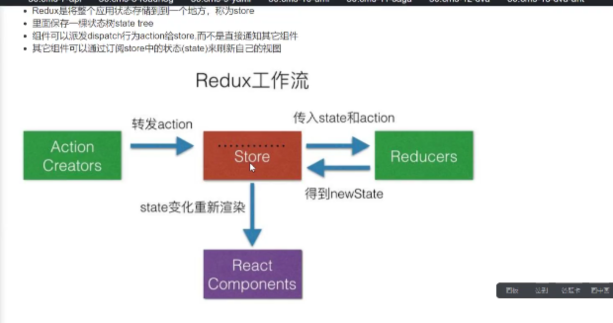

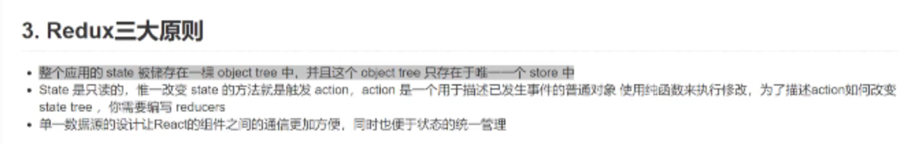

```js
index.js
export  {
    createStore,//创建仓库
    bindActionCreators, //把actioncreatore 与 dispatch绑定到一起
    combineReducers,//合并reducers
    applyMiddleware
}
//判断是不是纯对象
export default function isPlainObject(obj) {
    if (typeof obj != 'object' || obj === null) {
        return false;
    }
    let proto = obj;
    while(Object.getPrototypeOf(proto)) {
        proto = Object.getPrototypeOf(proto);
    }
    return Object.getPrototypeOf(obj) === proto;
}
//actionTypes
const ActionType = {
    INIT: '@@redux/INIT'
}
export default ActionType;
```

#### createSore

```js
createStore.js
import isPlainObject from './utils/isPlainObject'
import actionTypes from './utils/actionTypes'

export default function createStore(reducer, preloadedState) {
    if(typeof reducer !== 'function') {
        return new Error('reducer必须是一个函数')
    }
    let currentReducer = reducer;//当前的处理器
    let currentState = preloadedState; //当前状态
    let currentListeners = [];//保存当前的监听函数
    function getState() {
        return currentState;
    }
    function dispatch(action) {
        if(!isPlainObject(action)) {
            throw new Error('action必须是一个纯对象')
        }
        if (typeof action.type === 'undefined') {
            throw new Error('action的type的属性不能是undefined');
        }
        currentState = currentReducer(currentState, action);
        //状态发生变化  通知
        for (let i = 0; i < currentListeners.length;i++) {
            const listener = currentListeners[i];
            listener();
        }
        return action;
    }
    //订阅
    function subscribe(listener) {
        currentListeners.push(listener);
        //源码优化  let 
        let subscribed = true;
      //取消订阅
        return function unsubscribe() {
            if (!subscribed) return;
            const index = currentListeners.indexOf(listener);
            console.log(index, currentListeners);
            currentListeners.splice(index, 1);
            subscribed = false;
        }
    }
    //如果state是通过reducer传过来的  没法拿到初始化状态 必须做以下处理
    dispatch({type:actionTypes});////preloadedState 可能没有传
    return {
        getState,
        subscribe,
        dispatch
    }
}
```

#### bindActionCreator

```js
function bindActionCreator(actionCreator, dispatch) {
    return function() {
     return dispatch(actionCreator.apply(this,arguments));
    }
 }
 export default function bindActionCreators(actionCreators, dispatch) {
     if (typeof actionCreators === 'function') {
         return bindActionCreator(actionCreators, dispatch);
     }
     //传的是整个action对象
     const bindActionCreators = {};
     for(const key in actionCreators) {
         //把每个键值重写成 方法 直接调用 替换掉老方法
         bindActionCreators[key] = bindActionCreator(actionCreators[key], dispatch);
     }
     return bindActionCreators;
 }
//  actionCreators = {
//      increment() {
//          return types.INCREMENT
//      }
//  }
//  bindActionCreators的作用是将一个或多个action和dispatch组合起来生成
```

#### combineReducers

//合并reducers

```js
export default function (reducers) {
    //实现reducer的合并
    //reducers {counter1:counter1, counter2:counter2}
    const reducerKeys = Object.keys(reducers);//['counter1', 'counter2']
    return function (state = {}, action) {

        //这里应该是给 合并成新的reducer  reducer 需要传参
        const nextState = {};//下一个状态对象
        for (let i = 0; i < reducerKeys.length; i++) {
            const key = reducerKeys[i];//counter1
            const reducer = reducers[key];
            const previouStateForKey = state[key]; //老状态
            const nextStateForKey = reducer(previouStateForKey, action);
            nextState[key] = nextStateForKey;
        }
        return nextState;
    }

}
import {combineReducers} from '../../redux';
let reducers = combineReducers({
    counter1,
    counter2
})
export default reducers;
reducer --- counter1.js
import * as types from '../action-types';
let initState = { number: 1 };
function reducer(state = initState, action) {
    console.log(action, 'action');
    switch (action.type) {
        case types.INCREMENT:
            return { number: state.number + (action.payload ?                         action.payload.number : 1) }
        case types.DECREMENT:
            return { number: state.number - 1 }
        default:
            return state;

    }
}
export default reducer;
src-component-counter1.vue  这是最原始的用法 实际不会这么用哦
import React, { Component } from 'react'
import {bindActionCreators}  from '../redux';
import store from '../store';
import actions from '../store/actions/counter2'


// let INCREMENT = 'INCREMENT';
// let DECREMENT = 'DECREMENT';
//在redux中 动作是有规定的 规定必须有一个不为undefined type属性 用来表示动作类型

let boundActions = bindActionCreators(actions, store.dispatch);
export default class  extends Component {
    constructor() {
        super();
        this.state = { number: store.getState().counter2 }
    }
    componentDidMount() {
        this.unsubscribe = store.subscribe(() => {
            this.setState({ number: store.getState().counter2 })
        })
    }
    componentWillUnmount() {
        //取消订阅
        this.unsubscribe();
    }
    render() {
        return (
            <div>
                <p>{this.state.number}</p>
                <button onClick={boundActions.increment}>+</button>
                <button onClick={boundActions.decrement}>-</button>
            </div>
        )
    }
}

```

### 使用react-redux/connect

```js
根index.js----
import ReactDOM from 'react-dom';
import Counter from './components/Counter';
import {Provider} from './react-redux';
import store from './store';
// console.log(store, 'index-store');
ReactDOM.render((
    <Provider store={store}>
        <Counter/>
    </Provider>
),document.getElementById('root'));
```

```js
src-components-counter.js
import React,{Component} from 'react';
import actions from '../store/actions/counter';
import {connect} from '../react-redux';
//把store 的 state 
 class Counter extends Component{
   render(){
       console.log(this.props, 'this.props---');
       return (
           <>
             <p>{this.props.number}</p>
             <button onClick={this.props.increment}>+</button>
             <button onClick={this.props.decrement}>-</button>
             <button onClick={this.props.asyncIncrement}>过一秒后加1</button>
             <button onClick={this.props.promiseIncrement}>promise加1</button>
           </>
       )
   }
}
//<button onClick={()=>this.props.dispatch({type:'INCREMENT'})}>INCREMENT</button>
// {number:0}=> {number:0}将成为当前组件的属性对象
//1 状态可能很大，但此组件用的很少。 2.可能需要增加或者 减少或者修改一些属性 
//即使映射的会不会也会触发渲染,也是为了性能优化
该回调函数返回的对象将作为 props 传递到被包装的组件中。
const mapStateToProps = state=>state;
或者 const mapStateToProps = state=>state.counter1;
// const mapDispatchToProps = (dispatch) => {
//   return {
//     increment:(...args) => dispatch(actions.increment(...args)),
//     decrement:(...args) => dispatch(actions.decrement(...args)),
//   }
// }
//conect负责连接仓库和组件
export default connect(
    mapStateToProps,
    // mapDispatchToProps
    actions
)(Counter);

```

React-redux

```js
export {
    Provider,
    connect
}
```


```js
coonect源码.js
//用于连接仓库跟组件 目的是把状态映射为state
import React,{Component} from 'react';
import {bindActionCreators} from '../redux'
import ReduxContext from './context'
//mapStateToProps  把状态树映射为props
export default function(mapStateToProps, mapDispatchToProps) {
    return function(WrapperComponent) {
        return class extends Component{
            static contextType = ReduxContext;//拿到上下问对象
            constructor(props, context) { //context = {store: this.props.store}
            console.log(props, context);
                super(props);
                this.state = mapStateToProps(context.store.getState());
            }
            componentDidMount() {
                this.unsubscribe = this.context.store.subscribe(() => {
                    this.setState(mapStateToProps(this.context.store.getState()));
                })
            }
            componentWillUnmount() {
                this.unsubscribe();
            }
            render() {
                let actions = {};
                if (typeof mapDispatchToProps == 'function') {
                    actions = mapDispatchToProps(this.context.store.dispatch);

                }else {
                   //bindActionCreators 派发动作
                    actions = bindActionCreators(mapDispatchToProps, this.context.store.dispatch);

                }
                return <WrapperComponent {...this.state} {...actions}></WrapperComponent>
            }
            
        }
    }
}
```

```js
Provider.js
import React, { Component } from 'react'
import ReduxContext from './context';
//向下层组件提供store
export default class Provider extends Component {
  render() {
    console.log(this.props.store, 'this.props.store-redux-Provider');
    return (
    <ReduxContext.Provider value={{ store: this.props.store }}>
      {this.props.children}
    </ReduxContext.Provider>
    )
  }
}
根组件--index.js---
  import ReactDOM from 'react-dom';
import Counter from './components/Counter';
import {Provider} from './react-redux'; //connect.js会拿到上下文对象
import store from './store';
ReactDOM.render((
    <Provider store={store}>
        <Counter/>
    </Provider>
),document.getElementById('root'));
```

### Redux-middleware

```js
store --- index.js
import { createStore, applyMiddleware} from '../redux';
import reducers from './reducers';
import logger1 from '../react-logger' // 有这个源码的 redux-logger
import logger2 from '../react-logger2'
import thunk from '../redux-thunk'
import promise from '../rudux-promise'
打印结果
/**
 * 老状态1
 * 老状态2
 * 改状态
 * 新状态2
 * 新状态1
 */
let thunkWithExtraArgument = thunk.withExtraArgument({number:5});
//使用想多传个参数
let store = applyMiddleware(thunkWithExtraArgument,promise,logger1,logger2)(createStore)(reducers)
```

#### Compose

```js
compose.js
function add1(str) {
    return '1'+str;
}
function add2(str) {
    return '2'+str;
}
function add3(str) {
    return '3'+str;
}
function compose(...funcs) {
    if (funcs.length === 0) return args => args;
    if (funcs.length ===1) {
        return funcs[0];
    }
    return funcs.reduce((func, next)=>(...args) => func(next(...args)));
}
let result = compose(add1)('zhufeng');
console.log(result, 'result------'); 
export default compose;
```

```js
react-logger2.js
let logger = （{dispatch, getState}） => next => action => {
    console.log('老状态2', store.getState());
    dispatch(action);
    console.log('新状态2', store.getState());
}
export default logger;
```

#### redux-applyMiddleware

```js
import compose from './compose'
export default function applyMiddleware(...middleware) {
    return function(createStore) {
        return function(reducers) {
            const store = createStore(reducers);//最原始 的仓库
            let dispatch = () => {
                throw Error('现在还不能用');
            }
            // middleware = middleware(store);
            let middlewareAPI  = {
                getState: store.getState,
                dispatch: (...args) => dispatch(...args)
            }
            const chain = middleware.map(middleware => middleware(middlewareAPI)); //中间件用法
          //
            console.log(chain, 'chain---');
            // dispatch = middleware(store.dispatch);
            dispatch = compose(...chain)(store.dispatch);
            return {
                ...store,
                dispatch
            }
        }
    }
}
// export default function logger({getState}) {
//     return function (next) {
//         return function (action) {
//             console.log('老状态', getState());
//             next(action);
//             console.log('新状态', getState());
//         }
//     }
// }
```

### Redux-thunks.js

派发一个异步

createStore  reducer必须是一个纯对象

Action return的是一个函数 thunks负责劫持

```js
src-store-actions-counter,js
 decrement() {
        // store.dispatch({ type: DECREMENT })
        return { type: types.DECREMENT };
    }, 
      //让中间件去拦截action为函数的action
  asyncIncrement() {
        // console.log('asyncIncrement');
    //看根组件index.js  见上面
        return function (dispatch, getState, amount) {
            //getState获取老状态
            console.log(amount, 'amount');
            setTimeout(() => {
                dispatch({ type: types.INCREMENT, payload: amount })
                dispatch({ type: types.INCREMENT, payload: getState })
            }, 1000)
        }
    },
```

#### Redux-thunk.js

实现派发一个异步

```js
function createThunkMiddleWare(extraArgument) {
    console.log(extraArgument, 'extraArgument');
     // let middlewareAPI  = {
    //     getState: store.getState,
    //     dispatch: (...args) => dispatch(...args)
    // }
    // const chain = middleware.map(middleware => middleware(middlewareAPI));
   
    // dispatch = compose(...chain)(store.dispatch);
    return ({dispatch, getState}) => next => action => {
        if (typeof action === 'function') {
            console.log(action, 'actions----')
           return action(dispatch, getState, extraArgument);
        }
        return next(action);
    }
}
const thunk = createThunkMiddleWare();
thunk.withExtraArgument = createThunkMiddleWare;
export default  thunk;
```

### Redux-promise

```js
components-actions-counter,js
promiseIncrement() {
        return {
            type: types.INCREMENT,
            payload: new Promise((reslove, reject) => {
                setTimeout(() => {
                    let result = Math.random();
                    if (result > 0) {
                        reslove({number:result});
                    } else {
                        reject({number:result});
                    }
                }, 1000)
            })
        }
    }

```

```js
Redux-promise.js
function isPromise(obj) {
    //判断是不是一个promise 判断.then属性是不是一个function
    return !!obj && (typeof obj == 'object' || typeof obj == 'function') && (typeof obj.then == 'function')
}
export default function({dispatch,getState}) {
    return next => action => {
        return isPromise(action.payload) ? action.payload.then(result => {
           dispatch({...action, payload: result});
        }).catch((error) => {
            dispatch({...action, payload:error, error:true});
            //必须return 一个失败
            return Promise.reject(error); //因为action还要向下传递 保证走到失败 let {payload} =store.dispatch(action);
         // payload.then
        }): next(action);
    }
}
```

### React-router-dom

#### 模拟

```js
hash模拟
<body>
    <a href="#/a">跳转到/a</a>
    <a href="#/b">跳转到/b</a>
    <div id="root" style="border: 3px solid red;height: 200px;"></div>

</body>
<script>
    let container = document.getElementById('root');
    window.addEventListener('hashchange', (event) => {
    console.log(event);
    // container.innerHTML = event.newURL;
    container.innerHTML = `当前的路径${window.location.hash.slice(1)}`
    })
```

```js
History-hash 模拟
<body>
    <!-- <div id="root"></div> -->
    <button onClick="push('/a')">/a</button>
    <button onClick="push('/b')">/b</button>
    <button onClick="push('/c')">/c</button>
    <div id="root" style="border: 3px solid red;height: 200px;"></div>


</body>
<script>
    let container = document.getElementById('root');
    //监听弹出状态的事件
    window.onpopstate = event => {
        console.log(event);
        container.innerHTML = event.state && event.state.to;
    }
    function push(to) {
        //三个参数 state 标题（已经废弃） 
        //pushState 入栈不会触发onpopstate
        window.history.pushState({to}, null, to);
    }
    window.onpushState = function(state, title, path) {
        container.innerHTML = state.to || path;

    }
    //重写
    let oldPush = window.history.pushState;
    window.history.pushState = function(state, title, path) {
        // console.log(state);
        oldPush.call(window.history,state, title, path);
        window.onpushState(state, title, path); 
    }

```

#### 源码概览

```js
根组件 index.js
import { BrowserRouter as Router, Route, Link } from 'react-router-dom';
ReactDOM.render(
  <Router>
    <>
      <nav className="navbar navbar-inverse">
        <div className="container-fluid">
          <NavHeader/>
          <ul className="nav navbar-nav">
            {/* <li>珠峰架构</li> */}
            <li><MeauLink to="/" exact>首页</MeauLink></li>

            <li><MeauLink to='/user'>用户中心</MeauLink></li>
            <li><MeauLink to="/profile">个人中心</MeauLink></li>
            <li><MeauLink to="/login">登录</MeauLink></li>
                {/* <li><Link to={{ pathname: '/', state: { title: '首页' } }}>首页</Link></li>
            <li><Link to={{ pathname: '/user', state: { title: '首页' } }}>用户中心</Link></li>
            <li><Link to={{ pathname: '/profile', state: { title: '首页' } }}>个人中心</Link></li>
            <li><Link to="/login">登录</Link></li> */}
          </ul>
        </div>
      </nav>
      <div className="container">
        <div className="row">
          <div className="col-md-12">
            //Route只能有一个根节点
            <Route path="/" component={Home} exact></Route>
            <Route path="/user" component={User}></Route>
            <Route path="/login" component={Login}></Route>
            <Protected path="/profile" component={Profile}></Protected>
          </div>
        </div>
      </div>
    </>
  </Router>,
  document.getElementById('root'))
```

```js
react-router-dom index.js 
export {
    HashRouter,
    Route,
    Link,
    Redirect,
    Switch,
    withRouter,
    Prompt,
    BrowserRouter
}
```

#### HashRouter

```js
import React, { Component } from 'react'
import Context from './context'
export default class HashRouter extends Component {
    state = {
        location:{pathname:window.location.hash.slice(1) || '/', state:null}
    }
    componentDidMount() {
        window.location.hash = window.location.hash || '/';
        window.addEventListener('hashchange', (e) => {
            //location对象  里有的参数
            this.setState({
                location: {
                    ...this.state.location,
                    pathname:window.location.hash.slice(1),
                    state: this.locationState
                }
            })
        })
    }
    locationState = null;//私有属性
    render() {
        let that =this;
        //传给route
        let value = {
            location:that.state.location,
            history:{
                push(to) { //定义一个history对象  有一个push方法来跳转路径
                    // message = {location => }
                    //that.block = message
                   if (that.message) {
                       let confirm =  window.confirm(that.message(typeof to === 'object' ? to : {pathname:to}));
                       if (!confirm) return;
                   }
                  
                    if (typeof to === 'object') {
                       let {pathname, state} = to;
                       that.locationState = state; 
                   window.location.hash = pathname; //触发hashchange
                //    console.log(path, window.location.hash)
                   }else {
                    that.locationState = null; 
                    window.location.hash = to; //触发hashchange
                   }
                },
                block(message) {
                    console.log('block-message', message);
                    that.message = message; //暂存 这是组件传过来的message
                }
            }
        }
        return (
            <div>
                <Context.Provider value={value}>
                    {this.props.children}
                </Context.Provider>
            </div>
        )
    }
}

```

#### BrowserRouter

```js
import React, { Component } from 'react'
import Context from './context'
let pushState = window.history.pushState;

export default class BrowserRouter extends Component {
    state = {
        location:{pathname:window.location.pathname, state:null}
    }
    componentDidMount() {
        console.log(window)
        const that = this;
      //重写history的pushState
        window.history.pushState = (state, title, url) => {
            console.log('window.history.pushState', state, title, url);
            pushState.call(window.history,state, title, url);
            window.onpushstate.call(that, state, url);
        }
        window.onpopstate = (event) => {
            console.log(event, 'window-event--onpopstate')
            that.setState({
                location: {
                    ...that.state.location,
                    pathname:window.location.pathname,
                    state: event.state
                }
            })
        }
        window.onpushstate = (state, pathname) => {
            console.log('window-event--onpushstate')
            that.setState({
                location: {
                    ...that.state.location,
                    pathname,
                    state
                }
            })
        }
    }
    render() {
        let that =this;
        let value = {
            location:that.state.location,
            history:{
                push(to) { //定义一个history对象  有一个push方法来跳转路径
                    // message = {location => }
                    //that.block = message
                   if (that.block) {
                       let confirm =  window.confirm(that.block(typeof to === 'object' ? to : {pathname:to}));
                       if (!confirm) return;
                   }
                  
                    if (typeof to === 'object') {
                       let {pathname, state} = to;
                       //状态  标题  路径 pushState(stateObject,title,URL):
                       window.history.pushState(state, '', pathname);
                   }else {
                    // window.location.hash = to; //触发hashchange
                    window.history.pushState(null, '', to);
                   }
                },
                block(message) {
                    console.log('block-message', message);
                    that.block = message;
                }
            }
        }
        return (
            <div>
                <Context.Provider value={value}>
                    {this.props.children}
                </Context.Provider>
            </div>
        )
    }
}

```

#### route

接收pathname  判断显示组件

渲染有三种方式 component render children

component render 只有路径匹配了才会渲染 否则不渲染

children不管路径匹配不匹配都会渲染 但是要看match 有没有值 有值的话匹配上了 可以给当前路由加个颜色

```js
import React, { Component, Children } from 'react'
import Context from './context'
import { pathToRegexp } from 'path-to-regexp';
//匹配路由渲染  组件
export default class Route extends Component {
    static contextType = Context;
    render() {
        let { pathname } = this.context.location;
        console.log(pathname, 'pathname');
        let { path = '/', component: Component, exact = false, render, children } = this.props;
        let paramNames = []; 
        let regexp = pathToRegexp(path, paramNames, { end: exact });
        let result = pathname.match(regexp);
        /** result 没有动态路由的时候  paramNames是个【】
         * ["/user/detail/1597158679806", "1597158679806", index: 0, input: "/user/detail/1597158679806", groups: undefined]
            0: "/user/detail/1597158679806"
            1: "1597158679806" //动态路由的时候有
            groups: undefined
            index: 0
            input: "/user/detail/1597158679806"
            length: 2
         */
        /**  result 的值 有动态路由 
         * ["/", index: 0, input: "/user/detail/1597158679806", groups: undefined]
        0: "/"
        groups: undefined
        index: 0
        input: "/user/detail/1597158679806"
        length: 1
        __proto__: Array(0)
         */
        /**
         *  paramNames--- 数组对象--这个数组可以拿到传的动态路由的key
            [{…}]
            0: 
            modifier: ""
            name: "id"
            pattern: "[^\/#\?]+?"
            prefix: "/"
            suffix: ""
            __proto__: Objectlength: 1__proto__: Array(0) 
         */
        let props = {
            location: this.context.location,
            history: this.context.history
        } // 传给组件
        if (result) {
            paramNames = paramNames.map(item => item.name);// ['id']
            let [url, ...values] = result; // result第一个参数是url
            let params = {};
            for (let i = 0; i < paramNames.length; i++) {
                params[paramNames[i]] = values[i]
            }
            // paramNames
            /**
             * :
              modifier: ""
              name: "id"
              pattern: "[^\/#\?]+?"
              prefix: "/"
              suffix: ""
             */
            props.match = {
                params,
                path,
                url,
                isExact: url === pathname,
            }
            if (Component) {
                return <Component {...props}></Component>
            } else if (render) { 
                return render(props);
            }else if(children){
                return children(props);
            }else {
                return null;
            }
        }
        if (children) {
            return children(props)
        }
        return null; // 必须是return null
    }
}

```

#### link

```js
import React, { Component } from 'react'
import RouterContext from './context'
export default class Link extends Component {
    static contextType = RouterContext;
    render() {
        // console.log(this.context, 'link-context');
        return (
        // <a href={`#${this,props.to}`}>{this.props.children}</a>
        <a {...this.props} onClick={() => this.context.history.push(this.props.to)}>{this.props.children}</a>
        )
    }
}
```

#### meaulink

```js
import React from 'react';
import { Route, Link } from '../react-router-dom';
// 如果当前地址栏的路径跟自己匹配的话 加一个背景色
//在Route要想渲染指定内容有三种方式 component render children
// component render 路径匹配时渲染
// children 路劲不匹配也要渲染
export default function({to, exact, children}) {
    // const {to, exact, children} = props; // children 就是添加用户
    // console.log(to, exact, children, 'meau-link')
    console.log('meau-link-children', children)
    return (
        <Route path={to} exact={exact} children={
        props => {
            // console.log('meaulin', props, props.match ? 'active': '', 'active');
           return <Link className={props.match ? 'active': ''} to={to}>{children}</Link>
        }
        }></Route>
    )
}
```

#### swicth 

```js
使用
<div className="col-md-10">
                    {/* switch 匹配只会匹配一个 匹配上了就不再向下匹配了 */}
                    <Switch>
                    <Route path="/user/list" component={UserList}></Route>
                    <Route path="/user/add" component={UserAdd}></Route>
                    <Route path="/user/detail/:id" component={UserDetail}></Route>
                    <Redirect to="/user/list"></Redirect>
                    </Switch>
                  

                </div>

```

```js
Switch.js
import React, { Component } from 'react'
import RouterContext from './context'
import {pathToRegexp} from 'path-to-regexp'
//匹配路由  route path component
export default class Switch extends Component {
    static contextType = RouterContext;
    render() {
        let { pathname } = this.context.location;//当前地址栏的路径
        let children = Array.isArray(this.props.children) ? this.props.children : [this.props.children];
        console.log(children, 'children')
        
        for(let i = 0; i < children.length;i++) {
            let child = children[i];
            let {path='/', exact=false} = child.props;
            let paramNames = [];
            let regexp = pathToRegexp(path, paramNames,{end:exact});
            let result = pathname.match(regexp);
            if (result) {
                return child;//child 是个啥  react元素
            }
        }
        return null;
    }
}

```

#### Redirect

```js
import React, { Component } from 'react'
//重定向
import RouterContext from './context'
export default class Redirect extends Component {
    static contextType = RouterContext;
    
    render() {
        console.log('rediect');
        this.context.history.push(this.props.to);
        return null;
    }
}
```


#### Prompt


```js
 <Prompt when={this.state.blocking} message={location=> `你确定要跳转到${location.pathname}`}></Prompt>
//在router跳转阻止 HashRouter
import React, { Component } from 'react'
import RouterContext from './context'
export default class Prompt extends Component {
    static contextType = RouterContext;
    componentWillMount() {
        this.context.history.block(null)
    }
    render() {
        let history = this.context.history;//从上下文中获取历史对象
        const {when, message} = this.props;
        if (when) {
            history.block(message);
        }else {
            history.block(null);
        }
        return null;
    }
}

```

#### Protected 

```js
  <div className="col-md-12">
            <Route path="/" component={Home} exact></Route>
            <Route path="/user" component={User}></Route>
            <Route path="/login" component={Login}></Route>
            <Protected path="/profile" component={Profile}></Protected>
          </div>

import React from 'react';
import { Route, Redirect } from '../react-router-dom'
export default function ({ component: Component, ...rest }) {
    return (
        <Route {...rest} render={
            props => {
                console.log(props, 'props-protected')
                return localStorage.getItem('login') ? 
                <Component {...props} /> : 
                <Redirect to={{ pathname: '/login', state: { from: props.location.pathname } }} />
            }
        }></Route>
    )
}
login
import React, { Component } from 'react'

export default class Login extends Component {
    handleLogin =() => {
        localStorage.setItem('login', 'true');
        console.log(this.props, 'this.props')
        if (this.props.location.state) {
                this.props.history.push(this.props.location.state.from);
        }else {
            this.props.history.push('/');
        }
    }
    render() {
        return (
            <div>
                <button className="btn btn-primary" onClick={this.handleLogin}>登录</button>
            </div>
        )
    }
}

```

#### withRouter

```js
import React from 'react';
import {Route} from './index'
//主要为了拿到props 
export default function(WrapperComponent) {
    return props => <Route component={WrapperComponent} {...props}></Route>
}

//使用
 <NavHeader/>
  import React, { Component } from 'react'
import {withRouter} from '../react-router-dom'
class NavHeader extends Component {
    render() {
        console.log(this.props, 'nav-header')
        return (
            <div className="navbar-heading">
                <div onClick={() => this.props.history.push('/')} className="navbar-brand">珠峰架构</div>
            </div>
        )
    }
}
export default withRouter(NavHeader);
```

### ConnectedRouter 

[connected-react-router](https://link.zhihu.com/?target=https%3A//github.com/supasate/connected-react-router)是一个绑定react-router到redux的组件，来实现双向绑定router的数据到redux store中，这么做的好处就是让应用更Redux化，可以在action中实现对路由的操作。这个库现在支持ReactRouter v4和v5，v3的版本是reactjs/react-router-redux但是现在这个repo已经RO了。

#### historys.js

```js
使用
.history.js
import {createBrowserHistory } from 'history'
let history = createBrowserHistory(); //传递history
export default history;
```

#### 1.reducer -index.js

```js

step1:
In your root reducer file,
  import {combineReducers} from 'redux'
import counter from './counter'
import { connectRouter } from '../../connected-react-router'
import history from '../history'
// console.log(counter)
let reducers = combineReducers({
    router:connectRouter(history), //把当前信息存放到store
    counter
})
export default reducers;

```

#### 2.Store-index.js

```js
step:2
When creating a Redux store,
import {createStore, applyMiddleware} from 'redux';
import reducers from './reducers'
import {routerMiddleware} from '../connected-react-router'; //中间件
import history from './history'
// let store = createStore(reducers);
// let store = applyMiddleware(routerMiddleware(history))(createStore)(reducers) 两种写法
let store = createStore(reducers,applyMiddleware(routerMiddleware(history)))
window.store = store;
export {
    store
}
```

#### 3.入口文件-indexjs

```js
step3  ---根index.js
Wrap your react-router v4/v5 routing with ConnectedRouter and pass the history object as a prop. Remember to delete any usage of BrowserRouter or NativeRouter as leaving this in will cause problems synchronising the state.
Place ConnectedRouter as a child of react-redux's Provider.
N.B. If doing server-side rendering, you should still use the StaticRouter from react-router on the server.
import React from 'react';
import ReactDOM from 'react-dom';
import Home from './components/Home'
import Counter from './components/counter'
import { Route, Link } from 'react-router-dom'
import { Provider } from 'react-redux'
import { store, persistor } from './store'
import { ConnectedRouter } from './connected-react-router';
import history from './store/history'
import { PersistGate } from './redux-persist/integration/react'
//1.我们可以向仓库派发一个跳转路径的动作 动作发生后中间件进行拦截处理 进行跳转
//2.当路径发生改变的时候 可以把当前的路径信息存放到仓库中 router属性里
ReactDOM.render(
  <Provider store={store}>
    <ConnectedRouter history={history}>
        <>
          <Link to="/">Home</Link>
          <Link to="/counter">counter</Link>
          <hr />
          <Route path="/" exact={true} component={Home}></Route>
          <Route path="/counter" component={Counter}></Route>
        </>
      </ConnectedRouter>
  </Provider>

  , document.getElementById('root')
);
```

#### 4.Action-couter.js

```js
Note: the history object provided to router reducer, routerMiddleware, and ConnectedRouter component must be the same history object.
Now, it's ready to work!
src-component-counter.js
 <button onClick={this.props.goHome}>去首页</button>
store-action-couter
import { push } from 'connected-react-router'
goHome() {
        return push('/');
    }
```


#### 原理

```js
index.js
export {
    routerMiddleware,//创建路由中间件的函数接受history
    connectRouter, //创建reducer的函数  接受history
    push,//用来返回一个用来跳转路径的action
    ConnectedRouter //路由容器
}
constants.js
//向仓库中的路由中间件派发动作时用这个action-type
export const CALL_HISTORY_METHOD = '@@router/CALL_HISTORY_METHOD';

//当路径发生变更时 要向仓库派发这样的动作
export const LOCATION_CHANGE = '@@router/LOCATION_CHANGE';
history.js
import {createBrowserHistory } from 'history'
let history = createBrowserHistory();
export default history;

```

##### push

```js
import {CALL_HISTORY_METHOD} from './constants'
export default function(path) {
    console.log(path, 'push-push')
    return {
        type: CALL_HISTORY_METHOD,
         payload: {
             method:'push',
             path
         }
    }
}
```

##### routerMiddleware 

```js
routerMiddleware.js
import {CALL_HISTORY_METHOD} from './constants'
export default function(history) {
    return ({dispatch, getState}) => next => action => {
        if (action.type === CALL_HISTORY_METHOD) {
            let {method, path} = action.payload;
            history[method](path)
        }else {
            next(action)
        }
    }
}
```

##### Connected-router  

作用就是传递history对象

```js
connected-router
import React, { Component } from 'react'
import {Router} from 'react-router'//react-router-dom是浏览器端的router
import {LOCATION_CHANGE} from './constants'
import { ReactReduxContext } from 'react-redux'
//react-router-dom 是浏览器端的Router
//hashrouter 就是一个拥有了hashhistory 的reactrouter 
export default class ConnectedRouter extends Component {
    static contextType = ReactReduxContext;
    componentDidMount() {
        //监听路径的变化 每当路径发生变化后 都会执行监听函数 并传入第二个参数新的路径新的动作
        //action 'push' 'pop'
        this.unlistener = this.props.history.listen((location, action) => {
            this.context.store.dispatch({
                type: LOCATION_CHANGE,
                payload:{location, action}
                //location  action =‘pop’ || 'push'
         }
            })
        })
    }
    componentWillUnmount() {
        this.unlistener();
    }
    render() {
        let {history, children} = this.props;
        return (
            <Router history={history}>
                {children}
            </Router>
        )
    }
}
//多了个监听的功能
```

##### Connect-router

把路由存到redux中
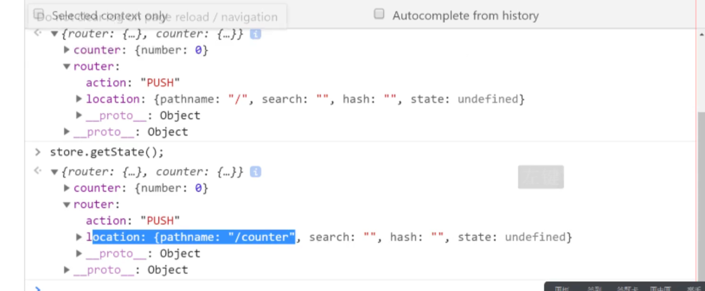;


```js
import { LOCATION_CHANGE } from './constants'
export default function (history) {
    let ininstate = {
        action: history.action, 
        location: history.location
    }
    return function (state = ininstate, action) {
        console.log(action.type, 'action.type');
        // debugger;
        switch (action.type) {
            case LOCATION_CHANGE:
            //action类型
           // {type: "@@router/LOCATION_CHANGE", payload: {…}}
                // payload:
                // action: "PUSH"
                // location: {pathname: "/", search: "", hash: "", state:                  undefined, key: "pgjdgh"}
                // __proto__: Object
                // type: "@@router/LOCATION_CHANGE"
                // __proto__: Object
                console.log(action.payload, 'action.payload') //即上面触发 传过来的那个
                return action.payload; //先经过reducers 合并 一下 存到redux 了
            default:
                return state;
        }
    }
}
```

### redux-persist

#### 入口-index.js

```js
import React from 'react';
import ReactDOM from 'react-dom';
import Home from './components/Home'
import Counter from './components/counter'
import { Route, Link } from 'react-router-dom'
import { Provider } from 'react-redux'
import { store, persistor } from './store'
import { ConnectedRouter } from './connected-react-router';
import history from './store/history'
import { PersistGate } from './redux-persist/integration/react'
ReactDOM.render(
  <Provider store={store}>
    <PersistGate loading={null} persistor={persistor}>
      <ConnectedRouter history={history}>
        <>
          <Link to="/">Home</Link>
          <Link to="/counter">counter</Link>
          <hr />
          <Route path="/" exact={true} component={Home}></Route>
          <Route path="/counter" component={Counter}></Route>
        </>
      </ConnectedRouter>
    </PersistGate>

  </Provider>

  , document.getElementById('root')
);

```

#### store-indexjs

```js
import {createStore, applyMiddleware, compose} from 'redux';
import reducers from './reducers'
import {routerMiddleware} from '../connected-react-router'; //中间件
import history from './history'
//知识点 数据持久化
import { persistStore, persistReducer } from '../redux-persist'
import storage from '../redux-persist/lib/storage' // defaults to localStorage for web
const persistConfig = {
  key: 'root',
  storage,
}
const persistedReducer = persistReducer(persistConfig, reducers)
const composeEnhancers = window.__REDUX_DEVTOOLS_EXTENSION_COMPOSE__ || compose;
// let store = createStore(reducers);
// let store = applyMiddleware(routerMiddleware(history))(createStore)(reducers) 两种写法
let store = createStore(persistedReducer,composeEnhancers(applyMiddleware(routerMiddleware(history))))
window.store = store;
let persistor = persistStore(store)
export {
    store,
    persistor
}
```

#### 原理

##### Redux-persist-index.js

```js
import persistStore from './persistStore'
import persistReducer from './persistReducer'

export {
    persistStore, //函数 persistStore(store)
    persistReducer
}
```

##### redux-persist/integration/react (PersistGate)

```js
import React, { Component } from 'react';

class PersistGate extends Component {
    componentDidMount() {
        //从localstorage里获得数据 改变仓库
        console.log(this.props.persistor, 'this.props.persistor')
        this.props.persistor.initState();
    }
    render() {
        return this.props.children
    }
}
export {PersistGate}
```

##### redux-persist-persistStore.js

```js
const PERSIST_INIT = 'PERSIST_INIT';

export default function persistStore(store) {
    let persistor = {
        ...store,
        initState() {
            store.dispatch({ type: PERSIST_INIT })
        }
    }
    return persistor
}
```

##### redux-persist-persistStore.js

```js
const PERSIST_INIT = 'PERSIST_INIT';

export default function persistStore(store) {
    let persistor = {
        ...store,
        initState() {
            store.dispatch({ type: PERSIST_INIT })
        }
    }
    return persistor
}
```

##### redux-persist-persistReducer

把localstorage的数据给reducer state

```js
const PERSIST_INIT = 'PERSIST_INIT';

//persistedReducer = persistReducer(persistConfig, reducers)
export default function persistReducer(persistConfig, reducers) {
    let key = `persist:${persistConfig.key}`;
    let isInited =false;
    return function (state, action) {
        switch (action.type) {
            case PERSIST_INIT:
                isInited = true;
                let value = persistConfig.storage.get(key);
                state = JSON.parse(value);
                return state;
            default:
                console.log(isInited, 'isInited');
                if (isInited) {
                    state = reducers(state, action);
                    persistConfig.storage.set(key, JSON.stringify(state));
                    return state;
                }else {
                    console.log(reducers(state, action), 'reducers(state, action)')
                    return reducers(state, action);
                }
               
        }
    }
}
```

##### redux-persist/lib/storage

```js
export default {
    set(key, value) {
        localStorage.setItem(key, value);
    },
    get(key) {
        return localStorage.getItem(key);
    }
}
```

## redux-saga

### 1.saga介绍

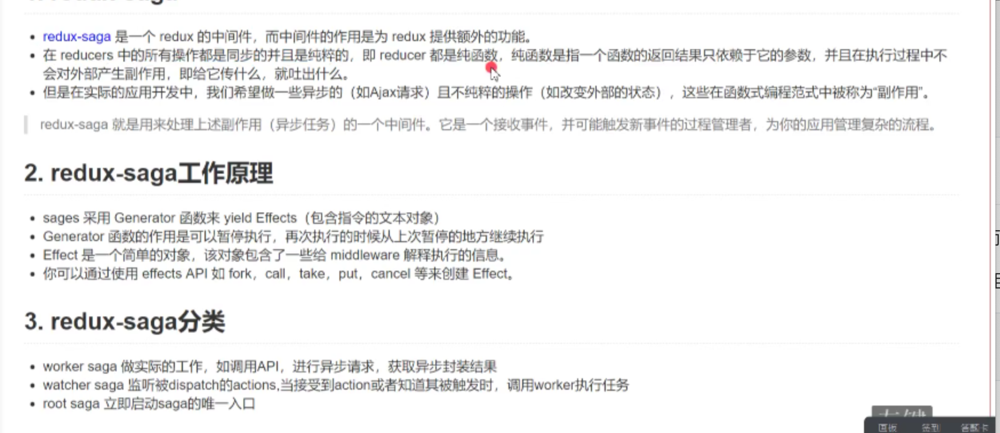

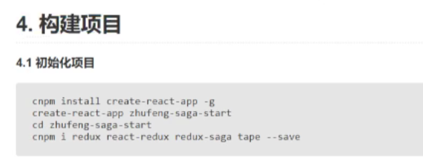

### 2.effect

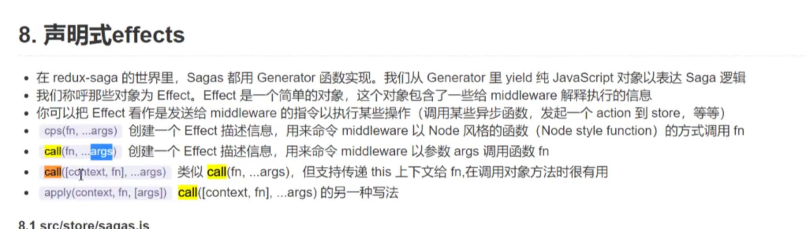


### 1.1 store-index.js

```js
import {createStore,applyMiddleware} from 'redux'
import reducer from './reducers'
import rootsage from '../store/saga/index'
// let store = createStore(reducer);
import createSagaMiddleware from 'redux-saga';
let sagaMiddleware = createSagaMiddleware();
let store = applyMiddleware(sagaMiddleware)(createStore)(reducer);
//sagaMiddleware 就是一个执行器 可以启动helloSaga 这个监听函数的执行
sagaMiddleware.run(rootsage);//run只能有一个 co库
export default store;
```

###  1.2 saga-index.js

```js
import {all} from 'redux-saga/effects'; //这个库里有delay
import hellosaga from './hellosaga'
import watchIncrementAsync from './watchIncrementAsync'

import readAsync from './readAsync'
import LoginSaga from './loginSaga'
import raceSaga from './raceSaga'
import raceSaga2 from './recesaga2'
/**
 * 1.rootsage 入口saga是用组织和调用别的saga generator
 * 2.监听saga 监听向仓库派发动作的 如果监听到某些动作 会通知worker去执行
 * 3.worker saga 真正干活的saga 真正执行任务的saga
 */
/**
 * race saga1.有时候我们同时启动多个任务 但又不想等待所有任务完成，我们只希望拿到胜利者：即第一个被reslove（或reject）的任务
 * 2.race 的另一个有用的功能是 他会自动取消那些失败的effects
 * 
 */

export default function* rootsage() {
    yield all([
        hellosaga(),
        watchIncrementAsync(), //异步 new promise
        readAsync(), //处理普通的回调函数
        LoginSaga(), //登录案例
        raceSaga(), //
        raceSaga2()
    ])
    // {
    //     type:'All',
    //     payload: [hellosaga, watchIncrementAsync]
    // }
    console.log('next');
}
// ES6中定义了一种新的函数.用function*定义生成器函数,
// 这种函数会返回一个generator对象
// .生成器函数在执行时可以暂停，然后又可以在暂停处接着执行。
/**
 * saga相对于thunk的有点
 * 1.便于单元测试
 */
```

### take put select 

Action-counter.js

```js
import * as types from '../action-types'

export default {
    increment() {
        return {type:types.INCREMENT}
    },
    decrement() {
        return {type:types.DECREMENT}
    },
    asyncIncrement() {
        return {type:types.ASYNC_INCREMENT}
    },
    stop() {
        return {type:types.CANCAL_COUNTER}
    }

}
```

### watchIncrementAsync 实现异步 put take takeEvery all

```js
import {all, takeEvery, put, call} from 'redux-saga/effects'; //这个库里有delay
import * as types from './action-types';
// delay大概意思
export const delay = function(ms) {
    return new Promise((reslove, reject) => {
        setTimeout(()=> {
            console.log(this) //null
            reslove(this.username);
        }, ms)
    })
}
export function* incrementAsync() {
    //当你yield 一个promise的时候 saga中间件可以接受这个promise 会等待完成
    //完成后会把这个resolve的值赋给msg 再接着往下走
    // let msg =  yield delay(1000); == yield call(delay, 1000);
    //系统的delay 内部调用了call方法
    let obj = {username:'zhufeng'}; //让delay 的this指向obj
    let msg = yield call([obj,delay], 1000);
    //let msg = yield apply(obj,delay, [1000]); //另一种写法
    // let msg = yield call(delay, 100); //call就是调用一个函数
    console.log('msg', msg);
    yield put({type:types.INCREMENT})
}
export function* watchIncrementAsync() {
    console.log('hello saga-async');
    //监听每一次的ASYNC_INCREMENT 每当有人向仓库派发这个动作的时候 就会调用另一个worker saga
    //每当yield一个值 一般被称为effect 就相当于告诉saga中间件执行某些处理
    yield takeEvery(types.ASYNC_INCREMENT, incrementAsync)
}
```

### select

```js
export function* watchAndLog() {
    while(true) {
        let action = yield take('*');
        console.log(action, 'action');
        //如何在saga中获取中心的状态树
        const state = yield select(state=> state.counter);
        console.log(state, 'state');
    }
}
```

### cps

```js
export const readFile = function(filename, callback) {
    console.log(filename, 'filename');
    setTimeout(() => {
        callback(null, filename +"‘s content" );
    },1000)
}
cps 负责处理普通的回调函数
import { readFile } from '../utils';
import {cps} from 'redux-saga/effects'; //这个库里有delay

export default function* readAsync() {
    //yield 只适用调用call方法
    let content = yield cps(readFile, 'README.md');
    console.log(content)
}
```

### race

/**

 \* 1.有时候我们同时启动多个任务 但又不想等待所有任务完成，我们只希望拿到胜利者：即第一个被reslove（或reject）的任务

 \* 2.race 的另一个有用的功能是 他会自动取消那些失败的effects

 \* 

 */

```js
const delay = ms => new Promise((reslove, reject) => {
    setTimeout(() => {reslove(ms)}, ms)
})
export default function* () {
    const {a, b} = yield race({
        a:call(delay,1000),
        b:call(delay, 500)
    })
    console.log('a=', a, 'b=', b);
}
//只要一个结束 该任务就结束了
```

```js
随时停止任务
<button onClick={this.props.stop}>取消</button>
            </div>
 stop() {
        return {type:types.CANCAL_COUNTER}
    }

action-couter 派发动作 types.CANCAL_COUNTER
const delay = ms => new Promise((reslove, reject) => {
    setTimeout(() => {reslove(ms)}, ms)
})
function* start() {
    while(true) {
        yield call(delay, 1000);
        yield put({type:types.INCREMENT})
    }
}
export default function* () {
    yield race({
        start: call(start),
        stop: take(types.CANCAL_COUNTER) //这个动作一完成 则当前任务就停止了
    })
}
```

### 登录案例

学习take, put, call, fork, cancel, cancelled

Action-types.js

```js

export const LOGIN = 'LOGIN';
export const LOGIN_ERROR = 'LOGIN_ERROR';
export const LOGIN_SUCESS = 'LOGIN_SUCESS';

export const LOGIN_OUT = 'LOGIN_OUT';
export const LOGIN_OUT_SUCCESS = 'LOGIN_OUT_SUCCESS'
export const CANCAL_COUNTER = 'CANCAL_COUNTER'
```

Src-components-login.js

```js
import * as types from '../action-types'
export default {
    login(username, password) {
        return {
            type:types.LOGIN,
            payload:{username, password}
        }
    },
    logout() {
        return {
            type: types.LOGIN_OUT
        }
    }
}
```

Store-reducer-user.js

```js
import * as types from '../action-types'
let ininstate = { username: null }
export default function (state = ininstate, action) {
    switch (action.type) {
        case types.LOGIN_SUCESS:
            return { token: action.payload }
        case types.LOGIN_ERROR:
            return { error: action.error }
        case types.LOGIN_OUT_SUCCESS:
            return {}
        default:
            return state;
    }
}
```

Saga-loginsaga

take, put, call, fork, cancel, cancelled 

```js
import { take, put, call, fork, cancel, cancelled } from 'redux-saga/effects'; //这个库里有delay
import * as types from '../action-types'
import api from './api'
function* login(username, password) {
    try {
        api.setItem('loading', 'true');
        //api.login是一个promise
        const token = yield call(api.login, username, password);
        yield put({ type: types.LOGIN_SUCESS, payload: token });
        api.setItem('loading', 'false');
    } catch (error) {
        alert(error);
        api.setItem('loading', 'false');
        yield put({ type: types.LOGIN_ERROR, error })
    }finally{
        //不管成功还是失败
        if (yield cancelled()) {
            api.setItem('loading', 'false');
        }
    }
}
export default function* () {
    while (true) {
        let { payload: { username, password } } = yield take(types.LOGIN);
        //如果接口很慢 => 等不及了 就点击退出 就监听不到了 永远是登录状态 
        //不希望 阻塞操作 退出登录
        // const token = yield call(login, username, password);
        //fork 就相当于开启了一个子进程 他会单独去执行 
        // 不会影响当前的主进程执行，主进程会立刻向下执行  这是打个比方哟  后面看源码实现
        //我们拿不到login的返回值，但是可以得到一个任务对象
       const task = yield fork(login, username, password); //我们拿不到login方法的返回值 但是可以得到一个任务对象的返回值
        // if (token) {
            //一旦登录成功了 就可以开始监听退出的动作
           const action =  yield take(types.LOGIN_OUT);
           if (action.type === types.LOGIN_OUT) {
               yield cancel(task);
           }
            yield put({ type: types.LOGIN_OUT_SUCCESS });
        // }
    }
}
```

### fork

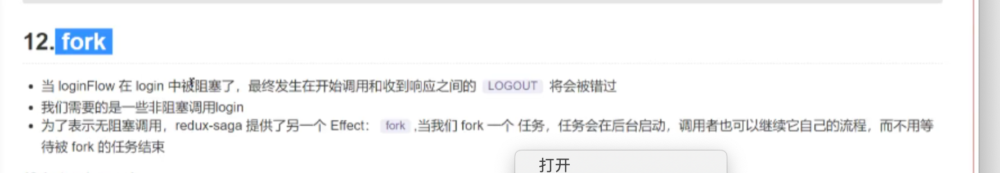

```js

```

### 原理

#### 1.take put

```js
export default function* () {
    for (let i = 0; i< 3;i++) {
        const action = yield take(types.ASYNC_INCREMENT);
        //订阅 等待派发动作 派发动作又走了一遍next(action) 又开始订阅
        yield put({type:types.INCREMENT});
    }
    alert('最多执行3次');//先走到这 才开始加1
}
```

#### Fork 

takeEvery 内部是fork fork上面有用例

```js
function* increment() {
    yield put({type:types.INCREMENT})
}
export default function* () {
    yield takeEvery(types.ASYNC_INCREMENT, increment)
}
```

#### call

```js
const delay = ms => new Promise((reslove, reject) => {
    setTimeout(() => {
        reslove(ms);
    }, ms)
})
function* increment() {
    let result = yield call(delay, 2000);
   //或者 let result = yield delay(2000);
    console.log('result=====', result); //2000
    yield put({type:types.INCREMENT})
}

export default function* () {
    yield takeEvery(types.ASYNC_INCREMENT, increment)
}
```

#### cps

```js
const delay = (ms, callback) => {
   setTimeout(() => {
     callback(ms);
    }, ms)
}
function* increment() {
    let result = yield cps(delay, 1000);
    console.log('result=====', result);
    yield put({type:types.INCREMENT})
}

export default function* () {
    yield takeEvery(types.ASYNC_INCREMENT, increment)
}
```

#### all

```js
export default function* rootsage() {
    //立刻启动所有的generator 等全部完成后saga才算完成
    yield all([
        counterSaga(),
        logSaga()
        // autoSaga()
    ])
    console.log('index-saga结束了')
}
```

#### 取消任务

```js
import {take, put, takeEvery, call, cps, all, fork, delay, cancel} from '../../redux-saga/effects'
import * as types from '../action-types'
function* increment () {
    while(true) {
        yield delay(1000);
        yield put({type:types.INCREMENT});
    }
}


export default function* () {
    const task = yield fork(increment);
    yield take(types.STOP_INCREMENT);
    yield cancel(task);
}
```

#### code-源码

redux-saga-effect.js

```js

export function take(actionType) {
    // console.log('effect-take', actionType);
    return {
        type:'TAKE',
        actionType
    }
}
export function put(action) {
    // console.log('effect-put', action);
    return {
        type:'PUT',
        action
    }
}
export function fork(task) {
    return {
        type: 'FORK',
        task
    }
}
//takeevery 相当于要开启一个新的子进程，单独监听actionType,当动作发生的时候去执行迭代器
export function* takeEvery(actionType,generator) {
    yield fork(function*() {
        while(true) {
            yield take(actionType);
            yield generator();//increment
        }
    })
}
export function call(fn, ...args) {
    return {
        type: 'CALL',
        fn,
        args
    }
}
const innerDelay = ms => new Promise((reslove, reject) => {
    setTimeout(() => {
        reslove(ms);
    }, ms)
})
export function delay(...args) {
    return call(innerDelay, ...args)
}
export function cps(fn, ...args) {

    return {
        type: 'CPS',
        fn, 
        args
    }
}
export function all(fns) {
    return {
        type: 'ALL',
        fns
    }
}
export function cancel (task) {
   return {
       type:'CANCEL',
       task
   }
}

```

redux-saga-index.js

```js
import { call } from "./effects";

//返回一个中间件
export default function createSagaMiddleware() {

    function createChannel() { //管道逻辑
        let observer = {};
        function subscribe(actionType, callback) {
            console.log(observer, 'oberver');
            observer[actionType] = callback; //订阅
            // observer[actionType] = observer[actionType] || [];
            // observer[actionType].push(callback);
        }
        function publish(action) {
            if (observer[action.type]) {
                //先删再绑定
                console.log('publish');
                let next = observer[action.type];//上面存的就是next把下次订阅完成才结束
                delete observer[action.type];
                next(action);
                // nexts.forEach(next => next(action));
                // console.log('observer-----', observer)
                //此处是个难点 一点更要保证generator执行下去
                //
                // observer[action.type](action);
                // delete observer[action.type];
            }
        }
        return {
            subscribe,
            publish
        }
    }
    let channel = createChannel();
    //中间件
    function sagaMiddleware({ dispatch, getState }) {

        function run(generator, callback) {
            //开始自动执行generator
            console.log(generator, callback, '开始自动执行generator')
           
            let it = typeof generator[Symbol.iterator] == 'function' ? generator : generator();
            // let it = generator();
            function next(action) {
                //value :{type:'TAKE', actionType:ASYNC_INCREMENT}
                console.log('action---', action);
                //action ---  {type: "ASYNC_INCREMENT"}
                let { value: effect, done } = it.next(action);
                console.log('effect---',done, effect)
                //it.next(action); 会改变上一次yiled的返回值 上一次yieled的返回值就是action
                //代码一运行的时候已经执行过一次了 用户点击按钮派发action的时候 开始派发动作走了pulish 然后又走了一遍呢next 这时候把返回值改掉了
                //effect ----  {action: {type: "INCREMENT"}, type: "PUT"}
                if (!done) {
                     //yiled的值可能就是一个迭代器
                    if (typeof effect[Symbol.iterator] == 'function') {
                        run(effect);//如果是一个迭代器的话 直接传入run方法 执行
                        next();
                    } else if (typeof effect.then == 'function') {
                        //直接yeild delay(1000) 一个promise
                        effect.then(next);
                    } else {
                        switch (effect.type) {
                            case 'TAKE'://take就是要监听每个动作,当动作发生执行下一步
                                channel.subscribe(effect.actionType, next);
                                break;
                            case 'PUT'://{type:'PUT',action:increment}
                                console.log(dispatch, effect.action);
                                dispatch(effect.action);
                                next();//然后又要去订阅
                                break;
                            case 'FORK':
                                let newTask = effect.task(); //task是一个generator
                                run(newTask); //如果是fork 就开启一个新的子进程去执行
                                next(newTask);//自己的saga会立刻继续执行 不会在此等待 会改变上一个yield的返回值
                                //task = yield fork(increment); 会赋值给task
                                break;
                            case 'CANCEL':
                                effect.task.return('任务直接结束');//迭代器return
                                break;

                            case 'CALL':
                                //先让函数执行
                                effect.fn(...effect.args)
                                    .then(next);
                                //let result = yield call(delay, 1000);
                                //会把resolve的值reslove(ms) 传给next 方法
                                break;
                            case 'CPS':
                                effect.fn(...effect.args, next);//把nextang
                                break;
                            case 'ALL':
                                //saga执行完之后 才执行next
                                function times(cb, length) {
                                    let count = 0;
                                    return function () {
                                        if (++count === length) {
                                            cb();
                                        }
                                    }
                                }
                                let fns = effect.fns;
                                let done = times(next, fns.length);
                                effect.fns.forEach(fn => run(fn, done));
                                break;
                            default:
                                break;
                        }
                    }

                } else {
                    //saga完成 -- 执行next  
                    callback && callback()
                }
            }
            next();
        }
        sagaMiddleware.run = run;
        return next => action => {
            channel.publish(action);//派发动作
            next(action)
        }
    }
    return sagaMiddleware;
}
```

### gen

```js
function* G() {
  const a = yield 100
  console.log('a', a)  // a aaa
  const b = yield 200
  console.log('b', b)  // b bbb
  const c = yield 300
  console.log('c', c)  // c ccc
}
const g = G()
g.next()    // value: 100, done: false
g.next('aaa') // a aaa   value: 200, done: false   
g.next('bbb') //   b bbb  value: 300, done: false
g.next('ccc') //c ccc  value: undefined, done: true
```

```js
let obj ={
    name:'zhufeng',
    age:10,
    [Symbol.iterator]() {
        let that = this;
        // console.log(this, 'this---')
        let values = Object.values(that);//['zhufeng', 10]
        // console.log('values---',values);
        let index = 0;
        return {
            next() {
                let value =values[index];
                let done = index >= values.length;
                index++;
                return {
                    value,
                    done

                }
            }
        }
    }
}
```

## React-hooks

### useState

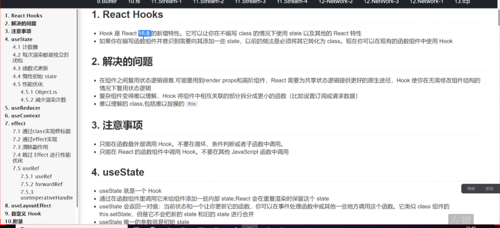

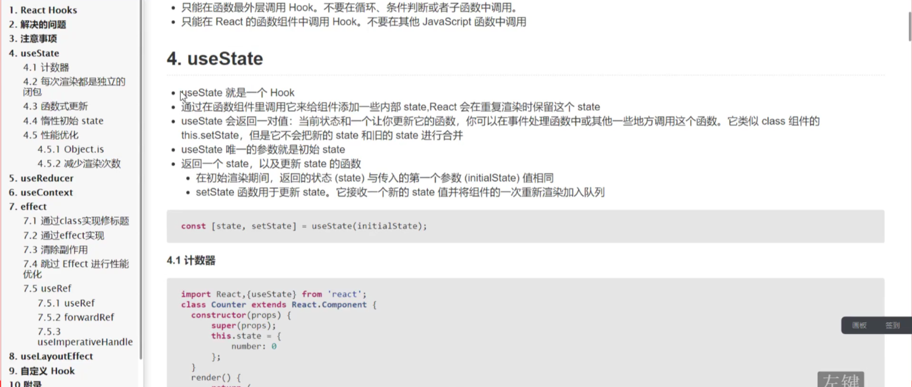


#### 1.1每次渲染都是独立的闭包

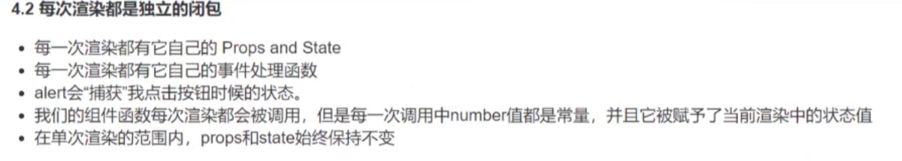

```js
function Counter2() {
  let [number, setNumber] = useState(0);//0是初始值
  return (
    <>
      <p>{number}</p>
      <button onClick={() => setNumber(number + 1)}>+</button>
    </>
  )
}
function Counter4() {
  let [number, setNumber] = useState(0);
  // console.log(useState(0));
  //左边2次右边2次左边1次
  function lazy() {
    setTimeout(() => {
      // setNumber(number+1) ==> 3
      setNumber(number => number + 1) // ===> 5 这个会去最新的状态
    }, 3000)
  }
  return (
    <>
      <p>{number}</p>
      <button onClick={() => setNumber(number + 1)}>+</button>
      <button onClick={lazy}>lazy</button>
    </>
  )
}
```

#### 1.2惰性初始化 

useState可以传函数 组件可以传值 在传值的基础上做加法

```js
function Counter5(props) {
  console.log('Counter5 render')
  let [counter, setCounter] = useState(function () {
    return { number: props.number }
  });
  //如果你修改状态的时候 直接传的是老状态 则什么都不做
  return (
    <>
      <p>{counter.number}</p>
      <button onClick={() => setCounter({ number: counter.number + 1 })}>+</button>
    </>
  )
}
ReactDOM.render(
  <Counter5 number={5} />,
  document.getElementById('root')
);

```

#### 1.3性能优化

调用react-hook 的更新函数并传入当前的 state时 react将跳过子组件的渲染及effect的执行 （React.js 使用Object.js比较算法来计算state）

传的如果是老状态的话就不会渲染 一般都不会这么用

```js
function Counter5(props) {
  console.log('Counter5 render')
  let [counter, setCounter] = useState(function () {
    return { number: props.number }
  });
  //如果你修改状态的时候 直接传的是老状态 则什么都不做
  return (
    <>
      <p>{counter.number}</p>
      <button onClick={() => setCounter({ number: counter.number + 1 })}>+</button>
    </>
  )
}
ReactDOM.render(
  <Counter5 number={5} />,
  document.getElementById('root')
);
```

### 减少渲染次数 memo

 Subcounter props的值为改变 就不会刷新了

memo  useMemo useCallback

```js
//减少渲染次数
function Subcounter({ onClick, data }) {
  console.log('Subcounter-render')
  return (
    <button onClick={onClick}>{data.number}</button>
  )
}
Subcounter = memo(Subcounter);
function Counter6(props) {
  console.log('Counter6-render')
  const [number, setNumber] = useState(0);
  const [name, setName] = useState('计数器');
  const data = useMemo(() => ({ number }), [number]); // []这个是依赖项 如果这个依赖项
  //data  {number: 1}
  const addClick = useCallback(()=>{
    setNumber(number + 1)
  },[number])
  return (
    <>
      <input type="text" value={name} onChange={(e) => setName(e.target.value)} />
      <Subcounter data={data} onClick={addClick} />
    </>
  )
}
```

### useReducer

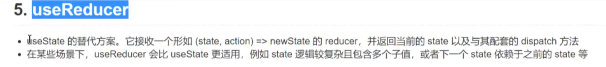

```js
const initialState = 0;
function reducer(state, action) {
  switch (action.type) {
    case 'ADD':
      return { number: state.number + 1 };
    default:
      return state;
      break;
  }
}
function Counter() {
  const [state, dispatch] = useReducer(reducer, initialState, () => ({ number: initialState }))
  return (
    <p>{state.number}</p>
      <button onClick={() => dispatch({ type: 'ADD' })}>+</button>
  )
}
```

### useContext

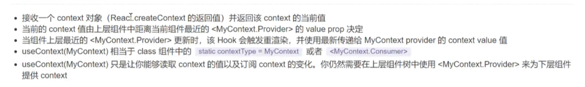

```js
import React, { useReducer, createContext, Component, useContext } from 'react';
import ReactDOM from 'react-dom';
let Countercontext = createContext();
function Counter() {
  const [state, dispatch] = useReducer(reducer, initialState, () => ({ number: initialState }))
  return (
    <Countercontext.Provider value={{ state, dispatch }}>
      <Subcounter />
    </Countercontext.Provider>

  )
}
function Subcounter() {
  const {state, dispatch} = useContext(Countercontext); //可以解构
  return (
    <>
      <p>{state.number}</p>
      <button onClick={() => dispatch({ type: 'ADD' })}>+</button>

    </>

  )
}
```

### useEffect

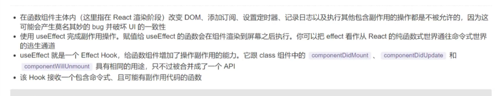

```js
function Counter() {
  let [number, setNumber] = useState(0);
  //effect函数是在每次渲染完成后就执行
  //每次我们重新渲染 都会生成新的effect 替换掉之前的 某种意义上讲effect更像是渲染结果的一部分-每个effect属于一次特定的渲染
  useEffect(() => {
    document.title = `你现在一共点击了${number}`
  })
  return (
    <>
      <p>{number}</p>
      <button onClick={() => setNumber(number + 1)}>+</button>
    </>
  )
}
```

清除副作用


```js
定时器案例
function Counter3() {
  let [number, setNumber] = useState(0);
  //effect函数是在每次渲染完成后就执行
  //每次我们重新渲染 都会生成新的effect 替换掉之前的 某种意义上讲effect更像是渲染结果的一部分-每个effect属于一次特定的渲染
  useEffect(() => {
    console.log('你开启了一个新的定时器');
    const $timer = setInterval(() => {
      setNumber(number=>number+1)
    }, 1000);
    return () => {
      clearInterval($timer) //会把上一个定时器清除掉
    }
  }) //依赖的变化是空的 不会变 然后后面的定时器 不会执行
  return (
    <>
      <p>{number}</p>
      <button onClick={() => setNumber(number + 1)}>+</button>
    </>
  )
}
```

```js
跳过effect进行性能优化
function Counter3() {
  let [number, setNumber] = useState(0);
  //effect函数是在每次渲染完成后就执行
  //每次我们重新渲染 都会生成新的effect 替换掉之前的 某种意义上讲effect更像是渲染结果的一部分-每个effect属于一次特定的渲染
  useEffect(() => {
    console.log('你开启了一个新的定时器');
    const $timer = setInterval(() => {
      setNumber(number=>number+1)
    }, 1000);
  }, []) //依赖的变化是空的 不会变 然后后面的定时器 不会执行
  //这个定时器只会执行一次
  return (
    <>
      <p>{number}</p>
      <button onClick={() => setNumber(number + 1)}>+</button>
    </>
  )
}
```

### useRef

```js
let myInput;
function Child() {
  //const inputRef = createRef();返回的永远是新的
  const inputRef = useRef();//useRef 和 createRef 的区别  前者是旧的永远是一个  后者是新的 每次都创建新的
 console.log('inputRef === myInput', inputRef === myInput)
  myInput = inputRef;
  function getFocus() {
    inputRef.current.focus();
  }
  return (
    <>
    <input type="text" ref={inputRef}/>
    <button onClick={getFocus}>获得焦点</button>
    </>
  )

}
funtion Parent() {
  return <Child/>
}
```

```js
父组件去操作input框
function Child(props, ref) {
  return (
    <>
    <input type="text" ref={ref}/>
    </>
  )
}
let ForwardChild = forwardRef(Child);

function Parent() {
  //操作child 的input 
  let [number, setNumber] = useState(0);
  const inputRef = useRef();
  function getFocus() {
    inputRef.current.focus();
  }
  return (
    <>
    <ForwardChild ref={inputRef}/>
    <button onClick={getFocus}>获得焦点</button>
    <button onClick={()=>setNumber(number+1)}>{number}</button>
    </>
  )
}

```

### useImperativeHandle

可以在使用ref时自定义暴露给父组件的实例值

在大多数情况下，应该避免使用ref这样的命令式代码，seImperativeHandle应与forwardRef一起使用

```js
import React, {createRef, forwardRef,useRef, useState, useEffect, useReducer, createContext, Component, useContext,useImperativeHandle } from 'react';
import ReactDOM from 'react-dom';

function Child(props, parentRef) {
  let inputRef = useRef();
  useImperativeHandle(parentRef, () => {
    return {
      focus() { //这个方法会传给parentRef。current
        inputRef.current.focus();
      }
    }
  });
  return (
    <>
    <input type="text" ref={inputRef}/>
    </>
  )
}
//这样写 子组件收不到保护
let ForwardChild = forwardRef(Child);

function Parent() {
  //操作child 的input 
  let [number, setNumber] = useState(0);
  const parentRef = useRef();
  function getFocus() {
    parentRef.current.focus();
    //此处的current是上面useImperativeHandle return的那个对象呀
  }
  return (
    <>
    <ForwardChild ref={parentRef}/>
    <button onClick={getFocus}>获得焦点</button>
    <button onClick={()=>setNumber(number+1)}>{number}</button>
    </>
  )
}

ReactDOM.render(
  <Parent/>,
  document.getElementById('root')
);

```

### UseLayoutEffectComponent

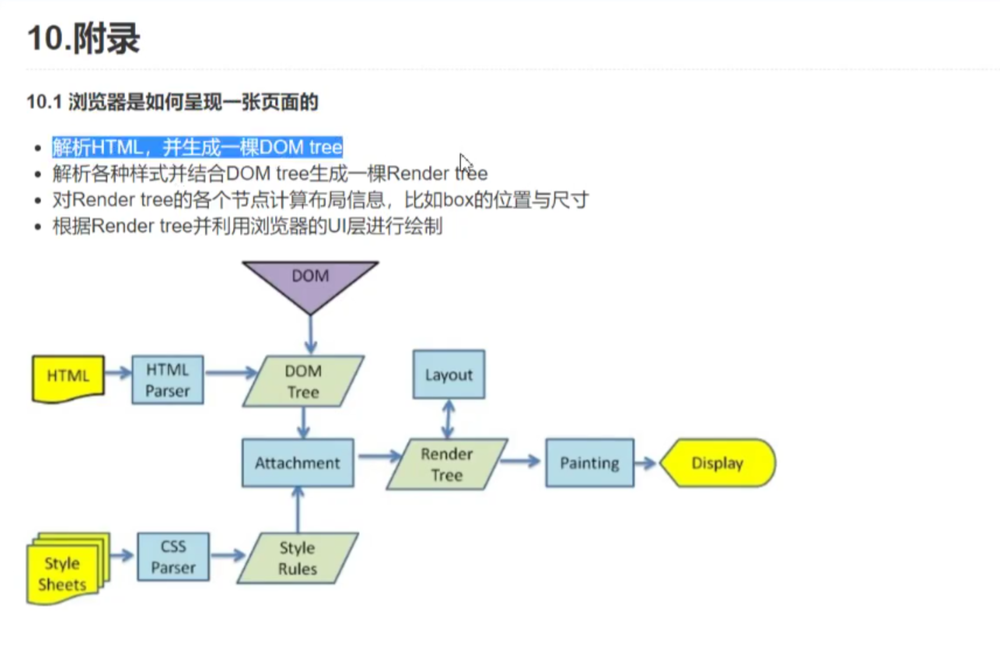

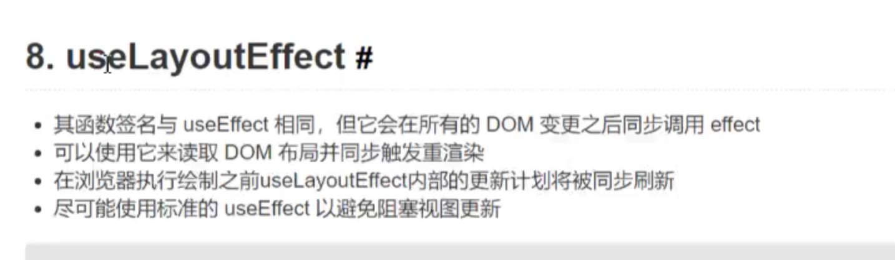

```js
import React, { useLayoutEffect, useEffect, useState} from 'react';
import ReactDOM from 'react-dom';
function UseLayoutEffectComponent() {
   const [color, setcolor] = useState('red');
      //useLayoutEffect
   //会在所有的DOM变更之后同步调用effect
   //可以用他来读取DOM布局并同步触发重渲染
   //在浏览器执行绘制之前useLayoutEffect内部的更新将同步刷新
   //尽可能使用标准的useEffect 以避免阻塞视图更新
   useLayoutEffect(() => {
    // alert('useLayoutEffect-COLOR=='+color); color获取到了 但是页面没有变更  渲染是同步的 会阻塞页面渲染
    console.log('useLayoutEffect-COLOR==', color); 
    document.getElementById('myDiv').style.backgroundColor='pink'//页面永远是pink
     //如果想操作dom 就用这个 用useEffect 去改变颜色的时候会出现闪烁
  })
   
   useEffect(() => {
     console.log('useEffect-COLOR==', color);
   })

   return (
     <>
     <div id="myDiv" style={{backgroundColor:color}}>颜色</div>
     <button onClick={() => setcolor('red')}>红</button>
     <button onClick={() => setcolor('yellow')}>黄</button>

     <button onClick={() => setcolor('blue')}>蓝</button>

     </>
   )
}

ReactDOM.render(
  <UseLayoutEffectComponent/>,
  document.getElementById('root')
);

```


## 小知识点

npm eject  能召唤出配置文件  ----> 实现css模块化

### 目录

## 2.使用的软件
### typora
### markdown语法
##3.怎么创建大纲和目录

### 怎么创建大纲
### 怎么创建目录

## 问题

### 1.无限滚动的实现

### 2.table 实现大量数据的渲染

## 面试

了解ES6、AMD、CMD、CommonJS等模块化开发方式。

 良好的代码能力、沟通协作能力，掌握常用基本算法、设计模式。
\NodeJS开发经验者优先。

熟悉http
