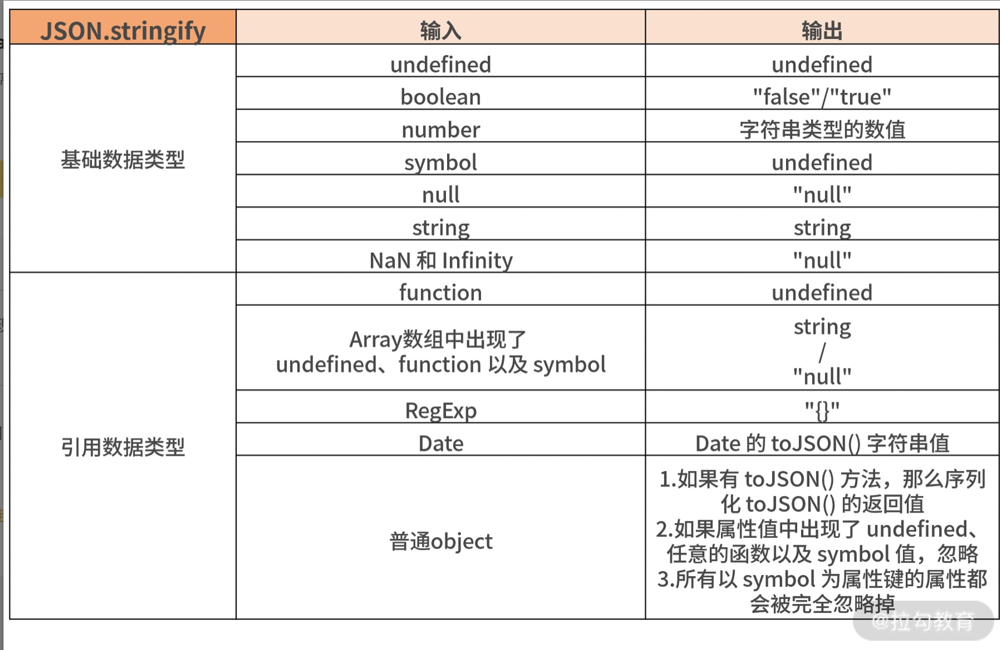

## 1.apply、call、bind

apply、call、bind 这三个方法之间有什么区别?
**call的性能比apply要好那么一丢丢 尤其参数在三个以上的时候**
```js
function fn1() {
    // console.log(this, 'this')
   console.log(1,arguments);
}
function fn2() {
    console.log(2);
 }
// call 的特点
// 1.可以改变当前函数this指向
// 2.让当前函数执行
// fn1.call(fn2); //1
// fn1.call.call(fn2); //2  如果多个call 会让fn2执行
```
```js
let a = {
  name: 'jack',
  getName: function(msg) {
    return msg + this.name;
  } 
}
let b = {
  name: 'lily'
}
console.log(a.getName('hello~'));  // hello~jack
console.log(a.getName.call(b, 'hi~'));  // hi~lily
console.log(a.getName.apply(b, ['hi~']))  // hi~lily
let name = a.getName.bind(b, 'hello~');
console.log(name());  // hello~lily
```
### apply 和 call 的实现
```js
Function.prototype.call = function (context, ...args) {
   context = context  || window;
  context.fn = this; //假如  当fn被调用的时候 函数谁调用 this指向谁 改变了this指向
  const result = eval('context.fn(...args)');
  delete context.fn
  return result;
}
//apply 参数是数组
Function.prototype.apply = function (context, args) {
  context = context || window;
  context.fn = this;
  let result = eval('context.fn(...args)');
  delete context.fn
  return result;
}

```

### bind 的实现
- 方法可以绑定this指向
- 返回一个绑定后的新函数
- 如果绑定的函数被new 当前函数的this 就是当前的实例
```js
let obj = {
    name:' jw'
}
function fn(name,age) {
    console.log(this.name + '养了' +name+age+'岁了');
}
Function.prototype.bind = function(context) {
    let that = this;
    let bindArgs = Array.prototype.slice.call(arguments,1) // 猫
    function Fn(){};
    function fBound(...args) {
        //如果被new 了
        return that.apply(this instanceof fBound ? this : context,bindArgs.concat(args));
    }
    Fn.prototype = this.prototype;
    fBound.prototype = new Fn();
    return fBound;
}
fn.prototype.flag = '哺乳类'
let bindFn = fn.bind(obj,'猫'); 
bindFn(9,8); //可以传参 //{ name: ' jw' }
let instance = new bindFn(9); // undefined养了猫9岁了
console.log(instance.flag) //哺乳类
```
## 2.new 的实现
那么 new 在这个生成实例的过程中到底进行了哪些步骤来实现呢？总结下来大致分为以下几个步骤。
- 创建一个新对象；

- 将构造函数的作用域赋给新对象（this 指向新对象）；

- 执行构造函数中的代码（为这个新对象添加属性）；

- 返回新对象。

new 的实现

我们刚才在讲 new 的原理时，介绍了执行 new 的过程。那么来看下在这过程中，new 被调用后大致做了哪几件事情。

- 让实例可以访问到私有属性；

- 让实例可以访问构造函数原型（constructor.prototype）所在原型链上的属性；

- 构造函数返回的最后结果是引用数据类型。

那么请你思考一下，自己实现 new 的代码应该如何写呢？下面我给你一个思路。
```js
function Animal(type) {
    this.type = type; //实例上的属性
    //如果构造函数返回的是一个引用类型 需要把这个对象返回
    return {name:"jw"}
}
Animal.prototype.say = function() {
    console.log('say');
}

function mockNew(Fn,...arg) {
 let obj = Object.create(Fn.prototype);
 let r = Fn.call(obj,...arg);
return r instanceof Object ? r :obj;
}
let animal = mockNew(Animal, '哺乳类')
console.log(animal,animal.type);
// animal.say();
```

## 3.JSON.stringify
JSON.stringify 是日常开发中经常用到的 JSON 对象中的一个方法，JSON 对象包含两个方法：一是用于解析成 JSON 对象的 parse()；二是用于将对象转换为 JSON 字符串方法的 stringify()。下面我们分别来看下两个方法的基本使用情况。

### JSON.parse

JSON.parse 方法用来解析 JSON 字符串，构造由字符串描述的 JavaScript 值或对象。该方法有两个参数：第一个参数是需要解析处理的 JSON 字符串，第二个参数是可选参数提供可选的 reviver 函数，用在返回之前对所得到的对象执行变换操作。

**该方法的语法为：JSON.parse(text[, reviver])**

下面通过一段代码来看看这个方法以及 reviver 参数的用法，如下所示。

```js
const json = '{"result":true, "count":2}';
const obj = JSON.parse(json);
console.log(obj.count);
// 2
console.log(obj.result);
// true
/* 带第二个参数的情况 */
JSON.parse('{"p": 5}', function (k, v) {
    if(k === '') return v;     // 如果k不是空，
    return v * 2;              // 就将属性值变为原来的2倍返回
});                            // { p: 10 }
```
上面的代码说明了，我们可以将一个符合 JSON 格式的字符串转化成对象返回；带第二个参数的情况，可以将待处理的字符串进行一定的操作处理，比如上面这个例子就是将属性值乘以 2 进行返回。

下面我们来了解一下 JSON.stringify 的基本情况。

### JSON.stringify

JSON.stringify 方法是将一个 JavaScript 对象或值转换为 JSON 字符串，默认该方法其实有三个参数：第一个参数是必选，后面两个是可选参数非必选。第一个参数传入的是要转换的对象；第二个是一个 replacer 函数，比如指定的 replacer 是数组，则可选择性地仅处理包含数组指定的属性；第三个参数用来控制结果字符串里面的间距，后面两个参数整体用得比较少。

**该方法的语法为：JSON.stringify(value[, replacer [, space]])**

下面我们通过一段代码来看看后面几个参数的妙用，如下所示。

```js
JSON.stringify({ x: 1, y: 2 });
// "{"x":1,"y":2}"
JSON.stringify({ x: [10, undefined, function(){}, Symbol('')] })
// "{"x":[10,null,null,null]}"
/* 第二个参数的例子 */
function replacer(key, value) {
  if (typeof value === "string") {
    return undefined;
  }
  return value;
}
var foo = {foundation: "Mozilla", model: "box", week: 4, transport: "car", month: 7};
var jsonString = JSON.stringify(foo, replacer);
console.log(jsonString);
// "{"week":4,"month":7}"
/* 第三个参数的例子 */
JSON.stringify({ a: 2 }, null, " ");
/* "{
 "a": 2
}"*/
JSON.stringify({ a: 2 }, null, "");
// "{"a":2}"
```
从上面的代码中可以看到，增加第二个参数 replacer 带来的变化：通过替换方法把对象中的属性为字符串的过滤掉，在 stringify 之后返回的仅为数字的属性变成字符串之后的结果；当第三个参数传入的是多个空格的时候，则会增加结果字符串里面的间距数量，从最后一段代码中可以看到结果。

下面我们再看下 JSON.stringify 的内部针对各种数据类型的转换方式。

如何自己手动实现？

为了让你更好地理解实现的过程，请你回想一下“01 | 代码基本功测试（上）：JS 的数据类型你了解多少”中的基本知识，我们当时讲了那么多种数据类型，如果它们都使用这个方法，返回的结果又会是怎么样的呢？

分析各种数据类型及边界情况

我们来分析一下都有哪些数据类型传入，传入了之后会有什么返回，通过分析的结果我们之后才能更好地实现编码。大致的分析汇总如下表所示（可参考 MDN 文档）。



上面这个表中，基本整理出了各种数据类型通过 JSON.stringify 这个方法之后返回对应的值，但是还有一个特殊情况需要注意：对于包含循环引用的对象（深拷贝那讲中也有提到）执行此方法，会抛出错误。

那么根据上面梳理的这个表格，我们来一起看下代码怎么编写吧。

代码逻辑实现

我们先利用 typeof 把基础数据类型和引用数据类型分开，分开之后再根据不同情况来分别处理不同的情况，按照这个逻辑代码实现如下。

```js

function jsonStringify(data) {
  let type = typeof data;

  if(type !== 'object') {
    let result = data;
    //data 可能是基础数据类型的情况在这里处理
    if (Number.isNaN(data) || data === Infinity) {
       //NaN 和 Infinity 序列化返回 "null"
       result = "null";
    } else if (type === 'function' || type === 'undefined' || type === 'symbol') {
      // 由于 function 序列化返回 undefined，因此和 undefined、symbol 一起处理
       return undefined;
    } else if (type === 'string') {
       result = '"' + data + '"';
    }
    return String(result);
  } else if (type === 'object') {
     if (data === null) {
        return "null"  // 第01讲有讲过 typeof null 为'object'的特殊情况
     } else if (data.toJSON && typeof data.toJSON === 'function') {
        return jsonStringify(data.toJSON());
     } else if (data instanceof Array) {
        let result = [];
        //如果是数组，那么数组里面的每一项类型又有可能是多样的
        data.forEach((item, index) => {
        if (typeof item === 'undefined' || typeof item === 'function' || typeof item === 'symbol') {
               result[index] = "null";
           } else {
               result[index] = jsonStringify(item);
           }
         });
         result = "[" + result + "]";
         return result.replace(/'/g, '"');
      } else {
         // 处理普通对象
         let result = [];
         Object.keys(data).forEach((item, index) => {
            if (typeof item !== 'symbol') {
              //key 如果是 symbol 对象，忽略
              if (data[item] !== undefined && typeof data[item] !== 'function' && typeof data[item] !== 'symbol') {
                //键值如果是 undefined、function、symbol 为属性值，忽略
                result.push('"' + item + '"' + ":" + jsonStringify(data[item]));
              }
            }
         });
         return ("{" + result + "}").replace(/'/g, '"');
        }
    }
}
```
手工实现一个 JSON.stringify 方法的基本代码如上面所示，有几个问题你还是需要注意一下：

由于 function 返回 'null'， 并且 typeof function 能直接返回精确的判断，故在整体逻辑处理基础数据类型的时候，会随着 undefined，symbol 直接处理了；

由于 01 讲说过 typeof null 的时候返回'object'，故 null 的判断逻辑整体在处理引用数据类型的逻辑里面；

关于引用数据类型中的数组，由于数组的每一项的数据类型又有很多的可能性，故在处理数组过程中又将 undefined，symbol，function 作为数组其中一项的情况做了特殊处理；

同样在最后处理普通对象的时候，key （键值）也存在和数组一样的问题，故又需要再针对上面这几种情况（undefined，symbol，function）做特殊处理；

最后在处理普通对象过程中，对于循环引用的问题暂未做检测，如果是有循环引用的情况，需要抛出 Error；

根据官方给出的 JSON.stringify 的第二个以及第三个参数的实现，本段模拟实现的代码并未实现，如果有兴趣你可以自己尝试一下。

整体来说这段代码还是比较复杂的，如果在面试过程中让你当场手写，其实整体还是需要考虑很多东西的。当然上面的代码根据每个人的思路不同，你也可以写出自己认为更优的代码，比如你也可以尝试直接使用 switch 语句，来分别针对特殊情况进行处理，整体写出来可能看起来会比上面的写法更清晰一些，这些可以根据自己情况而定。

实现效果测试

上面的这个方法已经实现了，那么用起来会不会有问题呢？我们就用上面的代码，来进行一些用例的检测吧。

上面自己实现的这个 jsonStringify 方法和真正的 JSON.stringify 想要得到的效果是否一样呢？请看下面的测试结果。

```js
let nl = null;
console.log(jsonStringify(nl) === JSON.stringify(nl));
// true
let und = undefined;
console.log(jsonStringify(undefined) === JSON.stringify(undefined));
// true
let boo = false;
console.log(jsonStringify(boo) === JSON.stringify(boo));
// true
let nan = NaN;
console.log(jsonStringify(nan) === JSON.stringify(nan));
// true
let inf = Infinity;
console.log(jsonStringify(Infinity) === JSON.stringify(Infinity));
// true
let str = "jack";
console.log(jsonStringify(str) === JSON.stringify(str));
// true
let reg = new RegExp("\w");
console.log(jsonStringify(reg) === JSON.stringify(reg));
// true
let date = new Date();
console.log(jsonStringify(date) === JSON.stringify(date));
// true
let sym = Symbol(1);
console.log(jsonStringify(sym) === JSON.stringify(sym));
// true
let array = [1,2,3];
console.log(jsonStringify(array) === JSON.stringify(array));
// true
let obj = {
    name: 'jack',
    age: 18,
    attr: ['coding', 123],
    date: new Date(),
    uni: Symbol(2),
    sayHi: function() {
        console.log("hi")
    },
    info: {
        sister: 'lily',
        age: 16,
        intro: {
            money: undefined,
            job: null
        }
    }
}
console.log(jsonStringify(obj) === JSON.stringify(obj)); // true
```
通过上面这些测试的例子可以发现，我们自己实现的 jsonStringify 方法基本和 JSON.stringify 转换之后的结果是一样的，不难看出 jsonStringify 基本满足了预期结果。

本讲的内容也就先介绍到这里。

总结

这一讲，我利用原理结合实践的方式，带你实现了一个 JSON.stringify 的方法。从中你可以看到，要想自己实现一个 JSON.stringify 方法整体上来说并不容易，它依赖很多数据类型相关的知识点，而且还需要考虑各种边界情况。

希望你多加实践，如果在面试中也让你当场实现一个 JSON.stringify 方法，你才能够轻松应对。

另外，如果把本讲中的题目作为面试题的话，其实是对你的 JS 编码能力的一个很全面的考察，因此对于数据类型的相关知识还是很有必要系统性地学习，尤其是对于 JSON 的这两个方法，不常用的那几个参数你是否有了解？还有引用数据类型中对数组以及普通对象的处理，这部分手写起来会比基础数据类型复杂一些，在一些细节处理上会遇到问题。因此，你要好好理解。
## 4.0.1 + 0.2 != 0.3
```js
//0.1 + 0.2 != 0.3
//进制转换的规则 十进制 => 二进制

// 0.1 

//11 //二进制   十进制的3

console.log(parseInt('1010',2)); 

// 1 0 1 0 
// 2的(4-1)次方  = 1*8  
// 2的(3-1)次方 = 0*4  
//2的(2-1)次方 = 1*2
//2的(1-1)次方 = 1*1  相加 = 10
 //0.1   二进制 
 //整数位 当前位的值 * 2^(n-1)
 //小数位 把当前的不停的*2 取整
//  0.1 转换成2进制   0.000110011001100110011001100...
/**
 * 0.1 * 2 = 0.2 无整数
 * 0.2 * 2 = 0.4 无整数
 * 0.4 * 2 = 0.8 无整数
 * 0.8 * 2 = 0.6 取整后余数0.6
 * 0.6 * 2 = 0.2 取整后余数0.2
 *
 * ....
 * 
 */
console.log(0.1.toString(2)); 
//双精度浮点数 -- 最后取出来的数肯定是要0.1大一点
 
```
## 5.for in 
for/in 循环遍历对象的属性
for/in 语句循环遍历对象的属性。 
js中获取key得到某对象中相对应的value的方法：obj.key 
js中根据动态key得到某对象中相对应的value的方法有二： 
```js
var key = "name1";var value = obj[key]; 
var key = "name1";var value = eval("obj."+key); 
```
```js

var obj={"name":"tom","age":22,"job":"it"};
var keys="name";
console.log(obj[keys]);   //tom 
console.log(eval("obj."+keys));   //tom
```
<font color="red">**使用 for in 循环遍历对象的属性时，原型链上的所有属性都将被访问：**
</font>

```js
Object.prototype.bar = 10;// 修改Object.prototype  
var obj={"name":"wjy","age":26,"sex":"female"};//定义一个object对象    
var keys=[];//定义一个数组用来接受key    
var values=[];//定义一个数组用来接受value    
  for(var key in obj){    
    keys.push(key);    
    values.push(obj[key]);//取得value      
    }    
alert("keys is ："+keys+" and values is ："+values);   
//keys is : name,age,sex,bar and values is : wjy,26,female,10   
```
<font color="red">**推荐总是使用 hasOwnProperty 方法， 这将会避免原型对象扩展带来的干扰: ：**
</font>
```js
function allpro(obj){  
    var keys=[];   
    var values=[];    
    for(var key in obj){   
        //只遍历对象自身的属性，而不包含继承于原型链上的属性。  
        if (obj.hasOwnProperty(key) === true){  
            keys.push(key);    
            values.push(obj[key]);   
            }                 
        }  
    alert("keys is ："+keys+" and values is ："+values);    
}  
Object.prototype.bar = 1;// 修改Object.prototype  
var o={"name":"wjy","age":26,"sex":"female"};//定义一个object对象   
allpro(o);  
//keys is : name,age,sex and values is: wjy,26,female  
```

复制代码
object对象没有length属性，那么获取object对象的length就可以通过遍历得到key值的数组的长度来获取啦~ 

keys.length;//"3"  

## instanceof

```js

function instance(A,B) {
    B = B.prototype;
    A = A.__proto__;
    while(true) {
        if (!A) return;
        if (A == B) {
            return true;
        }
        A = A.__proto__;
    }
}
```
