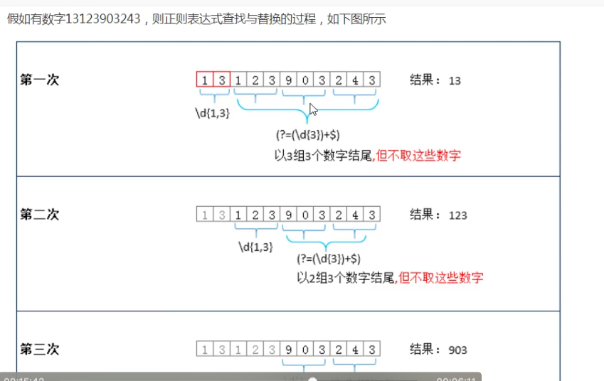

## 编写正则表达式
### 创建方式
```js
let str = 'hello';
let reg = /\d+/;
reg.test(str)
reg = new RegExp(“\\d+”) //必须要转译 \
```
### 正则表达式两部分
- 元字符
- 修饰符
```js
常用的元字符
//=> 1.量词元字符 设置出现的次数
* 0到多次
+ 1到多次
？零次或者1次
{n} 出现n次
{n,} 出现n到多次
{n,m} 出现n到m次
//=> 2.特殊元字符 单个或者组合在一起代表特殊的含义
\ 转译字符 普通->特殊->普通
. 除\n（换行符）以外的任意字符
^ 以哪一个元字符作为开始
$ 以哪一个元字符作为结束
\n 换行符
\d 0-9之间的一个数字
\D 非0-9之间的一个数字
\w 数字字母下划线中的任意一个字符
\s 一个空白字符 包括空格 制表符（tab4个空格） 换页符
\t 制表符 一个tab4个空格
\b 匹配一个单词的边界
x|y x或者y的一个字符 1|5|9
[xyz] x 或者y 或者z中的一个字符 
[^xy] 除了x y 以外的任意字符
[a-z] 指定a-z这个范围内的任意字符 [0-9a-zA-Z] === \w 数字字母下划线
[^a-z] 上一个的取反
() 正则中的分组符号
(?:) 只匹配不捕获
(?=) 正向预查
(?!) 负向预查

// =>3.普通元字符 代表本身含义的
/zhufeng/ 此正则匹配的就死 ‘正则’
```
```js
/* 正则表达式常用的修饰符*/
i => ignoremore 忽略单词大小写匹配
m => multiline 可以进行多行匹配
g => global 全局匹配
```
## 元字符详细解析
^ $ 
```js
//=> ^/$ 两个都不加 包含符合规则的内容即可
let reg1 = /\d+/
//=> ^/$ 两个都加 只能是符合规则一致的内容
let reg2 = /^\d+$/
//=> 举例 手机号
reg = /^1\d{10}$/ 
```
\ 把特殊符号转换成普通的
```js
. 不是小数点 .除\n 外的任意字符
let reg = /^2.3$/
let reg = /^2\.3$/ 只能是2.3
let str = "\d"
//字符串 中 \ 就是把字符转译到
str = 'zhu\nfeng' 这样会有一个换行符
str = 'zhu\\nfeng' 这样才会出现一个\n

```
x|y 

```js
let reg = /^18|29$/;
console.log(reg.test("18")) //true
console.log(reg.test("29"))//true
console.log(reg.test("182"))//true
console.log(reg.test("189"))//true
console.log(reg.test("1829"))//true
console.log(reg.test("182"))//true
// ---- 直接 x|y 会存在很乱的优先级问题 一般我们写的时候都伴随着小括号进行小括号进行分组 因为小括号会改变优先级问题
let reg = /^(18|29)$/; 只能是18 或者 29
console.log(reg.test("18")) //true
console.log(reg.test("29"))//false
console.log(reg.test("182"))//false
console.log(reg.test("189"))//false
console.log(reg.test("1829"))//false
console.log(reg.test("182"))//false
```
[]
```js
//1.[] 中括号中出现的字符一般都代表本身的含义

let reg = /^[@+]+$/; //这里的 + 号就表示的就是 + 号
console.log(reg.test('@@')) //true
console.log(reg.test('+'))

reg = /^[\d]$/;//  \d 在括号中还代表0-9
console.log(reg.test("d")); //false
console.log(reg.test("\\")); //false
console.log(reg.test("9"));//true

reg = /^[\\d]$/;//  \d 在括号中还代表0-9
console.log(reg.test("d")); //true
console.log(reg.test("\\")); //true
console.log(reg.test("9"));//flase

//2. [] 中不存在多位数
reg = /^[18]$/;
console.log(reg.test("1"));//true
console.log(reg.test("8"));//true
console.log(reg.test("18"));//false
reg = /^[10-29]$/ // 1 或者 0-2 或者 9 

//写一个 10 -29 之间的值

```
## 常用的正则表达式

- 1.验证是否为有效数字
/**
 * 规则分析  
 * 
 * 可能出现+-号 也可能不出现 [+-]? 
 * 一位0-9都可以 多位首位不能为0 (\d|([1-9])\d+)
 * 小数部分可能有可能没有 一旦有必须有小数点+数字 (\.\d+)?
 * /
```js
0 1 12.5 -1 09 -13.5 =9 +9

let reg = /^[+-]?(\d|([1-9])\d+)(\.\d+)?$/
console.log(reg.test("1"))
console.log(reg.test("1.8"))
console.log(reg.test("09"))
```
- 2.验证密码
```js
//数字 字母 下划线 6 - 16位
let reg = /^\w{6,16}$/

```
- 3.验证真实姓名 /^[\u4E00-\u9FA5]$/ 验证汉字
```js
1.汉字
2.名字长度2-10位
3.可能有译名 2——10
let reg = /^[\u4E00-\u9FA5]{2,10}(·[\u4E00-\u9FA5]{2,10})?$/

//尼古拉斯·赵四
```
- 4.验证邮箱
```js
let reg = /^\w+((-\w+)|(\.\w+))*@[A-Za-z0-9]+((\.|-)[A-Za-z0-9]+)*\.[A-Za-z0-9]+$/


//=>  ^\w+((-\w+)|(\.\w+))*  
1.开头是数字字母下划线（1到多位）
2.还可以是 - 数字字母下划线 或者. 数字字母下划线 整体0-多次
3.邮箱可以由数字 字母 下划线 - . 几部分组成 - . / 不能作为开头 也不能连续出现
//=>[A-Za-z0-9]+
1.@ 后面紧跟着 数字 字母 1到多位
// => ((\.|-)[A-Za-z0-9]+)*  
@xxx.com.cn 
@zhufeng-pei-xun-office.com 企业域名 

//=>  \.[A-Za-z0-9]+
.com .cn .org .edu .net .vip 最后的才是为了匹配域名
```
5.身份证号码

1.最多18位
2.最后一个可能是x
身份证 前六位 省市县 
中间8位是年月日 
最后四位
最后一位 是 x 或者数字
倒数第二位 偶数女 奇数 男
其余的都是算法都是算出来的 411521 1992 0314 675x
```js
reg = /^\d{17}(\d|x)$/
() 小括号 分组的第二个作用 把大正则的信息匹配到 还能单独捕获每个小分组的内容
reg = /^(\d{6})(\d{4})(\d{2})(\d{2})\d{2}(\d)(\d|x)$/
reg.exec('41152119920314675x') //捕获的结果是数组 包含每一个小分组单独获取的内容
//["41152119920314675x", "411521", "1992", "03", "14", "5", "x"]
//
```
## 构造函数创建正则 可以拼接变量 两个斜杠之间的都是元字符
```js
//=> 构造函数传的是字符串 \d需要转译 \\d 
let type = "zhufeng"
let reg = /\d+/g;
reg = new RegExp("\\d+", "g")
//=> 两个斜杠中间包起来的都是元字符
reg = /^@"+type+"@$/ //这里拼接没有效果
console.log(reg.test("@zhufeng@")) //false
console.log(reg.test('@""typeee"@')) //true
reg = new RegExp("^@"+type+"@$") //正则里面可以拼接变量
console.log(reg.test("@zhufeng@")) //true
console.log(reg.test('@""typeee""@')) //false
```
## 正则捕获

> 实现正则捕获的方法
- 正则RegExp.prototype 上的方法
 - exec
 - test

- 字符串String.prototype上的方法
 - replace
 - match
 - split
 ...
### 正则捕获的懒惰性 
**默认只捕获第一个，原因lastIndex的值不会被修改，每一次都是从字符串0开始位置查找，所以永远是第一个,设置全局匹配修饰符g 第一次捕获完 lastIndex自己会修改**
```js
/*
基于exec实现正则的捕获
1.捕获到的结果是null或者是一个数组 捕获不到就是null
第一项：本次捕获到的内容
其余项 对应小分组本次单独捕获的内容
index:当前捕获内容在字符串中的起始索引
input:原始字符串
2. 每执行一次exec只能捕获到一个符合正则规则的，但是默认情况下 执行100遍 获取的结果永远都是第一个匹配到的 其余的捕获不到
*/
let str = 'zhufeng2019yangfan2020qihang2021';
let reg = /^\d+/; //
console.log(reg.test(str));//false
console.log(reg.exec(str)); // null
let str = 'zhufeng2019yangfan2020qihang2021';
let reg = /\d+/g; //
console.log(reg.test(str));//true
console.log(reg.exec(str)); // ["2019", index: 7, input: "zhufeng2019yangfan2020qihang2021", groups: undefined]
console.log(reg.lastIndex) //11
console.log(reg.exec(str)); // 2020
console.log(reg.lastIndex)//22
 console.log(reg.exec(str));//2021
 console.log(reg.lastIndex)//32
  console.log(reg.exec(str));//null 当全部捕获完之后 lastIndex变成0 再重新捕获
 console.log(reg.lastIndex)//0
// => 编写一个 execAll 执行一次可以把所有匹配的结果都捕获到 前提/g
```
```js
// => 这种写法会有问题哦~~
let reg = /\d+/g
if (reg.test(str)) { //这里会改变lastIndex的值
    console.log(reg.exec(str))// 2020
}

```
### 全部捕获 可用字符串的方法
**正则原型没有全部捕获的方法，但是String match可以全部捕获**
```js
//字符串match 源码
let reg = /\d+/g
function execAll(str = "") {
  //this RegExp 正则实例
  if(!this.global) return this.exec(str);

  //验证当前正则是否设置了g 否则会死循环
  let ary = [], //存储每次的结果
    res = this.exec(str);
  while (res) {
    ary.push(res[0]); //存储每次捕获的内容
    res = this.exec(str);
  }
  return ary.length === 0 ? null : ary;
}
RegExp.prototype.execAll = execAll;

console.log(reg.execAll("zhufeng2019yangfan2020qihang2021"));
let reg = /\d+/g
console.log("zhuf2019@2020".match(reg)); //源码在上面
```
## 正则捕获的贪婪性
**正则捕获的贪婪性，默认情况下 正则捕获的时候 是按照当前正则所匹配的最长结果来获取的，？取消贪婪性 在量词元字符后面设置？取消捕获时候的贪婪性**

```js
let str = "珠峰@2019@2020培训";
let reg = /\d+/g; //1到多个连续出现的数字
console.log(str.match(reg)); //["2019", "2020"]
let reg = /\d+?/g; //1到多个连续出现的数字
console.log(str.match(reg)); //["2", "0", "1", "9", "2", "0", "2", "0"]

```
- ？左边是非量词元字符：本身代表量词元字符，出现0-1次
- 问号左边是量词元字符 取消捕获的贪婪性
- （?:） 只匹配不捕获
- （?=) 正向预查
- (?!) 负向预查

## 其他正则捕获的方法

### test也能捕获 本意是匹配
  $1 - $9 获取当前本次正则匹配后 第一个到第9个分组的信息
  项目中一般不怎么用 因为用的RegExp的方法
```js
let str = "{0}年{1}月{2}日"
let reg = /\{(\d+)}/g
console.log(reg.test(str));
console.log(RegExp.$1);
console.log(reg.test(str));
console.log(RegExp.$1);
console.log(reg.test(str));
console.log(RegExp.$1);
console.log(reg.test(str)); //false
console.log(RegExp.$1); // 2 存储的是上次捕获的结果
// $1 - $9 获取当前本次正则匹配后 第一个到第9个分组的信息
```
### replace 字符串中实现替换的方法 一般都是伴随正则使用的
```js
let str = 'zhufeng@2019|zhufeng@2020';
//把zhufeng替换成汉字
str = str.replace("zhufeng",'珠峰'); //不用正则 一次只能替换一次
str = str.replace(/zhufeng/g,'珠峰'); //不用正则 一次只能替换一次
str = 'zhufeng@2019|zhufeng@2020';
//把zhufeng替换成zhufengpeixun
str = str.replace("zhufeng",'zhufengpeixun').replace("zhufeng",'zhufengpeixun') //zhufengpeixunpeixun@2019|zhufeng@2020
let str = 'zhufeng@2019|zhufeng@2020';
str.replace(/zhufeng/g,'zhufengpeixun') //"zhufengpeixun@2019|zhufengpeixun@2020 因为下次寻找的lastIndex 改变了
```
### 案例 把时间字符串进行处理
```js
let time = "2019-08-13";
//=> 2019年8月13日
let reg = /^(\d{4})-(\d{1,2})-(\d{1,2})$/;

time = time.replace(reg,"$1年$2月$3日")

//原理步骤 [str].replace([reg],[function])
//1.首先拿Reg和time进行匹配捕获 能匹配到几次就会把传递的函数执行几次（匹配一次执行一次）
//2.不仅执行 还给replace还给方法传递了实参信息 exex捕获的内容一致的信息（大正则匹配的内容 小分组匹配的内容....）
// 3在函数中返回的是啥 就把当前匹配的内容替换成啥
let reg = /^(\d{4})-(\d{1,2})-(\d{1,2})$/;
let time = "2019-08-13";
time = time.replace(reg,(big,$1,$2,$3) => {
  //=> $1,$2,$3 是我们自己设置的变量
  console.log(big,$1,$2,$3) //2019-08-13 2019 08 13
})
time = time.replace(reg,(...args) => {
  //=> $1,$2,$3 是我们自己设置的变量
  let [,$1,$2,$3] = args;
  $2.length < 2 ? $2="0" + $2: null;
    $3.length < 2 ? $3="0" + $3: null;
  return $1+'年'+$2+'月'+$3+'日'
}) //2019年08月13日
```
## 单词首字母大写
```js
let str = 'good good study, day day up!';
//首字母大写
let reg = /\b([a-zA-z])[a-zA-z]*\b/g;
str = str.replace(reg,function(...args) { //函数执行6次
  let [content,$1] = args
  console.log(content) //content good
  $1 = $1.toUpperCase();
  content = content.substring(1); // content good
  return $1 + content;

})
```
### 常用案例
#### 1.验证一个字符串中哪个字符串出现次数最多 多少次
 - 去重
```js
let str= "zhufengpeixunzhoulaoshi";

let obj = {};
[].forEach.call(str,item => {
    console.log(item);
    if (typeof obj[char] !== 'undefined') return obj[char]++;
    obj[char] = 1;

})
let max = 1,res = [];
for(let key in obj) {
    let item = obj[key];
    item > max ? max = item : null;
}
for(let key in obj) {
    let item = obj[key];
    if (item === max) {
       res.push(key);
    }
}
console.log(`出现最多的字符是${res},出现了${max}次`)

```
  - 排序
```js
let str= "zhufengpeixunzhoulaoshi"; //可以使用localeCompare() 方法来实现中文按照拼音排序
str = str.split('').sort((a,b) => a.localeCompare(b)).join(''); //排序后的字符串
let reg = /([a-zA-Z])\1+/g ;//至少有一个跟他相同的
console.log(str.match(reg)); 
let ary = str.match(reg);
ary.sort((a,b) => b.length - a.length);
console.log(ary); // [ 'hhh', 'uuu','ee',  'ii', 'nn',  'oo', 'zz'  ]
let max = ary[0].length,
res = [ary[0].substr(0,1)];
for(let i = 1; i < ary.length;i++) {
    let item = ary[i];
    if (item.length < max) {
        break;
    }
    res.push(item.substr(0,1));
}
console.log(`出现最多的字符是:${res},出现了${max}次`)
```
```js
let str= "zhufengpeixunzzhoulaoshiii",
max = 0, res = [], flag = false;
str = str.split('').sort((a,b)=>a.localeCompare(b)).join('');
console.log(str) //aeefghhhiilnnoopsuuuxzz
//最多出现str.length次
for(let i = str.length; i> 0;i--) {
   let reg = new RegExp("([a-zA-Z])\\1{"+(i-1)+"}", "g"); //如果再其后面出现\1则是代表与第一个小括号中要匹配的内容相同。
   // i = 3 hhh uuu
   str.replace(reg, function(content,$1,$2) { //只要进这个函数 就不用向下匹配了
     res.push($1);
     max=i;
     flag = true;
   })
   if (flag) break;
}
console.log(`出现最多的字符是:${res},出现了${max}次`)

```
#### 2.时间格式化
let time = "2019-8-13 16:23:09"

//服务器获取的格式 

//2019-8-13 16:23:09

//2019/8/13 16:23:09

想要变成的
// 08月13日 16时51分
// 2019年08月13日 16时51分
```js
/**
 * formatTime:时间字符串个格式化处理
 * @params 
 * template:[string] 我们最后期望获取日期格式的模板
 * @return 
 * [string] 格式化后的时间字符串
 * by zy 
 */
~function() {
    function formatTime(template="{0}年{1}月{2}日 {3}时{4}分{5}秒") {
     let timeAry = this.match(/\d+/g);
     console.log(timeAry); //[ '2019', '8', '13', '16', '23', '9' ]
    return template.replace(/\{(\d+)\}/g,function(...[,$1]) {
        //console.log(content,$1) //[ '{0}', '0', 0, '{0}年{1}月{2}日 {3}时{4}分{5}秒']
        //content 大分组匹配的信息 $1 小分组匹配的信息 如果没有就用00补位
        let time = timeAry[$1] || "00";
       return time.length < 2 ? "0"+time : time;
     })
    }
    ['formatTime'].forEach(item => {
        String.prototype[item] = eval(item); //eval 把字符串变成表达式
    })

}();
let time = "19/8/13 17:9"
// String.prototype.formatTime =formatTime;
console.log(time.formatTime("{0}-{1}-{2} {3}:{4}:{5}"))
```
#### 3.url - queryURLParams
```js
/**
 * queryURLParams 获取url地址后面问号后面的参数信息 可能包括Hash值
 * @params
 * @return 
 *   [object] 把所有问号参数的信息以键值对的方式存储起来
 * by zy
 */
~function() {
    function queryURLParams() {
        let obj = {};
        let reg = /([^?=&#]+)=([^?=&#]+)/g //[[^?=&#]]  不能是 [^?=&#]
        this.replace(reg, (...[,$1,$2]) =>  obj[$1] = $2)
        this.replace(/#([^?=&#]+)/, (...[,$1]) => obj['HASH'] = $1)
        return obj;
    }
      
    ['queryURLParams'].forEach(item => {
        String.prototype[item] = eval(item); //eval 把字符串变成表达式
    })
}();
let url = "http://www.zhufengpeixun.cn/?1x=1&from=wx#video";
//=> {1x:1,from:'wx',HASH:"video"}
console.log(url.queryURLParams())
```

#### 4. 千位符
普通写法
```js
let num = '1564'; // 15,628,954
function millimeter(str) {
    str =  str.split('').reverse('').join('');
    for (let i = 2; i < str.length-1;i+=4) { //6
        let prev = str.substring(0,i+1),
        next = str.substring(i+1);
        str = prev + ',' + next;  // 459,826,15
    }
    return str.split('').reverse('').join('');
}
console.log(millimeter(num))

```
```js
function millimeter(str) {
    return str.replace(/\d{1,3}(?=(\d{3})+$)/g,(...args)=> {
      console.log(args);
      const [content] = args; //[ '12', '678', 0, '12345678' ] [ '345', '678', 2, '12345678' ]
      return content + ',';
    }) //正向预查 条件符合不捕获  ？！条件不符合
   //当前正则捕获15 
}
console.log(millimeter('12345678'))
```

