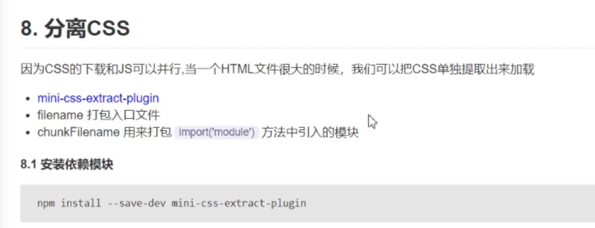
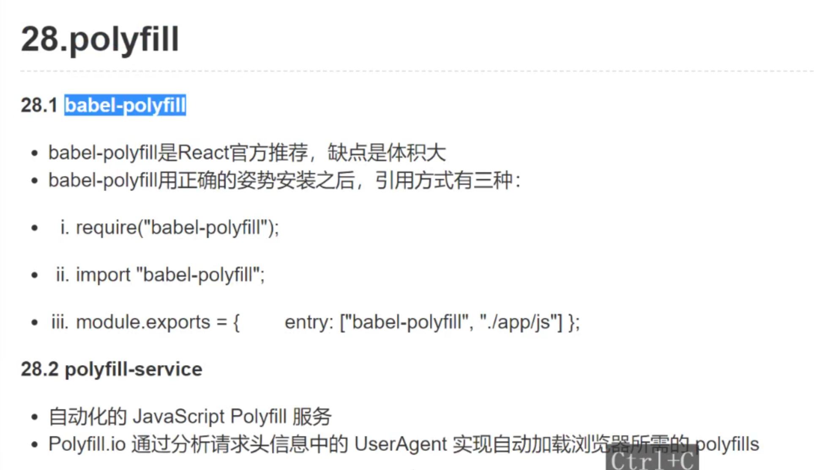
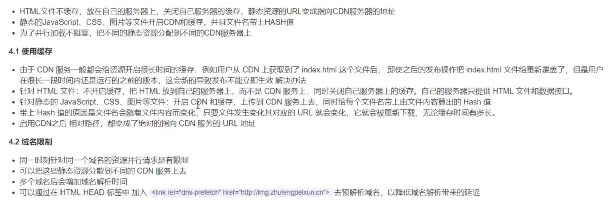

#   1.基础应用

## 1.概念


对比 [Node.js 模块](https://nodejs.org/api/modules.html)，webpack *模块*能够以各种方式表达它们的依赖关系，几个例子如下：

- [ES2015 `import`](https://developer.mozilla.org/en-US/docs/Web/JavaScript/Reference/Statements/import) 语句
- [CommonJS](http://www.commonjs.org/specs/modules/1.0/) `require()` 语句
- [AMD](https://github.com/amdjs/amdjs-api/blob/master/AMD.md) `define` 和 `require` 语句
- css/sass/less 文件中的 [`@import` 语句](https://developer.mozilla.org/en-US/docs/Web/CSS/@import)。
- 样式(`url(...)`)或 HTML 文件(``)中的图片链接(image url)

mode

配置模式 启用webpack优化 三个选项

-  develompment
- production
- Node


## 2.webpack-dev-server

```js
devServer: {
    contentBase: path.resolve(__dirname, 'dist'), //产出文件的根目录
    port: 8080,
    host: 'localhost',
    compress: true //启用gizp压缩
},
```


## 3.html-webpack-plugin

```js
plugins: [
    //产出html文件
    new HtmlWebpackPlugin({
        template: "./src/index.html",
        filename: 'index.html',
        hash: true, //为了避免缓存，可以在产出的文件后面加hash值
        //chunks: ['common', 'index'], //指定引入的代码块  用的不多 感觉不好使
        //chunksSortMode: "manual" //对引入的代码块进行排序的模式
    })
]
```

## 4.loader


logo 最后被打包成fd5生成的hash值

 把图片拷贝到dist目录 更改了文件名 文件名被打包成fd5生成的hash值 


打包后的结果


file-loader  把文件拷贝过去 改一下文件名 变更路径 相对路径

url-loader是file-loader的增强

有些时候 需要一些内联 有些文件比较小 不需要生成文件

```js
url-loader需要传参 options: {limit: 10*1024}
url-loader 内置了file-loader
加载的图片小于10k 就转换成base64编码 内嵌到网页中去
```

## 5.clean-webpack-plugin

npm install --save-dev clean-webpack-plugin

const { CleanWebpackPlugin } **=** require('clean-webpack-plugin');

```
 plugins: [
        /**
         * All files inside webpack's output.path directory will be removed once, but the
         * directory itself will not be. If using webpack 4+'s default configuration,
         * everything under <PROJECT_DIR>/dist/ will be removed.
         * Use cleanOnceBeforeBuildPatterns to override this behavior.
         *
         * During rebuilds, all webpack assets that are not used anymore
         * will be removed automatically.
         *
         * See `Options and Defaults` for information
         */
        new CleanWebpackPlugin(),
    ],
```

## 6.分离css

mini-css-extract-plugin




```js
plugins:[
   new MiniCssExtractPlugin({
            filename: '[name].css', //name 代码块chunk的名字
            chunkFilename: '[id].css' //代码块的名字 在异步加载的时候用的 分割代码块然后异步加载
        }) //分离css
]
```

## 7.压缩js css


uglifyjs-webpack-plugin  terser-webpack-plugin optimize-css-assets-webpack-plugin

## 8.css js存放单独的目录


hash代表本次的编译 每编译一次就会产生新的文件

chunkhash代码块的hash  每个entry都会产生一个chunk

```js
entry: {
  vendor: ['react', 'react-dom'],
  index: 'src/index.js'
}
output: {
  filename: '[name].[hash:8]js'
}
//产生2个chunk vendor index 
index.html 设置不缓存
index.js 设置hash值 文件名变了 就请求新的资源 不用缓存的
vendor.js --- 放到cdn 实现缓存
默认情况：index.js改变了  vendor也会跟着改变
现在我不想让vendor改变 
1.chunkhash
 new MiniCssExtractPlugin({
            filename: '[name][hash][chunkhash].css', //name 代码块chunk的名字
            //chunkhash 只要打包后的模块有一个发生了变化 都会改变
            chunkFilename: '[id].css' //代码块的名字 在异步加载的时候用的 分割代码块然后异步加载
        }) //分离css
2.contenthash
new MiniCssExtractPlugin({
            filename: '[name][contenthash].css', //name 代码块chunk的名字
            //chunkhash 只要打包后的模块有一个发生了变化 都会改变
            chunkFilename: '[id].css' //代码块的名字 在异步加载的时候用的 分割代码块然后异步加载
        }) //分离css
```

## 9.html使用src


webpack4使用html-withimg-loader遇到问题

问题：图片路径会有default
`ERROR in Error: Parse Error:  <script type="text/javascript" src="bundle.js?588181ceb9662c845b90"></script></body> </html>`

解决方案：
file-loader升级以后，esModule参数默认为true，改为false即可

```javascript
{
                test: /\.(png|jpg|gif)$/,
                use: [
                    {
                        loader: 'file-loader',
                        options: {
                            esModule: false,
                            outputPath: 'assets'
                        },
                    },
                ],
            }
```

## 10.glob


## 11.less sass

```js
 {
                test: /\.less$/,
                // use: 'css-loader', //单个
                // 不用style-loader
                use: [MiniCssExtractPlugin.loader, 'css-loader', 'less-loader'] //从右向左
            },
            {
                test: /\.scss$/,
                // use: 'css-loader', //单个
                // 不用style-loader
                use: [MiniCssExtractPlugin.loader, 'css-loader','sass-loader'] //从右向左
            },
              
 //在css-loader 里使用less
               {
                test: /\.css$/,
                // use: 'css-loader', //单个
                // 不用style-loader
                use: [
                    MiniCssExtractPlugin.loader,
                    {
                        loader: 'css-loader',
                        options:{
                            importLoaders: 2
                             //0 no loader
                             //1 postcss-loader
                              //2 postcss-loader sass-loader
                             }
                    },
                        'postcss-loader',
                         'sass-loader'
                ] //从右向左
```


## 12.处理css前缀


```js
{
                test: /\.css$/,
                // use: 'css-loader', //单个
                // 不用style-loader
                use: [MiniCssExtractPlugin.loader, 'css-loader', 'postcss-loader'] //从右向左
            },
```

```js
postcss.config.js 默认文件名
module.exports = {
    plugins: [require('autoprefixer')]
}
.browserslistrc 配置的支持浏览器版本
# Browsers that we support

last 1 version
> 1%
maintained node versions
not dead
IE 6 # sorry

```

## 13.转译es6/es7


 ```js
{
  "presets":[
    "@babel/preset-env",
    "@babel/preset-react"
  ],
  "plugins":[
    ["@babel/plugin-proposal-decorators", { "legacy": true }], //旧的写法
    [ "@babel/plugin-proposal-class-properties",{"loose": true}], //松散的模式
    ["@babel/plugin-transform-runtime", {
      "corejs": false,
      "helpers": true,
      "regenerator": true,
      "useESModules": true
    }]
  ]
}

 ```


## 14.babel-run-time


申明类的时候 每个类都引用了共同的方法


## 15.eslint


npm i eslint-config-airbnb eslint-plugin-import eslint-plugin-react eslint-plugin-react-hooks eslint-plugin-jsx-a11y -D

## 16.引入字体


## 17.如何调试


Webstorm配置 https://www.it610.com/article/1281976568083660800.htm


Cheap-module-source-map 源码不能调整列

eval 最快  不能调整源码  线上不能使用

----测试服务器 才能上传sourcr-map


安装compiler.jar

执行上述命令 ----

可以看一下网站了解


## 18.第三方库


```js
1. {
        test: require.resolve('jquery'),
        use: [{
          loader: 'expose-loader',
          options: '$'
        }]
      }

2. require("expose-loader?$!jquery");
暴露成全局变量 window.$ 也可以有

3. webpack
--externals
 externals: {
     'jquery': 'jQuery' //key是包的名字，值是jQuery 全局上的jQuery给了jquery
  },
    需要去index.html去手动添加cdn地址
4.利用插件 插件去帮我们自动写script标签
 new htmlWebpackExternalsPlugin({
      externals: [
        {
          module: 'jquery',
          entry: 'https://unpkg.com/jquery@3.2.1/dist/jquery.min.js',
          global: 'jQuery',
        },
      ],
    }),
```

## 19.watch


## 20.添加商标-拷贝静态文件


## 21服务器代理


```js
devServer: {
    contentBase: path.resolve(__dirname, 'dist'), // 产出文件的根目录
    port: 8080,
    host: 'localhost',
    compress: true,
      //dev-server内部就是一个express
      before() {
      app.get('/api/users', function(req,res) => {
              res.json([{}])
              })
    },
    proxy: {
      '/api':{ /api/users  ===>后台接口其实是/users
        target: 'http://localhost:3000',
        pathRewrite: ["^/api", ""]
      }
    },
}
```

## 22.webpack-dev-middleware

在node项目中集成一个webpack

```js
let express = require('express');
let app = express();
let webpackDevMiddleware = require('webpack-dev-middleware');
let webpackConfig = require('./webpack.config.js');
let webpack = require('webpack');
let compiler = webpack(webpackConfig);
//中间件到底做了什么?
/**
 * 1.启动编译 compiler.run
 * 2.有一个中间件 用来响应客户端对打包后的文件的请求
 */
app.use(webpackDevMiddleware(compiler, {}));
app.get('/users', function (req, res) {
  res.json([{id:1, name: 'zhufeng'}])
})
app.listen('3000')
//访问localhose:3000 能拿到客户端资源 没有跨域问题 可以直接上线
```


## 23.reslove

```js
  //定制一些查找文件的规则
  resolve: {
    extensions: ['.js','.jsx', '.vue', '.scss','.less', '.css'],
    alias:{
      //引入的时候 直接找你指定的路径 就不从按照node_modules规则找了
      'bootstrap': path.join(__dirname, 'node_modules/bootstrap/dist/css/bootstrap.css'),
    },
    //可以减少查找的路径 加快查找速度 可以自己添加查找路径
    modules: ['node_modules', 'zfmodules'],// 先从node_modules里面找 找不到 再找zfmath
    mainFields: ['style', 'browser', 'module', 'main'],
    mainFiles: ['base.js', 'index.js']
  }
```

 

mainFiles


## 24.noParse


## 25.definePlugin


会把这些变量和值挂载到全局上

## 26.IgnorePlugin


```js
//设置语言

//手动引入所需要的语言包
import 'moment/locale/zh-cn';

moment.locale('zh-cn'); //设置语言

let r = moment().endOf('day').fromNow();
console.log(r);
```

## 27.区分环境变量


```js
package.json
  "scripts": {
    "build": "webpack",
    "build:dev": "webpack --config webpack.base.js --env=development",
    "build:prod": "webpack --env=production",
  },
    --config指定配置文件
    可以传参
    webpack.config.js
    module.expoets = (env, argv) {
      mode: env
    }
    封装log
    let oldConsole = console.log
    console.log = function(...args) {
     
      if (process.env.NODE_ENV === 'development') {
         oldConsole.apply(console, args);
      }
    }
```


## 28.image-webpack-loader

压缩图片

```js
 {
        test: /\.(gif|png|jpe?g|svg)$/i,
        use: [
          {
            loader: 'url-loader',
            options: {
              esModule: false,
              limit: 10 * 1024, // 如果图片小于10k就转成base64
              outputPath: 'images',
              publicPath: '/images',
            }
          },
          {
            loader: 'image-webpack-loader',
            options: {
              mozjpeg: {
                progressive: true,
              },
              // optipng.enabled: false will disable optipng
              optipng: {
                enabled: false,
              },
              pngquant: {
                quality: [0.65, 0.90],
                speed: 4
              },
              gifsicle: {
                interlaced: false,
              },
              // the webp option will enable WEBP
              webp: {
                quality: 75
              }
            }
          }
        ]
      },
```

```js
如果安装报错 image-webpack-loader  EPIPE
应该装包丢失  用cnpm i 安装 就行
```

## 29.多页mpa


```js
建文件夹  src下 

entries   入口文件

pages 模板文件

webpack.config.js
const glob = require('glob');
const entryFiles = glob.sync('./src/entries/*.js');
// [
//   './src/entries/index.js',
//   './src/entries/index1.js',
//   './src/entries/index2.js'
// ]
  let entry = {};
let htmlWebpackPlugins = [];
entryFiles.forEach(entryFile => {
  // console.log(path.sep, '/');
  let entryName = path.basename(entryFile.split(path.sep).pop(), '.js');
  // console.log(path.basename(entryFile.split(path.sep).pop(), '.js'), 'pathname')
  entry[entryName] = entryFile;
  htmlWebpackPlugins.push(new HtmlWebpackPlugin({
    template: `./src/pages/${entryName}.html`,
    filename: `${entryName}.html`,
    // minify: false,
    // hash: true, // 为了避免缓存，可以在产出的文件后面加hash值
    chunks: [entryName], //指定引入的代码块  用的不多 感觉不好使
    // chunksSortMode: "manual" //对引入的代码块进行排序的模式
  }))
  //path.extname 扩展名
})
module.exports = {
  entry:entry,
  plugins: [
    ...htmlWebpackPlugins
  ]
}
？公共页面 chunks
```

## 29.日志优化


 **new** FriendlyErrorsWebpackPlugin(),

## 29.错误上报


## 30.日志输出


## 31.费时分析

speed-measure-webpack-plugin


## 32.webpack-bundle-analyzer


```js
const {BundleAnalyzerPlugin} = require('webpack-bundle-analyzer');
plugin:[
     new BundleAnalyzerPlugin({
      analyzerMode: 'disabled',
      generateStatsFile: true //是否生产stats文件
    })
]
配置脚本
{
 "script":{
    "generateAnalyzFile": "webpack --profile --json > stats.json",
    "analyz": "webpack-bundle-analyzer --port 8888 ./dist/stats.json"
 }
}
```

## 33.babel-polyfill

Babel-transform -runtime

Corejs 3包含promise 就不需要polyfill




推荐使用polyfill-service 会根据浏览器的版本下载浏览器需要的polyfill


Corejs 3包含promise 就不需要polyfill

## 34.libraryTarget 


 29.4 window

同this

29.5 libraryTarget: "umd"


## 35.npm 发布包

nrm use npm 切换到npm

npm login

npm search zhufenglibz  搜一下该包有没有人用 npm包名不能有大写

npm publish

.gitignore文件不能忽略dist要不然dist文件发布不上去

```js
 403 In most cases, you or one of your dependencies are requesting
npm ERR! 403 a package version that is forbidden by your security policy.
这个错误 ---一定要验证邮箱 才能发布自己的包
```


## 1.purgecss-webpack-plugin


## 2.cdn





## 3.rem

- 使用px2rem-loader
- 页面渲染时计算根元素的font-size
- Lib-flexible


```js
index.html
//计算font-size的大小
  let docEle = document.documentElement;
    function setRemUnit() {
        console.log(docEle, docEle.clientWidth / 10);
        // docEle.style.fontSize = docEle.clientWidth / 10 + 'px'
        docEle.style.fontSize = '10vw'  
    }
    setRemUnit();
    window.addEventListener('resize', setRemUnit);
一般会采用lib-flexible

```

```js
webpack.config.js
module: {
        rules: [
            {
                test: /\.css/,
                use: [
                    'style-loader',
                    'css-loader',
                    {
                        loader: "px2rem-loader",
                        options: {
                            remUnit: 75, //1rem = 75px 设计稿750px 1/10作为rem
                            remPrecision: 8 //除不尽 保留8位小数
                        }
                    }
                ], // 从右向左
            }
        ],
    },
      
      
```


## 4.内联资源

```js
<head>
    ${require('raw-loader!./meta.html').default}
    <style>
        /*!!忽略其他loader 如果不忽略会被ss-loader解析*/
        ${require('!!raw-loader!./index.css').default}
    </style>
    <!--    //要放到head里面-->
    <script>
        ${require('raw-loader!../node_modules/lib-flexible/flexible.js').default}
        // new htmlWebpackPlugin 可以识别 获取的代码给babel-loader raw-loader!babel-loader
        // 再给raw-loader (简单获取啥就显示到这个地方就行了)
    </script>
    <title>Document</title>

</head><head>
    ${require('raw-loader!./meta.html').default}
    <style>
        /*!!忽略其他loader 如果不忽略会被ss-loader解析*/
        ${require('!!raw-loader!./index.css').default}
    </style>
    <!--    //要放到head里面-->
    <script>
        ${require('raw-loader!../node_modules/lib-flexible/flexible.js').default}
        // new htmlWebpackPlugin 可以识别 获取的代码给babel-loader raw-loader!babel-loader
        // 再给raw-loader (简单获取啥就显示到这个地方就行了)
    </script>
    <title>Document</title>

</head>
```

# 2.优化

## 1.DLL


```js
webpack.dll.config
module.exports = {
    mode:'development',
    entry: {
        react: ['react', 'react-dom']
    },//希望把这些第三方库文件进行单独打包提高主文件的打包速度
    output:{
        path: path.resolve(__dirname, 'dist'),
        filename: '[name].dll.js',//会打包出来 react.dll.js
        library: '_dll_[name]',//指定导出的名字 _dll_react
        //libraryTarget: "var"默认
    },
    plugins: [
        new webpack.DllPlugin({
            name: '_dll_[name]', //跟上面libary一样
            path: path.resolve(__dirname, 'dist', '[name].manifest.json')
        })
    ]
}
webpack.config.js
plugins:[
   new webpack.DllReferencePlugin({
            manifest: path.resolve(__dirname, 'dist', 'react.manifest.json')
        })
  //如果有多个就new 多个
]
//先 npm run dll 配置命令  "dll": "webpack --config webpack.dll.config.js"
index.html 需要手动引入
<script src="react.dll.js"></script>
//然后import 
```

## 2.tree-shaking


## 3.scope hoisting


#### 4.热更新


## 4.split-chunks

```js

  optimization: {
    splitChunks: {
      cacheGroups: {
        vendors: {
          chunks: 'initial'//指定分割的类型 all async initial
          name: 'vendors',//代码块的名字
          test: /node_modules/,
          priority: -10 优先级
        },
        react: {
           chunks: 'initial'，
           name: 'commons',
             minsize:0,
               minChunks:2， //引用2次被打包到common
          priority: -20
        }
      }
    }
  },
```


