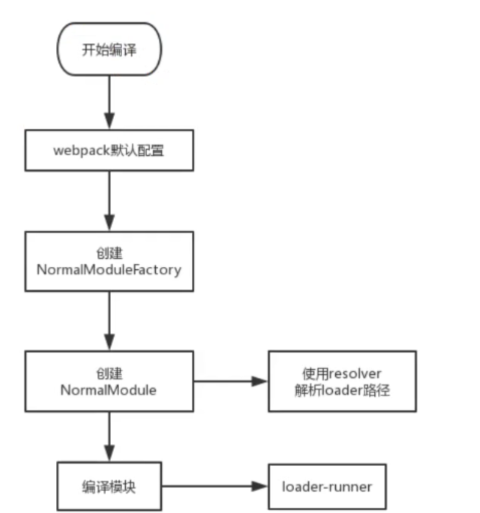

## webpack原理

### 1.webpack插件机制


### 2.tapable分类


Webpack 本质上是一种事件流的机制，它的工作流程就是将各个插件串联起来，而实现这一切的核心就是 `tapable`，Webpack 中最核心的，负责编译的 `Compiler` 和负责创建 `bundles` 的 `Compilation` 都是 `tapable` 构造函数的实例。

打开 Webpack `4.0` 的源码中一定会看到下面这些以 `Sync`、`Async` 开头，以 `Hook` 结尾的方法，这些都是 `tapable` 核心库的类，为我们提供不同的事件流执行机制，我们称为 “钩子”。


```js
// 引入 tapable 如下
const {
    SyncHook,
    SyncBailHook,
    SyncWaterfallHook,
    SyncLoopHook,
    AsyncParallelHook,
    AsyncParallelBailHook,
    AsyncSeriesHook,
    AsyncSeriesBailHook,
    AsyncSeriesWaterfallHook
 } = require("tapable");
```

*
上面的实现事件流机制的 “钩子” 大方向可以分为两个类别，“同步” 和 “异步”，“异步” 又分为两个类别，“并行” 和 “串行”，而 “同步” 的钩子都是串行的。

## Sync 类型的钩子

### 1、SyncHook

SyncHook 为串行同步执行，不关心事件处理函数的返回值，在触发事件之后，会按照事件注册的先后顺序执行所有的事件处理函数。

```js
// SyncHook 钩子的使用
const { SyncHook } = require("tapable");

// 创建实例
let syncHook = new SyncHook(["name", "age"]);

// 注册事件
syncHook.tap("1", (name, age) => console.log("1", name, age));
syncHook.tap("2", (name, age) => console.log("2", name, age));
syncHook.tap("3", (name, age) => console.log("3", name, age));

// 触发事件，让监听函数执行
syncHook.call("panda", 18);

// 1 panda 18
// 2 panda 18
// 3 panda 18
```
在 `tapable` 解构的 `SyncHook` 是一个类，注册事件需先创建实例，创建实例时支持传入一个数组，数组内存储事件触发时传入的参数，实例的 `tap` 方法用于注册事件，支持传入两个参数，第一个参数为事件名称，在 Webpack 中一般用于存储事件对应的插件名称（名字随意，只是起到注释作用）， 第二个参数为事件处理函数，函数参数为执行 `call` 方法触发事件时所传入的参数的形参。


模拟 SyncHook 类
```js
class SyncHook {
    constructor(args) {
        this.args = args;
        this.tasks = [];
    }
    tap(name, task) {
        this.tasks.push(task);
    }
    call(...args) {
        // 也可在参数不足时抛出异常
        if (args.length < this.args.length) throw new Error("参数不足");

        // 传入参数严格对应创建实例传入数组中的规定的参数，执行时多余的参数为 undefined
        args = args.slice(0, this.args.length);

        // 依次执行事件处理函数
        this.tasks.forEach(task => task(...args));
    }
}```

`tasks` 数组用于存储事件处理函数，`call` 方法调用时传入参数超过创建 `SyncHook` 实例传入的数组长度时，多余参数可处理为 `undefined`，也可在参数不足时抛出异常，不灵活，后面的例子中就不再这样写了。

### 2、SyncBailHook

`SyncBailHook` 同样为串行同步执行，如果事件处理函数执行时有一个返回值不为空（即返回值为 `undefined`），则跳过剩下未执行的事件处理函数（如类的名字，意义在于保险）。

只要返回一个不为undefined 的值 就不执行后续 的

```js
// SyncBailHook 钩子的使用
const { SyncBailHook } = require("tapable");

// 创建实例
let syncBailHook = new SyncBailHook(["name", "age"]);

// 注册事件
syncBailHook.tap("1", (name, age) => console.log("1", name, age));

syncBailHook.tap("2", (name, age) => {
    console.log("2", name, age);
    return "2";
});

syncBailHook.tap("3", (name, age) => console.log("3", name, age));

// 触发事件，让监听函数执行
syncBailHook.call("panda", 18);

// 1 panda 18
// 2 panda 18
复制代码
```

通过上面的用法可以看出，`SyncHook` 和 `SyncBailHook` 在逻辑上只是 `call` 方法不同，导致事件的执行机制不同，对于后面其他的 “钩子”，也是 `call` 的区别，接下来实现 `SyncBailHook` 类。


```js
// 模拟 SyncBailHook 类
class SyncBailHook {
    constructor(args) {
        this.args = args;
        this.tasks = [];
    }
    tap(name, task) {
        this.tasks.push(task);
    }
    call(...args) {
        // 传入参数严格对应创建实例传入数组中的规定的参数，执行时多余的参数为 undefined
        args = args.slice(0, this.args.length);

        // 依次执行事件处理函数，如果返回值不为空，则停止向下执行
        let i = 0, ret;
        do {
            ret = this.tasks[i++](...args);
        } while (!ret);
    }
}
```
在上面代码的 `call` 方法中，我们设置返回值为 `ret`，第一次执行后没有返回值则继续循环执行，如果有返回值则立即停止循环，即实现 “保险” 的功能。

### 3、SyncWaterfallHook

`SyncWaterfallHook` 为串行同步执行，上一个事件处理函数的返回值作为参数传递给下一个事件处理函数，依次类推，正因如此，只有第一个事件处理函数的参数可以通过 `call` 传递，而 `call` 的返回值为最后一个事件处理函数的返回值。

如果上一个函数有返回值 则传给下一个函数 如果没有返回值 则找上一个函数的返回值

```typescript jsx
// SyncWaterfallHook 钩子的使用
const { SyncWaterfallHook } = require("tapable");

// 创建实例
let syncWaterfallHook = new SyncWaterfallHook(["name", "age"]);

// 注册事件
syncWaterfallHook.tap("1", (name, age) => {
    console.log("1", name, age);
    return "1";
});

syncWaterfallHook.tap("2", data => {
    console.log("2", data);
    return "2";
});

syncWaterfallHook.tap("3", data => {
    console.log("3", data);
    return "3"
});

// 触发事件，让监听函数执行
let ret = syncWaterfallHook.call("panda", 18);
console.log("call", ret);

// 1 panda 18
// 2 1
// 3 2
// call 3
```

`SyncWaterfallHook` 名称中含有 “瀑布”，通过上面代码可以看出 “瀑布” 形象生动的描绘了事件处理函数执行的特点，与 `SyncHook` 和 `SyncBailHook` 的区别就在于事件处理函数返回结果的流动性，接下来看一下 `SyncWaterfallHook` 类的实现。


```js
// 模拟 SyncWaterfallHook 类
class SyncWaterfallHook {
    constructor(args) {
        this.args = args;
        this.tasks = [];
    }
    tap(name, task) {
        this.tasks.push(task);
    }
    call(...args) {
        // 传入参数严格对应创建实例传入数组中的规定的参数，执行时多余的参数为 undefined
        args = args.slice(0, this.args.length);

        // 依次执行事件处理函数，事件处理函数的返回值作为下一个事件处理函数的参数
        let [first, ...others] = this.tasks;
        return reduce((ret, task) => task(ret), first(...args));
    }
}
复制代码
```

上面代码中 `call` 的逻辑是将存储事件处理函数的 `tasks` 拆成两部分，分别为第一个事件处理函数，和存储其余事件处理函数的数组，使用 `reduce` 进行归并，将第一个事件处理函数执行后的返回值作为归并的初始值，依次调用其余事件处理函数并传递上一次归并的返回值。

### 4、SyncLoopHook

`SyncLoopHook` 为串行同步执行，事件处理函数返回 `true` 表示继续循环，即循环执行当前事件处理函数，返回 `undefined` 表示结束循环，`SyncLoopHook` 与 `SyncBailHook` 的循环不同，`SyncBailHook` 只决定是否继续向下执行后面的事件处理函数，而 `SyncLoopHook` 的循环是指循环执行每一个事件处理函数，直到返回 `undefined` 为止，才会继续向下执行其他事件处理函数，执行机制同理。

注意 如果返回的不是undefined 则函数重头再执行一遍

```js
// SyncLoopHook 钩子的使用
const { SyncLoopHook } = require("tapable");

// 创建实例
let syncLoopHook = new SyncLoopHook(["name", "age"]);

// 定义辅助变量
let total1 = 0;
let total2 = 0;

// 注册事件
syncLoopHook.tap("1", (name, age) => {
    console.log("1", name, age, total1);
    return total1++ < 2 ? true : undefined;
});

syncLoopHook.tap("2", (name, age) => {
    console.log("2", name, age, total2);
    return total2++ < 2 ? true : undefined;
});

syncLoopHook.tap("3", (name, age) => console.log("3", name, age));

// 触发事件，让监听函数执行
syncLoopHook.call("panda", 18);

// 1 panda 18 0
// 1 panda 18 1
// 1 panda 18 2
// 2 panda 18 0
// 2 panda 18 1
// 2 panda 18 2
// 3 panda 18

```

***通过上面的执行结果可以清楚的看到 `SyncLoopHook` 的执行机制，但有一点需要注意，返回值必须严格是 `true` 才会触发循环，多次执行当前事件处理函数，必须严格返回 `undefined`，才会结束循环，去执行后面的事件处理函数，如果事件处理函数的返回值不是 `true` 也不是 `undefined`，则会死循环。\***

在了解 `SyncLoopHook` 的执行机制以后，我们接下来看看 `SyncLoopHook` 的 `call` 方法是如何实现的。


```js
// 模拟 SyncLoopHook 类
class SyncLoopHook {
    constructor(args) {
        this.args = args;
        this.tasks = [];
    }
    tap(name, task) {
        this.tasks.push(task);
    }
    call(...args) {
        // 传入参数严格对应创建实例传入数组中的规定的参数，执行时多余的参数为 undefined
        args = args.slice(0, this.args.length);

        // 依次执行事件处理函数，如果返回值为 true，则继续执行当前事件处理函数
        // 直到返回 undefined，则继续向下执行其他事件处理函数
        this.tasks.forEach(task => {
            let ret;
            do {
                ret = this.task(...args);
            } while (ret === true || !(ret === undefined));
        });
    }
}
复制代码
```

在上面代码中可以看到 `SyncLoopHook` 类 `call` 方法的实现更像是 `SyncHook` 和 `SyncBailHook` 的 `call` 方法的结合版，外层循环整个 `tasks` 事件处理函数队列，内层通过返回值进行循环，控制每一个事件处理函数的执行次数。

***注意：在 Sync 类型 “钩子” 下执行的插件都是顺序执行的，只能使用 `tab` 注册。\***

------

## Async 类型的钩子

***`Async` 类型可以使用 `tap`、`tapSync` 和 `tapPromise` 注册不同类型的插件 “钩子”，分别通过 `call`、`callAsync` 和 `promise` 方法调用，我们下面会针对 `AsyncParallelHook` 和 `AsyncSeriesHook` 的 `async` 和 `promise` 两种方式分别介绍和模拟。\***

### 1、AsyncParallelHook

`AsyncParallelHook` 为异步并行执行，通过 `tapAsync` 注册的事件，通过 `callAsync` 触发，通过 `tapPromise` 注册的事件，通过 `promise` 触发（返回值可以调用 `then` 方法）。

#### (1) tapAsync/callAsync

`callAsync` 的最后一个参数为回调函数，在所有事件处理函数执行完毕后执行。

```js

// AsyncParallelHook 钩子：tapAsync/callAsync 的使用
const { AsyncParallelHook } = require("tapable");

// 创建实例
let asyncParallelHook = new AsyncParallelHook(["name", "age"]);

// 注册事件
console.time("time");
asyncParallelHook.tapAsync("1", (name, age, done) => {
    settimeout(() => {
        console.log("1", name, age, new Date());
        done();
    }, 1000);
});

asyncParallelHook.tapAsync("2", (name, age, done) => {
    settimeout(() => {
        console.log("2", name, age, new Date());
        done();
    }, 2000);
});

asyncParallelHook.tapAsync("3", (name, age, done) => {
    settimeout(() => {
        console.log("3", name, age, new Date());
        done();
        console.timeEnd("time");
    }, 3000);
});

// 触发事件，让监听函数执行
asyncParallelHook.callAsync("panda", 18, () => {
    console.log("complete");
});

// 1 panda 18 2018-08-07T10:38:32.675Z
// 2 panda 18 2018-08-07T10:38:33.674Z
// 3 panda 18 2018-08-07T10:38:34.674Z
// complete
// time: 3005.060ms
```

***异步并行是指，事件处理函数内三个定时器的异步操作最长时间为 `3s`，而三个事件处理函数执行完成总共用时接近 `3s`，所以三个事件处理函数是几乎同时执行的，不需等待。\***

所有 `tabAsync` 注册的事件处理函数最后一个参数都为一个回调函数 `done`，每个事件处理函数在异步代码执行完毕后调用 `done` 函数，则可以保证 `callAsync` 会在所有异步函数都执行完毕后执行，接下来看一看 `callAsync` 是如何实现的。

```js
// 模拟 AsyncParallelHook 类：tapAsync/callAsync
class AsyncParallelHook {
    constructor(args) {
        this.args = args;
        this.tasks = [];
    }
    tabAsync(name, task) {
        this.tasks.push(task);
    }
    callAsync(...args) {
        // 先取出最后传入的回调函数
        let finalCallback = args.pop();

        // 传入参数严格对应创建实例传入数组中的规定的参数，执行时多余的参数为 undefined
        args = args.slice(0, this.args.length);

        // 定义一个 i 变量和 done 函数，每次执行检测 i 值和队列长度，决定是否执行 callAsync 的回调函数
        let i = 0;
        let done = () => {
            if (++i === this.tasks.length) {
                finalCallback();
            }
        };

        // 依次执行事件处理函数
        this.tasks.forEach(task => task(...args, done));
    }
}
```

在 `callAsync` 中，将最后一个参数（所有事件处理函数执行完毕后执行的回调）取出，并定义 `done` 函数，通过比较 `i` 和存储事件处理函数的数组 `tasks` 的 `length` 来确定回调是否执行，循环执行每一个事件处理函数并将 `done` 作为最后一个参数传入，所以每个事件处理函数内部的异步操作完成时，执行 `done` 就是为了检测是不是该执行 `callAsync` 的回调，当所有事件处理函数均执行完毕满足 `done` 函数内部 `i` 和 `length` 相等的条件时，则调用 `callAsync` 的回调。

#### (2) tapPromise/promise

要使用 `tapPromise` 注册事件，对事件处理函数有一个要求，必须返回一个 Promise 实例，而 `promise` 方法也返回一个 Promise 实例，`callAsync` 的回调函数在 `promise` 方法中用 `then` 的方式代替。

```js
// AsyncParallelHook 钩子：tapPromise/promise 的使用
const { AsyncParallelHook } = require("tapable");

// 创建实例
let asyncParallelHook = new AsyncParallelHook(["name", "age"]);

// 注册事件
console.time("time");
asyncParallelHook.tapPromise("1", (name, age) => {
    return new Promise((resolve, reject) => {
        settimeout(() => {
            console.log("1", name, age, new Date());
            resolve("1");
        }, 1000);
    });
});

asyncParallelHook.tapPromise("2", (name, age) => {
    return new Promise((resolve, reject) => {
        settimeout(() => {
            console.log("2", name, age, new Date());
            resolve("2");
        }, 2000);
    });
});

asyncParallelHook.tapPromise("3", (name, age) => {
    return new Promise((resolve, reject) => {
        settimeout(() => {
            console.log("3", name, age, new Date());
            resolve("3");
            console.timeEnd("time");
        }, 3000);
    });
});

// 触发事件，让监听函数执行
asyncParallelHook.promise("panda", 18).then(ret => {
    console.log(ret);
});

// 1 panda 18 2018-08-07T12:17:21.741Z
// 2 panda 18 2018-08-07T12:17:22.736Z
// 3 panda 18 2018-08-07T12:17:23.739Z
// time: 3006.542ms
// [ '1', '2', '3' ]
```

上面每一个 `tapPromise` 注册事件的事件处理函数都返回一个 Promise 实例，并将返回值传入 `resolve` 方法，调用 `promise` 方法触发事件时，如果所有事件处理函数返回的 Promise 实例结果都成功，会将结果存储在数组中，并作为参数传递给 `promise` 的 `then` 方法中成功的回调，如果有一个失败就是将失败的结果返回作为参数传递给失败的回调。


```js
// 模拟 AsyncParallelHook 类 tapPromise/promise
class AsyncParallelHook {
    constructor(args) {
        this.args = args;
        this.tasks = [];
    }
    tapPromise(name, task) {
        this.tasks.push(task);
    }
    promise(...args) {
        // 传入参数严格对应创建实例传入数组中的规定的参数，执行时多余的参数为 undefined
        args = args.slice(0, this.args.length);

        // 将所有事件处理函数转换成 Promise 实例，并发执行所有的 Promise
        return Promise.all(this.tasks.map(task => task(...args)));
    }
}
复制代码
```

其实根据上面对于 `tapPromise` 和 `promise` 使用的描述就可以猜到，`promise` 方法的逻辑是通过 `Promise.all` 来实现的。

### 2、AsyncSeriesHook

`AsyncSeriesHook` 为异步串行执行，与 `AsyncParallelHook` 相同，通过 `tapAsync` 注册的事件，通过 `callAsync` 触发，通过 `tapPromise` 注册的事件，通过 `promise` 触发，可以调用 `then` 方法。

#### (1) tapAsync/callAsync

与 `AsyncParallelHook` 的 `callAsync` 方法类似，`AsyncSeriesHook` 的 `callAsync` 方法也是通过传入回调函数的方式，在所有事件处理函数执行完毕后执行 `callAsync` 的回调函数。


```js
// AsyncSeriesHook 钩子：tapAsync/callAsync 的使用
const { AsyncSeriesHook } = require("tapable");

// 创建实例
let asyncSeriesHook = new AsyncSeriesHook(["name", "age"]);

// 注册事件
console.time("time");
asyncSeriesHook.tapAsync("1", (name, age, next) => {
    setTimeout(() => {
        console.log("1", name, age, new Date());
        next();
    }, 1000);
});

asyncSeriesHook.tapAsync("2", (name, age, next) => {
    setTimeout(() => {
        console.log("2", name, age, new Date());
        next();
    }, 2000);
});

asyncSeriesHook.tapAsync("3", (name, age, next) => {
    setTimeout(() => {
        console.log("3", name, age, new Date());
        next();
        console.timeEnd("time");
    }, 3000);
});

// 触发事件，让监听函数执行
asyncSeriesHook.callAsync("panda", 18, () => {
    console.log("complete");
});


// 1 panda 18 2018-08-07T14:40:52.896Z
// 2 panda 18 2018-08-07T14:40:54.901Z
// 3 panda 18 2018-08-07T14:40:57.901Z
// complete
// time: 6008.790ms
复制代码
```

***异步串行是指，事件处理函数内三个定时器的异步执行时间分别为 `1s`、`2s` 和 `3s`，而三个事件处理函数执行完总共用时接近 `6s`，所以三个事件处理函数执行是需要排队的，必须一个一个执行，当前事件处理函数执行完才能执行下一个。\***

`AsyncSeriesHook` 类的 `tabAsync` 方法注册的事件处理函数参数中的 `next` 可以与 `AsyncParallelHook` 类中 `tabAsync` 方法参数的 `done` 进行类比，同为回调函数，不同点在于 `AsyncSeriesHook` 与 `AsyncParallelHook` 的 `callAsync` 方法的 “并行” 和 “串行” 的实现方式。


```js
// 模拟 AsyncSeriesHook 类：tapAsync/callAsync
class AsyncSeriesHook {
    constructor(args) {
        this.args = args;
        this.tasks = [];
    }
    tabAsync(name, task) {
        this.tasks.push(task);
    }
    callAsync(...args) {
        // 先取出最后传入的回调函数
        let finalCallback = args.pop();

        // 传入参数严格对应创建实例传入数组中的规定的参数，执行时多余的参数为 undefined
        args = args.slice(0, this.args.length);

        // 定义一个 i 变量和 next 函数，每次取出一个事件处理函数执行，并维护 i 的值
        // 直到所有事件处理函数都执行完，调用 callAsync 的回调
        // 如果事件处理函数中没有调用 next，则无法继续
        let i = 0;
        let next = () => {
            let task = this.tasks[i++];
            task ? task(...args, next) : finalCallback();
        };
        next();
    }
}
复制代码
```

`AsyncParallelHook` 是通过循环依次执行了所有的事件处理函数，`done` 方法只为了检测是否已经满足条件执行 `callAsync` 的回调，如果中间某个事件处理函数没有调用 `done`，只是不会调用 `callAsync` 的回调，但是所有的事件处理函数都执行了。

而 `AsyncSeriesHook` 的 `next` 执行机制更像 `Express` 和 `Koa` 中的中间件，在注册事件的回调中如果不调用 `next`，则在触发事件时会在没有调用 `next` 的事件处理函数的位置 “卡死”，即不会继续执行后面的事件处理函数，只有都调用 `next` 才能继续，而最后一个事件处理函数中调用 `next` 决定是否调用 `callAsync` 的回调。

#### (2) tapPromise/promise

与 `AsyncParallelHook` 类似，`tapPromise` 注册事件的事件处理函数需要返回一个 Promise 实例，`promise` 方法最后也返回一个 Promise 实例。


```js
// AsyncSeriesHook 钩子：tapPromise/promise 的使用
const { AsyncSeriesHook } = require("tapable");

// 创建实例
let asyncSeriesHook = new AsyncSeriesHook(["name", "age"]);

// 注册事件
console.time("time");
asyncSeriesHook.tapPromise("1", (name, age) => {
    return new Promise((resolve, reject) => {
        settimeout(() => {
            console.log("1", name, age, new Date());
            resolve("1");
        }, 1000);
    });
});

asyncSeriesHook.tapPromise("2", (name, age) => {
    return new Promise((resolve, reject) => {
        settimeout(() => {
            console.log("2", name, age, new Date());
            resolve("2");
        }, 2000);
    });
});

asyncParallelHook.tapPromise("3", (name, age) => {
    return new Promise((resolve, reject) => {
        settimeout(() => {
            console.log("3", name, age, new Date());
            resolve("3");
            console.timeEnd("time");
        }, 3000);
    });
});

// 触发事件，让监听函数执行
asyncSeriesHook.promise("panda", 18).then(ret => {
    console.log(ret);
});

// 1 panda 18 2018-08-07T14:45:52.896Z
// 2 panda 18 2018-08-07T14:45:54.901Z
// 3 panda 18 2018-08-07T14:45:57.901Z
// time: 6014.291ms
// [ '1', '2', '3' ]
复制代码
```

分析上面的执行过程，所有的事件处理函数都返回了 Promise 的实例，如果想实现 “串行”，则需要让每一个返回的 Promise 实例都调用 `then`，并在 `then` 中执行下一个事件处理函数，这样就保证了只有上一个事件处理函数执行完后才会执行下一个。


```kotlin
// 模拟 AsyncSeriesHook 类 tapPromise/promise
class AsyncSeriesHook {
    constructor(args) {
        this.args = args;
        this.tasks = [];
    }
    tapPromise(name, task) {
        this.tasks.push(task);
    }
    promise(...args) {
        // 传入参数严格对应创建实例传入数组中的规定的参数，执行时多余的参数为 undefined
        args = args.slice(0, this.args.length);

        // 将每个事件处理函数执行并调用返回 Promise 实例的 then 方法
        // 让下一个事件处理函数在 then 方法成功的回调中执行
        let [first, ...others] = this.tasks;
        return others.reduce((promise, task) => {
            return promise.then(() => task(...args));
        }, first(...args));
    }
}
复制代码
```

上面代码中的 “串行” 是使用 `reduce` 归并来实现的，首先将存储所有事件处理函数的数组 `tasks` 解构成两部分，第一个事件处理函数和存储其他事件处理函数的数组 `others`，对 `others` 进行归并，将第一个事件处理函数执行后返回的 Promise 实例作为归并的初始值，这样在归并的过程中上一个值始终是上一个事件处理函数返回的 Promise 实例，可以直接调用 `then` 方法，并在 `then` 的回调中执行下一个事件处理函数，直到归并完成，将 `reduce` 最后返回的 Promise 实例作为 `promise` 方法的返回值，则实现 `promise` 方法执行后继续调用 `then` 来实现后续逻辑。

## 对其他异步钩子补充

在上面 `Async` 异步类型的 “钩子中”，我们只着重介绍了 “串行” 和 “并行”（`AsyncParallelHook` 和 `AsyncSeriesHook`）以及回调和 Promise 的两种注册和触发事件的方式，还有一些其他的具有一定特点的异步 “钩子” 我们并没有进行分析，因为他们的机制与同步对应的 “钩子” 非常的相似。

`AsyncParallelBailHook` 和 `AsyncSeriesBailHook` 分别为异步 “并行” 和 “串行” 执行的 “钩子”，返回值不为 `undefined`，即有返回值，则立即停止向下执行其他事件处理函数，实现逻辑可结合 `AsyncParallelHook` 、`AsyncSeriesHook` 和 `SyncBailHook`。

`AsyncSeriesWaterfallHook` 为异步 “串行” 执行的 “钩子”，上一个事件处理函数的返回值作为参数传递给下一个事件处理函数，实现逻辑可结合 `AsyncSeriesHook` 和 `SyncWaterfallHook`。

## 总结

在 `tapable` 源码中，注册事件的方法 `tab`、`tapSync`、`tapPromise` 和触发事件的方法 `call`、`callAsync`、`promise` 都是通过 `compile` 方法快速编译出来的，我们本文中这些方法的实现只是遵照了 `tapable` 库这些 “钩子” 的事件处理机制进行了模拟，以方便我们了解 `tapable`，为学习 Webpack 原理做了一个铺垫，在 Webpack 中，这些 “钩子” 的真正作用就是将通过配置文件读取的插件与插件、加载器与加载器之间进行连接，“并行” 或 “串行” 执行，相信在我们对 `tapable` 中这些 “钩子” 的事件机制有所了解之后，再重新学习 Webpack 的源码应该会有所头绪

### 3.syncHook


new SyncHook(['name']) //这里面的参数 决定了能接收几位参数


### 4.SyncBailHook


这样更严谨 只能返回undefined 才会停止


### 5.SyncWaterfallHook


  

结果 

1 zhufeng 10

2 result1 10

3 result2 10

​     

如果第二个没有返回值 第三个的第一个参数会取上一个的返回值

###  6.SyncLoopHook

不停的执行回调函数 直到函数的返回结果是undefined 

注意 如果遇到不是undefined 函数是要重头执行


```js
let hook = new SyncLoopHook(['name', 'age']);
let counter1 = 0;
let counter2 = 0;
let counter3 = 0;
//不停的执行函数 直到函数结果返回undefined
hook.tap('1', function(name, age) {
    console.log('1', name, age);
    if (++counter1 == 1) {
        counter1 = 0;
        return;
    }
    return true;
})
hook.tap('2', function(name, age) {
    console.log('2', name, age);
    if (++counter2 == 2) {
        counter2 = 0;
        return;
    }
    return true;
})
hook.tap('3', function(name, age) {
    console.log('3', name, age);
    if (++counter3 == 3) {
        counter3 = 0;
        return;
    }
    return true;
})
//只要不返回undefined 又重头循环
hook.call('zhufeng', 10);
// 1 zhufeng 10
// 2 zhufeng 10
// 1 zhufeng 10
// 2 zhufeng 10
// 3 zhufeng 10
// 1 zhufeng 10
// 2 zhufeng 10
// 1 zhufeng 10
// 2 zhufeng 10
// 3 zhufeng 10
// 1 zhufeng 10
// 2 zhufeng 10
```

### 7.AsyncParallk

```
//异步的钩子（串行）并行需要等待所有并发的异步事件执行后再执行回调方法
//同时发送多个请求
//注册方法 tapAsync 异步执行  tap同步执行
```


### 


```js
class AsyncParallelHook { // 异步并行的钩子
    constructor(args) {
        this._args = args;
        this.tasks = [];
    }
    tapPromise(name,task) {
        this.tasks.push(task);
    }
    promise() {
        let args = Array.from(arguments).slice(0, this._args.length);
    let tasks = this.tasks.map(task => task(...args));
    return Promise.all(tasks);

    }
}
let hook = new AsyncParallelHook(['name']);
let total = 0;
hook.tapPromise('1', function(name) {

    return new Promise((reslove, reject) => {
        setTimeout(() => {
            console.log('1', name);
            reslove();
        }, 1000)
    })

})
hook.tapPromise('2', function(name) {
    return new Promise((reslove, reject) => {
        setTimeout(() => {
            console.log('2', name);
            reject();
        }, 2000)
    })

})
hook.tapPromise('3', function(name) {
    return new Promise((reslove, reject) => {
        setTimeout(() => {
            console.log('3', name);
            reslove();
        }, 2000)
    })

})
console.time('cost')
hook.promise('jw').then(() => {
    console.log('end');
    console.timeEnd('cost')
}, err=> {
    console.log(err, 'err');
    console.timeEnd('cost')

})
// 1 jw
// 2 jw
// undefined err
// cost: 2022.995ms
// 3 jw

```

## 12.intercept


```js

const {
    SyncHook
} = require('tapable');

const hook = new SyncHook(['arg1', 'arg2', 'arg3']);

/**
 * 注册拦截器
 */
hook.intercept({
    //每次在call之前的钩子
    call(source, target, name) {
        console.log(source, target, name)
    },
    tap() {
        console.log(arguments, 'argument')
    },
    register({type, fn, name}) {
        console.log(arguments, 'argument--register({type, fn, name}) {\n')
        return {type, fn, name};
    }
});

/**
 * 注册监听事件
 */
hook.tap('1', (name) => {
    console.log(1, name);
});

hook.tap('2', (name) => {
    console.log(2, name);
});

/**
 * 事件触发
 */

hook.call('zhufeng');
//
[Arguments] { '0': { type: 'sync', fn: [Function], name: '1' } } argument--register({type, fn, name}) {

[Arguments] { '0': { type: 'sync', fn: [Function], name: '2' } } argument--register({type, fn, name}) {

zhufeng undefined undefined
[Arguments] { '0': { type: 'sync', fn: [Function], name: '1' } } argument
1 zhufeng
[Arguments] { '0': { type: 'sync', fn: [Function], name: '2' } } argument
2 zhufeng

```


## 13.context


Loop 函数给context加个任意的对象属性 在注册监听函数的回调中都能拿到

### 14.代码块


## 工作流程


## loader的整体流程




### 1.loader配置


### 3.loader用法


实现异步的写法


### 4.用法准则


### 5.loader类型


noAutoLoader 不要普通loader 上面写错了

Require('-!css-loader!./style.css');

只执行后面的loader

### 6. loader如何执行的


enforce: post/pre/normal


### 7.loader api

#### 7-1.this.cacheabe

#### 7-2.thia.async

#### 7-3.thia.callback

#### 7-4.loader.raw


### 8.loader-其他api


## 9.raw-loader

```js
<!doctype html>
<html lang="en">
<head>
    ${require('raw-loader!./meta.html').default}
    <style>
        /*!!忽略其他loader 如果不忽略会被ss-loader解析*/
        ${require('!!raw-loader!./index.css').default}
    </style>
    <!--    //要放到head里面-->
    <script>
        ${require('raw-loader!../node_modules/lib-flexible/flexible.js').default}
        // new htmlWebpackPlugin 可以识别 获取的代码给babel-loader raw-loader!babel-loader
        // 再给raw-loader (简单获取啥就显示到这个地方就行了)
    </script>

    <title>Document</title>

</head>
```

## pitch


## Run-loader源码

```js

loader1.js
function loader(source) {
    console.log('loader1', this.data);

    return source + '//loader1'
}
loader.pitch = function(remindingRequest,previousRequest,data) {
    data.picth='picthzy';
    console.log('pitch1');
}
module.exports = loader;
loader2.js
function loader(source) {
    let callback = this.async();
    setTimeout(() => {
        console.log('loader2');
        callback(null, source + '//loader2')
        console.timeEnd('cost');
    }, 2000);
}
loader.pitch = function(remindingRequest,previousRequest,data) {
    console.log('pitch2')
    return 'let name = "loader3"'
}
module.exports = loader;
loader3.js
function loader(source) {
    console.log('loader3');
    return source + '//loader3'
}
loader.pitch = function(remindingRequest,previousRequest,data) {
    console.log('pitch3')

}
loader.raw = true;//默认情况下 loader得到的是字符串
module.exports = loader;
执行结果
pitch1
pitch2
loader1 { picth: 'picthzy' }

```

```JS
run-loader loader执行顺序源码
let path = require('path');
let fs = require('fs');

function createLoaderObject(loaderPath) {
    let obj = {data: {}};//data是用来在pitch
    obj.request = loaderPath;//loader这个文件的绝对路径
    obj.normal = require(loaderPath);//正常的loader函数
    obj.pitch = obj.normal.pitch;
    return obj;
}

function defineProperty(loaderContext) {
    Object.defineProperty(loaderContext, 'request', {
        get: function () { //loader1!loader2!loader3!hello.js 所有
            return loaderContext.loaders.map(loader => loader.request).concat(loaderContext.resource).join('!')
        }
    })
    Object.defineProperty(loaderContext, 'remindingRequest', {
        get: function () { //loader3!hello.js 不包括自己+后面
            return loaderContext.loaders.slice(loaderContext.loaderIndex + 1).map(loader => loader.request).concat(loaderContext.resource).join('!')
        }
    })
    Object.defineProperty(loaderContext, 'currentRequest', {
        get: function () {//loader2!loader3!hello.js 包括自己+后面
            return loaderContext.loaders.slice(loaderContext.loaderIndex).map(loader => loader.request).concat(loaderContext.resource).join('!')
        }
    })
    Object.defineProperty(loaderContext, 'previousRequest', {
        get: function () { //loader1 不包括自己的前面
            return loaderContext.loaders.slice(0, loaderContext.loaderIndex).map(loader => loader.request).join('!')
        }
    })
    Object.defineProperty(loaderContext, 'data', {
        get: function () { //loader1 不包括自己的前面
            return loaderContext.loaders[loaderContext.loaderIndex].data;
        }
    })
}
var isSync = true;
function runLoaders(options, finnallyCallback) {
    let loaderContext = options.context || {}; //loader的上下文环境
    loaderContext.resource = options.resource;
    loaderContext.loaders = options.loaders.map(createLoaderObject);
    loaderContext.loaderIndex = 0; //loaderIndex正在执行的loader的索引
    loaderContext.readResource = options.readResource;
    defineProperty(loaderContext);

    function asyncCallback(err, result) {
        isSync = true;
        loaderContext.loaderIndex--;
        iterateNormalLoaders(loaderContext, result, finnallyCallback);
    }
    loaderContext.async = function () {
        isSync = false; //改成异步
        return asyncCallback;
    }
    iteratePitchingLoaders(loaderContext, finnallyCallback);
    function iteratePitchingLoaders(loaderContext, finnallyCallback) {
        if (loaderContext.loaderIndex >= loaderContext.loaders.length) {
            loaderContext.loaderIndex--;
            return processRescource(loaderContext, finnallyCallback);
        }
        let currentLoaderObject = loaderContext.loaders[loaderContext.loaderIndex];
        let pitchFn = currentLoaderObject.pitch;
        if (!pitchFn) {
            loaderContext.loaderIndex++;
            return iteratePitchingLoaders(loaderContext, finnallyCallback)
        }
        let args = pitchFn.apply(loaderContext, [
            loaderContext.remindingRequest,
            loaderContext.previousRequest,
            loaderContext.data]);
        if (args) { //有返回值 不再向后面走了
            loaderContext.loaderIndex--;
            iterateNormalLoaders(loaderContext, args, finnallyCallback);
        }else {
            loaderContext.loaderIndex++;
            return iteratePitchingLoaders(loaderContext, finnallyCallback)
        }
    }
function processRescource(loaderContext,finnallyCallback) {

let result = loaderContext.readResource(loaderContext.resource);
if (!loaderContext.loaders[loaderContext.loaderIndex].normal.raw) {
    result = result.toString('utf8')
}
    iterateNormalLoaders(loaderContext, result, finnallyCallback);
}
function iterateNormalLoaders(loaderContext, args, finnallyCallback) {
    if (loaderContext.loaderIndex < 0) {
       return finnallyCallback(null,args);
    }
    let currentLoaderObject = loaderContext.loaders[loaderContext.loaderIndex];
     let normalFn = currentLoaderObject.normal;
     args = normalFn.apply(loaderContext, [args]);
     if (isSync) {
         loaderContext.loaderIndex--;
         iterateNormalLoaders(loaderContext, args, finnallyCallback)
     }

}
}

runLoaders({
    resource: path.resolve(__dirname, 'src', 'hello.js'),//要加载的资源
    // String: Absolute path to the resource (optionally including query string)

    loaders: [//我们要用这三个loader去转换hello.js
        path.resolve('loaders', 'loader1'),
        path.resolve('loaders', 'loader2'),
        path.resolve('loaders', 'loader3')
    ],
    // String[]: Absolute paths to the loaders (optionally including query string)
    // {loader, options}[]: Absolute paths to the loaders with options object

    // context: { minimize: true },
    context: {},
    // Additional loader context which is used as base context

    readResource: fs.readFileSync.bind(fs)
    // A function to read the resource
    // Must have signature function(path, function(err, buffer))

}, function (err, result) {
    console.log(result, 'result');
    // err: Error?

    // result.result: Buffer | String
    // The result

    // result.resourceBuffer: Buffer
    // The raw resource as Buffer (useful for SourceMaps)

    // result.cacheable: Bool
    // Is the result cacheable or do it require reexecution?

    // result.fileDependencies: String[]
    // An array of paths (files) on which the result depends on

    // result.contextDependencies: String[]
    // An array of paths (directories) on which the result depends on
})

```


## 自模拟实现的loader


### 1.babel-loader

```js
cnpm i @babel/preset-env @babel/core -D
```


```js

let babel = require('@babel/core');

let loaderUtils = require('loader-utils');
function loader(source) {   
    // console.log(Object.keys(this))
      //拿到{ presets: [ '@babel/preset-env' ] }
    let options = loaderUtils.getOptions(this); 
    console.log(this.resourcePath) // 绝对路径 E:\zouyu\study\webpack-dev\webpack-origin\src\index.js

    let cb = this.async();
    // 通过babel.transform将代码直接转化为函数字符串放到html模版中
    babel.transform(source, {
        ...options,
        sourceMap: true,
        filename: this.resourcePath.split('/').pop()//文件名 处理文件的绝对路径
    }, function (err, result) {  
        cb(err, result.code, result.map); //异步
    })
  }

  module.exports = loader;
  //同步
const babel = require('@babel/core');
const path = require('path')
const loaderUtils = require('loader-utils');
function loader(inputSource) {
    let options = loaderUtils.getOptions(this);
     options = {
        ...options,
        sourceMaps: true, // 生产sourceMaps
        filename: path.basename(this.resourcePath)
    }
    let {code,map,ast} = babel.transformSync(inputSource, options);
    //可以把sourcemap ast 都传给webpack 这样webapck
    return this.callback(null, code, map,ast)
}
module.exports = loader;
```

### 2.banner-loader


### 3.style-loader

```js

let loaderUtils = require('loader-utils');
//require  返回的就是Css-loader处理好的结果
// !!css-loader!less-loader!index.less

function loader(source) {
    //style-loader导出一个脚本
    let style = `
    let style = document.createElement('style');
    style.innerHTML = ${JSON.stringify(source)};
    document.head.appendChild(style);
    `
    return style;
}
//在style-loader  css-loader less-loader
//style-loader!css-loader!./style.css
loader.pitch = function (remainingRequest) { //剩余的请求
    console.log(remainingRequest, 'remainingRequest');
    let style = `
    let style = document.createElement('style');
    style.innerHTML = require(${loaderUtils.stringifyRequest(this,
        '!!' + remainingRequest)})
    document.head.appendChild(style);
    `
    //如果不加！！会出现死循环
    return style;
}
//pitch 如果有两个最左侧的loader要联合使用
// JSON.stringify(source) 转换成一行  会把换行符转换成\r\n
module.exports = loader;

```


### 4.Css-loader

处理css中@import 和url这样的外部资源

图片资源要拷贝到打包文件目录 项目引用的是打包后的文件

Postcss

LoadUtils.stringfyReauest(this,path) 会把绝对路径转换成适合loader的相对路径

```js
/**
 * 主要实现处理@import 和 url() 语法,基于postcss
 */
    //通过js插件处理样式
const postcss = require('postcss');
const loaderUtils = require('loader-utils');
const path = require('path');
// css选择器的词法分析器,用于解析和序列化css选择器
const Tokenizer = require("css-selector-tokenizer");

function loader(content) {
    console.log('css-loader');
    const callback = this.async();
    const options = {
        importItems: [],
        urlItems: []
    };
    postcss([createPlugin(options)]).process(content).then(result => {
        const {importItems, urlItems} = options;
        let importJs = importItems.map(itemUrl => {
                console.log(loaderUtils.stringifyRequest(this, itemUrl), 'itemurl');
                return "require(" + loaderUtils.stringifyRequest(this, itemUrl) + ")";
            }
        ).join('\n');
        // require(url)返回一个打包后的绝对路径
        let cssstring = JSON.stringify(result.css).replace(/_CSS_URL_(\d+?)/g, function(match, g1) {
            // "background-image: url('" + require('" + url + "')";
            return '"+ require("' + urlItems[+g1] + '").default + "';
        });
        cssstring = cssstring.replace(/@import\s+?.+?;/g, '');
        console.log(`${importJs}`, '${importJs}');
        console.log(cssstring,'cssstring');
        callback(null, `
        ${importJs}
        module.exports=${cssstring};`);
    })
}
// 自定义的js插件
function createPlugin({urlItems, importItems}) {
    return function(css) {
        // 遍历@import规则
        css.walkAtRules(/^import$/, function(rule) {
            let values = Tokenizer.parseValues(rule.params);
              console.log(JSON.stringify(values), 'valeus');
            let url = values.nodes[0].nodes[0];
            importItems.push(url.value);
        })
        console.log(importItems, 'importItems');
        // 遍历每一条样式
        css.walkDecls(function(decl) {
            // 解析样式属性的值
            const values = Tokenizer.parseValues(decl.value);
            values.nodes.forEach(value => {
                value.nodes.forEach(item => {
                    if(item.type === 'url') {
                        let url = item.url;
                        item.url = "_CSS_URL_" + urlItems.length;
                        urlItems.push(url);
                    }
                })
            })
            // 将解析后值返回序列化
            decl.value = Tokenizer.stringifyValues(values);
            console.log(decl.value,'decl.value');
        })
    }
}
module.exports = loader;

```


### 5.file-loader


```js
/**
 * 读取源文件内容；重命名；并写入到新的目录下
 */
const { interpolateName, getOptions } = require('loader-utils');

function loader(content) {
    const {filename='[name].[hash].[ext]'}= getOptions(this) || {};
    const outFilename = interpolateName(this, filename, {content});
    this.emitFile(outFilename, content); //往输出目录下写文件
    return `module.exports=${JSON.stringify(outFilename)}`
}
// 内容二进制形式
loader.raw = true;
module.exports = loader;

```


### 6.url-loader

```js
/**
 * 当小于limit时，使用base64;
 如果文件小于limit不再拷贝 而是返回base64
 * 当大于limit时，根据file-loader处理
 */
/**
 * 读取源文件内容；重命名；并写入到新的目录下
 */
const { interpolateName, getOptions } = require('loader-utils');
const mime = require('mime');
const fileloader = require('file-loader');
function loader(content) {
    const {filename='[name].[hash].[ext]', limit=1024*64} = getOptions(this) || {};
    if (content.length < limit) {
    const constType = mime.getType(this.resourcePath);//返回此图片的内容类型
    let base64 = `data:${constType};base64,${content.toString('base64')}`;
    return `module.exports=${JSON.stringify(base64)}` //一定要转换成字符串类型
    }
    return fileloader.call(this,content);
}
// 内容二进制形式
loader.raw = true;
module.exports = loader;
```

### 7.sprite-loader

```js
.sprite.css 定义需要替换成精灵图的图片
.two {
    background-image: url('./b.png?sprite');
    height: 200px;
}
.three {
    background-image: url('./c.png?sprite');
    height: 200px;
}

.one {
    background-image: url('./a.png?sprite');
    height: 200px;
}
```

```js
sprite-loader.js
/**
 * 找到需要生成雪碧图的图片
 *
 */
const postcss = require('postcss');
const path = require('path');
const loaderUtils = require('loader-utils');
const spritesmith = require('spritesmith');
const Tokenizer = require("css-selector-tokenizer")

function loader(source) {
    let callback = this.async();
    let that = this; //this.context代表加载资源的上下文目录
   function createPlugin(postcssOptions) {

       return function (css) { //代表css文件本身
         css.walkDecls(function (decl) {
             // console.log(decl);
             let values = Tokenizer.parseValues(decl.value);
             // console.log(JSON.stringify(values.nodes));
             values.nodes.forEach(value => {
                 // console.log(JSON.stringify(value.nodes));
                 value.nodes.forEach(item => {
                     if (item.type === 'url' && item.url.endsWith('?sprite')){
                         //找到这个图片的绝对路径
                         let url = path.resolve(that.context, item.url);
                         // url = url.replace(/(\?sprite)/, '');
                         item.url = postcssOptions.spriteFilename;//改变css

                         // console.log(url, item.url, 'url---');
                         //按理说我要在当前规则下面添加一条规则background.position
                         postcssOptions.rules.push({
                             url,//原始图片的绝对路径 未来要用来合并雪碧图
                             rule: decl.parent //当前规则
                         })
                     }
                 })

             })
             decl.value = Tokenizer.stringifyValues(values);
         })
           postcssOptions.rules.map(item => item.rule).forEach((rule, index) => {
               console.log(index, 'index');
               rule.append(postcss.decl({
                   prop:'background-position',
                   value:`_BACKGROUNG_POSITON_${index}_` //弄个占位符 到时候替换一下子
               }))
           })
       }
   }
    const postcssOptions = {spriteFilename:'sprite.jpg',rules:[]}
    let pipeline = postcss([createPlugin(postcssOptions)]);
    pipeline.process(source, {from:undefined}).then(cssresult => {
        // console.log(result);
        let cssStr = cssresult.css;
        console.log('====================================');
        console.log(cssStr);
        console.log('====================================');

        let sprites = postcssOptions.rules.map(item => item.url.slice(0,item.url.lastIndexOf('?')));
        console.log(cssStr,sprites,'sprites')
        spritesmith.run({src:sprites},(err, result) => {
            // console.log(err,result);
            let coordinates = result.coordinates;

            Object.keys(coordinates).forEach((key, index) => {
                console.log(coordinates[key].x, coordinates[key].y)
                cssStr = cssStr.replace(`_BACKGROUNG_POSITON_${index}_`,
                    `-${coordinates[key].x}px -${coordinates[key].y}px`)
            })
            console.log('====================================');
            console.log(cssStr);
            console.log('====================================');
            that.emitFile(postcssOptions.spriteFilename, result.image);
            callback(null, `module.exports = ${JSON.stringify(cssStr)}`);

        })
        //JSON.stringify 可以处理某些换行符  直接用双引号会出现断行
    })

}
loader.raw = true;
module.exports = loader;

```

### 8.px2rem-loader

```js
/**
 * 找到需要生成雪碧图的图片
 *
 */
const postcss = require('postcss');
const path = require('path');
const loaderUtils = require('loader-utils');
const spritesmith = require('spritesmith');
const Tokenizer = require("css-selector-tokenizer")

function loader(source) {
    let callback = this.async();
    let {remUnit = 75,remPrecision=8} = loaderUtils.getOptions(this);
    let that = this; //this.context代表加载资源的上下文目录
    function createPlugin(postcssOptions) {

        return function (css) { //代表css文件本身
            css.walkDecls(function (decl) {
                // console.log(decl);
                let values = Tokenizer.parseValues(decl.value);
                // console.log(JSON.stringify(values.nodes));
                values.nodes.forEach(value => {
                    // console.log(JSON.stringify(value.nodes));
                    value.nodes.forEach(item => {
                        console.log(item);
                        if (item.name && item.name.endsWith('px')) {
                            let px = parseInt(item.name);
                            let rem = (px / remUnit).toFixed(remPrecision);
                            item.name = rem+'rem';
                        }
                    })

                })
                decl.value = Tokenizer.stringifyValues(values);
            })
        }
    }
    const postcssOptions = {};
    let pipeline = postcss([createPlugin(postcssOptions)]);
    pipeline.process(source, {from: undefined}).then(cssresult => {
        let cssStr = cssresult.css;
        callback(null, `module.exports = ${JSON.stringify(cssStr)}`);

    })
    //JSON.stringify 可以处理某些换行符  直接用双引号会出现断行

}
module.exports = loader;

```


让webpack帮助我们实现雪碧图


## <font face="微软雅黑" size=6 color=#FF0000 >Loader--utils</font>看官方文档

地址

https://blog.csdn.net/weixin_33795806/article/details/91379506

- **parseQuery(解析被调用loader的配置选项)**

将传递的字符串（例如loaderContext.resourceQuery）解析为查询字符串，并返回一个对象。

+ **parseString(是将字符串转化为json对象)**

  ```js
  
  const params = loaderUtils.parseQuery(this.resourceQuery); // resource: `file?param1=foo`
  if (params.param1 === "foo") {
  	// do something
  }
  ```

  

+ **getOptions(检索被调用loader的配置选项)**

  ```js
  const options = loaderUtils.getOptions(this);
  ```

  检索加载程序调用选项的推荐方法：
  1.如果this.query是字符串:尝试解析查询字符串并返回一个新对象
  2.如果它不是有效的查询字符串则抛出
  3.如果this.query是对象，它只是返回this.query
  4.在任何其他情况下，它只是返回 null

+ **stringifyRequest(将一个请求转化为非绝对路径的可被require或import的字符串；)**

  将请求转换为可在内部使用require()或import在避免绝对路径时使用的字符串。JSON.stringify(...)如果您在加载器中生成代码，请使用它。为什么这有必要？由于webpack在模块路径转换为模块ID之前计算哈希值，因此我们必须避免绝对路径以确保跨不同编译的一致哈希。

  > 前置知识：

  > 1. path.posix是跨平台兼容方案，path.win32则是兼容windows

  > 1. isAbsolute判断路径是否为绝对路径，值得注意的是在**posix**上 path.isAbsolute('/foo/bar'); // true path.isAbsolute('/baz/..'); // true path.isAbsolute('qux/'); // false path.isAbsolute('.'); // false 在**win**上path.isAbsolute('//server'); // true path.isAbsolute('\\server'); // true path.isAbsolute('C:/foo/..'); // true path.isAbsolute('C:\foo\..'); // true path.isAbsolute('bar\baz'); // false path.isAbsolute('bar/baz'); // false path.isAbsolute('.'); // false

  > 1. path.relative(from, to)方法根据当前工作目录返回 from 到 to 的相对路径。 如果 from 和 to 各自解析到相同的路径（分别调用 path.resolve() 之后），则返回零长度的字符串。如果将零长度的字符串传入 from 或 to，则使用当前工作目录代替该零长度的字符串。例如，在 POSIX 上：path.relative('/data/orandea/test/aaa', '/data/orandea/impl/bbb'); // 返回: '../../impl/bbb',在 Windows 上：path.relative('C:\orandea\test\aaa', 'C:\orandea\impl\bbb');// 返回: '..\..\impl\bbb'如果 from 或 to 不是字符串，则抛出 TypeError。

+ **urlToRequest(将url转换成适合webpack环境的模块请求)**

  ```js
  
  const url = "/path/to/module.js";
  const root = "./root";
  const request = loaderUtils.urlToRequest(url, root); // "./root/path/to/module.js"
  
  ```

+ **getHashDigest(通过限制字符长度获取文件部分哈希值)**

  ```js
  
  const digestString = loaderUtils.getHashDigest(buffer, hashType, digestType, maxLength);
  
  ```

  - 1. buffer：应该散列的内容
  - 1. hashType之一sha1，md5，sha256，sha512或任何其他的node.js支持的哈希类型
  - 1. digestType一hex，base26，base32，base36，base49，base52，base58，base62，base64
  - 1. maxLength 字符的最大长度

+ **interpolateName(自定义资源名称、hash等)**

  前置知识 path.parse() 方法返回一个对象，其属性表示 path 的重要元素。 尾部的目录分隔符将被忽略，参阅 path.sep。返回对象包含以下属性` <string> root <string> base <string> name <string> ext <string>`

  ```js
  
  在posix上：
  path.parse('/home/user/dir/file.txt');
  // 返回:
  // { root: '/',
  //   dir: '/home/user/dir',
  //   base: 'file.txt',
  //   ext: '.txt',
  //   name: 'file' }
  ┌─────────────────────┬────────────┐
  │          dir        │    base    │
  ├──────┬              ├──────┬─────┤
  │ root │              │ name │ ext │
  "  /    home/user/dir / file  .txt "
  └──────┴──────────────┴──────┴─────┘
  （"" 行中的所有空格都应该被忽略，它们纯粹是为了格式化）
  在window上：
  path.parse('C:\\path\\dir\\file.txt');
  // 返回:
  // { root: 'C:\\',
  //   dir: 'C:\\path\\dir',
  //   base: 'file.txt',
  //   ext: '.txt',
  //   name: 'file' }
  ┌─────────────────────┬────────────┐
  │          dir        │    base    │
  ├──────┬              ├──────┬─────┤
  │ root │              │ name │ ext │
  " C:\      path\dir   \ file  .txt "
  └──────┴──────────────┴──────┴─────┘
  （"" 行中的所有空格都应该被忽略，它们纯粹是为了格式化）
  
  ```

+ **isUrlRequest(判断是否是路径)**
+ **getCurrentRequest(获取当前请求)**
+ **getRemainingRequest(获取请求)**


## plugin

### 1.plugin


### 2.创建插件


### 3.基本插件架构


### 4.预获取插件

### npx webpack --profile --json > stats.json

```js
button.addEventListener('click', () => {
    //给分离的代码块起个名字
    import(/*webpackPrefetch:true*//*webpackChunkName:'hello'*/'./hello').then(result => {
        console.log(result.default);
    })
    import(/*webpackChunkName:'world'*/'./world').then(result => {
        console.log(result.default);
    })
})
打包文件
```

```js
插件js
/**
 * 1.获取compilation
 * 2.监听钩子
 * compilation.hooks.htmlWebpackPluginAlterAssetTags = new AsyncSeriesWaterfallHook([''])
 */

class PrefetchPlugin {
    constructor(options) {
        this.options = options || {};
    }

    apply(compiler) {
        compiler.hooks.compilation.tap('PrefetchPlugin', compilation => {
            console.log('----The compiler is starting a new compilation...-----------------------------');
            // console.log(compilation.hooks.htmlWebpackPluginBeforeHtmlProcessing)
            //生成标签的时候做一些事情
            compilation.hooks.htmlWebpackPluginAlterAssetTags.tapAsync('PrefetchPlugin', (htmlData, cb) => {
                //如何拿到文件名
                let chunkMap = {};//所有代码块都在chunks上
                let tags = [];
                compilation.chunks.forEach(chunk => {
                    chunkMap[chunk.id]= chunk;
                })
                compilation.chunks.forEach(chunk => {//循坏每个代码块
                    let prefetchChunkIds = chunk.getChildIdsByOrders().prefetch;
 
                    console.log('====================================');
                    console.log(prefetchChunkIds);
                    console.log('====================================');
                    if (prefetchChunkIds) {
                        prefetchChunkIds.forEach(prefetchChunkId => {
                            let files = chunkMap[prefetchChunkId].files;
                            files.forEach(file => {
                                tags.push({
                                    tagName: 'link',
                                    closeTag: true,
                                    attributes: {ref: 'prefetch', as: 'script', href: file}
                                })
                            })
                        });
                    }
                })
                htmlData.head.push(...tags);
                cb();

                // htmlData.head.push(
                //     {
                //         tagName: 'link',
                //         closeTag: true,
                //         attributes: {ref: 'prefetch', as: 'script', href: 'hello.bundle.js'}
                //     }
                // )
                // htmlData.head.push({
                //     tagName: 'link',
                //     closeTag: true,
                //     attributes: {ref: 'prefetch', as: 'script', href: 'world.bundle.js'}
                // })

            })
        })
    }
}

module.exports = PrefetchPlugin;

```


### 5.done-plugin

```js
//插件就是一个类 有一个apply方法接受一个complier方法
//我们会在compiler对象上钩子上挂载一个监听函数
// 当compiler这个对象上的钩子函数触发的时候 会执行对应的监听函数

class DonePlugin {
    constructor(options){
        this.options = options || {};

    }
    apply(compiler) {
        //同步插件
        //打包完成告诉一下吗 hooks实例 挂载很多钩子函数
        //每当编译完成之后都会call done这个事件
        compiler.hooks.done.tap('DonePlugin',  (stats) => {
            console.log(this.options.message || '编译完成');
        })
    }
}
module.exports = DonePlugin;

```

### 6.OptimizePlugin

```js
//我们想知道如何获取到compilation对象
class OptimizePlugin {
    constructor(options){
        this.options = options || {};

    }
    apply(compiler) {
        //每当compiler创建出来一个compilation对象 就会触发回调 参数就是compilation
        compiler.hooks.compilation.tap('OptimizePlugin', compilation => {
            compilation.hooks.optimize.tap('OptimizePlugin', () => {
                console.log('webpack优化中----');
            })
        })
    }
}
module.exports = OptimizePlugin;

```

### 7.ZipPlugin

```js

/**
 * 写一个插件的思路
 * 1.找到插件代码需要执行的钩子
 * 2.知道钩子函数的参数和数据结构，进行加工
 */
const JsZip = require('jszip');
const {RawSource}= require('webpack-sources');
class ZipPlugin {
    constructor(options){
        this.options = options || {};

    }
    apply(compiler) {
        //当资源已经准备就绪 准备向输出的目录写入的时候会触发这个钩子
        //写入文件之前触发
        compiler.hooks.emit.tapPromise('OptimizePlugin', (compilation, cb) => {
           console.log(compilation.assets, 'compilation');
           /**
            {
                'bundle.js': CachedSource {
                _source: ConcatSource { children: [Array] },
                _cachedSource: undefined,
                    _cachedSize: undefined,
                    _cachedMaps: {},
                node: [Function],
                    listMap: [Function]
            },
                'index.html': { source: [Function: source], size: [Function: size] }
            } compilation
            */
           var zip = new JsZip();
           for(let filename in compilation.assets) {
               zip.file(filename, compilation.assets[filename].source());
           }
           //把所有文件压成一个压缩包 将压缩包的二进制内容content
           return zip.generateAsync({type:'nodebuffer'}).then(content => {
               //向Assets属性上新挂载了一个值
               //一种写法
               /**
                *
                * @type {{size(): *, source(): *}}
                * compilation.assets[this.options.name] = {
                   source() {
                       return content;
                   },
                   size() {
                       return content.length;
                   }
               }
                */
               //借助webpack源码
               compilation.assets[this.options.name]=new RawSource(content)
               // cb(null, compilation);
               // return Promise.resolve(compilation);//tappromise没有cb 这个还可以不用
           })

        })
    }
}
module.exports = ZipPlugin;


```


### 8.自动外链


### 9.自动上传到cdn


```js
// UploadPlugin.js/
let path = require('path');
const qiniu = require('qiniu');
const fs = require('fs');
//把外链的标签变成内链的
class UploadPlugin {
    constructor(options) {
        let {
            bucket = '',
            domain = "",
            accesskey = '',
            secretKey = ""
        } = options;
        let mac = new qiniu.auth.digest.Mac(accesskey, secretKey);
        let putPolicy = new qiniu.rs.putPolicy({scope: bucket});
        this.uploadToken = putPolicy.uploadToken(mac);
        let config = new qiniu.conf.Config();
        this.formUploader = new qiniu.form_up.FormUploader(config);
        this.putExtra = new qiniu.form_up.PutExtra();
    }
    apply(compiler) {
        compiler.hooks.afterEmit.tapPromise('UploadPlugin', (compilation) => {
            let assets =  compilation.assets;
            let promise = Object.entries(assets).map(([key, value]) =>  this.upload(key, value.source()));
            return Promise.all(promise);
        })

    }
    upload(key, value) {
        return new Promise((reslove, reject) => {
            this.formUploader.put(this.uploadToken, key, value, this.putExtra, function(err, body, info) {
              err ? reject(err) : reslove(body);
            })
        })
    }
}
module.exports = UploadPlugin;

```

## AST


```js
let fs = require('fs');
let path = require('path');
let babylon = require('babylon');//源代码转换成语法树
let  traverse = require('@babel/traverse').default;//用来遍历语法树的节点并且对节点增删改
let types = require('@babel/types');//判断某种节点是否指定类型 或者用来生成一个新节点
let generator = require('@babel/generator').default;//用来把语法树重新编程代码
//源代码 -> babylon转成语法树-->traverse遍历节点--->types生成新的节点替换老节点->generator重新生成代码
```


 


## 懒加载


buildModule


emit


## 热更新

### 1.服务端


### 2.客户端


## 进阶

[1,2,3].includes('')  promise 这是高级语法 需要配置 usage :好处是可以按需加载


# [webpack的loader的原理和实现-博文推荐](https://www.cnblogs.com/lyraLee/p/12050811.html)


想要实现一个loader，需要首先了解loader的基本原理和用法。

### 1. 使用

loader是处理模块的解析器。

[](javascript:void(0);)

```
  module: {
    rules: [
      {
        test: /\.css$/,
        use: [ // 多个loader，从右向左解析，即css-loader开始
          MiniCssExtractPlugin.loader,
          'css-loader'
        ]
      }
}
```

[](javascript:void(0);)

### 2.自定义loader的查找规则

很多时候，我们可以自己定义loader, 比如在根目录下新建一个loaders的文件夹，文件夹内实现各个loader的代码。但是webpack不识别这些loader，我们需要配置使webpack识别这些自定义的loader。

有四种方式：

\1. resolveLoader.moduels

[](javascript:void(0);)

```
  resolveLoader: {
    modules: ['node_modules', 'loaders'] // 先从node_modules中查找，没有从loaders文件夹中查找loader1.js
  },
  module: {
    rules: [
      {
        test: /\.js/,
        use: ['loader1']
      }
    ]
  }
```

[](javascript:void(0);)

2.resolveLoader.alias

```
  resolveLoader: {
    alias: {// 绝对路径
      loader1: path.resolve(__dirname, 'loaders', 'loader1.js')
    }
  },
```

3.loader的绝对路径

[](javascript:void(0);)

```
  module: {
    rules: [
      {
        test: /\.js/,
        use: [path.resolve(__dirname, 'loaders', 'loader1.js')]
      }
    ]
  }
```

[](javascript:void(0);)

4.npm link(待解决)

### 3. loader的标准

\1. 一个loader只实现一个功能，复合设计的单一功能原则。

\2. loader的处理顺序。

当一个文件需要多个loader时，从最后的loader开始执行，其传入的参数是文件的原始内容。返回结果传入倒数第二个loader, 作为其入参，依次处理，直到第一个loader。

\3. loaders 处理的最终结果(最后一个loader返回值)是一个字符串/Buffer。

### 4. loader类型

loader的加载顺序是按照pre->normal->inline->post的顺序执行

#### 1.pre-前置loader

rule.enforce = pre;

```
      { 
        test: /test\.js$/,
        loader: 'loader3',
        enforce: 'pre'
      },
```

#### 2.normal-正常loader

 没有任何特征的loader都是普通loader

#### 3.inline-行内loader

```
// 对test.js使用loader1和loader2
import 'loader1!loader2!./test.js'； // 按照从右到左，先执行loader2
```

行内loader的一个应用场景是，loader中pitch的参数remainingRequest。其通过loaderUtils.stringifyRequest(this, XXXX)后，变为

```
"../loaders/css-loader.js!./style.css"
```

对于正常的.css文件，会根据webpack中的规则，从右向左加载。但是对于上面的行内loader,有三个标志符号指定哪些loader。

1）! 忽略普通loader

```markdown
// 表示忽略webpack配置中的正常loader，然后按照loader类型的顺序加载
require("!" + "../loaders/css-loader.js!./style.css")
```

\2. -! 忽略普通和前置loader

```markdown
// 表示忽略webpack配置中的正常和前置loader
require("-!" + "../loaders/css-loader.js!./style.css")
```

\3. !! 只使用行内loader 忽略普通，前置，后置loader；

```markdown
// 表示只使用行内loader, 忽略webpack配置中的loader
require("!!" + "../loaders/css-loader.js!./style.css")
```

#### 4.post-后置loader

```
      { 
        test: /test\.js$/,
        loader: 'loader5',
        enforce: 'post'
      },
```

### 6. loaders的常见API

#### 1. this.callback

当loader有单个返回值时可以直接使用return返回。当需要返回多个结果时，需要使用this.callback。

其预期参数如下：

[](javascript:void(0);)

```
this.callback(
    err: Error | null,
    content: string | Buffer,
    sourceMap?:SourceMap, // 可选传参
    meta?:any //元数据，可以是任意值；当将AST作为参数传递时，可以提高编译速度
}
```

[](javascript:void(0);)

⚠️： 使用该方法时，loader必须返回undefined。

#### 2. 越过loader(Pitching loader)

**含义：**

Pitching loader指的是loader上的pitch方法。

**语法：**

[](javascript:void(0);)

```js
module.exports = function (content) {
  console.log(this.data); // {value: 42}
  return stringorBuffer;
}
/**
 * 对于请求index.js的rule
 * use: ['loader1','loader2', 'loader3']
 *
 * @param {*} remainingRequest 
 * 剩余的请求。
 * 如果返回undefined，则按照remainingRequest的顺序访问下一个loader的pitch
 * 对于第一个被调用的pitch方法来说，其值为: loader2!loader3!index.js
 * 
 * @param {*} precedingRequest 
 * 前一个请求。
 * 1. 如果返回一个非undefined值，则直接进入precedingRequest所在的loader方法,
 * 并且将pitch的返回值作为该loader方法的参数。
 * 如果该loader不是FinalLoader,按照从右到左顺序依次执行
 * 2. 有一个特殊情况，如果第一个pitch方法返回一个非undefined值，
 * 它必须是string|Buffer,因为它将作为该FinalLoader的返回值
 * 
 * @param {*} data 
 * pitch中的数据。
 * 初始值是空对象{},可以给其赋值，然后通过loader方法中的this.date共享该数据
 */
 module.exports.pitch = function(remainingRequest, precedingRequest, data) {
  data.value = 42;
  // 此处可以返回数据；但是如果是第一个pitch，只能返回string|Buffer,它就是最终结果
}
```

[](javascript:void(0);)

**作用：**

正常的loader加载顺序是从右到左。但是在执行loader之前，会从左到右的调用loader上的pitch方法，可以根据该方法的返回值，决定后续的loader要跳过不执行。其方法中传入的data数据可以通过loader方法中的this.data进行共享。

**应用场景：**

1 ）最左侧的两个loader之间有关联关系；手动加载loader。

如：style-loader和css-loader

2 ) pitch阶段给data赋值，在执行阶段从this.data取值

3）通过pitch可以跳过某些loader

**执行顺序**：

[](javascript:void(0);)

```js
use: [
  'a-loader',
  'b-loader',
  'c-loader'
]
// 当所有的loader的pitch方法都返回undefined时，正确的执行顺序如下
|- a-loader `pitch`
  |- b-loader `pitch`
    |- c-loader `pitch`
      |- requested module is picked up as a dependency
    |- c-loader normal execution
  |- b-loader normal execution
|- a-loader normal execution
```

[](javascript:void(0);)

如果某个loader的pitch方法返回一个非undefined的值，将会跳过剩余的loader。

```js
//  如果上面的b-loader返回一个结果，则执行顺序为
|- a-loader `pitch`
  |- b-loader `pitch` returns a module
|- a-loader normal execution
```

#### 3. raw

设置loader的raw属性为true,则内容变为二进制形式。针对图片，文件等。

此时content.length就是文件的大小

### 7. loader工具库中常见方法

loader-utils： 内含各种处理loader的options的各种工具函数

schema-utils: 用于校验loader和plugin的数据结构

我们根据上面的要求，可以自己完成常见loader的实现。

#### 1. loaderUtils.stringifyRequest(this, itemUrl)

将URL转为适合loader的相对路径

```
/Users/lyralee/Desktop/MyStudy/React/loaders/loaders/css-loader.js!/Users/lyralee/Desktop/MyStudy/React/loaders/src/style.css
// 使用了loaderUtils.stringifyRequest(this, XXXX)方法后
"../loaders/css-loader.js!./style.css"
```

#### 2. loaderUtils.getOptions(this)

获取loader的options对象

#### 3. schemaUtils(schema, options)

校验options的格式

### 8.自模拟实现loader

#### 1. babel-loader

简单的模拟实现babel-loader。它本身是基于@babel/core和其他插件和预设。

[](javascript:void(0);)

```
const babel = require('@babel/core');
const loaderUtils = require('loader-utils');
const path = require('path');

function loader(inputSource) {
  const loaderOptions = loaderUtils.getOptions(this);
  const options = {
    ...options,
    sourceMap: true, //是否生成映射
    filename: path.basename(this.resourcePath) //从路径中获取目标文件名
  }
  const {code, map, ast} = babel.transform(inputSource, loaderOptions);
  // 将内容传递给webpack
  /**
   * code: 处理后的字符串
   * map: 代码的source-map
   * ast: 生成的AST
   */
  this.callback(null, code, map, ast);
}
module.exports = loader;
```

[](javascript:void(0);)

#### 2. banner-loader

给解析的模块添加注释信息。该loader主要用于学习schema-utils的用法。

[](javascript:void(0);)

```
const babel = require('@babel/core');
// 获取loader的options
const loaderUtils = require('loader-utils');
// 校验loader的options
const validationOptions = require('schema-utils');
const fs = require('fs');

/**
 * 
 * @param {*} inputSource 
 * 该方法只接受内容作为入参，要注意使用该插件的顺序，
 * 如果在其他返回多个参数的loader之后接受参数，会丢失内容
 */
function loader(inputSource) {
  // 该loader启用缓存
  this.cacheable(); 
  // 用于异步操作中
  const callback = this.async();
  const schema = {
    type: 'object',
    properties: {
      text: { type: 'string' },
      filename: { type: 'string'}
    }
  }
  const options = loaderUtils.getOptions(this);
  // 校验options格式是否符合自定义的格式schema
  validationOptions(schema, options);
  const { code } = babel.transform(inputSource);
  // 读取外部文件，作为注释的内容
  fs.readFile(options.filename, 'utf8', (err, text) => {
    callback(null, options.text + text + code);
  })
}
module.exports = loader;
```

[](javascript:void(0);)

按照loader中的要求，options必须含有两个字段，filename和text,否则会报错

[](javascript:void(0);)

```
          {
            loader: 'banner-loader',
            options: {
              text: '/***lyra code ***/',
              filename: path.resolve(__dirname, 'banner.txt')
            }
          }
```

[](javascript:void(0);)

#### 3. less-loader

[](javascript:void(0);)

```
const less = require('less');

module.exports = function(content) {
  const callback = this.async();
  less.render(content, {filename: this.resource}, (err, result) => {
    callback(null, result.css)
  })
}
```

[](javascript:void(0);)

#### 4. css-loader

[](javascript:void(0);)

```js
/**
 * 主要实现处理@import 和 url() 语法,基于postcss
 */
 //通过js插件处理样式
const postcss = require('postcss');
// css选择器的词法分析器,用于解析和序列化css选择器
const Tokenizer = require("css-selector-tokenizer");

module.exports = function(content) {
  const callback = this.async();
  const options = {
    importItems: [],
    urlItems: []
  };
  postcss([createPlugin(options)]).process(content).then(result => {
    const {importItems, urlItems} = options;
    let requires = importItems.map(itemUrl => (
      `require(${itemUrl});`
      )
    ).join('');  
    // require(url)返回一个打包后的绝对路径
    let cssstring = JSON.stringify(result.css).replace(/_CSS_URL_(\d+)/g, function(match, g1) {
      // "background-image: url('" + require('" + url + "')";
      return '"+ require("' + urlItems[+g1] + '").default + "';
    });

    cssstring = cssstring.replace(/@import\s+['"][^'"]+['"];/g, '');
    callback(null, `${requires}module.exports=${cssstring}`);
  })
}
// 自定义的js插件
function createPlugin({urlItems, importItems}) {
  return function(css) {
    // 遍历@import规则
    css.walkAtRules(/^import$/, function(result) {
      importItems.push(result.params);
    })
    // 遍历每一条样式
    css.walkDecls(function(decl) {
      // 解析样式属性的值
      const values = Tokenizer.parseValues(decl.value);
      values.nodes.forEach(value => {
        value.nodes.forEach(item => {
          if(item.type === 'url') {
            let url = item.url;
            item.url = "_CSS_URL_" + urlItems.length;
            urlItems.push(url);
          }
        })  
      })
      // 将解析后值返回序列化
      decl.value = Tokenizer.stringifyValues(values);
    })
  }
}
```

[](javascript:void(0);)

#### 5.style-loader

[](javascript:void(0);)

```js
const loaderUtils = require('loader-utils');

module.exports.pitch = function(remainingRquest, precedingRequest, data){
  const script = (
    `
      const style = document.createElement('style');
      style.innerHTML = require(${loaderUtils.stringifyRequest(this, '!!' + remainingRquest)});
      document.head.appendChild(style);
    `
  )
  return script;
}
```

[](javascript:void(0);)

#### 6. file-loader

[](javascript:void(0);)

```js
/**
 * 获取内容了；修改名称；在打包文件夹中输出
 */
const { interpolateName, getOptions } = require('loader-utils');

module.exports = function(content) {
  const { name='[name].[hahs].[ext]' } = getOptions(this) || {};
  const outFilename = interpolateName(this, name, {content});
  this.emitFile(outFilename, content);
  return `module.exports=${JSON.stringify(outFilename)}`
}
// 内容二进制形式
module.exports.raw = true;
```

[](javascript:void(0);)

#### 7.url-loader 

[](javascript:void(0);)

```js
/**
 * 当小于limit时，使用base64;
 * 当大于limit时，根据file-loader处理
 */
const { getOptions } = require('loader-utils');
const fileLoader = require('file-loader');
const mime = require('mime');

module.exports = function(content) { 
  const { limit=10*1024 } = getOptions(this) || {};
  if (content.length < limit) {
    const base64 = `data:${mime.getType(this.resourcePath)};base64,${content.toString('base64')}`
    return `module.exports = "${base64}"`
  }
  return fileLoader.call(this, content)
}
module.exports.raw = true;
```
